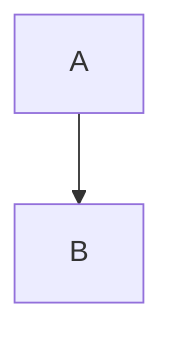
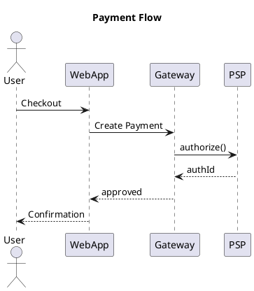
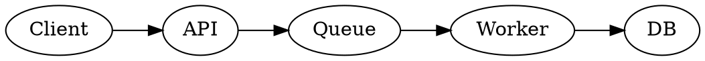
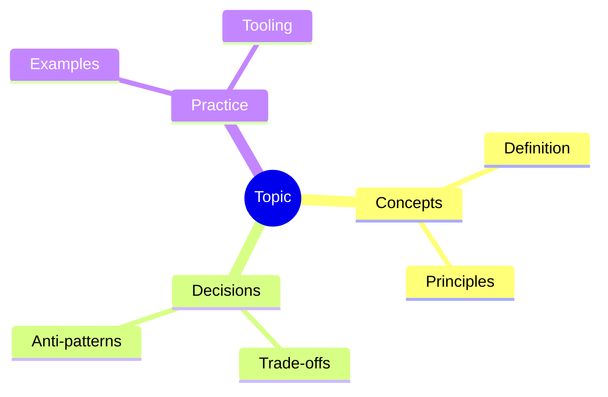
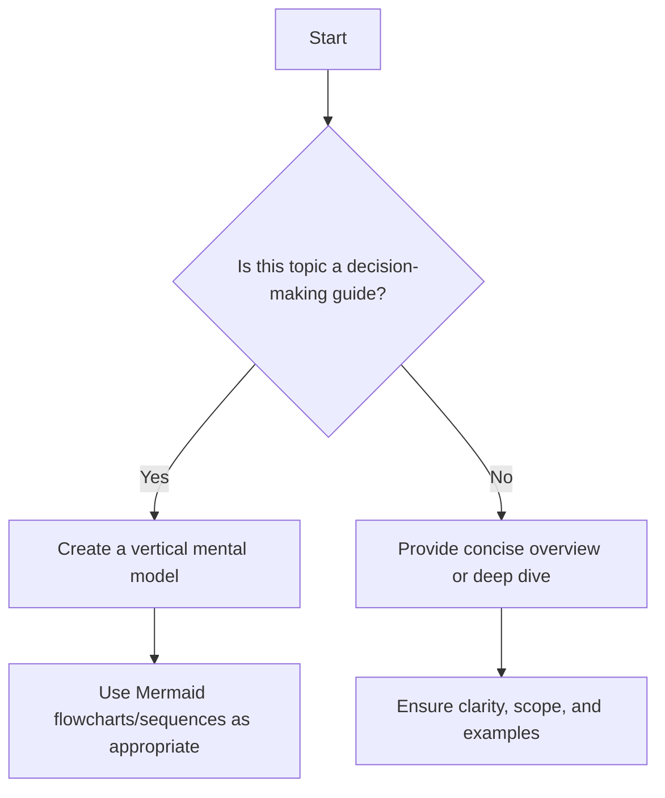

# Paradigm Docs Authoring Rules (Deterministic Version)

All code blocks and documentation in `docs/**/*.md(x)` must follow these explicit, numbered rules. Do not skip or reinterpret any rule. If a rule cannot be followed, stop and report.

## 1. Tabbed Code Blocks

1. Use `<Tabs>` and `<TabItem>` for language switching.
2. Inside each `<TabItem>`, use a triple-backtick code block (```) with:

    - The language (e.g., `python`, `go`, `javascript`)
    - The `title` attribute (e.g., `title="foo.py"`)
    - The `showLineNumbers` attribute

3. Do **not** use the `<CodeBlock>` component for tabbed code blocks.
4. Example:

```mdx
<Tabs groupId="lang" queryString>
  <TabItem value="python" label="Python">
```python title="foo.py" showLineNumbers
def hello():
    print("Hello, world!")
```

  </TabItem>
  <TabItem value="go" label="Go">
```go title="foo.go" showLineNumbers
package main
func main() { println("Hello, world!") }
```
  </TabItem>
</Tabs>
```

## 2. Diagrams

1. All diagrams must be wrapped in a `<Figure>` component with a descriptive `caption` prop.
2. Example:

```mdx
<Figure caption="A descriptive caption for the diagram.">


</Figure>
```

## 3. Indentation

1. All code inside code blocks must use 4-space indentation. Do not use tabs.

## 4. General

1. Do not create or edit `.md` files for paradigm docs; only `.mdx`.
2. Ensure all code examples are up-to-date and use free, accessible references.
3. **Contrast for Visibility:** Whenever highlighting, coloring, or otherwise emphasizing text (including in diagrams, code, or callouts), always ensure the text color is sufficiently contrasted against its background for good visibility in both light and dark modes. Explicitly set text color if necessary to maintain readability.
4. **Emphasis with Bold:** Use bold formatting (`**text**`) to emphasize key terms, actions, or concepts. This helps create accents and improves scannability.

## Build Article Prompt (v1.0.0) — Deterministic Authoring Contract

## 5. Purpose

1. Generate or update one or more documentation articles under `./docs/**` from a relative glob input while strictly honoring the canonical structure and house style. Produce human-friendly, instructive, and deep, production-grade content with diagrams, examples, decision aids, and explicit operational guidance.

## 6. Inputs

1. targetGlob: A repo-relative glob under `./docs/**`, e.g. `./docs/**/*.md`, `./docs/**/topic/*.mdx`, or a single file like `./docs/foundational-concepts/system-thinking.md`.
2. canonicalPath: Path to the canonical structure file. Default: `.github/instructions/canonical/docs-structure.v1.0.0.md`.

## 7. Contract (High-Level, Deterministic)

1. Read and understand the canonical structure file before writing. If missing or malformed, stop and report.
2. For each matched path:

    - If the file is an `index.md` or `index.mdx`, produce/maintain a shorter overview-style category intro (summary, mental model/decision aid, concise guidance, optional relevant quote).
    - For all other files, produce/maintain the full topic article with significant depth, sections, examples, and diagrams.

3. Keep tone professional yet engaging; avoid machine-like writing; show real-world context, trade-offs, and edge cases. Prefer concrete, actionable guidance over generic exposition.
4. All external links must open in a new tab and use `rel="nofollow noopener noreferrer"` and display an external-link emoji (↗️).
5. If generating or using images, store them under `./static/img/**` mirroring the article’s subtree path (do not put new images inside `./docs`).
6. All diagrams and visualizations must be wrapped in a `<Figure>` component with a descriptive `caption`.

## 7.1 Frontmatter (Extended)

- In addition to preserving existing frontmatter, add the following keys when missing and appropriate:
  - `docType`: one of `overview | deep-dive | how-to | reference | case-study`.
  - `difficulty`: one of `intro | intermediate | advanced`.
  - `estimatedTime`: integer minutes readers typically spend.
  - `lastReviewed`: `YYYY-MM-DD` date the article was last verified.
  - `personas`: array of intended audiences (e.g., `['engineer','architect','lead','manager']`).
  - `description`: ≤160 characters, crisp summary for SEO/snippets.
  - `keywords`: 8–20 comma-separated or array form, aligned to content and canonical terms.
  - `image`: social preview image path under `/img/**` (1200×630 recommended).
  - `slug`: stable, kebab-case URL segment; avoid dates; ≤60 chars.
    - Do NOT set `slug` on category index files (`index.mdx`/`index.md`). Rely on the folder path.
    - For leaf docs (non-index), prefer omitting `slug` unless intentionally overriding canonical path.
    - Never create a duplicate trailing segment (e.g., `.../what-is-software-architecture/what-is-software-architecture`). If a slug equals the parent folder name, remove the slug.
  - `tags`: array of 10–20 tags (see §26.1) for indexing and visible Tags section.
  - Keep values aligned with article depth and tone; do not fabricate authors or dates.

## 8. Depth Expectations and Minimum Deliverables

- `index.mdx` or `index.md` (overview):
  - 300–600 words. Include one visual (Mermaid preferred, wrapped in `<Figure>`) and a concise decision aid or mental model if appliable. Optionally include a short, relevant quote.
- All other files (full topic):
  - Target 900–1600 words (minimum 800). Include at least:
  - One decision model or sequence/state diagram (Mermaid, wrapped in `<Figure>`) where applicable.
  - For every flow-like or multi-step code example (especially those shown in multiple languages), include a sequential call flow Figure (vertical Mermaid flowchart, `flowchart TB`) before the code tabs. The diagram must clearly show the order of function/procedure calls, decision points, and error/return paths, using quoted node labels for any punctuation or multi-word text. This Figure should be shared across all language tabs for the same example.
    - One decision matrix/table if the topic involves choices.
    - One practical example with copyable code/config (with filename + line numbers).
    - Explicit sections for: Patterns/Pitfalls, Edge cases, Operational considerations (SLO/SLI, rollouts), Security/Privacy/Compliance (if applicable), Observability (logs/metrics/traces), and Testing.
    - “When to use” and “When not to use” if applicable.

## 8.1 Engagement Layer (Mandatory, lightweight)

1. TL;DR: ≤80 words placed near the top of non-index articles.
2. Learning objectives: 3–6 bullets starting with “You will be able to…”.
3. Motivating scenario: 1–2 paragraphs grounding the topic in a real‑world context.
4. Hands‑on exercise: a small practical task using the `Steps` widget with copy‑ready code/config.
5. Self‑check: exactly 3 short questions; can use an ordered list or `FAQ` widget.
6. Signals & Anti‑signals: use `Showcase` or `ProsCons` to indicate when to apply vs avoid.
7. Next steps: 3–5 internal extensionless links to related docs plus at least one external reference following §23 rules (↗️ and rel attributes).
8. One takeaway: a single highlighted idea using `Callout` with tone `info`.

## 9. Pre-flight (Must Do Before Writing)

1) Load `canonicalPath` and read it fully to determine:
   - Where the topic belongs, its parents/siblings, and intended scope/depth in the larger outline.
   - What adjacent topics will (or will not) cover to prevent redundancy.
2) From the `targetGlob`, resolve matched files. For each file, derive:
   - Section lineage (parents → child) from folder path and canonical mapping.
   - Whether it’s an overview (`index.md` or `index.mdx`) or a full topic (any other file).
3) If canonical is missing or malformed, stop and report. Do not write.

## 10. Authoring Rules by File Type

- `index.mdx` or `index.md` (overview/category introductions)
  - Keep it concise: a summary/overview of the subject (typically 2–5 short paragraphs).
  - Include a decision-making aid or mental model when applicable, preferably visualized and wrapped in `<Figure>`.
  - It may include a short, relevant quote from a recognized authority; ensure it’s clearly relevant to the topic (not generic) and attribute it.
  - Favor high-level framing, scope boundaries, and how to navigate deeper articles.

- Other topic articles (e.g., `topic.md` or `topic.mdx`)
  - Establish scope: clarify what the topic covers and what’s out of scope (delegated to siblings).
  - Organize like a well-structured book section with scannable headings and a logical flow.
  - Include real-world examples, case studies, trade-offs, and edge cases (see Depth expectations above).
  - If teaching decisions, include a vertical mental model/flow using Mermaid (top-to-bottom, wrapped in `<Figure>`) and/or other suitable visualizations.
  - Include “When to use” and “When not to use” sections when applicable (omit if genuinely not relevant).
  - Add a short “Design review checklist” sub-section with 6–12 bullets capturing the most important acceptance criteria for the topic. Prefer the `Checklist` widget from /editing/category/widgets for this subsection.
  - For comparisons or showcases of options/examples, prefer the MDX components in the Editing Widgets sections (/editing/category/widgets) (e.g., `Showcase`, `Vs`, `DecisionMatrix`, `Checklist`, `ProsCons`, `Steps`/`Timeline`) rather than ad-hoc lists; use tables only when a grid communicates better.

## 11. Structure Template (Adapt as Needed for Each Topic)

- Title (H1): Canonical topic label.
- Brief introduction: why it matters; scope and boundaries.
- Core concepts or principles.
- Practical examples and real-world scenarios.
- Decision model / mental model (visualized) if this topic guides choices.
- Decision matrix/table (when comparing options).
- Implementation notes / patterns / pitfalls.
  - For A/B/N comparisons or curated highlights, use `Vs` (A/B/N) and `Showcase` (and related components) as documented in Editing Widgets (/editing/widgets).
- Operational considerations (SLO/SLI targets, rollout/rollback, quotas/limits).
- Security, privacy, and compliance implications (data classification, authn/authz, secrets).
- Observability (logs/metrics/traces, correlation IDs, dashboards and alerts).
- When to use / When not to use (if applicable).
- Alternatives and related topics (link internally).
- References (with nofollow, external-link emoji, open in new tab).

## 12. Diagrams and Visualizations

- Mermaid is preferred and already supported. Use vertical orientation for decision flows: `flowchart TB`.
- For every flow-like or multi-step code example (especially those shown in multiple languages), you must include a sequential call flow Figure (vertical Mermaid flowchart, `flowchart TB`) before the code tabs. The diagram must clearly show the order of function/procedure calls, decision points, and error/return paths, using quoted node labels for any punctuation or multi-word text. This Figure should be shared across all language tabs for the same example.
- Use the most suitable diagram for the idea: flowchart, sequence, state, class, ER, journey, pie/quadrant, timeline, or others the Mermaid version supports.
- Complex architecture visuals may be authored externally and saved to `./static/img/...` (mirroring the doc path). Reference them with `/img/...` absolute paths.
- All figures and diagrams must be oriented vertically (e.g., `flowchart TB` for Mermaid diagrams) to ensure consistency and readability. Avoid horizontal layouts unless absolutely necessary for clarity.
- **If you need to represent a long tree structure (many categories or leaves), be aware that a horizontal (left-to-right) tree may not display well on most screens due to width limitations. In such cases, prefer a vertical (top-to-bottom) orientation, as shown in `docs/foundational-concepts/programming-paradigms/index.mdx`, to maximize readability and scrolling usability.**

## 13. Mermaid Authoring Guardrails (Lint/Build-Safe)

- No hard tabs inside code fences. Use spaces only (Mermaid blocks are sensitive and lint enforces MD010).
- In flowcharts, quote any node label that contains punctuation, slashes, parentheses, or multiple words. Prefer the `id["Readable label"]` form:
  - Good: `E["HTTP/REST"]`, `D["gRPC (internal) or REST (external)"]`, `H["Topic/Stream"]`
  - Avoid unquoted labels with `/`, `()`, `:`, `-`, `&`, `+`, `?`, `!`, `#`, `%`, etc.
- Keep node IDs simple (letters/numbers/underscores). Put punctuation in the quoted label, not in the ID.
- Keep edge labels simple one-word terms (e.g., `|Yes|`, `|No|`). If you need punctuation, prefer moving that detail into the destination node label instead of the edge.
- For sequence diagrams, when participant names include spaces/punctuation, use an alias with a quoted display name, e.g.: `participant API as "API Service"`.
- Prefer `flowchart TB` for decision trees; split very large flows into smaller figures (5–9 nodes each) to keep parsing and readability stable.
- If a diagram fails to parse, first quote labels with punctuation and re-check for stray tabs or unmatched brackets.

### 13.1 Preventing Text Clipping and Arrow Cutoff

- **Always include an init directive** at the start of Mermaid diagrams to prevent text clipping and arrow cutoff:

  ```mermaid
  %%{init: {"flowchart": {"useMaxWidth": false, "htmlLabels": true, "nodeSpacing": 40, "rankSpacing": 35, "padding": 8, "wrap": true}, "themeVariables": {"fontSize": "14px"}} }%%
  flowchart TB
      Start["Data Fundamentals"] --> M["Data Modeling"]
  ```

- **Break long labels** with `<br/>` to prevent horizontal overflow:
  - Good: `T["Transactions & Isolation<br/>Levels"]`
  - Avoid: `T["Transactions & Isolation Levels"]` (may clip on mobile)
- **Key init parameters**:
  - `useMaxWidth: false` - prevents automatic width constraints that cut arrows
  - `htmlLabels: true` - enables HTML formatting like `<br/>`
  - `nodeSpacing: 40, rankSpacing: 35` - increases spacing between nodes
  - `padding: 8` - adds padding around the diagram
  - `wrap: true` - enables text wrapping
  - `fontSize: "14px"` - sets readable font size (adjust to 13px if still clipping)
- **If nodes still clip on mobile**, consider:
  - Reducing font size to `"13px"` or `"12px"`
  - Splitting into multiple smaller diagrams (5–7 nodes each)
  - Using shorter, more concise labels

## 14. Required Diagrams (Choose What Fits Best)

- Decision topics: at least one vertical flowchart (TB).
- Lifecycle/interaction topics: sequence diagram showing timing/retries/timeouts.
- State-heavy topics: state diagram with guards and terminal states.

## 15. Visuals by Purpose (Choose-First Guidance)

| Purpose                                       | Best fit (preferred first)                                             | Notes                                                                |
| --------------------------------------------- | ---------------------------------------------------------------------- | -------------------------------------------------------------------- |
| Quick decision paths                          | Mermaid flowchart TB                                                   | Keep vertical; 5–9 nodes per view; split if larger.                  |
| Request/response timing                       | Mermaid sequence                                                       | Ideal for API lifecycles, retries, backoffs.                         |
| State-centric logic                           | Mermaid state diagram                                                  | Show transitions, guards, and terminal states.                       |
| Architecture (C4 Context/Container/Component) | Structurizr DSL → export to Mermaid/PlantUML; or C4-PlantUML via Kroki | Keep each C4 level in its own figure; reference siblings for detail. |
| Data relationships/model                      | Mermaid class or ER; Graphviz/D2 via Kroki                             | Prefer entities/relations; annotate cardinality.                     |
| Dependency/graph view                         | Mermaid flowchart LR; Graphviz via Kroki                               | For dense graphs, Graphviz often clearer.                            |
| Deployment/topology                           | Mermaid flowchart with subgraphs; Draw.io for complex layouts          | Use groups for zones/VPCs; add mTLS/ingress markers.                 |
| Roadmap/timeline                              | Mermaid timeline or gantt                                              | Keep fewer than ~12 items per view.                                  |
| Exploration/overview                          | Mind map (Mermaid mindmap or mindmap plugin)                           | Great for .mdx overview pages.                                       |
| Trade-off matrix                              | Table                                                                  | When a grid communicates better than a figure.                       |

## 16. Reusable Components & Widgets (Use When They Fit Best)

- Prefer these when you want scannable, repeatable patterns for examples, trade-offs, comparisons, and interactive reading.
- Locations for docs and live examples: /editing/widgets.
- Showcase
  - Use for a single concept with 1..N named sections (Impact, Trade‑offs, Signals, SLOs, etc.).
  - Sections can be authored as rich MDX (text, code, inline components).
  - Choose a card-level tone when you want a subtle border accent: neutral (default), positive, warning, info.
  - You can also set per-section tone accents to draw attention to specific sections.
  - Authoring examples are maintained under Editing Widgets (routes: /editing/widgets).
- Vs (A/B/N comparison)
  - Use for 2 or more side-by-side options. Each card has a label and bullet points (both can be rich MDX).
  - To emphasize one option, set highlight to the 0-based index (or 'a'/'b' for legacy two-way) and choose highlightTone: neutral | positive | warning | info.
  - The highlight uses a tinted background rather than thick borders to keep the UI calm.
  - Authoring examples are maintained under Editing Widgets (routes: /editing/widgets).
- Category widgets (use when they match your content shape)
  - Checklist: Ideal for “Design review checklist” sections; compact, selectable items.
  - ProsCons: Show pros and cons side-by-side.
  - Steps / Timeline: For procedures, rollouts, or lifecycles.
  - FAQ: Curate common questions and concise answers.
  - Callout / Alert: Emphasize warnings, info notes, or positive guidance.
  - Metric / KPI: Present SLO/SLI targets or key numbers.
  - Cards / CardGrid: Curate multi-item showcases (tools, patterns, examples).
  - Use component-specific props as documented in /editing/widgets.

## 17. Tone Semantics When Using Showcase/Vs and Category Widgets

- Positive guidance or recommended options: use tone "positive".
- Negative, risky, or cautionary guidance: use tone "warning". If you need an "error-like" emphasis, use "warning" (the components do not expose a separate "error" tone).
- Neutral-but-notable callouts: use tone "info". Default/untinted is "neutral".
- For Vs, per-item highlightTone takes priority over the component-level tone; set highlight to the option to emphasize, and set highlightTone according to the same rules above.
- For Callout/Alert and other category widgets that support tone, apply the same tone mapping.

## 18. When to Use Which Tone

- positive: Recommend or preferred option in your context; a “good” leaning.
- warning: Caution readers—risk, complexity, or notable pitfalls. Use this for negative or error-like messages.
- info: Neutral but notable information; draw attention without implying danger or endorsement.
- neutral: No strong guidance; present facts evenly.

## 19. Authoring Snippets (Quick Reference)

```mdx title="Showcase (sections)"
<Showcase
  title="Release plan"
  sections={[
    { label: 'Signals', body: 'Traces, metrics, logs' },
    { label: 'Guardrails', body: <>Kill switches, <strong>flags</strong></>, tone: 'warning' },
  ]}
/>
```

```mdx title="Vs (3-way)"
<Vs
  title="Delivery semantics"
  items={[
    { label: 'At-most-once', points: ['Fast', 'Loss risk'] },
    { label: 'At-least-once', points: ['Retries', 'Duplicates'] },
    { label: 'Exactly-once', points: ['Complex', 'Transactional outbox'] },
  ]}
  highlight={1}
  highlightTone="info"
/>
```

```mdx title="Checklist (design review)"
<Checklist
  title="Design review checklist"
  items={[
    { label: 'Clear scope and boundaries defined' },
    { label: 'Decision flow includes rollback paths' },
    { label: 'Security controls mapped to data classes' },
    { label: 'SLIs/SLOs and alerts drafted' },
  ]}
/>
```

```mdx title="Pros & Cons"
<ProsCons
  pros={[
    'Clear separation of concerns',
    'Enables independent team velocity',
  ]}
  cons={[
    'Increased operational complexity',
    'Risk of inconsistent data models',
  ]}
/>
```

### 16.1 Widget Selection Guide (When to Use What)

- Figure: Wrap every image or diagram (Mermaid, etc.). Always required. See `/editing/widgets/figure.mdx`.
- Code Tabs: For programming examples across Python, Go, Node.js using `<Tabs>`/`<TabItem>`; follow `/editing/widgets/code.mdx`.
- Config Tabs: For config snippets across formats (YAML/JSON/TOML). Prefer `ConfigTabs`; see `/editing/widgets/config-tabs.mdx`.
- DecisionMatrix: For multi-criteria option comparison. Prefer over ad-hoc tables; see `/editing/widgets/decision-matrix.mdx`.
- Vs: For A/B/N side-by-side comparisons at-a-glance (few bullets per option). See `/editing/widgets/vs.mdx`.
- ProsCons: For quick pros/cons lists or to complement a DecisionMatrix with narrative. See `/editing/widgets/pros-cons.mdx`.
- Showcase: For a single concept with labeled sections (Impact, Risks, Signals). Great for Signals/Anti-signals.
- Checklist: For acceptance criteria or design review checklists (6–12 concise items). See `/editing/widgets/checklist.mdx`.

See [Editing Widgets](/editing/widgets) for complete examples and evolving guidance.

## 20. Optional Diagram Integrations (Use When They Add Clear Value)

1. Kroki via remark-kroki (PlantUML, D2, Graphviz, etc.)

- When: you need diagram types not natively available in Mermaid, or you prefer PlantUML/D2/Graphviz syntax.
- Authoring usage (after enabling remark-kroki in site config):





```d2 title="context.d2" showLineNumbers
App: Web App
DB: Database
App -> DB: stores
```

Config hint (site-level, optional):

```ts title="docusaurus.config.ts (excerpt)" showLineNumbers
export default {
  // ...existing config...
  markdown: {
    mermaid: true,
    remarkPlugins: [require('remark-kroki')],
  },
}
```

1. Draw.io (diagrams.net)

- When: highly custom spatial layouts or complex network/infra visuals.
- Authoring options:
  - Simple and robust: export SVG/PNG from Draw.io to `/static/img/...` mirroring the doc path, then embed:

    ```mdx
    
    ```

  - If a Draw.io plugin is enabled in the site, prefer its documented MDX component for embedding source `.drawio`/`.dio` files. Follow the plugin’s README for exact props.

1. Structurizr diagrams (C4 modeling)

- When: you want C4 Context/Container/Component/System Landscape with consistent styling.
- Authoring options:
  - If a Structurizr plugin is enabled, use the plugin’s MDX component to render DSL. Otherwise, export DSL to Mermaid or PlantUML and embed as code blocks (Mermaid preferred for in-repo readability) or export images to `/static/img/...`.

```plaintext title="workspace.dsl" showLineNumbers
workspace "Payments" "" {
  model {
    user = person "Customer"
    web = softwareSystem "Web App"
    psp = softwareSystem "PSP"
    user -> web "Buys"
    web -> psp "Charge"
  }
}
```

1. Mind maps

- When: overviews, brainstorming, topic mapping—especially for `.mdx` overview pages.
- Authoring options:
  - If a mindmap plugin is enabled, follow its syntax/component usage.
  - Or use Mermaid’s mindmap syntax:



Mermaid example (vertical decision flow)



## 21. Code and Pseudocode Guidelines

- Always prefer copy-friendly code blocks with a title/filename and line numbers enabled:
  - Add `title="FILENAME.ext"` and `showLineNumbers` in the code block meta.
  - Highlight ranges if helpful using Docusaurus meta (e.g., `{1,3-6}`).
- If the topic includes programming examples (e.g., design patterns), provide three language tabs in this order: Python, Go, Node.js.
- For pseudocode, use `plaintext` (or the closest supported language), still add `title` and `showLineNumbers`.
- For config/infra (YAML, Terraform, Helm, etc.), use proper language highlighting and `showLineNumbers`.
- If the topic is programming-oriented, provide the language triad (Python, Go, Node.js). If not code-centric, include at least one realistic config/example block (YAML/JSON/Terraform/etc.).

### Code Example Narrative (Required before language tabs)

- For every flow-like or multi-step example, precede tabs with a vertical Mermaid flowchart (`flowchart TB`) wrapped in `<Figure>` that summarizes the call sequence, decisions, and error paths.
- Keep 3–5 nodes per view; quote multi-word labels; no tabs inside fences; ensure the Figure applies to all language tabs that follow.

### Tabbed Code Widget (Example)

````mdx
import Tabs from '@theme/Tabs'
import TabItem from '@theme/TabItem'

<Tabs groupId="lang" queryString>
  <TabItem value="python" label="Python">

  ```python title="example.py" showLineNumbers
  class Greeter:
      def hi(self):
          print("Hello")
  ```

  </TabItem>
  <TabItem value="go" label="Go">

  ```go title="main.go" showLineNumbers
  package main
  import "fmt"
  func main(){ fmt.Println("Hello") }
  ```

  </TabItem>
  <TabItem value="node" label="Node.js">

  ```javascript title="index.js" showLineNumbers
  console.log('Hello')
  ```

  </TabItem>
</Tabs>
````

## 22. Tables and Widget Preference

- For comparisons and showcases, prefer reusable components from `/editing/widgets` first:
  - Use `DecisionMatrix` for multi-criteria option comparisons (preferred over ad-hoc markdown tables).
  - Use `Vs` for A/B/N comparisons at-a-glance with short bullet points.
  - Use `Showcase` for curated highlights with labeled sections (Impact, Trade-offs, Signals, etc.).
  - Use category widgets where appropriate (`Checklist`, `ProsCons`, `Steps`/`Timeline`, `FAQ`, `Callout`/`Alert`, `Metric`/`KPI`, `Cards`/`CardGrid`).
- Use plain markdown tables only when a grid communicates better than cards/components (e.g., many options with many attributes) and keep it scannable.

## 23. Links and References (Strict)

- Internal links: use relative links to other docs.
- External links: must open in a new tab, have `rel="nofollow noopener noreferrer"`, and show an external-link emoji.
  - Example (MDX/HTML):

  ```mdx
  <a href="https://example.com" target="_blank" rel="nofollow noopener noreferrer">Source ↗️</a>
  ```

- Always include a References section at the end if any external materials are cited:
  - Use an ordered list (1., 2., 3., …), not bullets. This is mandatory for all articles.
  - Example:

  ```md
  ## References
  1. <a href="https://example.com/guide" target="_blank" rel="nofollow noopener noreferrer">Author, Title ↗️</a>
  2. <a href="https://example.com/another" target="_blank" rel="nofollow noopener noreferrer">Another Source ↗️</a>
  ```

## 26.1 SEO & Discoverability (Required)

- Meta & frontmatter
  - Provide `title`, `description` (≤160 chars), `keywords` (8–20), `image` (1200×630), `slug`, `tags` (10–20) in frontmatter.
  - Include `<Head>` with `meta` tags for `description`, `og:title`, `og:description`, `og:image`, `twitter:card`, and canonical `<link rel="canonical">` when needed.
- Structured data (JSON-LD)
  - Embed `Article` JSON-LD with `headline`, `description`, `author`, `dateModified`, `image`, `keywords`.
  - Embed `BreadcrumbList` JSON-LD reflecting the doc lineage.
  - Optionally embed `FAQPage` JSON-LD if a FAQ section exists.
- Breadcrumbs
  - Ensure visible breadcrumbs via site theme (if enabled) and always include `BreadcrumbList` JSON-LD for crawlers.
- GPT/chat visibility best practices
  - Start with TL;DR and Learning Objectives; include a concise, extractive intro.
  - Use consistent headings, explicit definitions, and a short FAQ (3–5 Q/A) to aid retrieval.
  - Prefer descriptive alt text in `Figure`; keep code filenames and language labels explicit.
  - Add a "Questions this article answers" list (3–6 bullets) near the end when relevant.
- Tags handling
  - Do NOT add a visible `## Tags` section. Rely on frontmatter `tags` only; Docusaurus renders tags automatically.

Example (JSON-LD Article + Breadcrumbs):

```mdx title="Structured data" showLineNumbers
import Head from '@docusaurus/Head'

<Head>
  <script type="application/ld+json">{JSON.stringify({
    "@context": "https://schema.org",
    "@type": "Article",
    "headline": "Consistency Models in Distributed Systems",
    "description": "Practical trade-offs among strong, eventual, and causal consistency.",
    "image": "https://archman.dev/img/consistency/social-card.png",
    "keywords": ["consistency","strong consistency","eventual consistency","causal"],
    "author": {"@type":"Person","name":"Archman"},
    "dateModified": "2025-09-10"
  })}</script>
  <script type="application/ld+json">{JSON.stringify({
    "@context":"https://schema.org",
    "@type":"BreadcrumbList",
    "itemListElement":[
      {"@type":"ListItem","position":1,"name":"Foundational Concepts","item":"https://archman.dev/docs/foundational-concepts"},
      {"@type":"ListItem","position":2,"name":"Basic Distributed Systems Concepts","item":"https://archman.dev/docs/foundational-concepts/basic-distributed-systems-concepts"},
      {"@type":"ListItem","position":3,"name":"Consistency Models","item":"https://archman.dev/docs/foundational-concepts/basic-distributed-systems-concepts/consistency-models"}
    ]
  })}</script>
</Head>
```

## 24. Internal Cross-Linking (Canonical-Driven)

- Before writing, read the canonical structure file completely: `.github/instructions/canonical/docs-structure.v1.0.0.md`.
- Build a mental (or temporary) map of topic → expected location/slug from the canonical outline.
- Strict linkification: whenever you mention a concept that has its own article in the canonical outline, you must link to that article (do not leave plain text). This includes mentions in:
  - Scope statements ("Out of scope", "In scope")
  - Body paragraphs, definitions, and examples
  - Lists, callouts, and captions
  - Related topics and see-also notes
- Resolve links by:
  1) Using the canonical outline to determine the correct target topic and its parent/child lineage.
  2) Finding the corresponding file under `./docs/**` that matches the canonical topic (title/slug/path).
  3) Using a correct relative doc link to that file.
- Do not guess the path purely from text; prefer the canonical outline first, then verify the path exists in `./docs`. If ambiguous or missing, leave a TODO comment and surface it in your output.
  - Minimum: include at least three “Related topics” internal links that exist in `./docs/**` and are relevant siblings/parents/children per canonical.

## 25. Link Validation (Post-Generation, Required)

- After writing, validate all links you added/edited:
  - Internal doc links: ensure they are extensionless (no .md/.mdx) and the target file exists in `./docs/**`. If a target is missing, replace the link with a TODO note and report it.
  - Anchor fragments (e.g., `#section`): confirm the heading exists in the target file.
  - External links: perform a quick HEAD/GET check and ensure a 2xx response. If unreachable or 404/5xx, either replace with a better source or mark as TODO and report.
  - Mermaid image or static asset links: confirm files exist under `/static/img/**`.
  - References section must include at least 2 reputable sources when external material informed the article; prefer standards bodies, official docs, or well-regarded texts.

## 26. Automation Hint (Optional)

## 27. Tone and Style

- Professional, clear, concise, and engaging—avoid robotic prose.
- Use concrete examples, short anecdotes, and where helpful, brief quotes that are clearly connected to the topic.
- Avoid redundancy across siblings; defer content to the appropriate sibling and link to it.

## 28. Output Expectations

- Do not change canonical. Conform content to canonical scope and naming.
- Preserve existing frontmatter if present; add missing, minimal frontmatter only when necessary.
- Validate MD/MDX syntax so Docusaurus can build without errors.
- Keep overview `index.mdx` or `index.md` files short; keep other topic files substantial but focused.

## 29. Workflow (Per Matched File)

1) Map the file path to canonical to confirm scope and level of depth.
2) Choose article mode based on filename:
   - `index.mdx` or `index.md` → overview-mode (short, framing, optional quote, one diagram if applicable).
   - Other files → full-topic mode (deep dive, examples, decision model if appropriate).
3) Plan sections per the Structure template above; avoid overlap with siblings per canonical.
4) Author content:

- Include diagrams (Mermaid top-to-bottom for flows), tables where clearer, and code tabs if relevant.
- For comparisons or showcases, import and use `Showcase`, `Vs`, and category widgets (as appropriate) as documented in Editing Widgets (/editing/category/widgets).
- Ensure pseudocode/config examples include a filename, highlighting, and line numbers.
- Ensure all external links follow the strict rule and include ↗️.

1) If new images were produced, save under `./static/img/...` and reference with `/img/...`.

2) End with a References section when any external sources are used.

## 30. Quality Gates

- Lint: headings are hierarchical; no orphan H1/H2 jumps; links resolve; MDX compiles.
- Build sanity: content should not break a Docusaurus build given site config (Mermaid is enabled; Prism is present).
- Depth: .md article ≥800 words; at least one diagram and one example code/config included; decision topics also include a decision flow and a matrix/table.
- Cross-linking: at least three valid internal related links present; strict linkification followed in body text.
- References: at least two external sources when external material is cited.
- Requirements coverage: confirm the checklist below is satisfied for each article.

## 31. Author Checklist (Must-Verify)

- [ ] targetGlob respected (resolved files only under `./docs/**`).
- [ ] Canonical read and applied to scope, depth, and sibling boundaries.
- [ ] `index.mdx` or `index.md` files are concise, overview/decision-focused; quotes (if any) are relevant and attributed.
- [ ] Non-index files are comprehensive (≥800 words), with structure, examples, and (if applicable) when-to-use/not-use.
- [ ] A vertical mental model (Mermaid `TB`) is included when the topic teaches decisions; otherwise, the most suitable diagram is used.
- [ ] Visualization type chosen per purpose (see matrix); used Mermaid by default and Kroki/Draw.io/Structurizr/Mindmap when clearly beneficial.
- [ ] Mermaid safety: no hard tabs; node labels with punctuation/slashes/parentheses are quoted using `id["Label"]`; edge labels are simple words; participant names with spaces use alias + quoted display.
- [ ] Pseudocode/config/code samples have filenames and `showLineNumbers`; programming examples include Python, Go, and Node.js tabs when appropriate.
- [ ] Tables used where they improve clarity.
- [ ] For comparisons/showcases, used `Showcase`/`Vs` and category widgets (as appropriate) per Editing Widgets (/editing/category/widgets) (tables only when a grid communicates better).
- [ ] External links open in new tab, include `rel="nofollow noopener noreferrer"`, and show ↗️.
- [ ] References section included when any external materials are cited and uses an ordered list (1., 2., …).
- [ ] "Related topics" bullets are actual markdown links to internal docs (no plain text + path). Verify each target exists.
- [ ] At least three relevant "Related topics" internal links are included.
- [ ] For Showcase/Vs, tone semantics applied: positive → "positive"; negative/error-like → "warning"; neutral-but-notable → "info".
- [ ] Internal cross-links added for canonical topics mentioned in the text, with paths verified against `./docs/**` (canonical-first, then existence check).
- [ ] Strict linkification applied everywhere (scope bullets, body, lists, related topics, see-also): canonical topics are always linked.
- [ ] Post-generation link validation completed: internal targets exist (extensionless), anchors resolve, external links return 2xx; any TODOs are surfaced.
- [ ] Any generated images placed under `./static/img/**` mirroring the doc path.
- [ ] At least one diagram is present; decision topics include a vertical flow. Include a table (matrix) if comparing options.
- [ ] Operational considerations section provided (SLO/SLI, rollout/rollback, limits) or explicitly N/A with reason.
- [ ] Security/privacy/compliance and observability sections provided or explicitly N/A with reason.
- [ ] Edge cases addressed (empty/null, large inputs, timeouts/retries, idempotency/concurrency, multi-tenant data isolation) where applicable.

## 32. References Section Placement

1. The 'References' section must always be the last section in the document, regardless of whether external sources are cited. This ensures consistency and clarity across all documentation articles.
