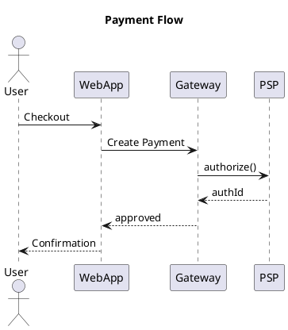
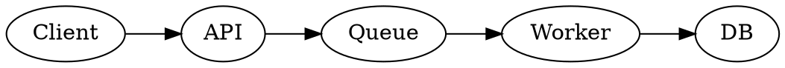
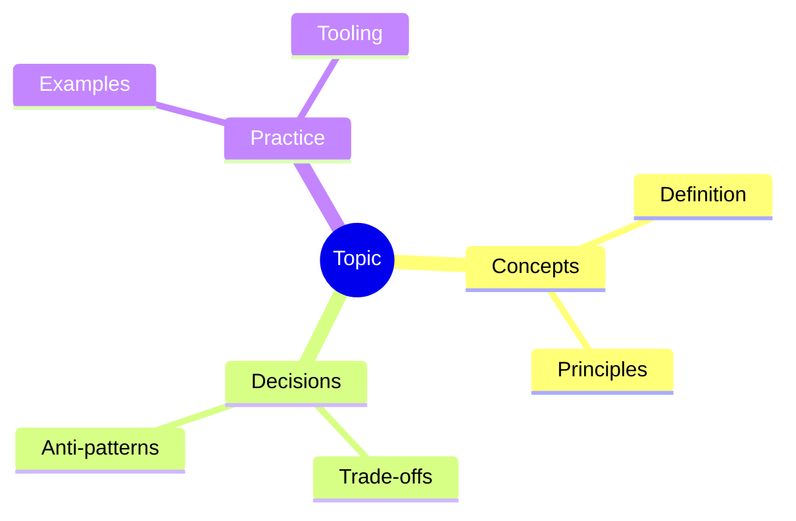
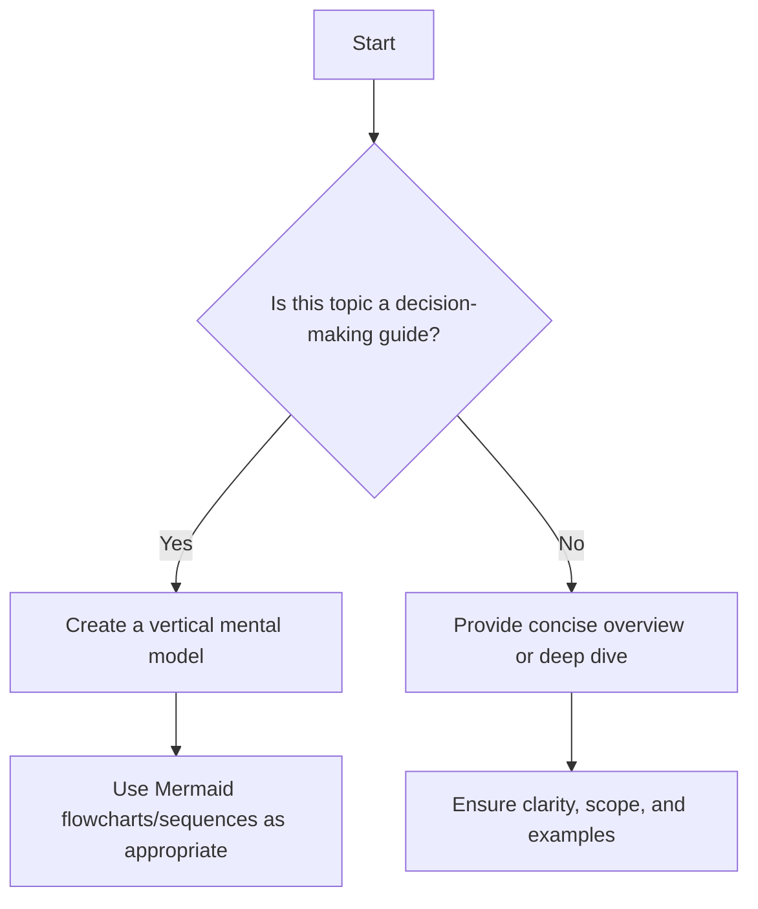

# Build Article Prompt (v1.0.0)

Purpose

- Generate or update one or more documentation articles under `./docs/**` from a relative glob input while strictly honoring the canonical structure and house style. Produce human-friendly, instructive content with diagrams, examples, and decision aids.

Inputs

- targetGlob: A repo-relative glob under `./docs/**`, e.g. `./docs/**/*.md`, `./docs/**/topic/*.mdx`, or a single file like `./docs/foundational-concepts/system-thinking.md`.
- canonicalPath: Path to the canonical structure file. Default: `.github/instructions/canonical/docs-structure.v1.0.0.md`.

Contract (high-level)

- Read and understand the canonical structure first to determine scope, placement, and expected depth of each matched topic.
- For each matched path:
  - If file is `.mdx`: produce/maintain a shorter overview-style category intro (summary, mental model/decision aid, concise guidance, optional relevant quote).
  - If file is `.md`: produce/maintain the full topic article with significant depth, sections, examples, and diagrams.
- Keep tone professional yet engaging; avoid machine-like writing; show real-world context and edge cases.
- All external links must open in a new tab and use `rel="nofollow noopener noreferrer"` and display an external-link emoji (↗️).
- If generating or using images, store them under `./static/img/**` mirroring the article’s subtree path (do not put new images inside `./docs`).

Pre-flight (must do before writing)

1) Load `canonicalPath` and read it fully to determine:
   - Where the topic belongs, its parents/siblings, and intended scope/depth in the larger outline.
   - What adjacent topics will (or will not) cover to prevent redundancy.
2) From the `targetGlob`, resolve matched files. For each file, derive:
   - Section lineage (parents → child) from folder path and canonical mapping.
   - Whether it’s an overview (`.mdx`) or a full topic (`.md`).
3) If canonical is missing or malformed, stop and report. Do not write.

Authoring rules by file type

- .mdx (overview/category introductions)
  - Keep it concise: a summary/overview of the subject (typically 2–5 short paragraphs).
  - Include a decision-making aid or mental model when applicable, preferably visualized.
  - It may include a short, relevant quote from a recognized authority; ensure it’s clearly relevant to the topic (not generic) and attribute it.
  - Favor high-level framing, scope boundaries, and how to navigate deeper articles.

- .md (full topic articles)
  - Establish scope: clarify what the topic covers and what’s out of scope (delegated to siblings).
  - Organize like a well-structured book section with scannable headings and a logical flow.
  - Include real-world examples, case studies, trade-offs, and edge cases.
  - If teaching decisions, include a vertical mental model/flow using Mermaid (top-to-bottom) and/or other suitable visualizations.
  - Include “When to use” and “When not to use” sections when applicable (omit if genuinely not relevant).

Structure template (adapt as needed for each topic)

- Title (H1): Canonical topic label.
- Brief introduction: why it matters; scope and boundaries.
- Core concepts or principles.
- Practical examples and real-world scenarios.
- Decision model / mental model (visualized) if this topic guides choices.
- Implementation notes / patterns / pitfalls.
- When to use / When not to use (if applicable).
- Alternatives and related topics (link internally).
- References (with nofollow, external-link emoji, open in new tab).

Diagrams and visualizations

- Mermaid is preferred and already supported. Use vertical orientation for decision flows: `flowchart TB`.
- Use the most suitable diagram for the idea: flowchart, sequence, state, class, ER, journey, pie/quadrant, timeline, or others the Mermaid version supports.
- Complex architecture visuals may be authored externally and saved to `./static/img/...` (mirroring the doc path). Reference them with `/img/...` absolute paths.

Visuals by purpose (choose-first guidance)

| Purpose                                       | Best fit (preferred first)                                             | Notes                                                                |
| --------------------------------------------- | ---------------------------------------------------------------------- | -------------------------------------------------------------------- |
| Quick decision paths                          | Mermaid flowchart TB                                                   | Keep vertical; 5–9 nodes per view; split if larger.                  |
| Request/response timing                       | Mermaid sequence                                                       | Ideal for API lifecycles, retries, backoffs.                         |
| State-centric logic                           | Mermaid state diagram                                                  | Show transitions, guards, and terminal states.                       |
| Architecture (C4 Context/Container/Component) | Structurizr DSL → export to Mermaid/PlantUML; or C4-PlantUML via Kroki | Keep each C4 level in its own figure; reference siblings for detail. |
| Data relationships/model                      | Mermaid class or ER; Graphviz/D2 via Kroki                             | Prefer entities/relations; annotate cardinality.                     |
| Dependency/graph view                         | Mermaid flowchart LR; Graphviz via Kroki                               | For dense graphs, Graphviz often clearer.                            |
| Deployment/topology                           | Mermaid flowchart with subgraphs; Draw.io for complex layouts          | Use groups for zones/VPCs; add mTLS/ingress markers.                 |
| Roadmap/timeline                              | Mermaid timeline or gantt                                              | Keep fewer than ~12 items per view.                                  |
| Exploration/overview                          | Mind map (Mermaid mindmap or mindmap plugin)                           | Great for .mdx overview pages.                                       |
| Trade-off matrix                              | Table                                                                  | When a grid communicates better than a figure.                       |

Reusable visual widgets (Showcase, Vs)

- Prefer these when you want scannable, repeatable patterns for examples, trade-offs, and comparisons.
- Showcase
  - Use for a single concept with 1..N named sections (Impact, Trade‑offs, Signals, SLOs, etc.).
  - Sections can be authored as rich MDX (text, code, inline components).
  - Choose a card-level tone when you want a subtle border accent: neutral (default), positive, warning, info.
  - You can also set per-section tone accents to draw attention to specific sections.
  - Authoring examples are maintained in editing/showcase-widgets (route: /editing/showcase-widgets).
- Vs (A/B/N comparison)
  - Use for 2 or more side-by-side options. Each card has a label and bullet points (both can be rich MDX).
  - To emphasize one option, set highlight to the 0-based index (or 'a'/'b' for legacy two-way) and choose highlightTone: neutral | positive | warning | info.
  - The highlight uses a tinted background rather than thick borders to keep the UI calm.
  - Authoring examples are maintained in editing/showcase-widgets (route: /editing/showcase-widgets).

Tone semantics when using Showcase/Vs

- Positive guidance or recommended options: use tone "positive".
- Negative, risky, or cautionary guidance: use tone "warning". If you need an "error-like" emphasis, use "warning" (the components do not expose a separate "error" tone).
- Neutral-but-notable callouts: use tone "info". Default/untinted is "neutral".
- For Vs, per-item highlightTone takes priority over the component-level tone; set highlight to the option to emphasize, and set highlightTone according to the same rules above.

When to use which tone

- positive: Recommend or preferred option in your context; a “good” leaning.
- warning: Caution readers—risk, complexity, or notable pitfalls. Use this for negative or error-like messages.
- info: Neutral but notable information; draw attention without implying danger or endorsement.
- neutral: No strong guidance; present facts evenly.

Authoring snippets (quick reference)

```mdx title="Showcase (sections)"
<Showcase
  title="Release plan"
  sections={[
    { label: 'Signals', body: 'Traces, metrics, logs' },
    { label: 'Guardrails', body: <>Kill switches, <strong>flags</strong></>, tone: 'warning' },
  ]}
/>
```

```mdx title="Vs (3-way)"
<Vs
  title="Delivery semantics"
  items={[
    { label: 'At-most-once', points: ['Fast', 'Loss risk'] },
    { label: 'At-least-once', points: ['Retries', 'Duplicates'] },
    { label: 'Exactly-once', points: ['Complex', 'Transactional outbox'] },
  ]}
  highlight={1}
  highlightTone="info"
/>
```

See editing/showcase-widgets (/editing/showcase-widgets) for complete examples and evolving guidance.

Optional diagram integrations (use when they add clear value)

1. Kroki via remark-kroki (PlantUML, D2, Graphviz, etc.)

- When: you need diagram types not natively available in Mermaid, or you prefer PlantUML/D2/Graphviz syntax.
- Authoring usage (after enabling remark-kroki in site config):





```d2 title="context.d2" showLineNumbers
App: Web App
DB: Database
App -> DB: stores
```

Config hint (site-level, optional):

```ts title="docusaurus.config.ts (excerpt)" showLineNumbers
export default {
  // ...existing config...
  markdown: {
    mermaid: true,
    remarkPlugins: [require('remark-kroki')],
  },
}
```

1. Draw.io (diagrams.net)

- When: highly custom spatial layouts or complex network/infra visuals.
- Authoring options:
  - Simple and robust: export SVG/PNG from Draw.io to `/static/img/...` mirroring the doc path, then embed:

    ```mdx
    
    ```

  - If a Draw.io plugin is enabled in the site, prefer its documented MDX component for embedding source `.drawio`/`.dio` files. Follow the plugin’s README for exact props.

1. Structurizr diagrams (C4 modeling)

- When: you want C4 Context/Container/Component/System Landscape with consistent styling.
- Authoring options:
  - If a Structurizr plugin is enabled, use the plugin’s MDX component to render DSL. Otherwise, export DSL to Mermaid or PlantUML and embed as code blocks (Mermaid preferred for in-repo readability) or export images to `/static/img/...`.

```plaintext title="workspace.dsl" showLineNumbers
workspace "Payments" "" {
  model {
    user = person "Customer"
    web = softwareSystem "Web App"
    psp = softwareSystem "PSP"
    user -> web "Buys"
    web -> psp "Charge"
  }
}
```

1. Mind maps

- When: overviews, brainstorming, topic mapping—especially for `.mdx` overview pages.
- Authoring options:
  - If a mindmap plugin is enabled, follow its syntax/component usage.
  - Or use Mermaid’s mindmap syntax:



Mermaid example (vertical decision flow)



Code and pseudocode guidelines

- Always prefer copy-friendly code blocks with a title/filename and line numbers enabled:
  - Add `title="FILENAME.ext"` and `showLineNumbers` in the code block meta.
  - Highlight ranges if helpful using Docusaurus meta (e.g., `{1,3-6}`).
- If the topic includes programming examples (e.g., design patterns), provide three language tabs in this order: Python, Go, Node.js.
- For pseudocode, use `plaintext` (or the closest supported language), still add `title` and `showLineNumbers`.
- For config/infra (YAML, Terraform, Helm, etc.), use proper language highlighting and `showLineNumbers`.

Tabbed code widget (example)

````mdx
import Tabs from '@theme/Tabs'
import TabItem from '@theme/TabItem'

<Tabs groupId="lang" queryString>
  <TabItem value="python" label="Python">

  ```python title="example.py" showLineNumbers
  class Greeter:
      def hi(self):
          print("Hello")
  ```

  </TabItem>
  <TabItem value="go" label="Go">

  ```go title="main.go" showLineNumbers
  package main
  import "fmt"
  func main(){ fmt.Println("Hello") }
  ```

  </TabItem>
  <TabItem value="node" label="Node.js">

  ```javascript title="index.js" showLineNumbers
  console.log('Hello')
  ```

  </TabItem>
</Tabs>
````

Tables

- Prefer tables for comparisons, options matrices, pros/cons, or capability summaries where it improves scanning.

Links and references (strict)

- Internal links: use relative links to other docs.
- External links: must open in a new tab, have `rel="nofollow noopener noreferrer"`, and show an external-link emoji.
  - Example (MDX/HTML):

  ```mdx
  <a href="https://example.com" target="_blank" rel="nofollow noopener noreferrer">Source ↗️</a>
  ```

- Always include a References section at the end if any external materials are cited:
  - Use an ordered list (1., 2., 3., …), not bullets. This is mandatory for all articles.
  - Example:

  ```md
  ## References
  1. <a href="https://example.com/guide" target="_blank" rel="nofollow noopener noreferrer">Author, Title ↗️</a>
  2. <a href="https://example.com/another" target="_blank" rel="nofollow noopener noreferrer">Another Source ↗️</a>
  ```

Internal cross-linking (canonical-driven)

- Before writing, read the canonical structure file completely: `.github/instructions/canonical/docs-structure.v1.0.0.md`.
- Build a mental (or temporary) map of topic → expected location/slug from the canonical outline.
- While authoring, if you mention a concept that has its own article in the canonical outline, link to that article instead of leaving plain text.
- Resolve links by:
  1) Using the canonical outline to determine the correct target topic and its parent/child lineage.
  2) Finding the corresponding file under `./docs/**` that matches the canonical topic (title/slug/path).
  3) Using a correct relative doc link to that file.
- Do not guess the path purely from text; prefer the canonical outline first, then verify the path exists in `./docs`. If ambiguous or missing, leave a TODO comment and surface it in your output.

Tone and style

- Professional, clear, concise, and engaging—avoid robotic prose.
- Use concrete examples, short anecdotes, and where helpful, brief quotes that are clearly connected to the topic.
- Avoid redundancy across siblings; defer content to the appropriate sibling and link to it.

Output expectations

- Do not change canonical. Conform content to canonical scope and naming.
- Preserve existing frontmatter if present; add missing, minimal frontmatter only when necessary.
- Validate MD/MDX syntax so Docusaurus can build without errors.
- Keep overview `.mdx` files short; keep topic `.md` files substantial but focused.

Workflow (per matched file)

1) Map the file path to canonical to confirm scope and level of depth.
2) Choose article mode based on extension:
   - `.mdx` → overview-mode (short, framing, optional quote, one diagram if applicable).
   - `.md` → full-topic mode (deep dive, examples, decision model if appropriate).
3) Plan sections per the Structure template above; avoid overlap with siblings per canonical.
4) Author content:
   - Include diagrams (Mermaid top-to-bottom for flows), tables where clearer, and code tabs if relevant.
   - Ensure pseudocode/config examples include a filename, highlighting, and line numbers.
   - Ensure all external links follow the strict rule and include ↗️.
5) If new images were produced, save under `./static/img/...` and reference with `/img/...`.
6) End with a References section when any external sources are used.

Quality gates

- Lint: headings are hierarchical; no orphan H1/H2 jumps; links resolve; MDX compiles.
- Build sanity: content should not break a Docusaurus build given site config (Mermaid is enabled; Prism is present).
- Requirements coverage: confirm the checklist below is satisfied for each article.

Author checklist (must-verify)

- [ ] targetGlob respected (resolved files only under `./docs/**`).
- [ ] Canonical read and applied to scope, depth, and sibling boundaries.
- [ ] `.mdx` files are concise, overview/decision-focused; quotes (if any) are relevant and attributed.
- [ ] `.md` files are comprehensive, with structure, examples, and (if applicable) when-to-use/not-use.
- [ ] A vertical mental model (Mermaid `TB`) is included when the topic teaches decisions; otherwise, the most suitable diagram is used.
- [ ] Visualization type chosen per purpose (see matrix); used Mermaid by default and Kroki/Draw.io/Structurizr/Mindmap when clearly beneficial.
- [ ] Pseudocode/config/code samples have filenames and `showLineNumbers`; programming examples include Python, Go, and Node.js tabs when appropriate.
- [ ] Tables used where they improve clarity.
- [ ] External links open in new tab, include `rel="nofollow noopener noreferrer"`, and show ↗️.
- [ ] References section included when any external materials are cited and uses an ordered list (1., 2., …).
- [ ] For Showcase/Vs, tone semantics applied: positive → "positive"; negative/error-like → "warning"; neutral-but-notable → "info".
- [ ] Internal cross-links added for canonical topics mentioned in the text, with paths verified against `./docs/**` (canonical-first, then existence check).
- [ ] Any generated images placed under `./static/img/**` mirroring the doc path.
