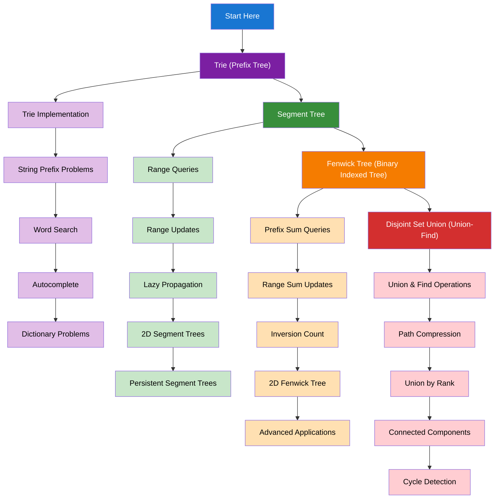

import { useCurrentSidebarCategory } from "@docusaurus/theme-common";

# Advanced Data Structures

Advanced data structures for solving complex algorithmic problems efficiently. These structures provide specialized operations for specific use cases.

## Learning Map

<Figure caption="Advanced data structures organized by complexity and application.">

</Figure>

## Prerequisites

- [Time & Space Complexity Analysis](../fundamentals-and-prerequisites/time-and-space-complexity-analysis)
- [Basic Data Structures](../fundamentals-and-prerequisites/basic-data-structures)
- [Trees & Binary Trees](../trees-and-binary-trees)

## What's in scope

- **Trie (Prefix Tree)**: String prefix problems, word search, autocomplete, and dictionary problems
- **Segment Tree**: Range queries, range updates, lazy propagation, and 2D segment trees
- **Fenwick Tree**: Prefix sum queries, range sum updates, inversion count, and 2D applications
- **Disjoint Set Union**: Union & find operations, path compression, union by rank, and cycle detection

## How to use this section

- Start with [Trie (Prefix Tree)](./trie-prefix-tree) for string-related problems
- Learn [Segment Tree](./segment-tree) for range query problems
- Master [Fenwick Tree](./fenwick-tree-binary-indexed-tree) for prefix sum operations
- Explore [Disjoint Set Union](./disjoint-set-union-union-find) for connectivity problems

<DocCardList items={useCurrentSidebarCategory().items} />
