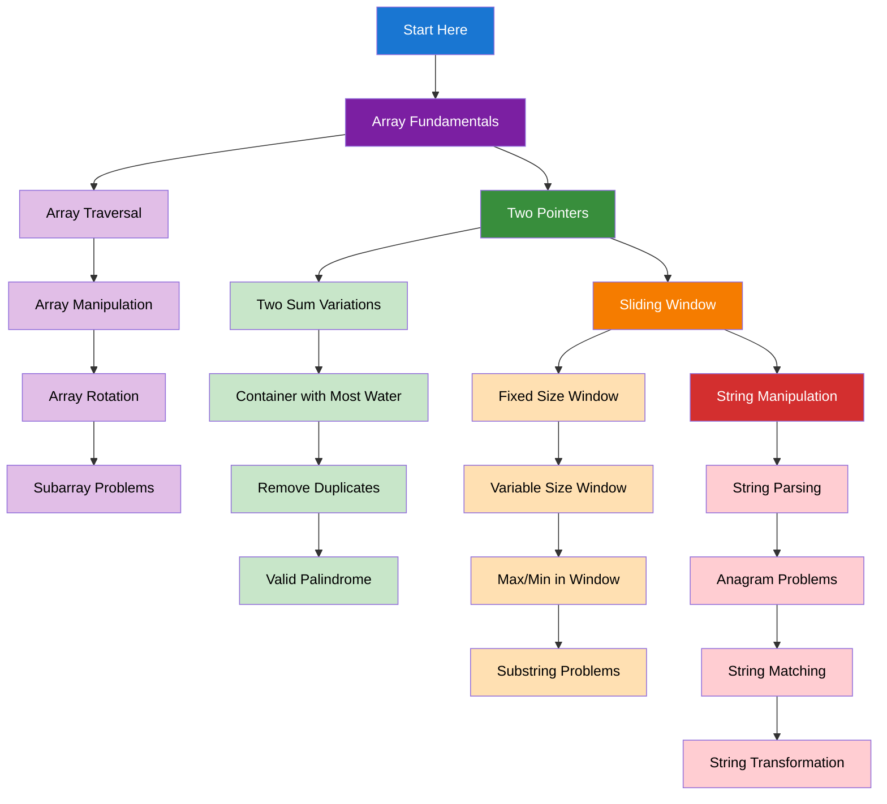

import DocCardList from "@theme/DocCardList";
import { useCurrentSidebarCategory } from "@docusaurus/theme-common";
import Figure from "@site/src/components/Figure";
import Head from "@docusaurus/Head";

<Head>
  
  
</Head>

# Arrays & Strings

Arrays and strings are the most fundamental data structures in programming. This section covers essential techniques and patterns that appear in countless algorithmic problems, making them perfect starting points for interview preparation.

## Learning Map

<Figure caption="Key concepts and techniques for working with arrays and strings.">

</Figure>

## Prerequisites

- [Time & Space Complexity Analysis](../fundamentals-and-prerequisites/time-and-space-complexity-analysis)
- [Basic Data Structures](../fundamentals-and-prerequisites/basic-data-structures)
- [Basic Programming Concepts](../fundamentals-and-prerequisites/basic-programming-concepts)

## What's in scope

- **Array Fundamentals**: Traversal, manipulation, rotation, and subarray problems
- **Two Pointers**: Efficient techniques for array and string problems
- **Sliding Window**: Processing contiguous subarrays and substrings
- **String Manipulation**: Parsing, anagrams, matching, and transformation

## How to use this section

- Start with [Array Fundamentals](./array-fundamentals) to understand basic array operations
- Learn [Two Pointers](./two-pointers) for efficient array traversal techniques
- Master [Sliding Window](./sliding-window) for subarray and substring problems
- Practice [String Manipulation](./string-manipulation) for text processing challenges

<DocCardList items={useCurrentSidebarCategory().items} />
