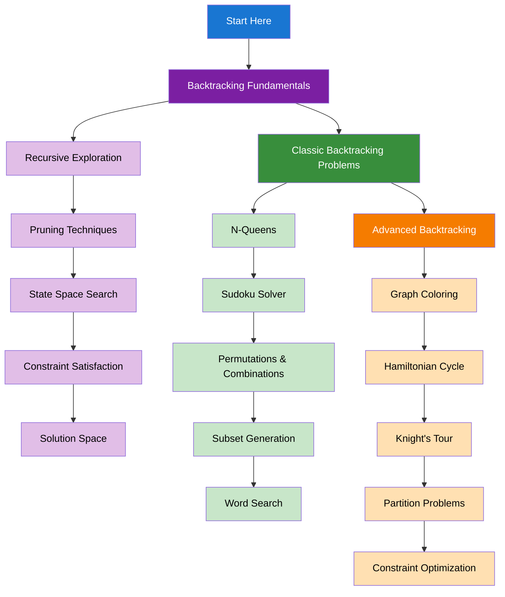

import { useCurrentSidebarCategory } from "@docusaurus/theme-common";

# Backtracking

Backtracking is a systematic method for solving constraint satisfaction problems by exploring all possible solutions and backtracking when constraints are violated.

## Learning Map

<Figure caption="Backtracking concepts organized from fundamentals to advanced applications.">

</Figure>

## Prerequisites

- [Time & Space Complexity Analysis](../fundamentals-and-prerequisites/time-and-space-complexity-analysis)
- [Basic Data Structures](../fundamentals-and-prerequisites/basic-data-structures)
- [Recursion Concepts](../fundamentals-and-prerequisites/basic-programming-concepts)

## What's in scope

- **Backtracking Fundamentals**: Recursive exploration, pruning techniques, state space search, and constraint satisfaction
- **Classic Backtracking Problems**: N-Queens, Sudoku solver, permutations, combinations, and word search
- **Advanced Backtracking**: Graph coloring, Hamiltonian cycle, Knight's tour, partition problems, and constraint optimization

## How to use this section

- Start with [Backtracking Fundamentals](./backtracking-fundamentals) to understand core concepts
- Practice [Classic Backtracking Problems](./classic-backtracking-problems) for essential algorithms
- Explore [Advanced Backtracking](./advanced-backtracking) for complex applications

<DocCardList items={useCurrentSidebarCategory().items} />
