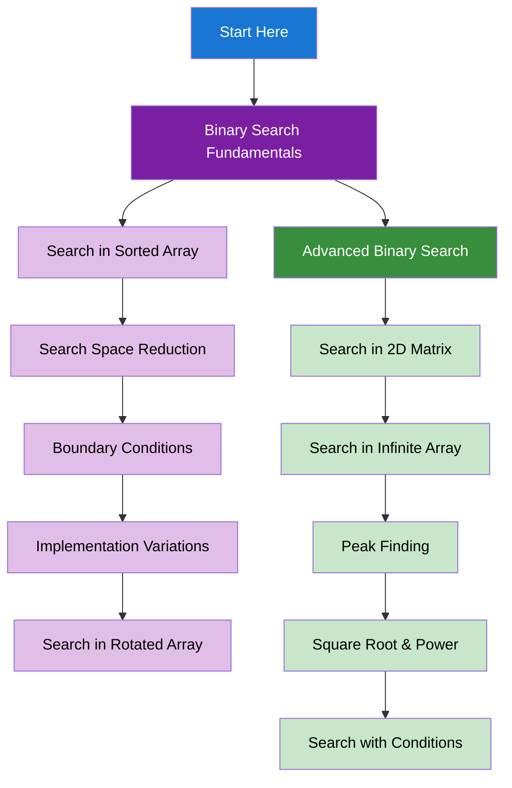

import DocCardList from "@theme/DocCardList";
import { useCurrentSidebarCategory } from "@docusaurus/theme-common";
import Figure from "@site/src/components/Figure";
import Head from "@docusaurus/Head";

<Head>
  
  
</Head>

# Binary Search

Binary search is a powerful technique for efficiently searching in sorted data and solving optimization problems.

## Learning Map

<Figure caption="Binary search concepts from fundamentals to advanced applications.">

</Figure>

## Prerequisites

- [Time & Space Complexity Analysis](../fundamentals-and-prerequisites/time-and-space-complexity-analysis)
- [Arrays & Strings](../arrays-and-strings)

## What's in scope

- **Binary Search Fundamentals**: Basic search in sorted arrays, boundary conditions, and implementation variations
- **Advanced Binary Search**: 2D matrix search, infinite arrays, peak finding, and conditional search

## How to use this section

- Start with [Binary Search Fundamentals](./binary-search-fundamentals) to understand basic concepts
- Learn [Advanced Binary Search](./advanced-binary-search) for complex applications

<DocCardList items={useCurrentSidebarCategory().items} />
