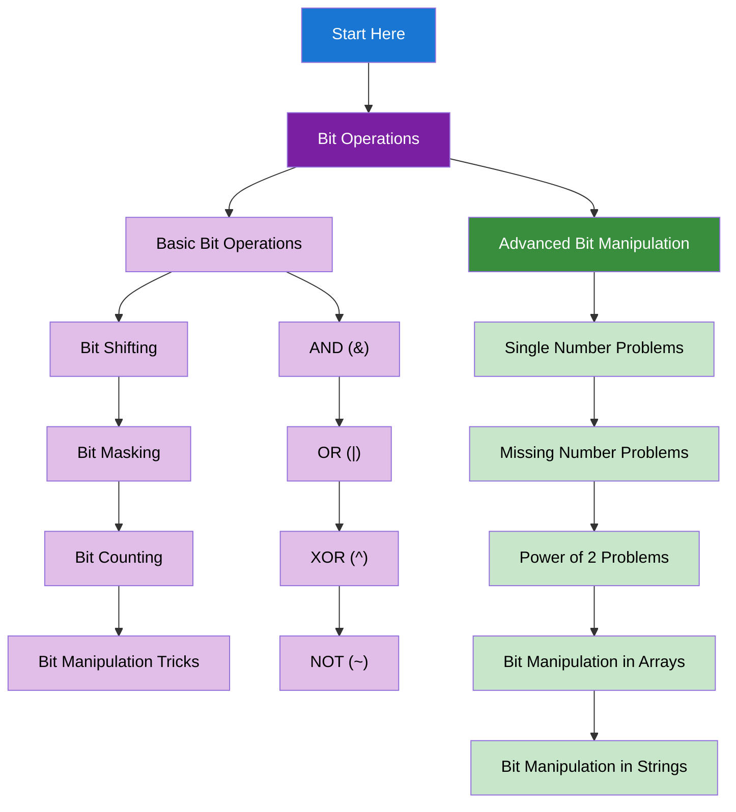

import { useCurrentSidebarCategory } from "@docusaurus/theme-common";

# Bit Manipulation

Bit manipulation involves working with individual bits in binary representation, providing efficient solutions for many algorithmic problems.

## Learning Map

<Figure caption="Bit manipulation concepts organized from basic operations to advanced techniques.">

</Figure>

## Prerequisites

- [Time & Space Complexity Analysis](../fundamentals-and-prerequisites/time-and-space-complexity-analysis)
- [Basic Programming Concepts](../fundamentals-and-prerequisites/basic-programming-concepts)

## What's in scope

- **Bit Operations**: Basic bit operations (AND, OR, XOR, NOT), bit shifting, bit masking, bit counting, and bit manipulation tricks
- **Advanced Bit Manipulation**: Single number problems, missing number problems, power of 2 problems, and bit manipulation in arrays and strings

## How to use this section

- Start with [Bit Operations](./bit-operations) to understand basic bit manipulation
- Learn [Advanced Bit Manipulation](./advanced-bit-manipulation) for complex problems

<DocCardList items={useCurrentSidebarCategory().items} />
