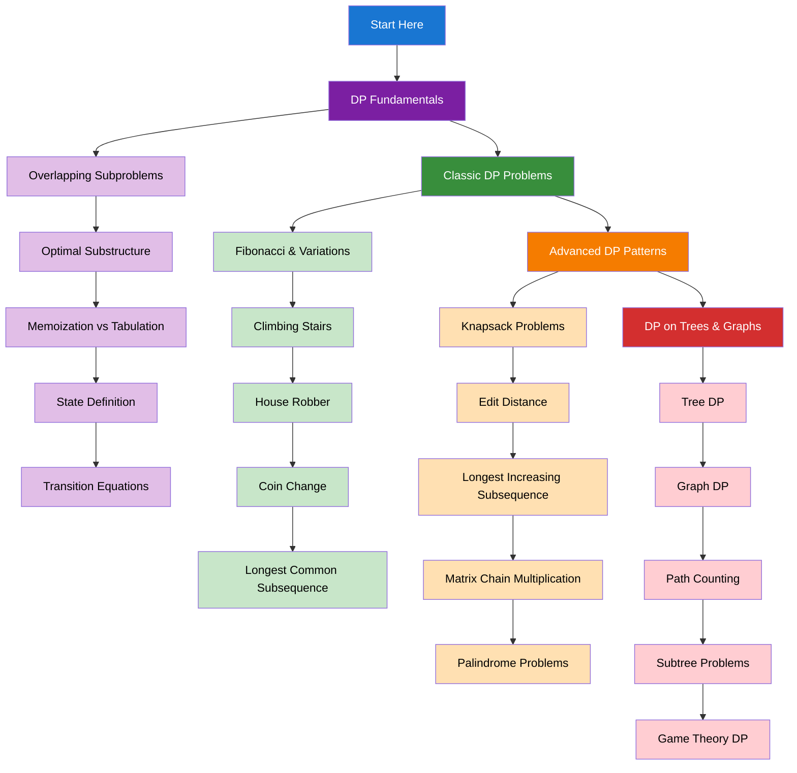

import { useCurrentSidebarCategory } from "@docusaurus/theme-common";

# Dynamic Programming

Dynamic Programming (DP) is a powerful technique for solving optimization problems by breaking them down into simpler subproblems and storing solutions to avoid redundant calculations.

## Learning Map

<Figure caption="Dynamic programming concepts and problem types organized by complexity.">

</Figure>

## Prerequisites

- [Time & Space Complexity Analysis](../fundamentals-and-prerequisites/time-and-space-complexity-analysis)
- [Arrays & Strings](../arrays-and-strings)
- [Hash Tables & Sets](../hash-tables-and-sets)
- [Trees & Binary Trees](../trees-and-binary-trees)

## What's in scope

- **DP Fundamentals**: Core concepts including overlapping subproblems, optimal substructure, and implementation approaches
- **Classic DP Problems**: Essential problems like Fibonacci, climbing stairs, house robber, and coin change
- **Advanced DP Patterns**: Complex patterns including knapsack, edit distance, and matrix chain multiplication
- **DP on Trees & Graphs**: Applying dynamic programming to tree and graph structures

## How to use this section

- Start with [DP Fundamentals](./dp-fundamentals) to understand the core concepts
- Practice [Classic DP Problems](./classic-dp-problems) to build intuition
- Master [Advanced DP Patterns](./advanced-dp-patterns) for complex problems
- Explore [DP on Trees & Graphs](./dp-on-trees-and-graphs) for specialized applications

<DocCardList items={useCurrentSidebarCategory().items} />
