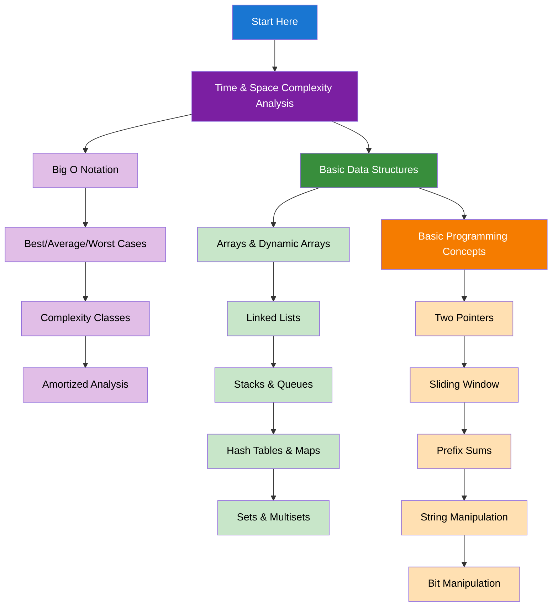

import { useCurrentSidebarCategory } from "@docusaurus/theme-common";

# Fundamentals & Prerequisites

Build the essential foundation for algorithmic problem-solving. This section covers the fundamental concepts you need to understand before diving into specific algorithms and data structures. Master these concepts to approach any coding problem with confidence.

## Learning Map

<Figure caption="Essential concepts to master before moving to specific algorithms.">

</Figure>

## Prerequisites

- Basic programming knowledge in any language
- Understanding of variables, loops, conditionals, and functions
- Basic mathematical concepts (logarithms, exponents)

## What's in scope

- **Time & Space Complexity Analysis**: Understanding Big O notation and how to analyze algorithm efficiency
- **Basic Data Structures**: Arrays, linked lists, stacks, queues, hash tables, and sets
- **Basic Programming Concepts**: Two pointers, sliding window, prefix sums, string manipulation, and bit manipulation

## How to use this section

- Start with [Time & Space Complexity Analysis](./time-and-space-complexity-analysis) to understand how to measure algorithm efficiency
- Learn [Basic Data Structures](./basic-data-structures) to understand the building blocks of algorithms
- Master [Basic Programming Concepts](./basic-programming-concepts) for common problem-solving techniques

<DocCardList items={useCurrentSidebarCategory().items} />
