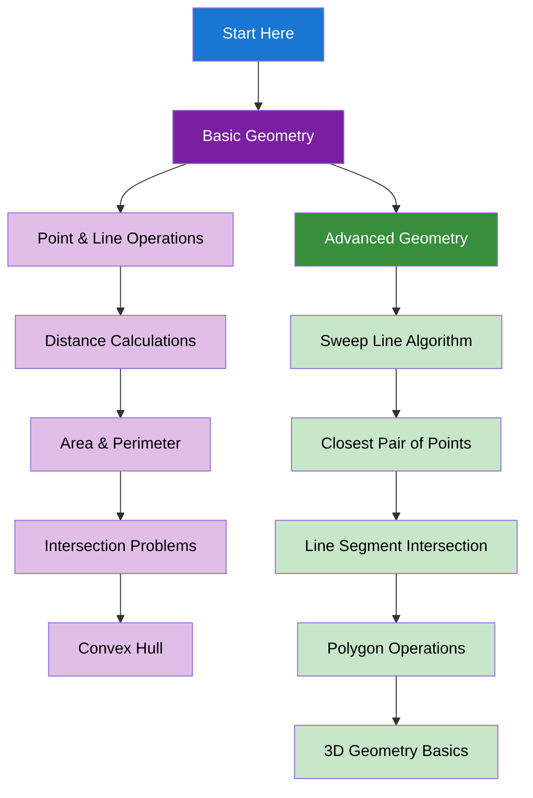

import { useCurrentSidebarCategory } from "@docusaurus/theme-common";

# Geometry & Computational Geometry

Geometric algorithms and computational geometry concepts for solving spatial and geometric problems.

## Learning Map

<Figure caption="Geometric concepts organized from basic operations to advanced algorithms.">

</Figure>

## Prerequisites

- [Time & Space Complexity Analysis](../fundamentals-and-prerequisites/time-and-space-complexity-analysis)
- [Basic Programming Concepts](../fundamentals-and-prerequisites/basic-programming-concepts)
- [Math & Number Theory](../math-and-number-theory)

## What's in scope

- **Basic Geometry**: Point & line operations, distance calculations, area & perimeter, intersection problems, and convex hull
- **Advanced Geometry**: Sweep line algorithm, closest pair of points, line segment intersection, polygon operations, and 3D geometry basics

## How to use this section

- Start with [Basic Geometry](./basic-geometry) to understand fundamental geometric operations
- Learn [Advanced Geometry](./advanced-geometry) for complex geometric algorithms

<DocCardList items={useCurrentSidebarCategory().items} />
