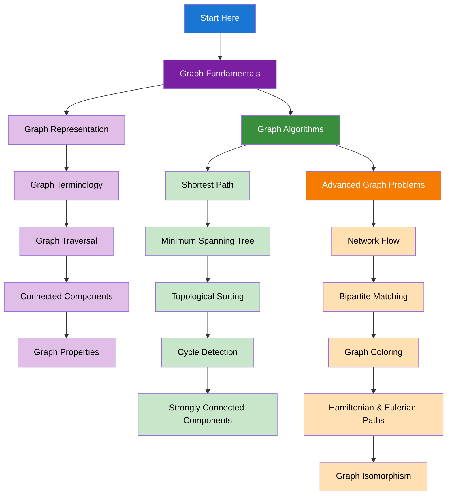

import { useCurrentSidebarCategory } from "@docusaurus/theme-common";

# Graphs

Graphs are fundamental data structures for modeling relationships and connections. Master graph algorithms for solving complex problems.

## Learning Map

<Figure caption="Graph concepts organized from fundamentals to advanced algorithms.">

</Figure>

## Prerequisites

- [Time & Space Complexity Analysis](../fundamentals-and-prerequisites/time-and-space-complexity-analysis)
- [Basic Data Structures](../fundamentals-and-prerequisites/basic-data-structures)
- [Trees & Binary Trees](../trees-and-binary-trees)

## What's in scope

- **Graph Fundamentals**: Representation, terminology, traversal, and properties
- **Graph Algorithms**: Shortest path, minimum spanning tree, topological sorting
- **Advanced Graph Problems**: Network flow, bipartite matching, graph coloring

## How to use this section

- Start with [Graph Fundamentals](./graph-fundamentals) to understand basic graph concepts
- Learn [Graph Algorithms](./graph-algorithms) for essential graph algorithms
- Explore [Advanced Graph Problems](./advanced-graph-problems) for complex applications

<DocCardList items={useCurrentSidebarCategory().items} />
