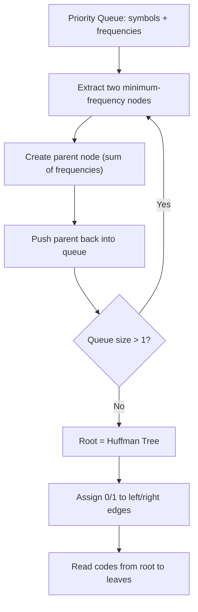

<Hero title="Classic Greedy Problems" subtitle="Master foundational greedy problems: knapsack, Huffman coding, scheduling, and shortest paths" imageAlt="Classic greedy algorithm problems and solutions" size="large" />

## TL;DR

Classic greedy problems demonstrate when locally optimal choices lead to globally optimal solutions. Fractional knapsack sorts by value-to-weight ratio, Huffman coding greedily merges least-frequent symbols, and job scheduling optimizes by deadlines and profits. Each problem has a clean proof of correctness via exchange arguments.

## Core Concepts

### Fractional Knapsack

Unlike the 0/1 knapsack (which requires DP), the fractional knapsack allows taking fractions of items. The greedy strategy is simple: sort items by value-to-weight ratio in descending order, then take as much of each item as possible until the knapsack is full. This works because fractions mean you can always "fill the gap" with the highest-value density item remaining. Time complexity is O(n log n) for sorting.

### Huffman Coding

Huffman coding builds an optimal prefix-free binary code for data compression. The algorithm uses a min-heap: repeatedly extract the two nodes with lowest frequency, merge them into a new internal node whose frequency is their sum, and push the result back. The process continues until one node remains—the root of the Huffman tree. Shorter codes are assigned to more frequent symbols, minimizing total encoded length. The greedy choice is provably optimal via the exchange argument: swapping any two leaf assignments either increases or maintains total cost.

### Job Scheduling with Deadlines

Given jobs with deadlines and profits, schedule the maximum-profit subset. The greedy approach sorts jobs by profit in descending order. For each job, assign it to the latest available slot before its deadline. This requires a simple slot-tracking array or a union-find structure for O(α(n)) per assignment. The exchange argument shows that replacing any lower-profit job with a higher-profit one never worsens the solution.

### Interval Scheduling Maximization

Select the maximum number of non-overlapping intervals. Sort intervals by their end time, then greedily pick the interval that ends earliest and doesn't conflict with the last selected interval. The proof of optimality shows that choosing the earliest-finishing interval leaves the most room for future selections. Time: O(n log n).

<Figure caption="Huffman coding tree construction process">

</Figure>

## Practical Example

<Tabs>
  <TabItem value="python" label="Python">
    ```python title="huffman_coding.py" showLineNumbers
    import heapq
    from collections import Counter

    def huffman_codes(text):
        freq = Counter(text)
        heap = [[count, [char, ""]] for char, count in freq.items()]
        heapq.heapify(heap)

        if len(heap) == 1:
            heap[0][1][1] = "0"
            return {heap[0][1][0]: "0"}

        while len(heap) > 1:
            lo = heapq.heappop(heap)
            hi = heapq.heappop(heap)
            for pair in lo[1:]:
                pair[1] = "0" + pair[1]
            for pair in hi[1:]:
                pair[1] = "1" + pair[1]
            heapq.heappush(heap, [lo[0] + hi[0]] + lo[1:] + hi[1:])

        codes = {char: code for char, code in heap[0][1:]}
        return codes

    # Fractional knapsack
    def fractional_knapsack(capacity, items):
        # items: list of (value, weight)
        items.sort(key=lambda x: x[0] / x[1], reverse=True)
        total = 0.0
        for value, weight in items:
            if capacity >= weight:
                total += value
                capacity -= weight
            else:
                total += value * (capacity / weight)
                break
        return total

    # Test
    codes = huffman_codes("abracadabra")
    print(codes)  # Variable-length prefix codes
    print(fractional_knapsack(50, [(60, 10), (100, 20), (120, 30)]))  # 240.0
    ```
  </TabItem>
  <TabItem value="java" label="Java">
    ```java title="HuffmanCoding.java" showLineNumbers
    import java.util.*;

    public class HuffmanCoding {
        static class Node implements Comparable<Node> {
            char ch;
            int freq;
            Node left, right;

            Node(char ch, int freq) {
                this.ch = ch;
                this.freq = freq;
            }

            Node(int freq, Node left, Node right) {
                this.ch = '\0';
                this.freq = freq;
                this.left = left;
                this.right = right;
            }

            public int compareTo(Node o) {
                return this.freq - o.freq;
            }
        }

        static Map<Character, String> buildCodes(String text) {
            Map<Character, Integer> freq = new HashMap<>();
            for (char c : text.toCharArray())
                freq.merge(c, 1, Integer::sum);

            PriorityQueue<Node> pq = new PriorityQueue<>();
            freq.forEach((ch, f) -> pq.add(new Node(ch, f)));

            while (pq.size() > 1) {
                Node left = pq.poll();
                Node right = pq.poll();
                pq.add(new Node(left.freq + right.freq, left, right));
            }

            Map<Character, String> codes = new HashMap<>();
            buildCodesHelper(pq.poll(), "", codes);
            return codes;
        }

        static void buildCodesHelper(Node node, String code, Map<Character, String> codes) {
            if (node == null) return;
            if (node.left == null && node.right == null) {
                codes.put(node.ch, code.isEmpty() ? "0" : code);
                return;
            }
            buildCodesHelper(node.left, code + "0", codes);
            buildCodesHelper(node.right, code + "1", codes);
        }
    }
    ```
  </TabItem>
  <TabItem value="typescript" label="TypeScript">
    ```typescript title="huffman.ts" showLineNumbers
    interface HuffmanNode {
        char?: string;
        freq: number;
        left?: HuffmanNode;
        right?: HuffmanNode;
    }

    function huffmanCodes(text: string): Map<string, string> {
        const freq = new Map<string, number>();
        for (const ch of text) freq.set(ch, (freq.get(ch) || 0) + 1);

        const nodes: HuffmanNode[] = [...freq.entries()]
            .map(([char, f]) => ({ char, freq: f }));
        nodes.sort((a, b) => a.freq - b.freq);

        while (nodes.length > 1) {
            const left = nodes.shift()!;
            const right = nodes.shift()!;
            const parent: HuffmanNode = {
                freq: left.freq + right.freq,
                left,
                right,
            };
            const idx = nodes.findIndex((n) => n.freq >= parent.freq);
            nodes.splice(idx === -1 ? nodes.length : idx, 0, parent);
        }

        const codes = new Map<string, string>();
        function traverse(node: HuffmanNode | undefined, code: string) {
            if (!node) return;
            if (node.char !== undefined) {
                codes.set(node.char, code || "0");
                return;
            }
            traverse(node.left, code + "0");
            traverse(node.right, code + "1");
        }
        traverse(nodes[0], "");
        return codes;
    }

    // Fractional knapsack
    function fractionalKnapsack(
        capacity: number,
        items: [number, number][]
    ): number {
        items.sort((a, b) => b[0] / b[1] - a[0] / a[1]);
        let total = 0;
        for (const [value, weight] of items) {
            if (capacity >= weight) {
                total += value;
                capacity -= weight;
            } else {
                total += value * (capacity / weight);
                break;
            }
        }
        return total;
    }
    ```
  </TabItem>
</Tabs>

## When to Use / When Not to Use

Use these greedy patterns when the problem has **optimal substructure** and the **greedy choice property** holds—meaning a locally optimal choice is part of a globally optimal solution. Fractional knapsack works because fractions are allowed; the 0/1 variant requires DP. Huffman coding is optimal for known static frequency distributions; adaptive coding (like LZW) handles dynamic streams. Interval scheduling works when you want maximum count of non-overlapping intervals; for weighted intervals, use DP instead.

:::warning Common Pitfalls
- **Applying fractional knapsack logic to 0/1 knapsack**: fractions change the problem fundamentally—0/1 requires DP
- **Not sorting correctly**: forgetting to sort by end time (interval scheduling) or value/weight ratio (knapsack) breaks correctness
- **Huffman with single symbol**: edge case where the heap has only one node—assign code "0" directly
- **Ignoring deadline collisions**: in job scheduling, not checking slot availability leads to incorrect schedules
- **Assuming greedy always works**: always verify the greedy choice property before choosing this approach

:::

## Self-Check

1. **Why does fractional knapsack have a greedy solution but 0/1 knapsack doesn't?** Fractions allow filling remaining capacity optimally; integer constraints create subproblem dependencies requiring DP.
2. **What is the time complexity of Huffman coding?** O(n log n) where n is the number of unique symbols, due to heap operations.
3. **How do you prove interval scheduling is optimal?** Exchange argument: if any other solution selects a different first interval, swapping it with the earliest-finishing one yields an equally valid or better solution.

:::info
**One Takeaway**: Each classic greedy problem pairs a sorting strategy with a selection rule. Master the exchange argument proof technique—it's the key to validating whether your greedy approach is correct.

:::

## Next Steps

- [Greedy Fundamentals](./greedy-fundamentals) for foundational theory and proof techniques
- [Advanced Greedy](./advanced-greedy) for combining greedy with priority queues and sorting
- [Dynamic Programming Fundamentals](../dynamic-programming/dp-fundamentals) for problems where greedy fails

## References

- Cormen, T. H., et al. (2022). *Introduction to Algorithms* (4th ed.). MIT Press. (Chapter 15: Greedy Algorithms) <a href="https://mitpress.mit.edu/books/introduction-algorithms-fourth-edition" target="_blank" rel="nofollow noopener noreferrer">↗️</a>
- Kleinberg, J., & Tardos, É. (2006). *Algorithm Design*. Pearson. (Chapter 4: Greedy Algorithms) <a href="https://www.pearson.com/us/higher-education/program/Kleinberg-Algorithm-Design/PGM307702.html" target="_blank" rel="nofollow noopener noreferrer">↗️</a>
