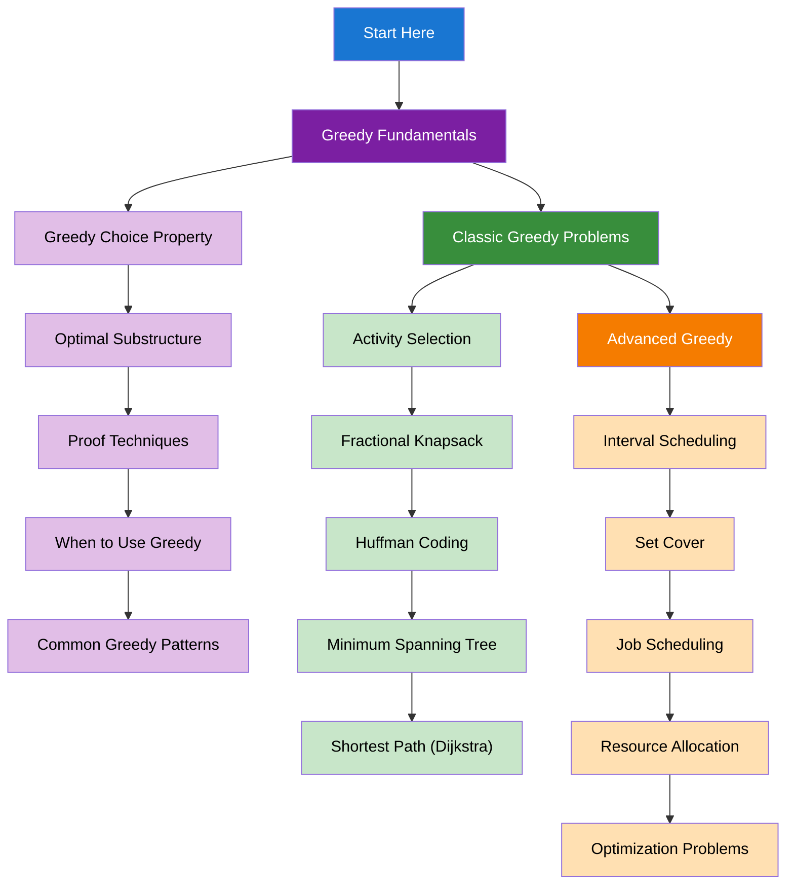

import { useCurrentSidebarCategory } from "@docusaurus/theme-common";

# Greedy Algorithms

Greedy algorithms make locally optimal choices at each step, hoping to find a global optimum. Master the principles and applications of greedy algorithms.

## Learning Map

<Figure caption="Greedy algorithm concepts organized from fundamentals to applications.">

</Figure>

## Prerequisites

- [Time & Space Complexity Analysis](../fundamentals-and-prerequisites/time-and-space-complexity-analysis)
- [Basic Data Structures](../fundamentals-and-prerequisites/basic-data-structures)
- [Arrays & Strings](../arrays-and-strings)

## What's in scope

- **Greedy Fundamentals**: Greedy choice property, optimal substructure, proof techniques, and when to use greedy
- **Classic Greedy Problems**: Activity selection, fractional knapsack, Huffman coding, minimum spanning tree, and shortest path
- **Advanced Greedy**: Interval scheduling, set cover, job scheduling, resource allocation, and optimization problems

## How to use this section

- Start with [Greedy Fundamentals](./greedy-fundamentals) to understand core concepts
- Practice [Classic Greedy Problems](./classic-greedy-problems) for essential algorithms
- Explore [Advanced Greedy](./advanced-greedy) for complex applications

<DocCardList items={useCurrentSidebarCategory().items} />
