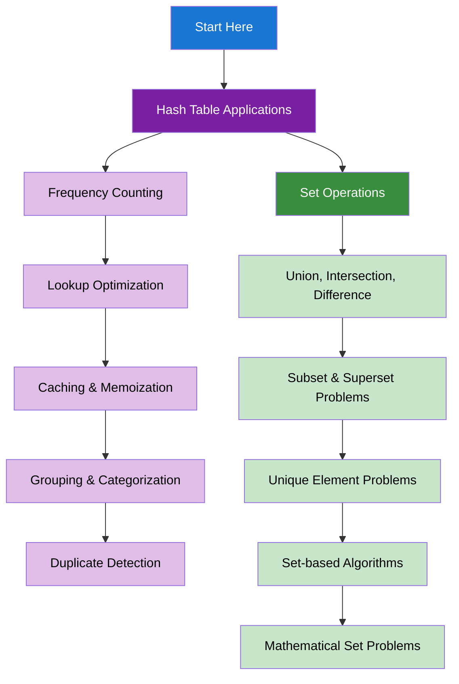

import DocCardList from "@theme/DocCardList";
import { useCurrentSidebarCategory } from "@docusaurus/theme-common";
import Figure from "@site/src/components/Figure";
import Head from "@docusaurus/Head";

<Head>
  
  
</Head>

# Hash Tables & Sets

Hash tables and sets are fundamental data structures that provide O(1) average-case access time, making them essential for optimizing many algorithmic problems. Master these structures to solve problems efficiently.

## Learning Map

<Figure caption="Key applications and operations for hash tables and sets.">

</Figure>

## Prerequisites

- [Time & Space Complexity Analysis](../fundamentals-and-prerequisites/time-and-space-complexity-analysis)
- [Basic Data Structures](../fundamentals-and-prerequisites/basic-data-structures)
- [Arrays & Strings](../arrays-and-strings)

## What's in scope

- **Hash Table Applications**: Frequency counting, lookup optimization, caching, grouping, and duplicate detection
- **Set Operations**: Union, intersection, difference, subset problems, and mathematical set operations

## How to use this section

- Start with [Hash Table Applications](./hash-table-applications) to understand common use cases
- Learn [Set Operations](./set-operations) for mathematical and logical operations on collections

<DocCardList items={useCurrentSidebarCategory().items} />
