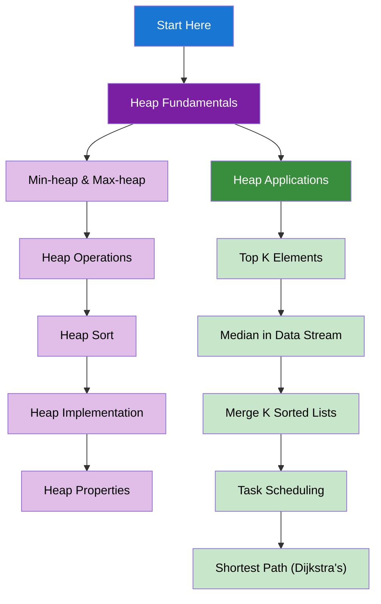

import DocCardList from "@theme/DocCardList";
import { useCurrentSidebarCategory } from "@docusaurus/theme-common";
import Figure from "@site/src/components/Figure";
import Head from "@docusaurus/Head";

<Head>
  
  
</Head>

# Heaps & Priority Queues

Heaps are specialized tree-based data structures that provide efficient access to minimum or maximum elements, making them essential for priority-based operations.

## Learning Map

<Figure caption="Heap concepts organized from fundamentals to applications.">

</Figure>

## Prerequisites

- [Time & Space Complexity Analysis](../fundamentals-and-prerequisites/time-and-space-complexity-analysis)
- [Basic Data Structures](../fundamentals-and-prerequisites/basic-data-structures)
- [Trees & Binary Trees](../trees-and-binary-trees)

## What's in scope

- **Heap Fundamentals**: Min-heap, max-heap, operations, implementation, and properties
- **Heap Applications**: Top K elements, median finding, merging sorted lists, task scheduling, and shortest path

## How to use this section

- Start with [Heap Fundamentals](./heap-fundamentals) to understand basic heap concepts
- Learn [Heap Applications](./heap-applications) for practical problem-solving

<DocCardList items={useCurrentSidebarCategory().items} />
