import { useCurrentSidebarCategory } from "@docusaurus/theme-common";

# Algorithms & Data Structures (LeetCode Preparation)

Master algorithmic problem-solving with a comprehensive, beginner-friendly guide that takes you from fundamentals to advanced techniques. This section is specifically designed for LeetCode preparation and technical interview success, with a carefully structured learning path that builds knowledge progressively.

## Learning Objectives

By the end of this section, you will be able to:

- **Analyze complexity**: Understand and analyze time and space complexity using Big O notation
- **Solve systematically**: Apply structured problem-solving strategies to break down complex problems
- **Master fundamentals**: Implement and manipulate core data structures (arrays, strings, trees, graphs)
- **Apply advanced techniques**: Use dynamic programming, greedy algorithms, and backtracking effectively
- **Optimize solutions**: Recognize patterns and choose optimal algorithms for different problem types
- **Prepare for interviews**: Develop confidence in technical interviews through systematic practice

## Learning Path

```mermaid title="algorithms-learning-path.mmd" showLineNumbers
flowchart TB
    Start["Start Here"] --> PS["Problem-Solving Strategies"]
    PS --> F["Fundamentals & Prerequisites"]
    F --> AS["Arrays & Strings"]
    AS --> HS["Hash Tables & Sets"]
    HS --> LL["Linked Lists"]
    LL --> SQ["Stacks & Queues"]
    SQ --> T["Trees & Binary Trees"]
    T --> H["Heaps & Priority Queues"]
    H --> G["Graphs"]
    G --> DP["Dynamic Programming"]
    DP --> GA["Greedy Algorithms"]
    GA --> BT["Backtracking"]
    BT --> BS["Binary Search"]
    BS --> SS["Sorting & Searching"]
    SS --> BM["Bit Manipulation"]
    BM --> M["Math & Number Theory"]
    M --> ADS["Advanced Data Structures"]
    ADS --> SA["String Algorithms"]
    SA --> CG["Geometry & Computational Geometry"]
    CG --> SD["System Design for Algorithms"]
    
    style Start fill:#1976d2,color:#ffffff
    style PS fill:#1976d2,color:#ffffff
    style F fill:#388e3c,color:#ffffff
    style AS fill:#4caf50,color:#ffffff
    style HS fill:#4caf50,color:#ffffff
    style LL fill:#4caf50,color:#ffffff
    style SQ fill:#4caf50,color:#ffffff
    style T fill:#ff9800,color:#ffffff
    style H fill:#ff9800,color:#ffffff
    style G fill:#ff9800,color:#ffffff
    style DP fill:#e91e63,color:#ffffff
    style GA fill:#e91e63,color:#ffffff
    style BT fill:#e91e63,color:#ffffff
    style BS fill:#9c27b0,color:#ffffff
    style SS fill:#9c27b0,color:#ffffff
    style BM fill:#9c27b0,color:#ffffff
    style M fill:#9c27b0,color:#ffffff
    style ADS fill:#2196f3,color:#ffffff
    style SA fill:#2196f3,color:#ffffff
    style CG fill:#2196f3,color:#ffffff
    style SD fill:#607d8b,color:#ffffff
```

<Figure caption="Recommended learning progression from beginner to advanced algorithmic concepts.">

</Figure>

## Prerequisites

- Basic programming knowledge in any language (Python, Java, C++, JavaScript)
- Understanding of basic programming concepts (variables, loops, conditionals, functions)
- Familiarity with basic data types (integers, strings, arrays)
- Mathematical foundation (basic algebra and logic)

## What's in scope

- **Fundamentals**: [Time/space complexity analysis](./fundamentals-and-prerequisites/time-and-space-complexity-analysis), [basic data structures](./fundamentals-and-prerequisites/basic-data-structures), and essential programming techniques
- **Core Topics**: [Arrays & strings](./arrays-and-strings), [hash tables & sets](./hash-tables-and-sets), [linked lists](./linked-lists), [stacks & queues](./stacks-and-queues), [trees & binary trees](./trees-and-binary-trees), and [graphs](./graphs)
- **Advanced Algorithms**: [Dynamic programming](./dynamic-programming), [greedy algorithms](./greedy-algorithms), [backtracking](./backtracking), and [binary search](./binary-search)
- **Specialized Areas**: [Bit manipulation](./bit-manipulation), [mathematical algorithms](./math-and-number-theory), [advanced data structures](./advanced-data-structures), and [string algorithms](./string-algorithms)
- **Real-world Applications**: [System design for algorithms](./system-design-for-algorithms) and [problem-solving strategies](./problem-solving-strategies) for interviews

## How to use this section

- **Beginners**: Start with [Problem-Solving Strategies](./problem-solving-strategies) to learn the methodology, then proceed to [Fundamentals & Prerequisites](./fundamentals-and-prerequisites) and follow the learning path sequentially
- **Intermediate**: Jump to specific topics like [Dynamic Programming](./dynamic-programming) or [Graphs](./graphs) based on your needs
- **Interview Prep**: Focus on [Problem-Solving Strategies](./problem-solving-strategies) for methodology and practice with the categorized problems
- **Advanced**: Explore [Advanced Data Structures](./advanced-data-structures) and [System Design for Algorithms](./system-design-for-algorithms)

> "The best way to learn algorithms is to understand the patterns, not memorize solutions. Focus on the 'why' behind each technique, and the 'how' will follow naturally." — *Donald Knuth*

<DocCardList items={useCurrentSidebarCategory().items} />
