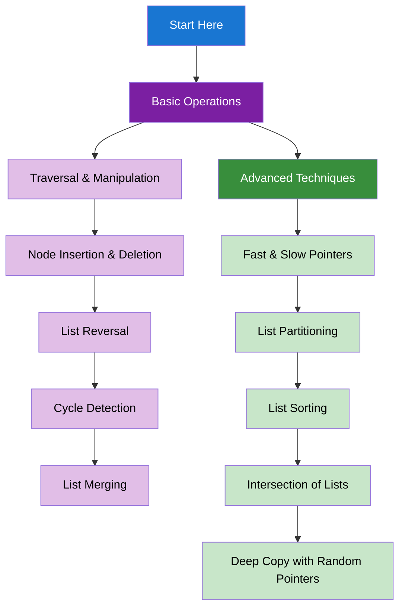

import DocCardList from "@theme/DocCardList";
import { useCurrentSidebarCategory } from "@docusaurus/theme-common";
import Figure from "@site/src/components/Figure";
import Head from "@docusaurus/Head";

<Head>
  
  
</Head>

# Linked Lists

Linked lists are fundamental data structures that provide dynamic memory allocation and efficient insertion/deletion operations.

## Learning Map

<Figure caption="Linked list concepts from basic operations to advanced techniques.">

</Figure>

## Prerequisites

- [Time & Space Complexity Analysis](../fundamentals-and-prerequisites/time-and-space-complexity-analysis)
- [Basic Data Structures](../fundamentals-and-prerequisites/basic-data-structures)

## What's in scope

- **Basic Operations**: Traversal, insertion, deletion, reversal, and cycle detection
- **Advanced Techniques**: Fast/slow pointers, partitioning, sorting, and intersection

## How to use this section

- Start with [Basic Operations](./basic-operations) to understand fundamental linked list operations
- Learn [Advanced Techniques](./advanced-techniques) for complex linked list algorithms

<DocCardList items={useCurrentSidebarCategory().items} />
