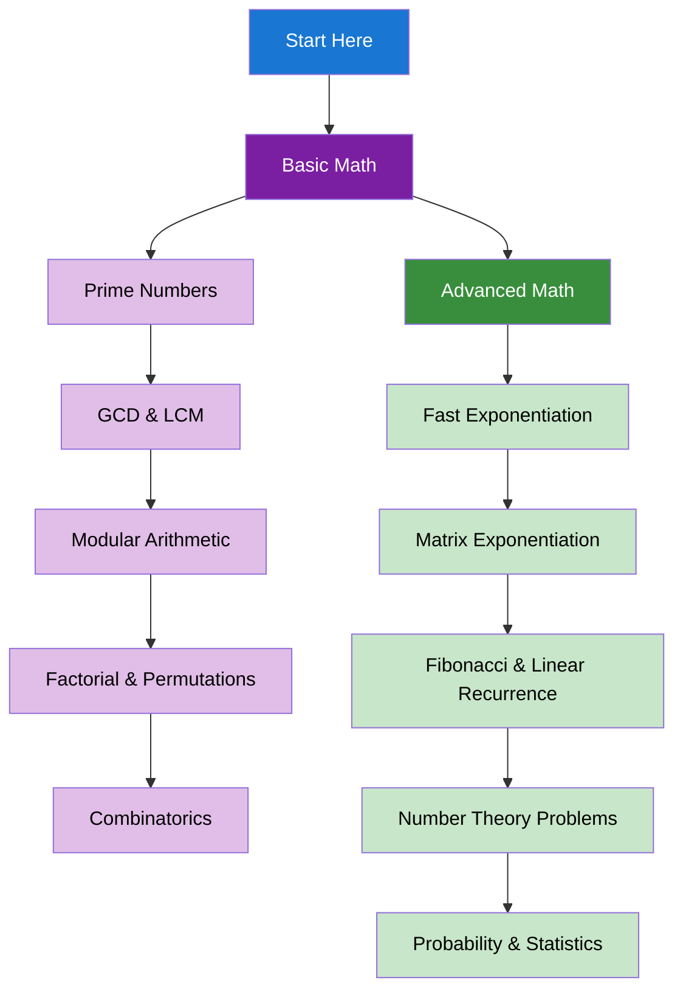

import { useCurrentSidebarCategory } from "@docusaurus/theme-common";

# Math & Number Theory

Mathematical algorithms and number theory concepts essential for solving complex algorithmic problems.

## Learning Map

<Figure caption="Mathematical concepts organized from basic to advanced topics.">

</Figure>

## Prerequisites

- [Time & Space Complexity Analysis](../fundamentals-and-prerequisites/time-and-space-complexity-analysis)
- [Basic Programming Concepts](../fundamentals-and-prerequisites/basic-programming-concepts)

## What's in scope

- **Basic Math**: Prime numbers, GCD & LCM, modular arithmetic, factorial & permutations, and combinatorics
- **Advanced Math**: Fast exponentiation, matrix exponentiation, Fibonacci & linear recurrence, number theory problems, and probability & statistics

## How to use this section

- Start with [Basic Math](./basic-math) to understand fundamental mathematical concepts
- Learn [Advanced Math](./advanced-math) for complex mathematical algorithms

<DocCardList items={useCurrentSidebarCategory().items} />
