import DocCardList from "@theme/DocCardList";
import { useCurrentSidebarCategory } from "@docusaurus/theme-common";
import Figure from "@site/src/components/Figure";
import Head from "@docusaurus/Head";

<Head>
  
  
</Head>

# Problem-Solving Strategies

Master the systematic approaches that transform complex algorithmic challenges into manageable, solvable problems. Whether you're preparing for technical interviews, tackling competitive programming, or solving real-world engineering problems, these strategies provide the foundation for consistent success.

> "The best way to solve a problem is to prevent it from happening in the first place. But when you can't prevent it, the next best thing is to have a systematic approach to solving it." — *Donald Knuth*

## The Problem-Solving Mindset

Effective algorithmic problem-solving isn't just about knowing data structures and algorithms—it's about developing a systematic approach that works under pressure. The difference between successful problem-solvers and those who struggle often comes down to having a clear methodology and the discipline to follow it consistently.

```mermaid title="problem-solving-methodology.mmd" showLineNumbers
flowchart TD
    Problem["Problem Statement"] --> Understand["Understand Requirements"]
    Understand --> Clarify["Clarify Constraints"]
    Clarify --> Examples["Work Through Examples"]
    Examples --> EdgeCases["Identify Edge Cases"]
    EdgeCases --> Analyze["Analyze & Pattern Match"]
    Analyze --> Patterns["Recognize Patterns"]
    Patterns --> DS["Choose Data Structures"]
    DS --> Algorithm["Select Algorithm"]
    Algorithm --> Design["Design Solution"]
    Design --> Pseudocode["Write Pseudocode"]
    Pseudocode --> Complexity["Analyze Complexity"]
    Complexity --> Tradeoffs["Consider Tradeoffs"]
    Tradeoffs --> Implement["Implement & Test"]
    Implement --> Code["Write Clean Code"]
    Code --> Test["Test Thoroughly"]
    Test --> Debug["Debug Issues"]
    Debug --> Optimize["Optimize & Refine"]
    Optimize --> Time["Time Optimization"]
    Time --> Space["Space Optimization"]
    Space --> Readability["Code Readability"]
    
    style Problem fill:#1976d2,color:#ffffff
    style Understand fill:#7b1fa2,color:#ffffff
    style Analyze fill:#388e3c,color:#ffffff
    style Design fill:#f57c00,color:#ffffff
    style Implement fill:#d32f2f,color:#ffffff
    style Optimize fill:#5d4037,color:#ffffff
```

<Figure caption="The systematic problem-solving methodology from understanding to implementation.">

</Figure>

## What You'll Master

This section covers the three pillars of effective problem-solving:

- **[Problem Analysis](./problem-analysis)**: Learn to break down complex problems, identify patterns, and choose the right approach before writing a single line of code
- **[Implementation Techniques](./implementation-techniques)**: Develop clean, efficient coding practices that work under time pressure and produce maintainable solutions  
- **[Interview Preparation](./interview-preparation)**: Master the communication and time management skills that separate good candidates from great ones

## Prerequisites

- Basic understanding of [time and space complexity](../fundamentals-and-prerequisites/time-and-space-complexity-analysis)
- Familiarity with [fundamental data structures](../fundamentals-and-prerequisites/basic-data-structures)
- Experience with at least one programming language

## Getting Started

Begin with [Problem Analysis](./problem-analysis) to build your systematic approach, then move to [Implementation Techniques](./implementation-techniques) to refine your coding skills. Complete your preparation with [Interview Preparation](./interview-preparation) to excel in technical assessments.

<DocCardList items={useCurrentSidebarCategory().items} />
