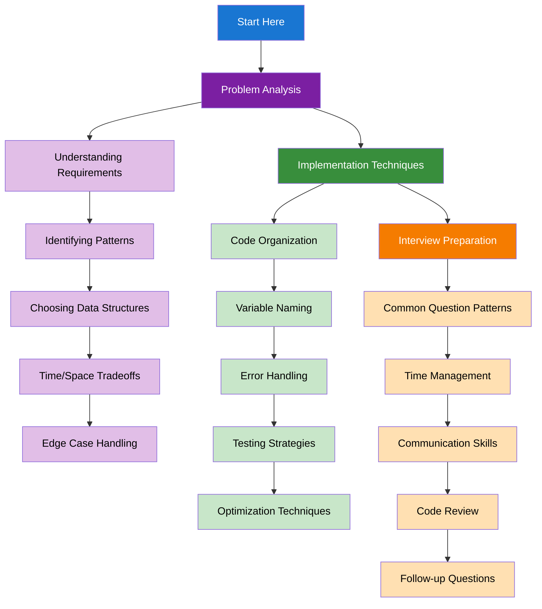

import DocCardList from "@theme/DocCardList";
import { useCurrentSidebarCategory } from "@docusaurus/theme-common";
import Figure from "@site/src/components/Figure";
import Head from "@docusaurus/Head";

<Head>
  
  
</Head>

# Problem-Solving Strategies

Develop systematic approaches to tackle algorithmic problems effectively. This section covers everything from initial problem analysis to interview preparation techniques.

## Learning Map

<Figure caption="Systematic approach to solving algorithmic problems from analysis to implementation.">

</Figure>

## Prerequisites

- All previous algorithm sections (recommended to complete most topics first)
- Basic understanding of time and space complexity
- Familiarity with common data structures and algorithms

## What's in scope

- **Problem Analysis**: Systematic approach to understanding and breaking down problems
- **Implementation Techniques**: Best practices for writing clean, efficient code
- **Interview Preparation**: Strategies for technical interviews and coding assessments

## How to use this section

- Start with [Problem Analysis](./problem-analysis) to learn systematic problem-solving approaches
- Master [Implementation Techniques](./implementation-techniques) for writing quality code
- Focus on [Interview Preparation](./interview-preparation) for technical interview success

<DocCardList items={useCurrentSidebarCategory().items} />
