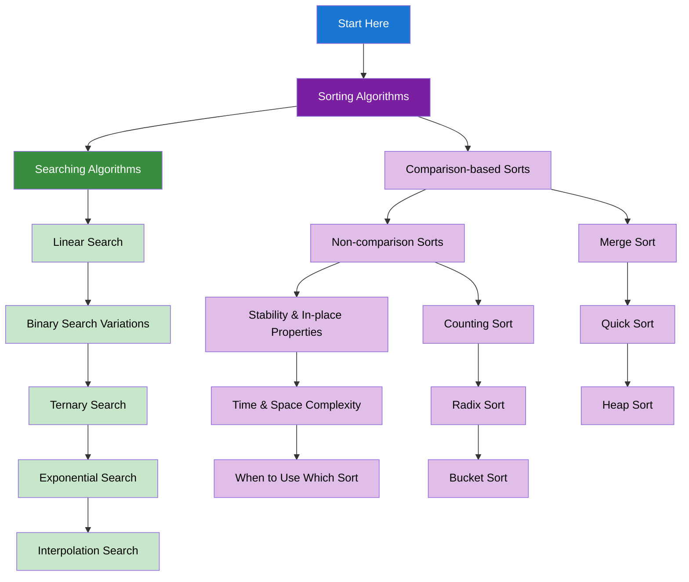

import DocCardList from "@theme/DocCardList";
import { useCurrentSidebarCategory } from "@docusaurus/theme-common";
import Figure from "@site/src/components/Figure";
import Head from "@docusaurus/Head";

<Head>
  
  
</Head>

# Sorting & Searching

Essential sorting and searching algorithms for organizing and finding data efficiently.

## Learning Map

<Figure caption="Sorting and searching algorithms organized by complexity and application.">

</Figure>

## Prerequisites

- [Time & Space Complexity Analysis](../fundamentals-and-prerequisites/time-and-space-complexity-analysis)
- [Basic Data Structures](../fundamentals-and-prerequisites/basic-data-structures)
- [Arrays & Strings](../arrays-and-strings)

## What's in scope

- **Sorting Algorithms**: Comparison-based sorts, non-comparison sorts, stability & in-place properties, time & space complexity, and when to use which sort
- **Searching Algorithms**: Linear search, binary search variations, ternary search, exponential search, and interpolation search

## How to use this section

- Start with [Sorting Algorithms](./sorting-algorithms) to understand different sorting techniques
- Learn [Searching Algorithms](./searching-algorithms) for efficient data retrieval

<DocCardList items={useCurrentSidebarCategory().items} />
