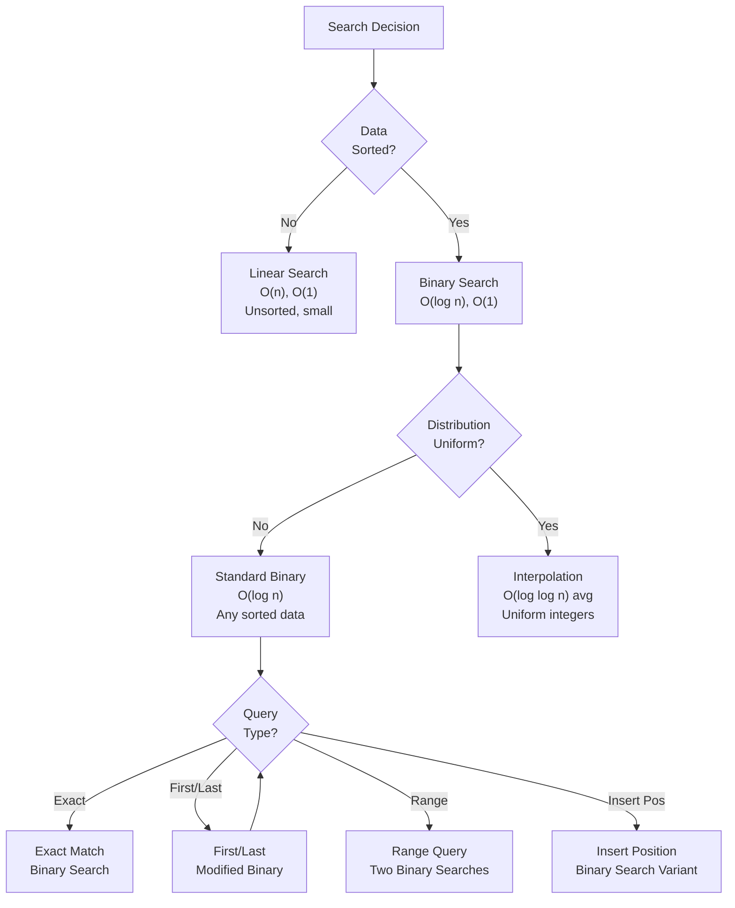

<Hero
  title="Searching Algorithms"
  subtitle="Various searching algorithms from linear search to advanced interpolation search"
  imageAlt="Searching Algorithms illustration"
  size="large"
/>

## TL;DR

Binary search queries sorted data in O(log n), exponentially faster than linear search's O(n). Interpolation search exploits uniform distribution for O(log log n) average case. Ternary search finds peaks/valleys in unimodal functions. Off-by-one errors and integer overflow are common pitfalls; use `mid = left + (right - left) / 2` to prevent bugs. Choose linear for unsorted small datasets, binary for sorted large data, interpolation for uniformly distributed integers.

## Learning Objectives

- Understand binary search invariants and boundary conditions
- Implement search variants (first/last occurrence, insert position, range)
- Recognize when linear, binary, ternary, exponential, or interpolation search applies
- Identify and fix off-by-one errors and integer overflow bugs
- Optimize search for special data structures (rotated arrays, 2D matrices)
- Analyze time/space complexity for different search scenarios

## Motivating Scenario

Your analytics platform searches a sorted log of 1 billion events for a transaction ID. Linear search: 500M comparisons, 10 seconds. Binary search: 30 comparisons, 5 milliseconds. A user-facing autocomplete searches product names in lexicographic order with 10 million items. Interpolation search on uniformly distributed inventory suggests O(log log n) performance. A feature flag system needs to find the first timestamp greater than "now"; binary search on log entries enables sub-millisecond lookup. Search algorithm choice directly impacts query latency and system responsiveness.

## Core Concepts

<Figure caption="Search algorithm decision tree: consider data structure, distribution, and query type.">



</Figure>

**Binary Search**: Divides sorted range in half; eliminates half the search space per iteration. Requires sort order and careful boundary handling.

**Interpolation Search**: Estimates target position using linear interpolation; faster on uniformly distributed data but can degrade to O(n) on clustered data.

**Ternary Search**: Divides range into thirds; useful for finding peaks/valleys in unimodal functions, not sorted arrays.

**Exponential Search**: Finds range by doubling, then binary searches; efficient for unbounded or infinite sequences.

**Boundary Conditions**: Inclusive vs exclusive endpoints; off-by-one errors are common. Standard pattern: `left = 0, right = n - 1`.

## Practical Example

<Tabs>
  <TabItem value="binary-search" label="Binary Search Variants" default>
```python
def binary_search(arr, target):
    """Standard binary search: returns index or -1."""
    left, right = 0, len(arr) - 1

    while left <= right:
        mid = left + (right - left) // 2  # Prevent overflow
        if arr[mid] == target:
            return mid
        elif arr[mid] < target:
            left = mid + 1
        else:
            right = mid - 1

    return -1

def binary_search_first(arr, target):
    """Find first (leftmost) occurrence of target."""
    left, right = 0, len(arr) - 1
    result = -1

    while left <= right:
        mid = left + (right - left) // 2
        if arr[mid] == target:
            result = mid
            right = mid - 1  # Continue left
        elif arr[mid] < target:
            left = mid + 1
        else:
            right = mid - 1

    return result

def binary_search_last(arr, target):
    """Find last (rightmost) occurrence of target."""
    left, right = 0, len(arr) - 1
    result = -1

    while left <= right:
        mid = left + (right - left) // 2
        if arr[mid] == target:
            result = mid
            left = mid + 1  # Continue right
        elif arr[mid] < target:
            left = mid + 1
        else:
            right = mid - 1

    return result

def binary_search_insert(arr, target):
    """Find position to insert target to maintain order."""
    left, right = 0, len(arr)

    while left < right:
        mid = left + (right - left) // 2
        if arr[mid] < target:
            left = mid + 1
        else:
            right = mid

    return left

# Usage: Events sorted by timestamp
events = [100, 200, 200, 200, 300, 400, 500]
print(binary_search(events, 200))         # 1 (any occurrence)
print(binary_search_first(events, 200))   # 1 (first 200)
print(binary_search_last(events, 200))    # 3 (last 200)
print(binary_search_insert(events, 250))  # 4 (insert position)

# Range query: all elements equal to 200
first = binary_search_first(events, 200)
last = binary_search_last(events, 200)
count = last - first + 1  # 3 elements
```
  </TabItem>

  <TabItem value="interpolation-search" label="Interpolation Search (Uniform Distribution)">
```python
def interpolation_search(arr, target):
    """O(log log n) on uniform distribution, O(n) worst case."""
    left, right = 0, len(arr) - 1

    while left <= right and target >= arr[left] and target <= arr[right]:
        # Linear interpolation: estimate position
        if arr[left] == arr[right]:
            if arr[left] == target:
                return left
            return -1

        # pos = left + (target - arr[left]) / (arr[right] - arr[left]) * (right - left)
        pos = left + ((target - arr[left]) * (right - left)) // (arr[right] - arr[left])
        pos = max(left, min(pos, right))  # Clamp to bounds

        if arr[pos] == target:
            return pos
        elif arr[pos] < target:
            left = pos + 1
        else:
            right = pos - 1

    return -1

# Usage: Uniformly distributed data (e.g., sorted product prices)
prices = [10, 15, 20, 25, 30, 35, 40, 45, 50]
print(interpolation_search(prices, 35))  # O(log log n) ~3 comparisons
print(interpolation_search(prices, 25))  # O(log log n) ~2 comparisons

# Worst case: clustered data
bad_case = [1, 2, 3, 4, 5, 100, 200, 300, 400]
print(interpolation_search(bad_case, 400))  # Can degrade to O(n)
```
  </TabItem>

  <TabItem value="ternary-search" label="Ternary Search (Unimodal Functions)">
```python
def ternary_search_iterative(arr):
    """Find peak in unimodal array (increases then decreases)."""
    left, right = 0, len(arr) - 1

    while left < right:
        mid1 = left + (right - left) // 3
        mid2 = right - (right - left) // 3

        if arr[mid1] < arr[mid2]:
            left = mid1 + 1
        else:
            right = mid2 - 1

    return left

def ternary_search_recursive(arr, left, right):
    """Recursive version: O(log₃ n)."""
    if left >= right:
        return left

    mid1 = left + (right - left) // 3
    mid2 = right - (right - left) // 3

    if arr[mid1] < arr[mid2]:
        return ternary_search_recursive(arr, mid1 + 1, right)
    else:
        return ternary_search_recursive(arr, left, mid2 - 1)

# Usage: Find maximum in unimodal array
mountain = [1, 3, 5, 7, 9, 10, 8, 6, 4, 2]
peak_idx = ternary_search_iterative(mountain)
print(f"Peak: {mountain[peak_idx]} at index {peak_idx}")  # 10 at index 5

# Optimization: O(log₃ n) = O(log n / log 3) ≈ 0.631 * O(log n)
# Slightly better than binary search (0.693), but overhead rarely justifies use
```
  </TabItem>

  <TabItem value="exponential-search" label="Exponential Search (Unbounded Arrays)">
```python
def exponential_search(arr, target):
    """Find in unbounded/infinite array: O(log n), no size needed."""
    if not arr or arr[0] == target:
        return 0

    # Find range where target might be
    i = 1
    while i < len(arr) and arr[i] < target:
        i *= 2

    # Binary search in range [i//2, i]
    left = i // 2
    right = min(i, len(arr) - 1)

    while left <= right:
        mid = left + (right - left) // 2
        if arr[mid] == target:
            return mid
        elif arr[mid] < target:
            left = mid + 1
        else:
            right = mid - 1

    return -1

# Usage: Searching infinite streams (log files, real-time data)
# Generator simulates unbounded array
def infinite_stream():
    i = 0
    while True:
        yield i * 10  # 0, 10, 20, 30, ...
        i += 1

# Convert generator to list for demo
sorted_data = [i * 10 for i in range(1000)]
print(exponential_search(sorted_data, 450))  # O(log n)
```
  </TabItem>

  <TabItem value="rotated-array" label="Search in Rotated Sorted Array">
```python
def search_rotated_array(arr, target):
    """Find target in rotated sorted array: [4,5,6,7,0,1,2]."""
    left, right = 0, len(arr) - 1

    while left <= right:
        mid = left + (right - left) // 2

        if arr[mid] == target:
            return mid

        # Determine which side is properly sorted
        if arr[left] <= arr[mid]:  # Left side sorted
            if arr[left] <= target < arr[mid]:
                right = mid - 1  # Target in sorted left
            else:
                left = mid + 1
        else:  # Right side sorted
            if arr[mid] < target <= arr[right]:
                left = mid + 1  # Target in sorted right
            else:
                right = mid - 1

    return -1

def find_rotation_point(arr):
    """Find minimum (rotation point) in rotated array."""
    left, right = 0, len(arr) - 1

    while left < right:
        mid = left + (right - left) // 2

        if arr[mid] > arr[right]:
            left = mid + 1
        else:
            right = mid

    return left

# Usage: Rotated array
rotated = [4, 5, 6, 7, 0, 1, 2]
print(search_rotated_array(rotated, 0))   # 4
print(search_rotated_array(rotated, 5))   # 1
print(find_rotation_point(rotated))       # 4 (index of min: 0)
```
  </TabItem>

  <TabItem value="2d-matrix" label="Search in 2D Sorted Matrix">
```python
def search_2d_matrix(matrix, target):
    """Search in row-wise and column-wise sorted matrix: O(m + n)."""
    if not matrix or not matrix[0]:
        return False

    # Start from top-right or bottom-left
    row = len(matrix) - 1
    col = 0

    while row >= 0 and col < len(matrix[0]):
        if matrix[row][col] == target:
            return True
        elif matrix[row][col] > target:
            row -= 1
        else:
            col += 1

    return False

def search_fully_sorted_matrix(matrix, target):
    """Search in fully sorted matrix: O(log(m*n))."""
    if not matrix or not matrix[0]:
        return False

    m, n = len(matrix), len(matrix[0])
    left, right = 0, m * n - 1

    while left <= right:
        mid = left + (right - left) // 2
        val = matrix[mid // n][mid % n]  # Convert 1D index to 2D

        if val == target:
            return True
        elif val < target:
            left = mid + 1
        else:
            right = mid - 1

    return False

# Row-wise and column-wise sorted
matrix1 = [
    [1, 4, 7],
    [2, 5, 8],
    [3, 6, 9]
]
print(search_2d_matrix(matrix1, 5))  # True, O(m+n) = O(6)

# Fully sorted (sorted by reading left-to-right, top-to-bottom)
matrix2 = [
    [1, 2, 3],
    [4, 5, 6],
    [7, 8, 9]
]
print(search_fully_sorted_matrix(matrix2, 5))  # True, O(log 9)
```
  </TabItem>

  <TabItem value="javascript" label="JavaScript Implementation">
```javascript
// Binary search with all variants
function binarySearch(arr, target) {
  let left = 0, right = arr.length - 1;

  while (left <= right) {
    const mid = Math.floor(left + (right - left) / 2);
    if (arr[mid] === target) return mid;
    if (arr[mid] < target) left = mid + 1;
    else right = mid - 1;
  }
  return -1;
}

function binarySearchFirst(arr, target) {
  let left = 0, right = arr.length - 1, result = -1;

  while (left <= right) {
    const mid = Math.floor(left + (right - left) / 2);
    if (arr[mid] === target) {
      result = mid;
      right = mid - 1;  // Continue searching left
    } else if (arr[mid] < target) {
      left = mid + 1;
    } else {
      right = mid - 1;
    }
  }
  return result;
}

// Efficient range search: O(log n) for both boundaries
function countRange(arr, target) {
  const first = binarySearchFirst(arr, target);
  if (first === -1) return 0;

  const last = binarySearchLast(arr, target);
  return last - first + 1;
}

function binarySearchLast(arr, target) {
  let left = 0, right = arr.length - 1, result = -1;

  while (left <= right) {
    const mid = Math.floor(left + (right - left) / 2);
    if (arr[mid] === target) {
      result = mid;
      left = mid + 1;  // Continue searching right
    } else if (arr[mid] < target) {
      left = mid + 1;
    } else {
      right = mid - 1;
    }
  }
  return result;
}

// Usage: API endpoint search
const users = [
  { id: 1, name: 'Alice' },
  { id: 5, name: 'Bob' },
  { id: 10, name: 'Charlie' },
  { id: 15, name: 'Dave' }
];

function binarySearchByID(users, targetID) {
  let left = 0, right = users.length - 1;

  while (left <= right) {
    const mid = Math.floor(left + (right - left) / 2);
    if (users[mid].id === targetID) return users[mid];
    if (users[mid].id < targetID) left = mid + 1;
    else right = mid - 1;
  }
  return null;
}

console.log(binarySearchByID(users, 10));  // { id: 10, name: 'Charlie' }
```
  </TabItem>
</Tabs>

## When to Use / When NOT to Use

<Vs items={[
{
    label: "Binary Search",
    points: [
      "Data is sorted and random-accessible (array, sorted list)",
      "Need O(log n) exact match or range queries",
      "Data size > 100 elements; linear search becomes slow",
      "Preferred default for sorted data"
    ]
  },
{
    label: "Linear Search",
    points: [
      "Data is unsorted and cannot be sorted",
      "Dataset is small (< 100 items)",
      "Need first occurrence without duplicates",
      "One-time search on already-sorted linked list (no random access)"
    ]
  }
]} />

<Vs items={[
{
    label: "Interpolation Search",
    points: [
      "Data is uniformly distributed (prices, IDs, timestamps)",
      "Can achieve O(log log n) on well-distributed data",
      "Integer or numeric keys",
      "Drawback: degrades to O(n) on skewed/clustered data"
    ]
  },
{
    label: "Exponential Search",
    points: [
      "Unbounded or infinite array (streams, generators)",
      "Size of array unknown beforehand",
      "Better than binary search when target is near beginning",
      "Drawback: requires append-only or sequential access"
    ]
  }
]} />

## Patterns & Pitfalls

<Showcase sections={[
  {
    label: "Pattern: Inclusive Left, Exclusive Right",
    body: "Standard: left=0, right=n-1 (inclusive both). Update: mid=left+(right-left)//2, then left=mid+1 or right=mid-1. Avoids off-by-one."
  },
  {
    label: "Pattern: First/Last Occurrence",
    body: "For first: when found, update result then search left (right=mid-1). For last: search right (left=mid+1). Separate loops avoid errors."
  },
  {
    label: "Pattern: Range Query",
    body: "Run binary_search_first() and binary_search_last(), then count=last-first+1. Two O(log n) searches, no iteration needed."
  },
  {
    label: "Pitfall: Integer Overflow",
    body: "mid = (left + right) / 2 overflows. Use mid = left + (right - left) / 2 instead. Standard pattern in all languages."
  },
  {
    label: "Pitfall: Off-by-One on Boundaries",
    body: "Forgetting right = len(arr) vs right = len(arr)-1. Forgetting left < right vs left <= right. Unit test all boundary cases."
  },
  {
    label: "Pitfall: Infinite Loop on Equal Values",
    body: "If arr[mid] == target but no update to left/right, loop repeats. Always move boundaries: left=mid+1 or right=mid-1."
  }
]} />

## Design Review Checklist

<Checklist items={[
  "Data is sorted before binary search is called?",
  "Using mid = left + (right - left) / 2 to prevent overflow?",
  "Loop condition is left <= right (or < right) and consistently updated?",
  "Boundary test cases: empty array, single element, target at edges?",
  "First/last occurrence variant handles duplicates correctly?",
  "Range queries use two binary searches, not iteration?",
  "Rotated array: correctly identifies sorted side before pruning?",
  "2D matrix: understands row-wise vs column-wise vs fully sorted?",
  "Unbounded array: exponential search finds range correctly?",
  "Linear search only used for unsorted or very small data?"
]} />

## Self-Check

- Why does mid = (left + right) / 2 overflow, and how do you fix it?
- How do you find first and last occurrence of a duplicate in O(log n)?
- What is the difference between binary search and interpolation search?
- When would you use exponential search vs binary search?
- How do you search in a rotated sorted array without knowing the pivot?

## Next Steps

- Implement all binary search variants from memory
- Solve <a href="https://leetcode.com/problems/binary-search/" target="_blank" rel="nofollow noopener noreferrer">LeetCode Binary Search problems ↗️</a>
- Study <a href="https://cses.fi/book/html/chapter15.html" target="_blank" rel="nofollow noopener noreferrer">CSES.fi Searching section ↗️</a>
- Explore index structures: B-trees, hash tables, skip lists
- Profile search performance on 10M+ element datasets

## References

- Donald Knuth, "The Art of Computer Programming, Volume 3: Sorting and Searching"
- <a href="https://en.wikipedia.org/wiki/Binary_search_algorithm" target="_blank" rel="nofollow noopener noreferrer">Wikipedia: Binary Search ↗️</a>
- <a href="https://en.wikipedia.org/wiki/Interpolation_search" target="_blank" rel="nofollow noopener noreferrer">Wikipedia: Interpolation Search ↗️</a>
- <a href="https://codeforces.com/blog/entry/45897" target="_blank" rel="nofollow noopener noreferrer">Codeforces: Binary Search Guide ↗️</a>
