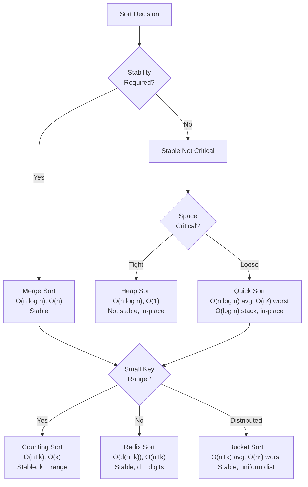

<Hero
  title="Sorting Algorithms"
  subtitle="Comparison-based and non-comparison sorting algorithms with their properties and use cases"
  imageAlt="Sorting Algorithms illustration"
  size="large"
/>

## TL;DR

Sorting algorithms divide into comparison-based (merge, quick, heap) and non-comparison (counting, radix, bucket). Merge sort guarantees O(n log n) and stability but uses O(n) space. Quick sort averages O(n log n) with O(1) space but degrades to O(n²). Use counting/radix for bounded integer ranges; use heap when space is critical. Algorithm choice depends on data size, stability requirements, and whether data fits in memory.

## Learning Objectives

- Understand time/space complexity trade-offs for major sorting algorithms
- Recognize when stability matters and which algorithms preserve ordering
- Implement efficient sorts for real-world constraints (memory, large datasets)
- Choose optimal algorithms based on data characteristics and performance goals
- Identify partition, divide-and-conquer, and non-comparison approaches

## Motivating Scenario

Your e-commerce platform sorts customer orders by date with payment status as a tiebreaker. Using an unstable sort scrambles the tiebreaker order, breaking reporting. Merging 100 million rows of analytics data with quick sort causes occasional 30-second pauses (O(n²) worst case). Counting sort on ZIP codes (5-digit) runs 10x faster than comparison sorts. Algorithm selection is not academic—it directly impacts user experience and infrastructure costs.

## Core Concepts

<Figure caption="Sorting algorithm decision tree: compare data characteristics, memory constraints, and stability needs.">



</Figure>

**Comparison-based Sorts**: Compare elements pairwise; lower bound is Ω(n log n) by information theory.

**Non-comparison Sorts**: Use element properties (digits, range) to avoid comparisons; can beat O(n log n) for specific inputs.

**Stability**: Preserves relative order of equal elements; critical for multi-key sorting or chained operations.

**In-place**: Uses O(1) extra space (or O(log n) for recursion); matters for large datasets or memory-constrained systems.

## Practical Example

<Tabs>
  <TabItem value="merge-sort" label="Merge Sort (Stable, O(n log n))" default>
```python
def merge_sort(arr):
    """Divide-and-conquer: guaranteed O(n log n), stable, uses O(n) extra space."""
    if len(arr) <= 1:
        return arr

    mid = len(arr) // 2
    left = merge_sort(arr[:mid])
    right = merge_sort(arr[mid:])

    return merge(left, right)

def merge(left, right):
    """Merge two sorted arrays, preserving stability."""
    result = []
    i = j = 0

    while i < len(left) and j < len(right):
        # Left first: stable when left <= right
        if left[i] <= right[j]:
            result.append(left[i])
            i += 1
        else:
            result.append(right[j])
            j += 1

    result.extend(left[i:])
    result.extend(right[j:])
    return result

# Usage: tuples with (priority, order_id)
orders = [(2, 'O123'), (1, 'O456'), (2, 'O789')]
sorted_orders = merge_sort(orders)  # Stable: (1, 'O456'), (2, 'O123'), (2, 'O789')
```
  </TabItem>

  <TabItem value="quick-sort" label="Quick Sort (In-place, O(n log n) avg)">
```python
def quick_sort(arr, low=0, high=None):
    """In-place partitioning: fast average case, O(n²) worst case, not stable."""
    if high is None:
        high = len(arr) - 1

    if low < high:
        # Partition and recurse
        pi = partition(arr, low, high)
        quick_sort(arr, low, pi - 1)
        quick_sort(arr, pi + 1, high)

    return arr

def partition(arr, low, high):
    """Hoare partition: three-way for duplicates."""
    pivot = arr[low + (high - low) // 2]  # Avoid worst case with random pivot
    i, j = low - 1, high + 1

    while True:
        i += 1
        while arr[i] < pivot:
            i += 1
        j -= 1
        while arr[j] > pivot:
            j -= 1

        if i >= j:
            return j

        arr[i], arr[j] = arr[j], arr[i]

# Usage: large array, in-place modification
data = [64, 34, 25, 12, 22, 11, 90, 88]
quick_sort(data)  # [11, 12, 22, 25, 34, 64, 88, 90]
```
  </TabItem>

  <TabItem value="counting-sort" label="Counting Sort (O(n+k) for bounded range)">
```python
def counting_sort(arr, max_val=None):
    """Linear time for small range: O(n+k), stable, k = max_val - min_val + 1."""
    if not arr:
        return arr

    min_val = min(arr)
    max_val = max(arr) if max_val is None else max_val
    range_size = max_val - min_val + 1

    # Count occurrences
    counts = [0] * range_size
    for num in arr:
        counts[num - min_val] += 1

    # Cumulative sum for stable positioning
    for i in range(1, len(counts)):
        counts[i] += counts[i - 1]

    # Place elements in order
    result = [0] * len(arr)
    for i in range(len(arr) - 1, -1, -1):  # Backward pass preserves stability
        val = arr[i]
        idx = counts[val - min_val] - 1
        result[idx] = val
        counts[val - min_val] -= 1

    return result

# Usage: ZIP codes (5-digit), test scores (0-100), age (0-120)
zip_codes = [10001, 10002, 10001, 20001, 10002]
sorted_zips = counting_sort(zip_codes)  # O(n+k) where k=10000, much faster than O(n log n)
```
  </TabItem>

  <TabItem value="radix-sort" label="Radix Sort (O(d(n+k)) for multi-digit integers)">
```python
def radix_sort(arr):
    """Sort by digit position: O(d(n+k)) where d=max digits, k=10 for base-10."""
    if not arr:
        return arr

    max_val = max(arr)
    exp = 1

    # Process each digit position
    while max_val // exp > 0:
        arr = counting_sort_by_digit(arr, exp)
        exp *= 10

    return arr

def counting_sort_by_digit(arr, exp):
    """Stable counting sort on single digit position."""
    counts = [0] * 10

    for num in arr:
        digit = (num // exp) % 10
        counts[digit] += 1

    for i in range(1, 10):
        counts[i] += counts[i - 1]

    result = [0] * len(arr)
    for i in range(len(arr) - 1, -1, -1):
        digit = (arr[i] // exp) % 10
        idx = counts[digit] - 1
        result[idx] = arr[i]
        counts[digit] -= 1

    return result

# Usage: Employee IDs, timestamps with fixed digit count
timestamps = [20250218, 20250117, 20250218, 20250210]
sorted_ts = radix_sort(timestamps)  # Stable, O(6 * (n+10)) = O(n)
```
  </TabItem>

  <TabItem value="heap-sort" label="Heap Sort (O(n log n), O(1) space, in-place)">
```python
def heap_sort(arr):
    """In-place heap: O(n log n) guaranteed, O(1) space, not stable."""
    n = len(arr)

    # Build max heap
    for i in range(n // 2 - 1, -1, -1):
        heapify(arr, n, i)

    # Extract elements
    for i in range(n - 1, 0, -1):
        arr[0], arr[i] = arr[i], arr[0]  # Move root to end
        heapify(arr, i, 0)

    return arr

def heapify(arr, n, i):
    """Restore heap property at index i."""
    largest = i
    left = 2 * i + 1
    right = 2 * i + 2

    if left < n and arr[left] > arr[largest]:
        largest = left
    if right < n and arr[right] > arr[largest]:
        largest = right

    if largest != i:
        arr[i], arr[largest] = arr[largest], arr[i]
        heapify(arr, n, largest)

# Usage: memory-constrained systems, predictable O(n log n)
data = [64, 34, 25, 12, 22, 11, 90, 88]
heap_sort(data)  # In-place, no extra allocation
```
  </TabItem>

  <TabItem value="javascript" label="JavaScript: Native Sort + Custom">
```javascript
// JavaScript's built-in sort (V8 uses Timsort: hybrid merge+insertion)
const numbers = [64, 34, 25, 12, 22, 11, 90, 88];
numbers.sort((a, b) => a - b);  // O(n log n), stable in modern engines

// Custom stable merge sort for guaranteed behavior
function mergeSort(arr) {
  if (arr.length <= 1) return arr;

  const mid = Math.floor(arr.length / 2);
  const left = mergeSort(arr.slice(0, mid));
  const right = mergeSort(arr.slice(mid));

  return merge(left, right);
}

function merge(left, right) {
  const result = [];
  let i = 0, j = 0;

  while (i < left.length && j < right.length) {
    if (left[i] <= right[j]) {
      result.push(left[i++]);
    } else {
      result.push(right[j++]);
    }
  }

  return result.concat(left.slice(i)).concat(right.slice(j));
}

// Counting sort for discrete small ranges (e.g., ratings 1-5)
function countingSort(arr, minVal, maxVal) {
  const counts = new Array(maxVal - minVal + 1).fill(0);

  for (const num of arr) counts[num - minVal]++;

  let idx = 0;
  for (let i = 0; i < counts.length; i++) {
    while (counts[i]-- > 0) {
      arr[idx++] = i + minVal;
    }
  }

  return arr;
}

// Performance comparison
const largeArray = Array.from({length: 100000}, () => Math.random() * 1000);
console.time('merge-sort');
mergeSort([...largeArray]);
console.timeEnd('merge-sort');  // ~50-100ms

console.time('built-in-sort');
[...largeArray].sort((a, b) => a - b);
console.timeEnd('built-in-sort');  // ~30-50ms (optimized, but not guaranteed stable)
```
  </TabItem>
</Tabs>

## When to Use / When NOT to Use

<Vs items={[
{
    label: "Merge Sort",
    points: [
      "Always O(n log n), guaranteed stable",
      "Ideal for multi-key sorting (e.g., email by domain, then by date)",
      "External sorting for data larger than memory",
      "Drawback: uses O(n) extra space, slower due to copying"
    ]
  },
{
    label: "Quick Sort",
    points: [
      "Average O(n log n) with O(log n) stack space (in-place)",
      "Fastest in practice; good cache locality",
      "Default for general-purpose sorting",
      "Drawback: O(n²) worst case (mitigated by random pivot or Timsort)"
    ]
  }
]} />

<Vs items={[
{
    label: "Heap Sort",
    points: [
      "O(n log n) guaranteed, O(1) space, fully in-place",
      "Best when memory is extremely constrained",
      "Priority queue operations (extracting top k elements)",
      "Drawback: poor cache locality, unstable, slower in practice than quick sort"
    ]
  },
{
    label: "Counting / Radix Sort",
    points: [
      "O(n+k) linear for small ranges or fixed-digit integers",
      "Unbeatably fast for discrete bounded data (digits, test scores, years)",
      "Stable by design",
      "Drawback: only for non-negative integers or mappable data; needs extra space"
    ]
  }
]} />

## Patterns & Pitfalls

<Showcase sections={[
  {
    label: "Pattern: Stable Sort for Multi-Key Data",
    body: "Sort by secondary key (date), then stable-sort by primary key (category). Elements with same primary key preserve date order. Merge sort or built-in stable sorts guarantee this."
  },
  {
    label: "Pattern: Hybrid Timsort",
    body: "Combine insertion sort (small runs), merge sort (large runs), and galloping (skipping runs). Used by Python, Java, JavaScript V8. Leverages real-world data patterns for near-linear performance."
  },
  {
    label: "Pattern: Three-Way Partitioning (Quick Sort with Duplicates)",
    body: "Partition into less-than, equal-to, greater-than. Handles duplicate elements efficiently, avoiding O(n²) degeneracy when many equal keys exist."
  },
  {
    label: "Pitfall: Unstable Sort Breaking Chained Operations",
    body: "After sorting by date, sort by status. Non-stable sort scrambles date order. Use stable sorts or combine keys (tuples) into single sort key."
  },
  {
    label: "Pitfall: O(n²) Worst Case in Quick Sort",
    body: "Median-of-three pivot, random pivot, or Timsort eliminates this. Never use basic quick sort on adversarially sorted data (reverse-sorted, all-same)."
  },
  {
    label: "Pitfall: Counting Sort on Large Ranges",
    body: "Counting sort: O(n+k) where k = range. If k >> n (e.g., 1 billion ZIP codes), counting sort uses too much memory. Use radix or comparison sorts instead."
  }
]} />

## Design Review Checklist

<Checklist items={[
  "Sorted by primary key and stable for secondary key?",
  "Data is small enough to fit in memory, or is external sort needed?",
  "Space constraint critical (in-place), or extra O(n) acceptable?",
  "Range of values small (k << n) for counting/radix sort?",
  "Worst-case performance guaranteed (merge/heap) or expected (quick)?",
  "Duplicates handled efficiently (three-way partitioning, radix)?",
  "Sorted order preserved in subsequent operations (stable sort)?",
  "Performance tested on real data size and distribution?",
  "Built-in sort (Timsort) sufficient, or custom sort needed?",
  "Sort is not bottleneck; profiling confirms impact?"
]} />

## Self-Check

- Why is merge sort stable but quick sort is not?
- When would you use counting sort over merge sort?
- What does O(n log n) lower bound mean, and which sorts achieve it?
- How does radix sort beat O(n log n), and what are the trade-offs?
- What is "in-place" sorting, and why does it matter for large datasets?

## Next Steps

- Implement custom sorts for your data: strings, tuples, custom objects
- Profile sorting performance on 1M+ element datasets
- Study <a href="https://en.wikipedia.org/wiki/Timsort" target="_blank" rel="nofollow noopener noreferrer">Timsort (Python's algorithm) ↗️</a>
- Explore external sorting for data larger than memory
- Learn about <a href="https://github.com/google/google-perftools" target="_blank" rel="nofollow noopener noreferrer">profiling tools ↗️</a> to identify sort bottlenecks

## References

- Donald Knuth, "The Art of Computer Programming, Volume 3: Sorting and Searching"
- <a href="https://en.wikipedia.org/wiki/Sorting_algorithm" target="_blank" rel="nofollow noopener noreferrer">Wikipedia: Sorting Algorithm ↗️</a>
- <a href="https://github.com/TheAlgorithms/Python" target="_blank" rel="nofollow noopener noreferrer">The Algorithms: Python implementations ↗️</a>
- BigO Cheat Sheet: <a href="https://www.bigocheatsheet.com/" target="_blank" rel="nofollow noopener noreferrer">Sorting and Search Algorithms ↗️</a>
