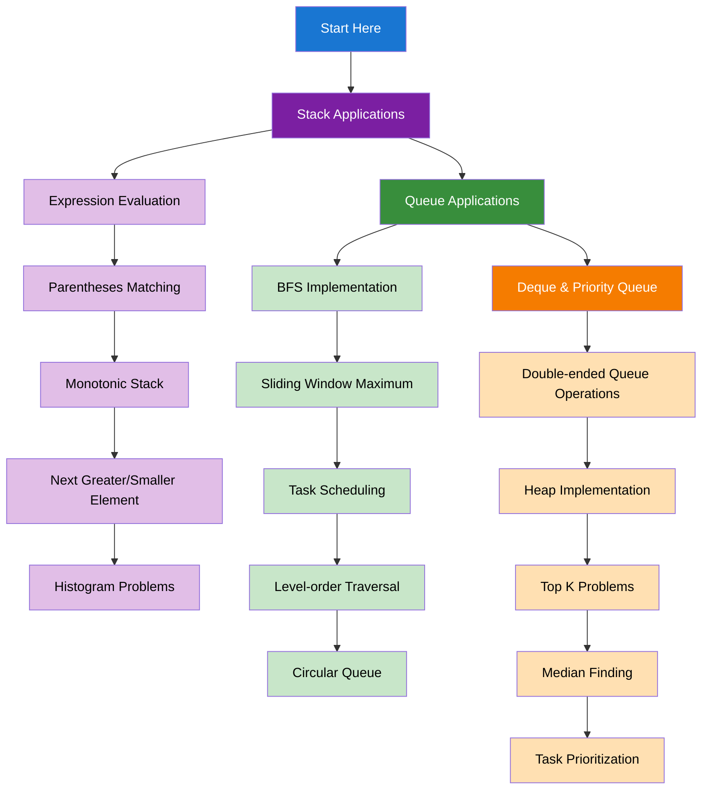

import { useCurrentSidebarCategory } from "@docusaurus/theme-common";

# Stacks & Queues

Stacks and queues are fundamental data structures that provide specific ordering and access patterns essential for many algorithms.

## Learning Map

<Figure caption="Stack and queue concepts organized by complexity and application.">

</Figure>

## Prerequisites

- [Time & Space Complexity Analysis](../fundamentals-and-prerequisites/time-and-space-complexity-analysis)
- [Basic Data Structures](../fundamentals-and-prerequisites/basic-data-structures)

## What's in scope

- **Stack Applications**: Expression evaluation, parentheses matching, monotonic stack, and histogram problems
- **Queue Applications**: BFS implementation, sliding window maximum, task scheduling, and level-order traversal
- **Deque & Priority Queue**: Double-ended operations, heap implementation, top K problems, and task prioritization

## How to use this section

- Start with [Stack Applications](./stack-applications) to understand stack-based algorithms
- Learn [Queue Applications](./queue-applications) for BFS and scheduling problems
- Master [Deque & Priority Queue](./deque-and-priority-queue) for advanced operations

<DocCardList items={useCurrentSidebarCategory().items} />
