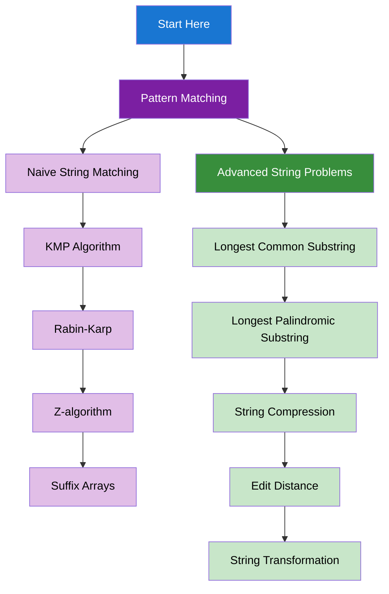

import DocCardList from "@theme/DocCardList";
import { useCurrentSidebarCategory } from "@docusaurus/theme-common";
import Figure from "@site/src/components/Figure";
import Head from "@docusaurus/Head";

<Head>
  
  
</Head>

# String Algorithms

Advanced string algorithms and pattern matching techniques for efficient text processing and analysis.

## Learning Map

<Figure caption="String algorithms organized from pattern matching to advanced string problems.">

</Figure>

## Prerequisites

- [Time & Space Complexity Analysis](../fundamentals-and-prerequisites/time-and-space-complexity-analysis)
- [Basic Programming Concepts](../fundamentals-and-prerequisites/basic-programming-concepts)
- [Arrays & Strings](../arrays-and-strings)

## What's in scope

- **Pattern Matching**: Naive string matching, KMP algorithm, Rabin-Karp, Z-algorithm, and suffix arrays
- **Advanced String Problems**: Longest common substring, longest palindromic substring, string compression, edit distance, and string transformation

## How to use this section

- Start with [Pattern Matching](./pattern-matching) to understand string search algorithms
- Learn [Advanced String Problems](./advanced-string-problems) for complex string processing

<DocCardList items={useCurrentSidebarCategory().items} />
