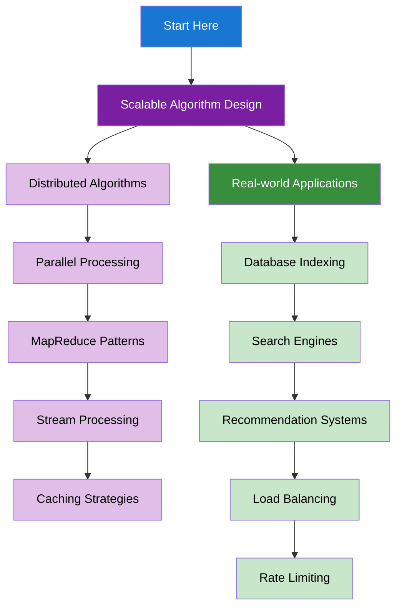

import DocCardList from "@theme/DocCardList";
import { useCurrentSidebarCategory } from "@docusaurus/theme-common";
import Figure from "@site/src/components/Figure";
import Head from "@docusaurus/Head";

<Head>
  
  
</Head>

# System Design for Algorithms

Learn how to design scalable algorithms for real-world systems and understand the practical applications of algorithmic concepts.

## Learning Map

<Figure caption="System design concepts organized from scalable algorithm design to real-world applications.">

</Figure>

## Prerequisites

- [Time & Space Complexity Analysis](../fundamentals-and-prerequisites/time-and-space-complexity-analysis)
- [Basic Data Structures](../fundamentals-and-prerequisites/basic-data-structures)
- [Graphs](../graphs)
- [Dynamic Programming](../dynamic-programming)

## What's in scope

- **Scalable Algorithm Design**: Distributed algorithms, parallel processing, MapReduce patterns, stream processing, and caching strategies
- **Real-world Applications**: Database indexing, search engines, recommendation systems, load balancing, and rate limiting

## How to use this section

- Start with [Scalable Algorithm Design](./scalable-algorithm-design) to understand distributed and parallel algorithms
- Learn [Real-world Applications](./real-world-applications) for practical system design applications

<DocCardList items={useCurrentSidebarCategory().items} />
