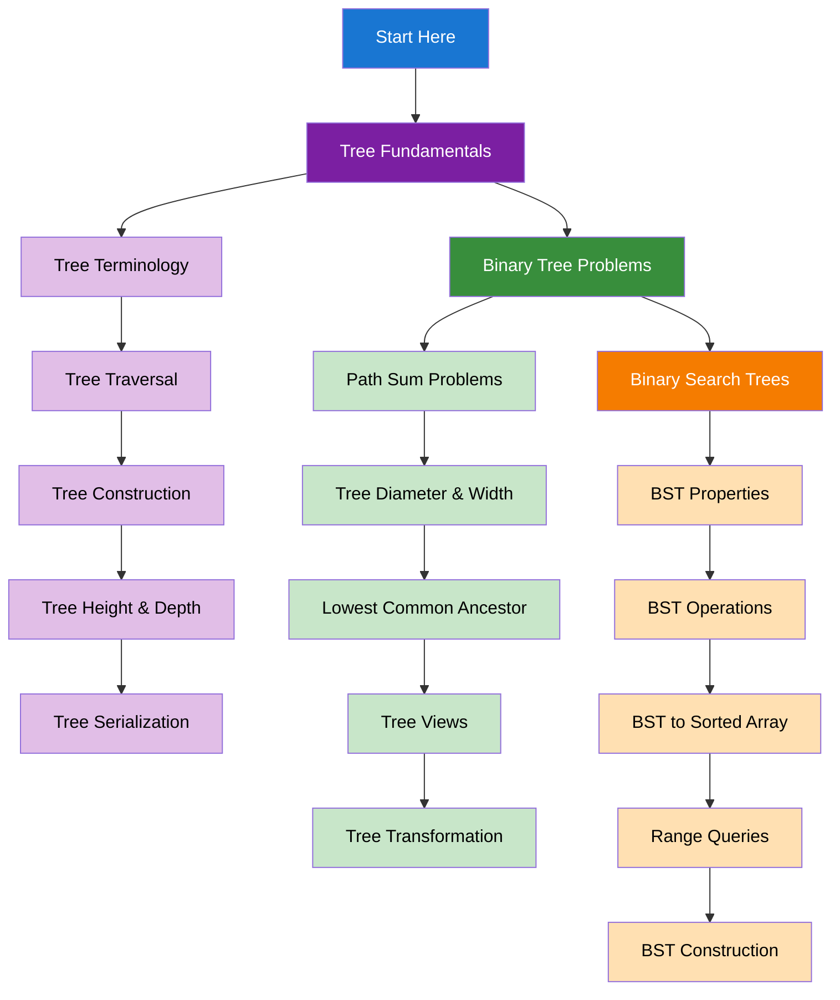

import { useCurrentSidebarCategory } from "@docusaurus/theme-common";

# Trees & Binary Trees

Trees are hierarchical data structures that appear frequently in algorithmic problems. Master tree traversal, binary tree operations, and binary search tree algorithms.

## Learning Map

<Figure caption="Tree concepts organized from fundamentals to advanced applications.">

</Figure>

## Prerequisites

- [Time & Space Complexity Analysis](../fundamentals-and-prerequisites/time-and-space-complexity-analysis)
- [Basic Data Structures](../fundamentals-and-prerequisites/basic-data-structures)
- [Arrays & Strings](../arrays-and-strings)

## What's in scope

- **Tree Fundamentals**: Terminology, traversal methods, construction, and serialization
- **Binary Tree Problems**: Path sums, diameter, lowest common ancestor, and tree views
- **Binary Search Trees**: Properties, operations, range queries, and construction

## How to use this section

- Start with [Tree Fundamentals](./tree-fundamentals) to understand basic tree concepts
- Practice [Binary Tree Problems](./binary-tree-problems) for common tree algorithms
- Master [Binary Search Trees](./binary-search-trees) for efficient search operations

<DocCardList items={useCurrentSidebarCategory().items} />
