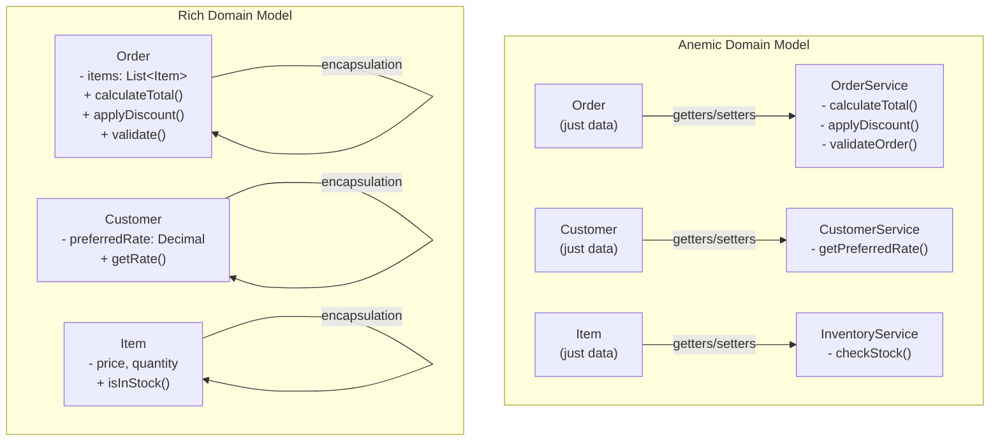

<Hero
  title="Anemic Domain Model"
  subtitle="Domain objects that are just data containers, with business logic scattered elsewhere."
  imageAlt="Anemic Domain Model illustration"
  size="large"
/>

## TL;DR

An Anemic Domain Model treats domain objects as mere data containers with getters/setters, while all business logic resides in service classes. This violates object-oriented design principles, scatters domain knowledge across your codebase, makes testing harder, and creates brittle systems where business rules are implicit and hard to enforce.

## Learning Objectives

You will be able to:
- Identify characteristics of anemic domain models in existing codebases
- Understand why anemic models violate core OOP principles and Domain-Driven Design
- Refactor an anemic model into a rich domain model with encapsulated behavior
- Design domain objects that enforce business invariants
- Test domain logic in isolation without service layer complexity

## Motivating Scenario

Imagine you're building an e-commerce platform. You start by creating an `Order` class that just holds data: items, customer, total, status. All the logic for calculating totals, applying discounts, checking inventory, and validating orders lives in `OrderService`, `DiscountService`, `InventoryService`, and `PaymentService`.

Six months later, you need to implement a new discount rule: "Orders over $500 get 10% off." You hunt through three service classes before finding the discount calculation. You update it, but miss a edge case in another service that duplicates the logic. Three weeks after shipping, a customer reports incorrect pricing. Now imagine maintaining this across 50+ domain objects, each with scattered business rules in a dozen different service classes. The cost of change becomes unbearable.

## Core Explanation

An anemic domain model treats domain objects as data transfer objects (DTOs) with only accessors and mutators. The actual business logic—the rules that govern how your domain works—lives in separate service classes. This creates several problems:

**1. Violation of Object-Oriented Encapsulation**

Objects should encapsulate both data AND the behavior that operates on that data. By separating them, you lose the primary benefit of object orientation: the ability to reason about data and its valid transformations together.

**2. Scattered Business Rules**

When business logic lives in services, the same domain rule often gets implemented in multiple places. An `Order` calculation might be in `OrderService.calculateTotal()`, but there's also logic in `InvoiceService.generateInvoice()` that does similar calculations. Change one, forget the other, and you have a bug.

**3. Difficult Testing**

Testing business logic requires instantiating the entire service layer with all its dependencies. You can't easily test order calculations without mocking database layers, payment gateways, and notification services. This makes tests slow, brittle, and expensive to maintain.

**4. Implicit Business Rules**

In an anemic model, the rules that should always be true about an order (like "an order can't be shipped without items") aren't enforced in the object itself. They're buried in service code as comments or scattered if-statements.

**5. Harder Domain Understanding**

New developers joining the team can't read the `Order` class to understand what an order is. They have to search through multiple services to understand the domain. This increases onboarding time and introduces subtle bugs.

A rich domain model, by contrast, encapsulates both data and behavior. Business rules live where the data lives, making them explicit, enforceable, and testable in isolation.

## Pattern Visualization

<Figure caption="Anemic vs Rich Domain Model Architecture">

</Figure>

## Code Examples

<Tabs>
  <TabItem value="python" label="Python">
    <Tabs>
      <TabItem value="bad" label="Anemic (Anti-pattern)">
        ```python title="order.py" showLineNumbers
        class Order:
            def __init__(self):
                self.items = []
                self.customer = None
                self.total = 0
                self.status = "pending"

            def get_items(self):
                return self.items

            def set_items(self, items):
                self.items = items

            def get_total(self):
                return self.total

            def set_total(self, total):
                self.total = total

            # No business logic here!

        class OrderService:
            def calculate_total(self, order):
                total = 0
                for item in order.get_items():
                    total += item.price * item.quantity
                return total

            def apply_discount(self, order, discount_percent):
                # Discount logic scattered here
                if discount_percent > 50:
                    raise ValueError("Discount too high")
                current_total = self.calculate_total(order)
                discount_amount = current_total * (discount_percent / 100)
                order.set_total(current_total - discount_amount)

            def validate_order(self, order):
                if len(order.get_items()) == 0:
                    raise ValueError("Order must have items")
                if order.customer is None:
                    raise ValueError("Order must have customer")
        ```
      </TabItem>
      <TabItem value="good" label="Rich Domain Model (Solution)">
        ```python title="order.py" showLineNumbers
        from dataclasses import dataclass
        from decimal import Decimal
        from enum import Enum

        class OrderStatus(Enum):
            PENDING = "pending"
            CONFIRMED = "confirmed"
            SHIPPED = "shipped"
            DELIVERED = "delivered"

        @dataclass
        class OrderItem:
            product_id: str
            price: Decimal
            quantity: int

            def get_subtotal(self) -> Decimal:
                return self.price * self.quantity

        class Order:
            MAX_DISCOUNT_PERCENT = 50

            def __init__(self, customer):
                self.customer = customer
                self.items: list[OrderItem] = []
                self.discount_percent: Decimal = Decimal(0)
                self.status = OrderStatus.PENDING

            def add_item(self, item: OrderItem) -> None:
                """Add item to order, enforcing business rules."""
                if not item or item.quantity <= 0:
                    raise ValueError("Item must be valid with quantity > 0")
                self.items.append(item)

            def apply_discount(self, discount_percent: Decimal) -> None:
                """Apply discount, enforcing maximum discount rule."""
                if not isinstance(discount_percent, (int, float, Decimal)):
                    raise TypeError("Discount must be numeric")

                if discount_percent < 0 or discount_percent > self.MAX_DISCOUNT_PERCENT:
                    raise ValueError(
                        f"Discount must be 0-{self.MAX_DISCOUNT_PERCENT}%"
                    )
                self.discount_percent = Decimal(str(discount_percent))

            def calculate_subtotal(self) -> Decimal:
                """Calculate total before discount."""
                if not self.items:
                    return Decimal(0)
                return sum(item.get_subtotal() for item in self.items)

            def calculate_total(self) -> Decimal:
                """Calculate final total with discount applied."""
                subtotal = self.calculate_subtotal()
                discount_amount = subtotal * (self.discount_percent / 100)
                return subtotal - discount_amount

            def validate(self) -> None:
                """Validate order is in valid state."""
                if not self.items:
                    raise ValueError("Order must contain at least one item")
                if self.customer is None:
                    raise ValueError("Order must have a customer")
                if self.status == OrderStatus.SHIPPED and not self.items:
                    raise ValueError("Cannot ship empty order")

            def ship(self) -> None:
                """Transition order to shipped state."""
                self.validate()
                if self.status != OrderStatus.CONFIRMED:
                    raise ValueError(
                        f"Can only ship confirmed orders, current: {self.status}"
                    )
                self.status = OrderStatus.SHIPPED

            def confirm(self) -> None:
                """Transition order to confirmed state."""
                self.validate()
                if self.status != OrderStatus.PENDING:
                    raise ValueError(
                        f"Can only confirm pending orders, current: {self.status}"
                    )
                self.status = OrderStatus.CONFIRMED

        # Usage
        order = Order(customer)
        order.add_item(OrderItem("PROD-123", Decimal("29.99"), 2))
        order.apply_discount(10)  # Valid: 10% discount
        print(order.calculate_total())  # Business logic is on the object
        order.validate()  # Explicit validation
        order.confirm()

        # This throws error - discount rule is enforced!
        # order.apply_discount(75)  # ValueError: Discount must be 0-50%
        ```
      </TabItem>
    </Tabs>
  </TabItem>
  <TabItem value="go" label="Go">
    <Tabs>
      <TabItem value="bad" label="Anemic (Anti-pattern)">
        ```go title="order.go" showLineNumbers
        package order

        type Item struct {
            ProductID string
            Price     float64
            Quantity  int
        }

        type Order struct {
            Items    []*Item
            Total    float64
            Status   string
            Customer *Customer
        }

        func (o *Order) GetItems() []*Item {
            return o.Items
        }

        func (o *Order) SetItems(items []*Item) {
            o.Items = items
        }

        func (o *Order) GetTotal() float64 {
            return o.Total
        }

        func (o *Order) SetTotal(total float64) {
            o.Total = total
        }

        // No business logic on Order itself!

        type OrderService struct{}

        func (s *OrderService) CalculateTotal(order *Order) float64 {
            total := 0.0
            for _, item := range order.GetItems() {
                total += item.Price * float64(item.Quantity)
            }
            return total
        }

        func (s *OrderService) ApplyDiscount(order *Order, discountPercent float64) error {
            // Discount logic scattered here
            if discountPercent > 50 {
                return errors.New("discount too high")
            }
            currentTotal := s.CalculateTotal(order)
            discountAmount := currentTotal * (discountPercent / 100)
            order.SetTotal(currentTotal - discountAmount)
            return nil
        }

        func (s *OrderService) Validate(order *Order) error {
            if len(order.GetItems()) == 0 {
                return errors.New("order must have items")
            }
            if order.Customer == nil {
                return errors.New("order must have customer")
            }
            return nil
        }
        ```
      </TabItem>
      <TabItem value="good" label="Rich Domain Model (Solution)">
        ```go title="order.go" showLineNumbers
        package order

        import (
            "errors"
            "fmt"
        )

        type Status string

        const (
            Pending   Status = "pending"
            Confirmed Status = "confirmed"
            Shipped   Status = "shipped"
        )

        type Item struct {
            productID string
            price     float64
            quantity  int
        }

        func NewItem(productID string, price float64, quantity int) (*Item, error) {
            if price < 0 || quantity <= 0 {
                return nil, errors.New("invalid item values")
            }
            return &Item{
                productID: productID,
                price:     price,
                quantity:  quantity,
            }, nil
        }

        func (i *Item) Subtotal() float64 {
            return i.price * float64(i.quantity)
        }

        type Order struct {
            customer         *Customer
            items            []*Item
            discountPercent  float64
            status           Status
            maxDiscountPercentage float64
        }

        func NewOrder(customer *Customer) *Order {
            return &Order{
                customer:              customer,
                items:                 []*Item{},
                discountPercent:       0,
                status:                Pending,
                maxDiscountPercentage: 50,
            }
        }

        func (o *Order) AddItem(item *Item) error {
            if item == nil {
                return errors.New("item cannot be nil")
            }
            o.items = append(o.items, item)
            return nil
        }

        func (o *Order) ApplyDiscount(discountPercent float64) error {
            if discountPercent < 0 || discountPercent > o.maxDiscountPercentage {
                return fmt.Errorf(
                    "discount must be 0-%v%%, got %v",
                    o.maxDiscountPercentage,
                    discountPercent,
                )
            }
            o.discountPercent = discountPercent
            return nil
        }

        func (o *Order) CalculateSubtotal() float64 {
            total := 0.0
            for _, item := range o.items {
                total += item.Subtotal()
            }
            return total
        }

        func (o *Order) CalculateTotal() float64 {
            subtotal := o.CalculateSubtotal()
            discountAmount := subtotal * (o.discountPercent / 100)
            return subtotal - discountAmount
        }

        func (o *Order) Validate() error {
            if len(o.items) == 0 {
                return errors.New("order must contain at least one item")
            }
            if o.customer == nil {
                return errors.New("order must have a customer")
            }
            return nil
        }

        func (o *Order) Confirm() error {
            if err := o.Validate(); err != nil {
                return fmt.Errorf("cannot confirm invalid order: %w", err)
            }
            if o.status != Pending {
                return fmt.Errorf("can only confirm pending orders, current: %v", o.status)
            }
            o.status = Confirmed
            return nil
        }

        func (o *Order) Ship() error {
            if o.status != Confirmed {
                return fmt.Errorf("can only ship confirmed orders, current: %v", o.status)
            }
            o.status = Shipped
            return nil
        }
        ```
      </TabItem>
    </Tabs>
  </TabItem>
  <TabItem value="nodejs" label="Node.js">
    <Tabs>
      <TabItem value="bad" label="Anemic (Anti-pattern)">
        ```javascript title="order.js" showLineNumbers
        class Order {
            constructor() {
                this.items = [];
                this.total = 0;
                this.status = 'pending';
                this.customer = null;
            }

            getItems() {
                return this.items;
            }

            setItems(items) {
                this.items = items;
            }

            getTotal() {
                return this.total;
            }

            setTotal(total) {
                this.total = total;
            }

            // No business logic!
        }

        class OrderService {
            calculateTotal(order) {
                let total = 0;
                for (const item of order.getItems()) {
                    total += item.price * item.quantity;
                }
                return total;
            }

            applyDiscount(order, discountPercent) {
                // Discount logic scattered here
                if (discountPercent > 50) {
                    throw new Error('Discount too high');
                }
                const currentTotal = this.calculateTotal(order);
                const discountAmount = currentTotal * (discountPercent / 100);
                order.setTotal(currentTotal - discountAmount);
            }

            validate(order) {
                if (order.getItems().length === 0) {
                    throw new Error('Order must have items');
                }
                if (!order.customer) {
                    throw new Error('Order must have customer');
                }
            }
        }

        module.exports = { Order, OrderService };
        ```
      </TabItem>
      <TabItem value="good" label="Rich Domain Model (Solution)">
        ```javascript title="order.js" showLineNumbers
        class OrderItem {
            constructor(productId, price, quantity) {
                this.productId = productId;
                this.price = price;
                this.quantity = quantity;
            }

            getSubtotal() {
                return this.price * this.quantity;
            }
        }

        class OrderStatus {
            static PENDING = 'pending';
            static CONFIRMED = 'confirmed';
            static SHIPPED = 'shipped';
        }

        class Order {
            static MAX_DISCOUNT_PERCENT = 50;

            constructor(customer) {
                this.customer = customer;
                this.items = [];
                this.discountPercent = 0;
                this.status = OrderStatus.PENDING;
            }

            addItem(item) {
                if (!item || item.quantity <= 0) {
                    throw new Error('Item must be valid with quantity > 0');
                }
                this.items.push(item);
            }

            applyDiscount(discountPercent) {
                if (typeof discountPercent !== 'number') {
                    throw new TypeError('Discount must be numeric');
                }

                if (discountPercent < 0 || discountPercent > Order.MAX_DISCOUNT_PERCENT) {
                    throw new Error(
                        `Discount must be 0-${Order.MAX_DISCOUNT_PERCENT}%, got ${discountPercent}`
                    );
                }

                this.discountPercent = discountPercent;
            }

            calculateSubtotal() {
                if (this.items.length === 0) return 0;
                return this.items.reduce((sum, item) => sum + item.getSubtotal(), 0);
            }

            calculateTotal() {
                const subtotal = this.calculateSubtotal();
                const discountAmount = subtotal * (this.discountPercent / 100);
                return subtotal - discountAmount;
            }

            validate() {
                if (this.items.length === 0) {
                    throw new Error('Order must contain at least one item');
                }
                if (!this.customer) {
                    throw new Error('Order must have a customer');
                }
                if (this.status === OrderStatus.SHIPPED && this.items.length === 0) {
                    throw new Error('Cannot ship empty order');
                }
            }

            confirm() {
                this.validate();
                if (this.status !== OrderStatus.PENDING) {
                    throw new Error(
                        `Can only confirm pending orders, current: ${this.status}`
                    );
                }
                this.status = OrderStatus.CONFIRMED;
            }

            ship() {
                this.validate();
                if (this.status !== OrderStatus.CONFIRMED) {
                    throw new Error(
                        `Can only ship confirmed orders, current: ${this.status}`
                    );
                }
                this.status = OrderStatus.SHIPPED;
            }
        }

        // Usage - Business logic lives on the object!
        const order = new Order(customer);
        order.addItem(new OrderItem('PROD-123', 29.99, 2));
        order.applyDiscount(10);
        console.log(order.calculateTotal());
        order.validate();
        order.confirm();

        // This throws error - business rule is enforced!
        // order.applyDiscount(75); // Error: Discount must be 0-50%

        module.exports = { Order, OrderItem, OrderStatus };
        ```
      </TabItem>
    </Tabs>
  </TabItem>
</Tabs>

## Patterns and Pitfalls

### Anti-patterns Found in Anemic Models

**1. The Service God Class Problem**
When all business logic moves to services, those services become "god classes" doing everything. An `OrderService` ends up with 50+ methods handling calculations, validation, notifications, and payments.

**2. Duplicate Validation**
The same validation rule appears in multiple services. "Check if order has items" might exist in `OrderService`, `InvoiceService`, `ShippingService`, and `PaymentService`.

**3. Implicit Dependencies**
You can't look at an Order object and understand what makes a valid order. The rules are hidden in service code, making the domain knowledge implicit and fragile.

**4. Test Bloat**
Tests must set up entire service hierarchies to test a simple business rule. A test for "applying a 10% discount" requires mocking databases, payment systems, and notification services.

### Why Developers Default to Anemic Models

- **Databases think in tables**: ORM patterns encourage thinking in terms of entities with getters/setters
- **Web frameworks encourage separation**: MVC, REST APIs naturally separate data from logic
- **Familiar from simple CRUD**: Many developers learn anemic patterns in tutorial applications
- **Perceived simplicity**: It seems simpler to write getters/setters than to design rich objects

## When This Happens / How to Detect

**Red Flags in Your Codebase:**

1. All classes have only getters and setters
2. Service classes are 500+ lines
3. You can't find where a business rule is implemented
4. The same validation appears in 3+ places
5. Tests require instantiating entire service graph
6. Adding a business rule requires changes in 5+ files
7. Domain objects have no meaningful methods
8. You can't understand what an object represents by reading its class

## How to Fix / Refactor

### Step 1: Identify Scattered Business Logic

Grep through your codebase for methods operating on an Order object:

```bash
grep -r "calculateTotal" src/
grep -r "applyDiscount" src/
grep -r "validateOrder" src/
```

### Step 2: Extract to Domain Object

Move these methods onto the domain class itself. Start small with one object. Don't try to refactor everything at once.

### Step 3: Enforce Invariants

Add validation in constructors and mutators. Make it impossible to create an invalid Order:

```python
# Bad: Validation happens elsewhere
order = Order()
order.total = -100  # No prevention

# Good: Validation in constructor
order = Order(items, customer)  # Fails immediately if invalid
```

### Step 4: Hide Implementation Details

Use private/protected fields. Callers shouldn't directly access `order.items`, they should call `order.calculateTotal()`.

### Step 5: Provide Meaningful Methods

Replace `getItems()` with methods that express intent:

```python
# Instead of:
total = sum(item.price * item.quantity for item in order.get_items())

# Do this:
total = order.calculate_total()
```

### Step 6: Test in Isolation

Now you can test business logic without any service layer:

```python
def test_discount_applied_correctly():
    order = Order(customer)
    order.add_item(OrderItem('PROD-1', 100, 1))
    order.apply_discount(10)
    assert order.calculate_total() == 90
```

## Operational Considerations

**Migration from Anemic to Rich Models:**

- **Gradual refactoring**: Don't rewrite everything at once. Move one object at a time
- **Backward compatibility**: Keep old service methods as deprecated wrappers while transitioning
- **Testing safety net**: Write tests for domain behavior before refactoring, to catch regressions
- **Documentation**: Document domain invariants explicitly in the class

**Performance Implications:**

- Rich models often perform better (less service orchestration)
- No N+1 problems from service layers calling each other
- Easier to optimize because logic is colocated

**Team Adoption:**

- Domain-Driven Design training helps team understand the benefits
- Code review focus on moving logic toward domain objects
- New features should use rich models from day one

## Design Review Checklist

<Checklist items={[
  "Does each domain object have business logic, not just getters/setters?",
  "Are domain invariants enforced in the object itself, not in services?",
  "Can you test domain logic without service dependencies?",
  "Are business rules co-located with the data they operate on?",
  "Do domain objects have meaningful method names expressing intent?",
  "Is validation happening in the domain object constructor/mutators?",
  "Are there no duplicate implementations of the same business rule?",
  "Can a new developer understand the domain by reading the objects?",
  "Are service classes focused on orchestration, not business logic?",
  "Is it impossible to create invalid domain objects?",
  "Do domain objects hide their internal state with private/protected fields?",
  "Are state transitions (e.g., pending→confirmed) enforced on the object?"
]} />

## Showcase

<Showcase
  title="Signals of Anemic Domain Model"
  sections={[
    {label: "Anti-Signals (Problems)", body: "- Order class with only getters/setters\n- calculateTotal() method in OrderService\n- validateOrder() duplicated in 3 places\n- Tests require mocking 10+ dependencies\n- Business rules in comments scattered across services\n- Impossible to understand what's a valid Order without reading 5 files", tone: "warning"}, {label: "Healthy Signals (Solutions)", body: "- Order.calculateTotal() method on Order class\n- Order.validate() enforced in constructor\n- Order.applyDiscount() with validation built-in\n- Single source of truth for each business rule\n- Unit tests just instantiate Order without service layer\n- New developers can read Order class and understand the domain", tone: "positive"}
  ]}
/>

## Self-Check

1. **Can you identify where a specific business rule is implemented in 10 seconds?** If not, it's scattered across services.

2. **Do your domain object tests require mocking external services?** If yes, the logic should be on the domain object, not the service.

3. **Could you implement the same validation in 2-3 different places?** If yes, move it to the domain object where it's guaranteed to be enforced.

## Next Steps

- **Read**: <a href="/docs/core-design-and-programming-principles/solid/single-responsibility" target="_blank" rel="nofollow noopener noreferrer">Single Responsibility Principle ↗️</a> to understand why services should focus on orchestration
- **Study**: <a href="/docs/core-design-and-programming-principles/grasp/information-expert" target="_blank" rel="nofollow noopener noreferrer">GRASP: Information Expert ↗️</a> for guidance on where domain logic should live
- **Explore**: Domain-Driven Design patterns for structuring complex domains
- **Practice**: Refactor one service's business logic into a domain object this week
- **Review**: Examine your codebase for scattered validation logic to refactor

## One Takeaway

<Callout tone="info">
Move business logic from service classes into domain objects. Make invalid states impossible. Encapsulate both data and behavior together—that's the whole point of objects.
</Callout>

## References

1. <a href="https://www.martinfowler.com/bliki/AnemicDomainModel.html" target="_blank" rel="nofollow noopener noreferrer">Martin Fowler - Anemic Domain Model ↗️</a>
2. <a href="https://domainlanguage.com/ddd/" target="_blank" rel="nofollow noopener noreferrer">Eric Evans - Domain-Driven Design ↗️</a>
3. <a href="https://refactoring.guru/refactoring/techniques/extract-method" target="_blank" rel="nofollow noopener noreferrer">Refactoring Guru - Extract Method ↗️</a>
4. <a href="https://en.wikipedia.org/wiki/SOLID" target="_blank" rel="nofollow noopener noreferrer">SOLID Principles ↗️</a>
