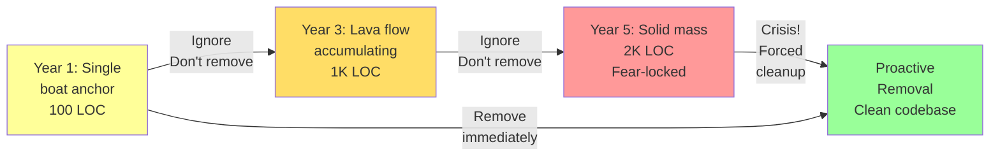

<Hero
  title="Boat Anchor and Lava Flow"
  subtitle="Obsolete code that won't die, accumulating to form unmaintainable legacy."
  imageAlt="Boat Anchor and Lava Flow illustration"
  size="large"
/>

## TL;DR

Boat Anchor: obsolete code kept around "just in case" we need it someday. Lava Flow: boat anchors accumulate over years, solidifying into an unmaintainable mass. A feature disabled two years ago still in the code. Legacy API endpoints no one uses. Old algorithms never called. Deprecated libraries we're "planning" to remove. Removing them is risky—unknown dependencies. The code grows without adding value. Solution: aggressive removal strategy—use deprecation periods, automated detection of dead code, and gradual removal with careful monitoring.

## Learning Objectives

You will be able to:
- Identify dead code and boat anchor code
- Understand the cost of accumulating obsolete code
- Implement deprecation strategies
- Detect dead code using automated tools
- Remove legacy code safely
- Prevent new boat anchors from forming

## Motivating Scenario

You're working on a legacy codebase. There's 200 lines of code to handle "old payment processing." It's been marked `@Deprecated` since 2019. It's never called, but no one wants to remove it:

"What if a customer still using the old system comes back?"
"It might break something if we remove it."
"It's harmless, just leave it."

Five years later:
- The feature has never been used
- But no one removes it
- Similar dead code accumulates
- The codebase is 40% larger than functional code
- New developers waste time understanding obsolete code
- Tests must maintain dead code paths

The lava flow has solidified. Removing it now is risky because:
- Are there hidden dependencies?
- Did we miss something?
- Will monitoring catch issues?

The fear prevents cleanup, which breeds more accumulation.

## Core Explanation

**What is Boat Anchor?**

Code that no longer serves a purpose but persists:
- Feature disabled but code remains
- Old API endpoints no one calls
- Deprecated libraries never removed
- Legacy algorithms replaced but kept

**Why It Persists**

1. **Fear**: "Might break something"
2. **Uncertainty**: Unknown dependencies
3. **Sunk Cost**: "We already built it"
4. **Speculative**: "Someday we might need it"
5. **Laziness**: Easier to leave than remove

**The Lava Flow**

Boat anchors accumulate:
- Year 1: 10 lines of deprecated code
- Year 2: 100 lines (added more features, deprecated old ones)
- Year 3: 500 lines (tech debt compounding)
- Year 5: 2000+ lines of dead code (40% of codebase)

Each individual removal seems risky. The whole mass is impossible to remove.

**Cost of Dead Code**

- **Onboarding**: New developers confused by unused code
- **Maintenance**: Must maintain code we don't use
- **Testing**: Tests for paths never executed
- **Size**: Build artifacts, deployment packages
- **Opportunity**: Time wasted instead of new features

## Prevention & Removal

<Figure caption="Removal Strategy: From Lava Flow to Clean Code">

</Figure>

## Removal Strategy

**Immediate (Days)**
- Mark as deprecated with version
- Update documentation
- Alert users/teams

**Short-term (Weeks)**
- Stop maintaining (no fixes to deprecated code)
- Don't add features
- Encourage migration

**Medium-term (Months)**
- Monitor usage in production
- Send notices to known users
- Provide migration guide

**Removal (When Zero Usage)**
- Remove with confidence
- Monitor for issues
- Document removal

## Design Review Checklist

<Checklist items={[
  "Are there @Deprecated or marked obsolete features?",
  "How long have they been deprecated?",
  "Are there tests for dead code paths?",
  "Is there documentation for features no one uses?",
  "Could you remove this code and have tests fail?",
  "Are feature flags in production for obsolete features?",
  "Is there a deprecation process in place?",
  "Are there automated tools detecting dead code?",
  "Has code review been asked to remove unused code?",
  "Is there monitoring to detect if removed code breaks anything?"
]} />

## Tools for Detection

| Tool | Purpose |
|------|---------|
| Checkstyle | Java dead code detection |
| Coverage Tools | Code never executed in tests |
| Linters | Unused variables, imports |
| Dependency Scanners | Unused libraries |
| Feature Flags | Track deprecated features |

## Real-World Examples

### Example 1: Deprecated Payment Gateway (2+ Years Old)

```python
# This code has been @Deprecated for 2 years, still in codebase
@deprecated(version="2.0", reason="Use Stripe integration instead")
class LegacyPaymentGateway:
    """Old payment processor. DEPRECATED since 2022."""

    def process_payment(self, amount, card):
        # 200 lines of legacy payment logic
        # Uses deprecated XML API (no longer supported by processor)
        # Tests still check this path (4 test cases)
        # Documentation still references this
        pass

    def validate_card(self, card):
        # 100 lines of old validation
        pass

    # ... 5 more methods

# Questions:
# - Is anyone still using this? No one knows.
# - Did we measure? No. Should we deprecate more aggressively?
# - Risk of removal? Unknown. Could affect unknown callers.
# - Cost of keeping? Maintains tests, documentation, developers confused, review time
```

**Cost Analysis**:
- 300 lines of dead code
- 4 test cases (20 minutes to maintain)
- Documentation updates (when other code changes)
- Developer confusion (should I use this or Stripe?)
- Onboarding time (new dev wastes 30 minutes reading deprecated code)
- Annual cost: ~40 hours of developer time = $5,000

**Removal Strategy**:

```python
# Step 1: Measure usage (Week 1)
# Add analytics to track calls
logger.info('DEPRECATED_GATEWAY_USED', payment_gateway='legacy')

# Measure over 1 week: 0 calls
# → Safe to remove

# Step 2: Announce deprecation (Week 2)
# - Update docs: "Legacy gateway removed Jan 15"
# - Email teams: "Last call is LegacyPaymentGateway"
# - Migrate tests

# Step 3: Remove (Week 3)
# - Delete LegacyPaymentGateway class
# - Update imports
# - Delete tests
# - Update docs
# - Monitoring: Alert if anyone tries to import it

# Result: -300 lines, -4 tests, -2 docs pages, -5% confusion
```

### Example 2: Feature Flag That's Always On

```python
# This feature flag has been true for 1 year (always on)
# But the fallback code still exists
if FEATURE_FLAG.get('NEW_CHECKOUT_FLOW'):
    # New checkout (1000 lines, well-tested, used by all users)
    return NewCheckoutFlow().process(order)
else:
    # Old checkout (500 lines, rarely tested, dead code?)
    return OldCheckoutFlow().process(order)

# Cost:
# - Old code must be maintained (security patches, etc.)
# - Tests must cover both paths (doubled test count)
# - Developers must understand both paths
# - Deployment risk: if NEW flag is flipped by accident, system breaks
```

**Solution**:

```python
# Step 1: Verify flag is always true (check logs)
# - No calls to OldCheckoutFlow in last 30 days
# - 100% of traffic through NewCheckoutFlow

# Step 2: Remove old code
return NewCheckoutFlow().process(order)

# Step 3: Remove feature flag infrastructure for this feature
# - Remove from config
# - Remove tests for old path
# - Update monitoring

# Result: -500 lines, -50% of checkout tests, simpler codebase
```

## Aggressive Removal Strategy

**Timeline**:

```
Version 1.0 (Month 1):
  - Code added
  - Status: Active

Version 2.0 (Month 2):
  - Code marked @Deprecated
  - Replacement available
  - Release notes warn users
  - Status: Deprecated

Version 2.6 (Month 8):
  - Code still in codebase (6 months)
  - Telemetry shows 0 usage
  - Status: Deprecated, removal planned

Version 3.0 (Month 9):
  - REMOVED from codebase
  - Release notes: "LegacyPaymentGateway removed"
  - If users call it: ImportError
  - Status: Removed

This approach gives users 1+ month to migrate before removal.
```

**Key Principle**: If it's truly deprecated, remove it within months, not years.

## Metrics for Identifying Boat Anchors

```python
class DeadCodeDetector:
    def find_unreachable_code(self):
        """Find code that can never be called"""
        # Code after return/raise
        # Code in catch blocks that are never thrown
        # Else branches that are always true/false
        # Methods never called
        pass

    def find_unused_methods(self):
        """Find methods that have no callers"""
        all_methods = self.analyze_codebase()
        called_methods = self.find_all_call_sites()
        unused = [m for m in all_methods if m not in called_methods]
        return unused

    def find_unused_imports(self):
        """Find imports that are never used"""
        # Java: Checkstyle UnusedImports
        # Python: pylint unused-import
        # Go: golangci-lint
        pass

    def find_deprecated_code_age(self):
        """Find @Deprecated code that's old"""
        deprecated = self.find_deprecated_items()
        for item in deprecated:
            age = datetime.now() - item.deprecated_date
            if age > 6_months:
                print(f"REMOVE: {item.name} deprecated for {age.days} days")
        return deprecated

    def find_feature_flags_always_on(self):
        """Find feature flags that haven't been false in 6+ months"""
        # Check logs: any calls to false branch?
        # If not: remove fallback code
        pass

# Output
# - UnusedMethod: `OldPaymentGateway.process()` - remove
# - UnusedImport: `import LegacyAPI` - remove
# - DeprecatedCode: `@deprecated class OldCheckout` (1 year old) - REMOVE NOW
# - FeatureFlag: `FEATURE_FLAG.OLD_FLOW` (always true, 8 months) - remove fallback
```

## Preventing Boat Anchors

1. **Don't mark as deprecated unless you have a replacement** (don't let it rot)
2. **Set explicit removal dates** (not "someday")
3. **Monitor usage** (metrics, telemetry)
4. **Measure cost** (how much time maintaining this?)
5. **Remove on schedule** (even if usage is unknown - measure first!)
6. **Automate detection** (linters, tools flag unused code)
7. **Code review discipline** (reviewers ask: "Do we need this?")

## One Takeaway

<Callout tone="info">
Dead code is technical debt. It accumulates silently, compounds over time, and becomes unmovable. Remove it on schedule. Better to remove too eagerly (users will complain) than accumulate lava flows (no one can move it). Measure first, then remove with confidence.
</Callout>

## Self-Check Questions

1. **When should you deprecate code?** When you have a working replacement. Give users 1-2 release cycles (months) to migrate.

2. **How do you know if deprecated code is safe to remove?** Measure usage (logs, metrics). If 0 calls in 30 days, it's safe.

3. **What's worse: removing code too aggressively or keeping dead code?** Keeping it. Dead code slows down everyone. Removing it makes it obvious if someone needs it (compilation error).

## Next Steps

1. **Audit codebase** — Find @Deprecated, unused methods, old comments
2. **Measure usage** — Add logging to deprecated code, collect metrics
3. **Quantify cost** — How much time spent maintaining dead code? (usually surprising)
4. **Create schedule** — Mark removal dates in roadmap
5. **Remove ruthlessly** — When date arrives, delete without hesitation
6. **Automate detection** — Linters, tools to flag unused code before humans review

## References

1. <a href="https://www.martinfowler.com/bliki/CodeSmells.html" target="_blank" rel="nofollow noopener noreferrer">Code Smells ↗️</a>
2. <a href="https://en.wikipedia.org/wiki/Dead_code" target="_blank" rel="nofollow noopener noreferrer">Dead Code ↗️</a>
3. <a href="https://checkstyle.sourceforge.io/" target="_blank" rel="nofollow noopener noreferrer">Checkstyle - Dead Code Detection ↗️</a>
4. <a href="https://refactoring.guru/remove-dead-code" target="_blank" rel="nofollow noopener noreferrer">Refactoring: Remove Dead Code ↗️</a>
5. <a href="https://github.com/golangci/golangci-lint" target="_blank" rel="nofollow noopener noreferrer">golangci-lint - Go Dead Code Detection ↗️</a>
