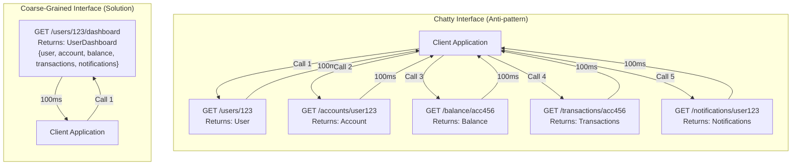

<Hero
  title="Chatty Interfaces and Tight Coupling"
  subtitle="Too much communication between objects, causing latency and tight coupling."
  imageAlt="Chatty Interfaces and Tight Coupling illustration"
  size="large"
/>

## TL;DR

Chatty interfaces require many round-trips to accomplish simple operations. Each call incurs network latency, making distributed systems slow and inefficient. They also create tight coupling where callers must know the exact sequence of calls. Solution: coarse-grained interfaces that bundle related data, minimizing network round-trips.

## Learning Objectives

You will be able to:
- Identify chatty interface patterns causing performance degradation
- Understand the relationship between chatty interfaces and tight coupling
- Measure the impact of round-trips on distributed systems
- Refactor fine-grained interfaces into coarse-grained ones
- Design API contracts that minimize network calls

## Motivating Scenario

You're building a user profile page. To display a user's dashboard, you need: user details, account balance, transaction history, and notification preferences. Your client application makes these calls:

```
Call 1: GET /api/users/123 → returns User
Call 2: GET /api/accounts/user123 → returns Account
Call 3: GET /api/accounts/acc456/balance → returns Balance
Call 4: GET /api/transactions/acc456?limit=10 → returns Transactions
Call 5: GET /api/notifications/user123 → returns Notifications
```

Each call incurs ~100ms network latency. Total time: 500ms just for network round-trips before rendering. Add 30ms processing time per call, and you've lost 650ms. Your users see a slow, choppy UI.

Your mobile team has it even worse. On a 4G connection with higher latency, each call takes 300ms. Total: 1.5 seconds of waiting before the UI renders anything. Users abandon the app.

Meanwhile, your backend team discovers a tight coupling problem: clients all know they need to call these 5 endpoints in this order. When you want to change the order or add caching, 15 different client codebases need updates.

## Core Explanation

**What Makes an Interface Chatty?**

A chatty interface requires many sequential calls to accomplish a task. The caller must make multiple requests, often waiting for each to complete before making the next. In distributed systems (microservices, client-server, APIs), each round-trip incurs network latency.

**The Latency Problem**

In modern networks:
- Local method calls: ~1 microsecond (µs)
- Local network (same datacenter): ~1 millisecond (ms)
- Internet API calls: 50-500ms depending on geography
- Mobile networks: 100-1000ms+

A seemingly "simple" operation requiring 5 API calls:
- Sequential execution: 5 × 100ms = 500ms minimum
- Plus parsing/processing: another 50-150ms
- User-perceptible delay threshold: 100-200ms

Your "quick" operation feels slow.

**The Coupling Problem**

Chatty interfaces force callers to understand the implementation details:
1. You need to call getUser() first
2. Extract the account ID from the user
3. Call getBalance() with the account ID
4. Call getTransactions() with the same account ID
5. Merge results together

Change the sequence? All clients break. Add a new required piece of data? All clients must update. This tight coupling makes evolution difficult.

**Why This Happens**

- **Premature granularity**: Designers create one method per responsibility, forgetting that callers might need multiple at once
- **Reusability thinking**: "Let's make methods generic so they can be reused for many scenarios"—but the reuse pattern requires orchestrating multiple calls
- **Microservices gone wrong**: Each microservice exposes fine-grained endpoints without thinking about common access patterns
- **Evolution**: Systems start simple, then get more fine-grained over time as responsibilities grow

## Pattern Visualization

<Figure caption="Chatty vs. Coarse-Grained Interface Pattern">

</Figure>

## Code Examples

<Tabs>
  <TabItem value="python" label="Python">
    <Tabs>
      <TabItem value="bad" label="Chatty (Anti-pattern)">
        ```python title="user_service.py" showLineNumbers
        import requests
        import time

        class UserService:
            BASE_URL = "https://api.example.com"

            def get_user(self, user_id):
                """Get just the user"""
                start = time.time()
                resp = requests.get(f"{self.BASE_URL}/users/{user_id}")
                print(f"get_user: {(time.time()-start)*1000:.0f}ms")
                return resp.json()

            def get_account(self, user_id):
                """Get just the account"""
                start = time.time()
                resp = requests.get(f"{self.BASE_URL}/accounts?user_id={user_id}")
                print(f"get_account: {(time.time()-start)*1000:.0f}ms")
                return resp.json()

            def get_balance(self, account_id):
                """Get just the balance"""
                start = time.time()
                resp = requests.get(f"{self.BASE_URL}/balances/{account_id}")
                print(f"get_balance: {(time.time()-start)*1000:.0f}ms")
                return resp.json()

            def get_transactions(self, account_id, limit=10):
                """Get just the transactions"""
                start = time.time()
                resp = requests.get(
                    f"{self.BASE_URL}/transactions/{account_id}?limit={limit}"
                )
                print(f"get_transactions: {(time.time()-start)*1000:.0f}ms")
                return resp.json()

            def get_notifications(self, user_id):
                """Get just the notifications"""
                start = time.time()
                resp = requests.get(f"{self.BASE_URL}/notifications?user_id={user_id}")
                print(f"get_notifications: {(time.time()-start)*1000:.0f}ms")
                return resp.json()

        # Client code makes 5 calls to accomplish simple task
        service = UserService()
        user = service.get_user(123)
        account = service.get_account(123)
        balance = service.get_balance(account['id'])
        transactions = service.get_transactions(account['id'])
        notifications = service.get_notifications(123)

        # Total: 500ms+ for simple page load!
        print({
            'user': user,
            'account': account,
            'balance': balance,
            'transactions': transactions,
            'notifications': notifications
        })
        ```
      </TabItem>
      <TabItem value="good" label="Coarse-Grained (Solution)">
        ```python title="user_service.py" showLineNumbers
        import requests
        import time
        from dataclasses import dataclass
        from typing import List

        @dataclass
        class NotificationItem:
            id: str
            message: str
            read: bool

        @dataclass
        class Transaction:
            id: str
            amount: float
            date: str

        @dataclass
        class UserDashboard:
            """Single coarse-grained object containing everything needed"""
            user_id: str
            name: str
            email: str
            account_id: str
            balance: float
            recent_transactions: List[Transaction]
            notifications: List[NotificationItem]

        class UserService:
            BASE_URL = "https://api.example.com"

            def get_user_dashboard(self, user_id: str) -> UserDashboard:
                """
                Single call returns all dashboard data.
                Backend handles orchestration, not the client.
                """
                start = time.time()
                resp = requests.get(f"{self.BASE_URL}/users/{user_id}/dashboard")
                elapsed = (time.time() - start) * 1000
                print(f"get_user_dashboard: {elapsed:.0f}ms (single call)")

                data = resp.json()
                return UserDashboard(
                    user_id=data['user_id'],
                    name=data['name'],
                    email=data['email'],
                    account_id=data['account_id'],
                    balance=data['balance'],
                    recent_transactions=[
                        Transaction(**t) for t in data['recent_transactions']
                    ],
                    notifications=[
                        NotificationItem(**n) for n in data['notifications']
                    ]
                )

        # Client code: single call to get everything
        service = UserService()
        dashboard = service.get_user_dashboard(123)

        # Use the data
        print({
            'user_id': dashboard.user_id,
            'balance': dashboard.balance,
            'transactions': dashboard.recent_transactions,
            'notifications': dashboard.notifications
        })

        # Backend can also provide specialized views for different clients
        class UserServiceExtended(UserService):
            def get_user_mobile_dashboard(self, user_id: str) -> dict:
                """
                Mobile-optimized: even less data, single call
                Reduces bandwidth on mobile networks
                """
                start = time.time()
                resp = requests.get(
                    f"{self.BASE_URL}/users/{user_id}/mobile-dashboard"
                )
                elapsed = (time.time() - start) * 1000
                print(f"get_user_mobile_dashboard: {elapsed:.0f}ms")
                return resp.json()

            def get_user_summary(self, user_id: str) -> dict:
                """
                Minimal view: just name and balance
                For quick status checks
                """
                start = time.time()
                resp = requests.get(f"{self.BASE_URL}/users/{user_id}/summary")
                elapsed = (time.time() - start) * 1000
                print(f"get_user_summary: {elapsed:.0f}ms")
                return resp.json()
        ```
      </TabItem>
    </Tabs>
  </TabItem>
  <TabItem value="go" label="Go">
    <Tabs>
      <TabItem value="bad" label="Chatty (Anti-pattern)">
        ```go title="user_service.go" showLineNumbers
        package service

        import (
            "context"
            "fmt"
            "io"
            "net/http"
            "time"
        )

        type UserService struct {
            httpClient *http.Client
            baseURL    string
        }

        func NewUserService(baseURL string) *UserService {
            return &UserService{
                httpClient: &http.Client{Timeout: 5 * time.Second},
                baseURL:    baseURL,
            }
        }

        // Each method makes a separate network call
        func (s *UserService) GetUser(ctx context.Context, userID string) (map[string]interface{}, error) {
            start := time.Now()
            req, _ := http.NewRequestWithContext(ctx, "GET", fmt.Sprintf("%s/users/%s", s.baseURL, userID), nil)
            resp, err := s.httpClient.Do(req)
            if err != nil {
                return nil, err
            }
            defer resp.Body.Close()
            fmt.Printf("GetUser: %dms\n", time.Since(start).Milliseconds())

            body, _ := io.ReadAll(resp.Body)
            // Parse JSON...
            return nil, nil
        }

        func (s *UserService) GetAccount(ctx context.Context, userID string) (map[string]interface{}, error) {
            start := time.Now()
            req, _ := http.NewRequestWithContext(ctx, "GET", fmt.Sprintf("%s/accounts?user_id=%s", s.baseURL, userID), nil)
            resp, err := s.httpClient.Do(req)
            if err != nil {
                return nil, err
            }
            defer resp.Body.Close()
            fmt.Printf("GetAccount: %dms\n", time.Since(start).Milliseconds())

            body, _ := io.ReadAll(resp.Body)
            // Parse JSON...
            return nil, nil
        }

        func (s *UserService) GetBalance(ctx context.Context, accountID string) (map[string]interface{}, error) {
            start := time.Now()
            req, _ := http.NewRequestWithContext(ctx, "GET", fmt.Sprintf("%s/balances/%s", s.baseURL, accountID), nil)
            resp, err := s.httpClient.Do(req)
            if err != nil {
                return nil, err
            }
            defer resp.Body.Close()
            fmt.Printf("GetBalance: %dms\n", time.Since(start).Milliseconds())

            body, _ := io.ReadAll(resp.Body)
            // Parse JSON...
            return nil, nil
        }

        // Client must orchestrate multiple calls sequentially
        func (s *UserService) LoadUserDashboard(ctx context.Context, userID string) (map[string]interface{}, error) {
            user, _ := s.GetUser(ctx, userID)
            account, _ := s.GetAccount(ctx, userID)
            balance, _ := s.GetBalance(ctx, account["id"].(string))

            // Total: 400-500ms+ for sequential calls
            return map[string]interface{}{
                "user":    user,
                "account": account,
                "balance": balance,
            }, nil
        }
        ```
      </TabItem>
      <TabItem value="good" label="Coarse-Grained (Solution)">
        ```go title="user_service.go" showLineNumbers
        package service

        import (
            "context"
            "encoding/json"
            "fmt"
            "io"
            "net/http"
            "time"
        )

        type Transaction struct {
            ID     string    `json:"id"`
            Amount float64   `json:"amount"`
            Date   time.Time `json:"date"`
        }

        type Notification struct {
            ID      string `json:"id"`
            Message string `json:"message"`
            Read    bool   `json:"read"`
        }

        type UserDashboard struct {
            UserID              string          `json:"user_id"`
            Name                string          `json:"name"`
            Email               string          `json:"email"`
            AccountID           string          `json:"account_id"`
            Balance             float64         `json:"balance"`
            RecentTransactions  []Transaction   `json:"recent_transactions"`
            Notifications       []Notification  `json:"notifications"`
        }

        type UserService struct {
            httpClient *http.Client
            baseURL    string
        }

        func NewUserService(baseURL string) *UserService {
            return &UserService{
                httpClient: &http.Client{Timeout: 5 * time.Second},
                baseURL:    baseURL,
            }
        }

        // Single call returns all dashboard data
        // Backend orchestrates, not the client
        func (s *UserService) GetUserDashboard(ctx context.Context, userID string) (*UserDashboard, error) {
            start := time.Now()

            req, _ := http.NewRequestWithContext(
                ctx,
                "GET",
                fmt.Sprintf("%s/users/%s/dashboard", s.baseURL, userID),
                nil,
            )

            resp, err := s.httpClient.Do(req)
            if err != nil {
                return nil, err
            }
            defer resp.Body.Close()

            elapsed := time.Since(start)
            fmt.Printf("GetUserDashboard: %dms (single call)\n", elapsed.Milliseconds())

            body, _ := io.ReadAll(resp.Body)
            var dashboard UserDashboard
            json.Unmarshal(body, &dashboard)

            return &dashboard, nil
        }

        // Backend can provide multiple views optimized for different clients
        type MobileDashboard struct {
            UserID    string  `json:"user_id"`
            Name      string  `json:"name"`
            Balance   float64 `json:"balance"`
            Unread    int     `json:"unread_count"`
        }

        func (s *UserService) GetMobileDashboard(ctx context.Context, userID string) (*MobileDashboard, error) {
            start := time.Now()

            req, _ := http.NewRequestWithContext(
                ctx,
                "GET",
                fmt.Sprintf("%s/users/%s/mobile-dashboard", s.baseURL, userID),
                nil,
            )

            resp, err := s.httpClient.Do(req)
            if err != nil {
                return nil, err
            }
            defer resp.Body.Close()

            elapsed := time.Since(start)
            fmt.Printf("GetMobileDashboard: %dms (optimized for mobile)\n", elapsed.Milliseconds())

            body, _ := io.ReadAll(resp.Body)
            var dashboard MobileDashboard
            json.Unmarshal(body, &dashboard)

            return &dashboard, nil
        }

        // Client code: single call to get all dashboard data
        func main() {
            service := NewUserService("https://api.example.com")
            ctx := context.Background()

            dashboard, _ := service.GetUserDashboard(ctx, "123")

            fmt.Printf("User: %s, Balance: %.2f\n", dashboard.Name, dashboard.Balance)
            fmt.Printf("Transactions: %d, Notifications: %d\n",
                len(dashboard.RecentTransactions),
                len(dashboard.Notifications),
            )
        }
        ```
      </TabItem>
    </Tabs>
  </TabItem>
  <TabItem value="nodejs" label="Node.js">
    <Tabs>
      <TabItem value="bad" label="Chatty (Anti-pattern)">
        ```javascript title="user-service.js" showLineNumbers
        const axios = require('axios');

        class UserService {
            constructor(baseURL) {
                this.baseURL = baseURL;
                this.client = axios.create({ baseURL });
            }

            async getUser(userId) {
                const start = Date.now();
                const resp = await this.client.get(`/users/${userId}`);
                console.log(`getUser: ${Date.now() - start}ms`);
                return resp.data;
            }

            async getAccount(userId) {
                const start = Date.now();
                const resp = await this.client.get(`/accounts?user_id=${userId}`);
                console.log(`getAccount: ${Date.now() - start}ms`);
                return resp.data;
            }

            async getBalance(accountId) {
                const start = Date.now();
                const resp = await this.client.get(`/balances/${accountId}`);
                console.log(`getBalance: ${Date.now() - start}ms`);
                return resp.data;
            }

            async getTransactions(accountId, limit = 10) {
                const start = Date.now();
                const resp = await this.client.get(
                    `/transactions/${accountId}?limit=${limit}`
                );
                console.log(`getTransactions: ${Date.now() - start}ms`);
                return resp.data;
            }

            async getNotifications(userId) {
                const start = Date.now();
                const resp = await this.client.get(`/notifications?user_id=${userId}`);
                console.log(`getNotifications: ${Date.now() - start}ms`);
                return resp.data;
            }

            async loadDashboard(userId) {
                // Client must orchestrate 5 sequential calls!
                const user = await this.getUser(userId);
                const account = await this.getAccount(userId);
                const balance = await this.getBalance(account.id);
                const transactions = await this.getTransactions(account.id);
                const notifications = await this.getNotifications(userId);

                // Total: 500ms+ of network latency
                return { user, account, balance, transactions, notifications };
            }
        }

        // Usage
        const service = new UserService('https://api.example.com');
        service.loadDashboard(123);
        ```
      </TabItem>
      <TabItem value="good" label="Coarse-Grained (Solution)">
        ```javascript title="user-service.js" showLineNumbers
        const axios = require('axios');

        class UserDashboard {
            constructor(data) {
                this.userId = data.user_id;
                this.name = data.name;
                this.email = data.email;
                this.accountId = data.account_id;
                this.balance = data.balance;
                this.recentTransactions = data.recent_transactions;
                this.notifications = data.notifications;
            }
        }

        class UserService {
            constructor(baseURL) {
                this.baseURL = baseURL;
                this.client = axios.create({ baseURL });
            }

            async getUserDashboard(userId) {
                // Single coarse-grained call
                // Backend handles orchestration
                const start = Date.now();
                const resp = await this.client.get(`/users/${userId}/dashboard`);
                const elapsed = Date.now() - start;
                console.log(`getUserDashboard: ${elapsed}ms (single call)`);

                return new UserDashboard(resp.data);
            }

            async getMobileDashboard(userId) {
                // Mobile-optimized view: less data, single call
                const start = Date.now();
                const resp = await this.client.get(`/users/${userId}/mobile-dashboard`);
                const elapsed = Date.now() - start;
                console.log(`getMobileDashboard: ${elapsed}ms (optimized for mobile)`);

                return resp.data;
            }

            async getUserSummary(userId) {
                // Quick summary: minimal data
                const start = Date.now();
                const resp = await this.client.get(`/users/${userId}/summary`);
                const elapsed = Date.now() - start;
                console.log(`getUserSummary: ${elapsed}ms`);

                return resp.data;
            }
        }

        // Usage: single call to get all data
        const service = new UserService('https://api.example.com');

        (async () => {
            const dashboard = await service.getUserDashboard(123);
            console.log(`User: ${dashboard.name}, Balance: $${dashboard.balance}`);
            console.log(`Transactions: ${dashboard.recentTransactions.length}`);

            // For mobile clients, use optimized endpoint
            const mobileDash = await service.getMobileDashboard(123);
            console.log(`Mobile view loaded in one call`);
        })();

        module.exports = { UserService, UserDashboard };
        ```
      </TabItem>
    </Tabs>
  </TabItem>
</Tabs>

## Patterns and Pitfalls

### When Chatty Interfaces Develop

**1. The Granularity Creep**
You design fine-grained methods: `getUser()`, `getBalance()`, `getTransactions()`. Later, you realize callers always need all three together, but the API contract is already public.

**2. Lack of Use Case Understanding**
Services designed without understanding how clients use the data. Each method solves one backend concern, not thinking about frontend needs.

**3. Microservices Boundaries**
Services are split by domain concern (User Service, Account Service, Transaction Service), but clients need data from all three for a single screen.

**4. Assuming Reusability**
"Make methods granular so they can be reused for many scenarios." But the reuse pattern requires client-side orchestration.

### The Hidden Cost: Retry Logic

With chatty interfaces, one failed call breaks the entire operation. Imagine this fails on call 4:

```
Call 1 ✓ Get user
Call 2 ✓ Get account
Call 3 ✓ Get balance
Call 4 ✗ Get transactions (timeout)
Entire operation fails
```

With a single coarse-grained call, the backend retries internally, users don't see failures.

## When This Happens / How to Detect

**Red Flags:**

1. Loading a single screen requires 5+ API calls
2. Backend endpoints are named for single data types (`GET /users/{id}`, `GET /accounts/{id}`, etc.)
3. Clients must orchestrate complex sequences of calls
4. API changes require updating many client codebases
5. Mobile users report slow load times
6. You see connection pooling problems—too many concurrent connections
7. Network waterfall charts show sequential calls

**Measurement:**

```javascript
// Measure the problem
async function loadDashboard(userId) {
    const start = Date.now();
    const result = await orchestrate5Calls(userId);
    console.log(`Total time: ${Date.now() - start}ms`);
    // If > 300ms, you have a problem
}
```

## How to Fix / Refactor

### Step 1: Identify Access Patterns

Map out what data clients actually need:

```
Dashboard page:
  - User name, email
  - Account balance
  - Last 5 transactions
  - Unread notifications count
```

### Step 2: Design Coarse-Grained Endpoint

Create an endpoint that returns everything needed:

```
GET /users/{id}/dashboard
→ UserDashboard { user, account, balance, transactions, notifications }
```

### Step 3: Provide Multiple Views

Different clients have different needs:

```
GET /users/{id}/dashboard       # Full desktop view
GET /users/{id}/mobile-dashboard # Lightweight mobile view
GET /users/{id}/summary         # Just name and balance
```

### Step 4: Use Backend for Orchestration

Let the backend fetch data in parallel, not the client sequentially:

```python
# Backend fetches all in parallel
async def get_user_dashboard(user_id):
    user_task = fetch_user(user_id)
    account_task = fetch_account(user_id)
    transactions_task = fetch_transactions(user_id)

    user, account, transactions = await asyncio.gather(
        user_task, account_task, transactions_task
    )

    return { user, account, transactions }
```

### Step 5: Deprecate Old Endpoints

Keep fine-grained endpoints for backward compatibility, but mark them deprecated. Migrate clients to coarse-grained endpoints.

## Operational Considerations

**Caching Strategy:**

Coarse-grained endpoints are easier to cache because the entire response is atomic. You can cache `getUserDashboard()` for 30 seconds, but `getUser()` + `getBalance()` requires invalidating separately.

**Versioning:**

When you add a new field to UserDashboard, existing clients automatically get it. With fine-grained APIs, you need to update all clients.

**GraphQL as a Middle Ground:**

GraphQL lets clients specify exactly what data they need, combining benefits of both approaches:

```graphql
query {
  user(id: 123) {
    name
    email
    account {
      balance
      transactions(limit: 5) { id amount date }
    }
    notifications { message }
  }
}
```

## Design Review Checklist

<Checklist items={[
  "Do clients load a single screen with 5+ API calls?",
  "Are endpoints designed per backend domain, not per client need?",
  "Do clients need to orchestrate complex sequences of calls?",
  "Are there multiple views of the same data (desktop vs mobile)?",
  "Can you cache a full screen view atomically, or must you cache parts?",
  "Do API clients know the exact sequence of calls needed?",
  "Are there NetworkError retries due to partial failures?",
  "Can the backend fetch multiple resources in parallel?",
  "Are there connection pool exhaustion issues?",
  "Does adding a new feature require updating multiple client codebases?",
  "Are round-trip latencies visible in performance profiling?"
]} />

## Showcase

<Showcase
  title="Signals of Chatty Interfaces"
  sections={[
    {label: "Anti-Signals (Problems)", body: "- 5 API calls to load a single screen\n- Client orchestrates sequential calls\n- Fine-grained endpoints (one per data type)\n- Mobile performance complaints\n- API changes require updating all clients\n- Network waterfall shows sequential latency", tone: "warning"}, {label: "Healthy Signals (Solutions)", body: "- Single API call loads full screen\n- Backend orchestrates related data\n- Coarse-grained endpoints by use case\n- Same fast load time on mobile and desktop\n- Adding fields transparent to clients\n- Flat network latency profile", tone: "positive"}
  ]}
/>

## Self-Check

1. **How many API calls does your app make to load a single screen?** If > 3, you likely have a chatty interface.

2. **Can you load the screen 10x faster by making one API call instead?** If yes, refactor to coarse-grained endpoint.

3. **Does the API require clients to understand the data structure?** If yes, move orchestration to the backend.

## Next Steps

- **Learn**: <a href="https://www.graphql.org/" target="_blank" rel="nofollow noopener noreferrer">GraphQL ↗️</a> for flexible data fetching
- **Study**: <a href="https://martinfowler.com/articles/web-api-design.html" target="_blank" rel="nofollow noopener noreferrer">Martin Fowler - Web API Design ↗️</a>
- **Practice**: Profile your application to measure round-trip latency
- **Audit**: List all API endpoints and how many clients use each
- **Refactor**: Design one coarse-grained endpoint for a common client pattern

## One Takeaway

<Callout tone="info">
Design APIs around how clients use the data, not how backend systems organize it. Coarse-grained endpoints cost less to call and reduce coupling.
</Callout>

## References

1. <a href="https://martinfowler.com/articles/web-api-design.html" target="_blank" rel="nofollow noopener noreferrer">Web API Design - Crafting Interfaces That Developers Love ↗️</a>
2. <a href="https://en.wikipedia.org/wiki/Chatty_I/O" target="_blank" rel="nofollow noopener noreferrer">Wikipedia - Chatty I/O ↗️</a>
3. <a href="https://www.graphql.org/" target="_blank" rel="nofollow noopener noreferrer">GraphQL Official Documentation ↗️</a>
4. <a href="https://restfulapi.net/batch-processing/" target="_blank" rel="nofollow noopener noreferrer">RESTful API - Batch Processing ↗️</a>
