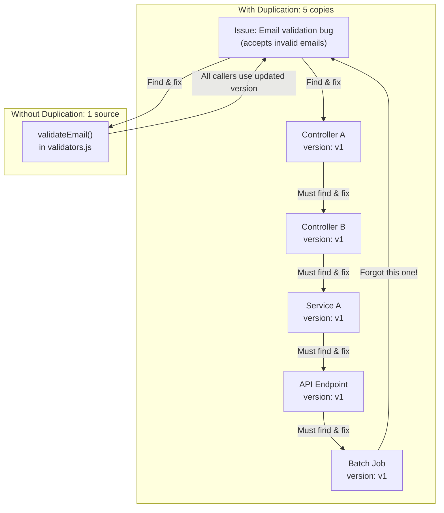

<Hero
  title="Copy-Paste Programming"
  subtitle="Duplicating code instead of extracting shared functionality, violating DRY principle."
  imageAlt="Copy-Paste Programming illustration"
  size="large"
/>

## TL;DR

Copy-paste programming duplicates code across your codebase, violating the DRY (Don't Repeat Yourself) principle. When you fix a bug in one copy, you forget about the others. When requirements change, you must update every copy consistently. This leads to subtle bugs, increased maintenance burden, and frustration. Extract shared code into reusable functions immediately.

## Learning Objectives

You will be able to:
- Identify duplicated code patterns in your codebase
- Understand why duplication is expensive to maintain
- Extract duplicated logic into reusable functions
- Measure and track duplication in your codebase
- Implement refactoring strategies to eliminate duplication
- Design generic functions that work across multiple scenarios

## Motivating Scenario

Your team is building an e-commerce platform. In the first sprint, you write user registration validation:

```javascript
// In UserController.js
if (!email.includes('@')) throw new Error('Invalid email');
if (password.length < 8) throw new Error('Password too short');
if (name.length < 2) throw new Error('Name too short');
```

Three months later, you add a profile update feature. Your colleague copies this validation:

```javascript
// In ProfileController.js
if (!email.includes('@')) throw new Error('Invalid email');
if (password.length < 8) throw new Error('Password too short');
if (name.length < 2) throw new Error('Name too short');
```

A bug is discovered: email validation is too strict (doesn't allow `.co.uk` domains). You fix it in UserController:

```javascript
if (!email.includes('@') || !email.includes('.')) throw new Error('Invalid email');
```

But ProfileController still uses the old validation. Now some users can update their profile with invalid emails. The bug takes three days to discover and causes angry customer support tickets.

This scenario repeats throughout the codebase. Duplicated validation, duplicated formatting logic, duplicated error handling. Each duplication is a ticking time bomb.

## Core Explanation

**Why Copy-Paste Happens**

- **It's fast**: Copying is faster than designing generic functions
- **It works**: The code works for your immediate use case
- **It seems harmless**: "I'll refactor this later"
- **Risk aversion**: "What if the new context requires different behavior?"

**The Hidden Cost**

Copy-paste has a deferred cost that compounds:

| Change | Cost with Duplication | Cost without Duplication |
|--------|----------------------|------------------------|
| Fix bug in 1 place | Search 3-5 times for duplication, fix each copy, risk forgetting one | Fix once, done |
| Add feature flag | Update 4 copies, test 4 times | Update once, test once |
| Change error message | Manual search + replace in multiple files | One line change |
| Onboarding new dev | "Watch out for email validation in these 6 places" | "Use validateUser() function" |

After 6 months, that "quick copy" has cost 40+ hours of maintenance and caused 3 bugs.

**The Psychological Impact**

Developers become afraid to change duplicated code. "If I change this, I might break the other place." This fear causes stagnation and technical debt accumulation.

## Pattern Visualization

<Figure caption="Code Duplication Cascade">

</Figure>

## Code Examples

<Tabs>
  <TabItem value="python" label="Python">
    <Tabs>
      <TabItem value="bad" label="Copy-Paste (Anti-pattern)">
        ```python title="user_service.py" showLineNumbers
        def register_user(email, password, name):
            """Register a new user"""
            # Duplicated validation
            if '@' not in email or '.' not in email:
                raise ValueError('Invalid email')
            if len(password) < 8:
                raise ValueError('Password must be 8+ characters')
            if not name or len(name) < 2:
                raise ValueError('Name must be at least 2 characters')
            # ... continue with registration
            return create_user(email, password, name)

        def update_profile(user_id, email, password, name):
            """Update user profile"""
            # SAME VALIDATION COPIED HERE!
            if '@' not in email or '.' not in email:
                raise ValueError('Invalid email')
            if len(password) < 8:
                raise ValueError('Password must be 8+ characters')
            if not name or len(name) < 2:
                raise ValueError('Name must be at least 2 characters')
            # ... continue with update
            return update_user(user_id, email, password, name)

        def reset_password(email, new_password):
            """Reset user password"""
            # Duplicated password validation
            if len(new_password) < 8:  # Inconsistent!
                raise ValueError('Password must be 8+ characters')
            # ... continue with reset
            return update_user_password(email, new_password)

        def invite_user(inviter_id, invitee_email):
            """Invite user by email"""
            # Duplicated email validation (slightly different!)
            if '@' not in invitee_email:  # Missing '.' check!
                raise ValueError('Invalid email')
            # ... continue with invitation
            return send_invitation(inviter_id, invitee_email)
        ```
      </TabItem>
      <TabItem value="good" label="DRY (Solution)">
        ```python title="validators.py" showLineNumbers
        class ValidationError(Exception):
            """Raised when validation fails"""
            pass

        class UserValidator:
            """Centralized user data validation"""

            MIN_PASSWORD_LENGTH = 8
            MIN_NAME_LENGTH = 2

            @staticmethod
            def validate_email(email: str) -> None:
                """
                Validate email format.
                Raises ValidationError if invalid.
                """
                if not email or not isinstance(email, str):
                    raise ValidationError('Email must be a non-empty string')

                if '@' not in email or '.' not in email:
                    raise ValidationError('Invalid email format')

                local, domain = email.rsplit('@', 1)
                if not local or not domain:
                    raise ValidationError('Invalid email format')

                if '.' not in domain:
                    raise ValidationError('Invalid email domain')

            @staticmethod
            def validate_password(password: str) -> None:
                """
                Validate password strength.
                Raises ValidationError if invalid.
                """
                if not password or not isinstance(password, str):
                    raise ValidationError('Password must be a non-empty string')

                if len(password) < UserValidator.MIN_PASSWORD_LENGTH:
                    raise ValidationError(
                        f'Password must be at least {UserValidator.MIN_PASSWORD_LENGTH} characters'
                    )

            @staticmethod
            def validate_name(name: str) -> None:
                """
                Validate user name.
                Raises ValidationError if invalid.
                """
                if not name or not isinstance(name, str):
                    raise ValidationError('Name must be a non-empty string')

                if len(name) < UserValidator.MIN_NAME_LENGTH:
                    raise ValidationError(
                        f'Name must be at least {UserValidator.MIN_NAME_LENGTH} characters'
                    )

            @staticmethod
            def validate_user(email: str, password: str, name: str) -> None:
                """
                Validate all user fields together.
                Raises ValidationError if any field is invalid.
                """
                UserValidator.validate_email(email)
                UserValidator.validate_password(password)
                UserValidator.validate_name(name)

        # Now services use the validator
        from validators import UserValidator, ValidationError

        def register_user(email, password, name):
            """Register a new user"""
            try:
                UserValidator.validate_user(email, password, name)
            except ValidationError as e:
                raise ValueError(str(e))

            # ... continue with registration
            return create_user(email, password, name)

        def update_profile(user_id, email, password, name):
            """Update user profile"""
            try:
                UserValidator.validate_user(email, password, name)
            except ValidationError as e:
                raise ValueError(str(e))

            # ... continue with update
            return update_user(user_id, email, password, name)

        def reset_password(email, new_password):
            """Reset user password"""
            try:
                UserValidator.validate_email(email)
                UserValidator.validate_password(new_password)
            except ValidationError as e:
                raise ValueError(str(e))

            # ... continue with reset
            return update_user_password(email, new_password)

        def invite_user(inviter_id, invitee_email):
            """Invite user by email"""
            try:
                UserValidator.validate_email(invitee_email)
            except ValidationError as e:
                raise ValueError(str(e))

            # ... continue with invitation
            return send_invitation(inviter_id, invitee_email)

        # Single source of truth:
        # - Change email validation once, all functions benefit
        # - Bug fix in password validation fixes it everywhere
        # - Easy to test validation logic in isolation
        ```
      </TabItem>
    </Tabs>
  </TabItem>
  <TabItem value="go" label="Go">
    <Tabs>
      <TabItem value="bad" label="Copy-Paste (Anti-pattern)">
        ```go title="user_service.go" showLineNumbers
        package service

        import (
            "errors"
            "strings"
        )

        func RegisterUser(email, password, name string) error {
            // Duplicated validation
            if !strings.Contains(email, "@") || !strings.Contains(email, ".") {
                return errors.New("invalid email")
            }
            if len(password) < 8 {
                return errors.New("password must be 8+ characters")
            }
            if name == "" || len(name) < 2 {
                return errors.New("name must be at least 2 characters")
            }
            // ... continue with registration
            return nil
        }

        func UpdateProfile(userID, email, password, name string) error {
            // SAME VALIDATION COPIED HERE!
            if !strings.Contains(email, "@") || !strings.Contains(email, ".") {
                return errors.New("invalid email")
            }
            if len(password) < 8 {
                return errors.New("password must be 8+ characters")
            }
            if name == "" || len(name) < 2 {
                return errors.New("name must be at least 2 characters")
            }
            // ... continue with update
            return nil
        }

        func ResetPassword(email, newPassword string) error {
            // Duplicated password validation (slightly different!)
            if len(newPassword) < 8 {
                return errors.New("password too short")  // Different message!
            }
            // ... continue with reset
            return nil
        }
        ```
      </TabItem>
      <TabItem value="good" label="DRY (Solution)">
        ```go title="validators/user_validator.go" showLineNumbers
        package validators

        import (
            "errors"
            "strings"
        )

        const (
            MinPasswordLength = 8
            MinNameLength     = 2
        )

        // ValidationError represents a validation failure
        type ValidationError struct {
            Field   string
            Message string
        }

        func (e ValidationError) Error() string {
            return e.Message
        }

        // UserValidator provides centralized validation
        type UserValidator struct{}

        func NewUserValidator() *UserValidator {
            return &UserValidator{}
        }

        // ValidateEmail checks email format
        func (v *UserValidator) ValidateEmail(email string) error {
            if email == "" {
                return ValidationError{
                    Field:   "email",
                    Message: "email is required",
                }
            }

            if !strings.Contains(email, "@") || !strings.Contains(email, ".") {
                return ValidationError{
                    Field:   "email",
                    Message: "invalid email format",
                }
            }

            parts := strings.Split(email, "@")
            if len(parts) != 2 || parts[0] == "" || parts[1] == "" {
                return ValidationError{
                    Field:   "email",
                    Message: "invalid email format",
                }
            }

            return nil
        }

        // ValidatePassword checks password strength
        func (v *UserValidator) ValidatePassword(password string) error {
            if password == "" {
                return ValidationError{
                    Field:   "password",
                    Message: "password is required",
                }
            }

            if len(password) < MinPasswordLength {
                return ValidationError{
                    Field:   "password",
                    Message: "password must be at least " + string(rune(MinPasswordLength)) + " characters",
                }
            }

            return nil
        }

        // ValidateName checks user name
        func (v *UserValidator) ValidateName(name string) error {
            if name == "" {
                return ValidationError{
                    Field:   "name",
                    Message: "name is required",
                }
            }

            if len(name) < MinNameLength {
                return ValidationError{
                    Field:   "name",
                    Message: "name must be at least 2 characters",
                }
            }

            return nil
        }

        // ValidateUser checks all user fields
        func (v *UserValidator) ValidateUser(email, password, name string) error {
            if err := v.ValidateEmail(email); err != nil {
                return err
            }

            if err := v.ValidatePassword(password); err != nil {
                return err
            }

            if err := v.ValidateName(name); err != nil {
                return err
            }

            return nil
        }

        // Now use the validator everywhere
        // user_service.go
        func RegisterUser(email, password, name string) error {
            validator := validators.NewUserValidator()

            if err := validator.ValidateUser(email, password, name); err != nil {
                return err
            }

            // ... continue with registration
            return nil
        }

        func UpdateProfile(userID, email, password, name string) error {
            validator := validators.NewUserValidator()

            if err := validator.ValidateUser(email, password, name); err != nil {
                return err
            }

            // ... continue with update
            return nil
        }

        func ResetPassword(email, newPassword string) error {
            validator := validators.NewUserValidator()

            if err := validator.ValidateEmail(email); err != nil {
                return err
            }

            if err := validator.ValidatePassword(newPassword); err != nil {
                return err
            }

            // ... continue with reset
            return nil
        }
        ```
      </TabItem>
    </Tabs>
  </TabItem>
  <TabItem value="nodejs" label="Node.js">
    <Tabs>
      <TabItem value="bad" label="Copy-Paste (Anti-pattern)">
        ```javascript title="user-service.js" showLineNumbers
        // Duplicated email validation across multiple files

        // In userController.js
        async function registerUser(req, res) {
            const { email, password, name } = req.body;

            // Validation duplicated here
            if (!email.includes('@') || !email.includes('.')) {
                return res.status(400).json({ error: 'Invalid email' });
            }
            if (password.length < 8) {
                return res.status(400).json({ error: 'Password too short' });
            }
            if (!name || name.length < 2) {
                return res.status(400).json({ error: 'Name too short' });
            }

            // ... continue with registration
        }

        // In profileController.js
        async function updateProfile(req, res) {
            const { email, password, name } = req.body;

            // SAME VALIDATION DUPLICATED!
            if (!email.includes('@') || !email.includes('.')) {
                return res.status(400).json({ error: 'Invalid email' });
            }
            if (password.length < 8) {
                return res.status(400).json({ error: 'Password too short' });
            }
            if (!name || name.length < 2) {
                return res.status(400).json({ error: 'Name too short' });
            }

            // ... continue with profile update
        }

        // In authService.js
        async function resetPassword(email, newPassword) {
            // Duplicated password validation (slightly different!)
            if (newPassword.length < 8) {
                throw new Error('Password must be 8+ chars');
            }
            // ... continue
        }

        // Bug in email validation discovered!
        // Must fix in 3+ places, easy to forget one
        ```
      </TabItem>
      <TabItem value="good" label="DRY (Solution)">
        ```javascript title="validators/user-validator.js" showLineNumbers
        /**
         * Centralized user validation logic.
         * Single source of truth for all user validation rules.
         */

        const MIN_PASSWORD_LENGTH = 8;
        const MIN_NAME_LENGTH = 2;

        class ValidationError extends Error {
            constructor(field, message) {
                super(message);
                this.field = field;
                this.name = 'ValidationError';
            }
        }

        class UserValidator {
            static validateEmail(email) {
                if (!email || typeof email !== 'string') {
                    throw new ValidationError('email', 'Email is required');
                }

                if (!email.includes('@') || !email.includes('.')) {
                    throw new ValidationError('email', 'Invalid email format');
                }

                const [local, domain] = email.split('@');
                if (!local || !domain || !domain.includes('.')) {
                    throw new ValidationError('email', 'Invalid email format');
                }
            }

            static validatePassword(password) {
                if (!password || typeof password !== 'string') {
                    throw new ValidationError('password', 'Password is required');
                }

                if (password.length < MIN_PASSWORD_LENGTH) {
                    throw new ValidationError(
                        'password',
                        `Password must be at least ${MIN_PASSWORD_LENGTH} characters`
                    );
                }
            }

            static validateName(name) {
                if (!name || typeof name !== 'string') {
                    throw new ValidationError('name', 'Name is required');
                }

                if (name.length < MIN_NAME_LENGTH) {
                    throw new ValidationError(
                        'name',
                        `Name must be at least ${MIN_NAME_LENGTH} characters`
                    );
                }
            }

            static validateUser(email, password, name) {
                this.validateEmail(email);
                this.validatePassword(password);
                this.validateName(name);
            }
        }

        module.exports = { UserValidator, ValidationError };

        // Now all controllers use the centralized validator
        // userController.js
        const { UserValidator, ValidationError } = require('../validators/user-validator');

        async function registerUser(req, res) {
            const { email, password, name } = req.body;

            try {
                UserValidator.validateUser(email, password, name);
            } catch (err) {
                if (err instanceof ValidationError) {
                    return res.status(400).json({ error: err.message, field: err.field });
                }
                throw err;
            }

            // ... continue with registration
        }

        // profileController.js
        async function updateProfile(req, res) {
            const { email, password, name } = req.body;

            try {
                UserValidator.validateUser(email, password, name);
            } catch (err) {
                if (err instanceof ValidationError) {
                    return res.status(400).json({ error: err.message, field: err.field });
                }
                throw err;
            }

            // ... continue with profile update
        }

        // authService.js
        async function resetPassword(email, newPassword) {
            try {
                UserValidator.validateEmail(email);
                UserValidator.validatePassword(newPassword);
            } catch (err) {
                if (err instanceof ValidationError) {
                    throw new Error(err.message);
                }
                throw err;
            }

            // ... continue
        }

        // Now:
        // - Change email validation ONCE, all functions benefit
        // - Bug fix applies everywhere
        // - Easy to test validation in isolation
        ```
      </TabItem>
    </Tabs>
  </TabItem>
</Tabs>

## Patterns and Pitfalls

### Why Duplication Spreads

**1. The "Quick Copy" Excuse**
"I'll just copy this validation for now, refactor later." Later never comes. The code ships, users depend on it, and refactoring becomes harder.

**2. Subtle Variations**
Duplication isn't always exact. One copy validates `email.length > 0`, another uses `email != null`. These subtle differences cause bugs when requirements change.

**3. Copy-Paste Inheritance**
One team copies code from another team. Both teams now maintain separate copies, diverging over time.

**4. Fear of Generalization**
"What if these two use cases diverge later?" Better to extract with parameters than duplicate. If they diverge, refactor then.

### Duplication Metrics

```
Duplication Ratio = (Duplicated Lines) / (Total Lines)
- < 5%: Acceptable
- 5-10%: Concerning, plan refactoring
- > 10%: Crisis, major refactoring needed
```

Tools: SonarQube, PMD, Checkstyle can measure duplication automatically.

## When This Happens / How to Detect

**Red Flags:**

1. Same validation logic in 3+ places
2. Bug fixed in one place, reappears in another copy
3. Copy-paste commits: "Copy user validation from X to Y"
4. Variable/function names identical in multiple files
5. Changes to one copy don't propagate to others
6. IDE shows "Similar code" warnings
7. Tests for the same logic in multiple test files

**Automated Detection:**

```bash
# Find duplicate code blocks (40+ lines)
sonarqube-scanner --report duplication

# Using PMD
pmd check --dir src/ --rulesets duplicates

# Simple grep for exact duplicates
grep -r "if (!email.includes('@'))" src/
```

## How to Fix / Refactor

### Step 1: Identify Duplication

```bash
# Find the same validation in multiple places
grep -n "validate.*email" src/**/*.js
```

### Step 2: Understand the Variations

Are the copies identical or slightly different? Identical? Easy to extract. Variations? Extract the common parts, parameterize the differences.

### Step 3: Create Shared Function/Utility

Extract to a shared module that all code uses:

```javascript
// validators/user-validator.js
export const validateEmail = (email) => { ... };

// All controllers import and use it
```

### Step 4: Gradually Migrate

Update one consumer at a time to use the shared function. Test each migration.

### Step 5: Remove Old Copies

Once all consumers are migrated, delete the old duplicated code.

## Operational Considerations

**Refactoring Under Pressure:**

Copy-paste is tempting when deadlines loom. Resist it. The short-term speed gain costs 10x in maintenance later.

**Code Review:**

Make duplication detection a code review practice. "This validation already exists in X module, use that instead."

**Automated Enforcement:**

Use static analysis tools (SonarQube, ESLint plugins) to flag potential duplication and block merges if too high.

## Design Review Checklist

<Checklist items={[
  "Is the same validation logic in only one place?",
  "Do similar functions use extracted helpers, not copy-paste?",
  "Are error messages consistent across similar validations?",
  "Can you change a requirement and update once, not in 5 places?",
  "Are utility functions in a shared location, not scattered?",
  "Did code review catch and prevent duplication?",
  "Are duplicate detection tools (SonarQube) part of CI/CD?",
  "Can you trace a shared behavior to a single source?",
  "Are there no commented-out or 'legacy' copies of functions?",
  "Would a new developer know to use validateEmail() instead of writing it again?",
  "Are tests for shared logic in one test file, not duplicated?"
]} />

## Showcase

<Showcase
  title="Signals of Copy-Paste Programming"
  sections={[
    {label: "Anti-Signals (Problems)", body: "- Email validation in 5 different files\n- Bug fixed in UserController, appears in ProfileController\n- Similar function names: validateEmail(), validateUserEmail(), checkEmail()\n- Slightly different error messages for same validation\n- Copy-paste commits in git log\n- Duplication ratio > 10%", tone: "warning"}, {label: "Healthy Signals (Solutions)", body: "- Email validation in validators/email-validator.js only\n- Bug fix applies everywhere automatically\n- Single validateEmail() function used everywhere\n- Consistent error messages from one source\n- Commits create new shared utilities\n- Duplication ratio < 5%", tone: "positive"}
  ]}
/>

## Self-Check

1. **Can you find the email validation in 10 seconds?** If it's in 3+ places, you have duplication.

2. **If you change the password requirement from 8 to 12 characters, how many files need updating?** Should be one.

3. **Do your tests duplicate test cases for the same logic?** If yes, the logic should be shared.

## Next Steps

- **Identify**: Run duplication analysis on your codebase
- **Extract**: Choose one duplicated pattern and create a shared utility
- **Migrate**: Update all consumers to use the shared utility
- **Verify**: Ensure tests pass, behavior unchanged
- **Prevent**: Add SonarQube/linting to catch future duplication

## One Takeaway

<Callout tone="info">
Every duplicated line is a future bug. Extract shared logic immediately, even if it seems simple. The maintenance cost of duplication compounds exponentially.
</Callout>

## References

1. <a href="https://en.wikipedia.org/wiki/Don%27t_repeat_yourself" target="_blank" rel="nofollow noopener noreferrer">Don't Repeat Yourself (DRY) Principle ↗️</a>
2. <a href="https://refactoring.guru/refactoring/techniques/extract-method" target="_blank" rel="nofollow noopener noreferrer">Refactoring: Extract Method ↗️</a>
3. <a href="https://www.sonarsource.com/solutions/duplicate-code/" target="_blank" rel="nofollow noopener noreferrer">SonarQube - Duplicate Code Detection ↗️</a>
4. <a href="https://en.wikipedia.org/wiki/Code_duplication" target="_blank" rel="nofollow noopener noreferrer">Code Duplication ↗️</a>
