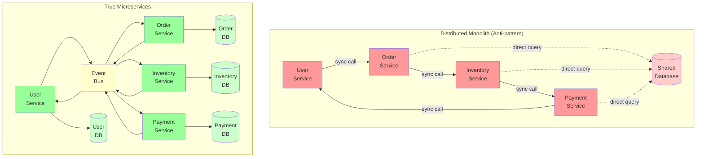

<Hero
  title="Distributed Monolith"
  subtitle="Microservices independent in deployment but tightly coupled in design."
  imageAlt="Distributed Monolith illustration"
  size="large"
/>

## TL;DR

A distributed monolith is the worst of both worlds: microservices deployed independently, but tightly coupled in design. Change one service and you must update 5 others. All services deployed together despite being "independent." Shared databases create implicit dependencies. Circular service dependencies break the entire system. You lose every advantage of microservices (independent scaling, deployment, failure isolation) while gaining all the disadvantages (complexity, latency, debugging difficulty). Solution: design services with loose coupling through clear API contracts, independent data stores, and asynchronous communication.

## Learning Objectives

You will be able to:
- Identify distributed monolith characteristics in microservice architectures
- Understand how tight coupling defeats microservice benefits
- Design service boundaries using Domain-Driven Design
- Create service contracts with versioning
- Implement asynchronous communication patterns
- Migrate from distributed monolith to loosely-coupled services
- Evaluate when microservices are (not) the right choice

## Motivating Scenario

Your company split a monolith into microservices three months ago. You now have:

- User Service
- Order Service
- Inventory Service
- Payment Service
- Notification Service

You want to change the Order API response format slightly. But:
- The User Service hardcodes expectations about Order responses
- The Inventory Service directly queries the Order database
- Payment Service and Order Service call each other synchronously
- Notification Service must be updated to handle new order fields
- You can't deploy Order Service without coordinating with 4 other teams

You end up deploying all services together anyway, defeating the whole point.

A network call fails between Order and Payment Service. The entire ordering system fails because there's no fallback. In a true microservice architecture, services would be resilient to each other's failures.

You realize: this isn't microservices, it's a distributed monolith.

## Core Explanation

**What Makes a Distributed Monolith**

1. **Synchronous Dependencies**: Service A makes a blocking call to Service B. If B is slow or down, A hangs. They're tightly coupled.

2. **Shared Database**: Multiple services read/write the same database tables. Services are coupled through the database schema.

3. **Circular Dependencies**: Service A calls Service B, Service B calls Service C, Service C calls Service A. You can't deploy or scale independently.

4. **Hard-Coded Contracts**: Services assume specific response formats. Change the format, all callers break.

5. **Coordinated Deployments**: You deploy services together because they're interdependent. You've lost deployment independence.

**Why This Happens**

- **Premature Microservices**: Split a monolith without clear domain boundaries. Services emerge with fuzzy responsibilities.
- **Ease Over Architecture**: Sharing a database is easier than building proper APIs. Synchronous calls are simpler than async messaging.
- **No Service Contract Discipline**: No versioning, no compatibility layer, no API evolution strategy.
- **Fear of Complexity**: "Async messaging is complex, we'll just call each other synchronously."

**The Cost**

You get:
- Complexity of distributed systems (latency, failures, debugging)
- Tight coupling of a monolith (can't change independently)
- Deployment coordination nightmare
- Testing complexity without the benefits of independence

You lose:
- Independent scaling
- Independent deployment
- Failure isolation (one service failure cascades)
- Technology diversity

## Pattern Visualization

<Figure caption="Distributed Monolith vs. True Microservices">

</Figure>

## Code Examples

<Tabs>
  <TabItem value="python" label="Python">
    <Tabs>
      <TabItem value="bad" label="Distributed Monolith (Anti-pattern)">
        ```python title="order_service.py" showLineNumbers
        import requests

        class OrderService:
            def __init__(self):
                self.user_service_url = "http://user-service:8001"
                self.inventory_service_url = "http://inventory-service:8002"
                self.payment_service_url = "http://payment-service:8003"
                self.db = SharedDatabase()

            def create_order(self, user_id, items):
                """Create an order - tightly coupled to other services"""
                # Get user (synchronous call - blocks if user service is slow)
                user_resp = requests.get(
                    f"{self.user_service_url}/users/{user_id}",
                    timeout=5
                )
                if user_resp.status_code != 200:
                    raise Exception("User service unavailable")
                user = user_resp.json()

                # Check inventory (synchronous call - blocks)
                for item in items:
                    inv_resp = requests.get(
                        f"{self.inventory_service_url}/check/{item['id']}",
                        timeout=5
                    )
                    if not inv_resp.json()['available']:
                        raise Exception("Item not in stock")

                # Create order record in shared database
                order = self.db.execute(
                    "INSERT INTO orders (user_id, items, status) VALUES (?, ?, ?)",
                    (user_id, items, 'pending')
                )

                # Process payment (synchronous call - blocks, tightly coupled)
                try:
                    payment_resp = requests.post(
                        f"{self.payment_service_url}/charge",
                        json={'user_id': user_id, 'amount': self._calculate_total(items)},
                        timeout=5
                    )
                    if payment_resp.status_code != 200:
                        # Payment failed but order already created
                        # Now in inconsistent state
                        self.db.execute("UPDATE orders SET status = ? WHERE id = ?", ('failed', order['id']))
                        raise Exception("Payment failed")
                except requests.Timeout:
                    # Payment service is slow
                    # Order is stuck in pending state forever
                    raise Exception("Payment service timeout")

                # Update order status
                self.db.execute("UPDATE orders SET status = ? WHERE id = ?", ('confirmed', order['id']))
                return order

            def get_order(self, order_id):
                # Directly query shared database
                return self.db.execute("SELECT * FROM orders WHERE id = ?", (order_id,))

        # Problems:
        # 1. If user service is down, orders can't be created
        # 2. If inventory service is slow, entire order creation is slow
        # 3. If payment service times out, order is in inconsistent state
        # 4. Shared database means Inventory and Payment services can directly query orders
        # 5. Can't deploy Order Service without coordinating with User, Inventory, Payment
        # 6. Can't scale Order Service independently (scales all to avoid DB bottleneck)
        ```
      </TabItem>
      <TabItem value="good" label="True Microservices (Solution)">
        ```python title="order_service.py" showLineNumbers
        from dataclasses import dataclass
        from enum import Enum
        import json
        from typing import List
        import asyncio
        from abc import ABC, abstractmethod

        class OrderStatus(Enum):
            PENDING = "pending"
            CONFIRMED = "confirmed"
            FAILED = "failed"
            SHIPPED = "shipped"

        @dataclass
        class Order:
            id: str
            user_id: str
            items: List[dict]
            total: float
            status: OrderStatus

        class EventBus(ABC):
            """Abstract event bus for async communication"""
            @abstractmethod
            async def publish(self, event_type: str, data: dict) -> None:
                pass

            @abstractmethod
            async def subscribe(self, event_type: str, handler) -> None:
                pass

        class InMemoryEventBus(EventBus):
            """Simple in-memory event bus for demonstration"""
            def __init__(self):
                self.subscribers = {}

            async def publish(self, event_type: str, data: dict) -> None:
                if event_type in self.subscribers:
                    for handler in self.subscribers[event_type]:
                        await handler(data)

            async def subscribe(self, event_type: str, handler) -> None:
                if event_type not in self.subscribers:
                    self.subscribers[event_type] = []
                self.subscribers[event_type].append(handler)

        class OrderService:
            """Order Service with clear boundaries and async communication"""

            def __init__(self, event_bus: EventBus):
                self.event_bus = event_bus
                # Order Service owns its own database
                self.db = OrderDatabase()
                # Subscribe to events from other services
                asyncio.create_task(event_bus.subscribe(
                    'PaymentProcessed',
                    self._on_payment_processed
                ))
                asyncio.create_task(event_bus.subscribe(
                    'InventoryReserved',
                    self._on_inventory_reserved
                ))

            async def create_order(self, user_id: str, items: List[dict]) -> Order:
                """
                Create order without blocking on other services.
                Other services handle their concerns asynchronously.
                """
                # Validate input (order service responsibility)
                total = sum(item['price'] * item['quantity'] for item in items)

                # Create order in initial state (order service's database only)
                order = Order(
                    id=str(uuid.uuid4()),
                    user_id=user_id,
                    items=items,
                    total=total,
                    status=OrderStatus.PENDING
                )
                self.db.save(order)

                # Emit events (async - don't wait)
                # Other services listen and act independently
                await self.event_bus.publish('OrderCreated', {
                    'order_id': order.id,
                    'user_id': user_id,
                    'items': items,
                    'total': total
                })

                return order

            async def _on_payment_processed(self, event: dict) -> None:
                """Handle payment processed event from Payment Service"""
                order_id = event['order_id']
                success = event['success']

                order = self.db.get(order_id)
                if order is None:
                    return

                if success:
                    order.status = OrderStatus.CONFIRMED
                    # Emit another event for downstream services
                    await self.event_bus.publish('OrderConfirmed', {
                        'order_id': order_id
                    })
                else:
                    order.status = OrderStatus.FAILED

                self.db.save(order)

            async def _on_inventory_reserved(self, event: dict) -> None:
                """Handle inventory reserved event from Inventory Service"""
                order_id = event['order_id']
                reserved = event['reserved']

                if not reserved:
                    order = self.db.get(order_id)
                    order.status = OrderStatus.FAILED
                    self.db.save(order)

            def get_order(self, order_id: str) -> Order:
                """Get order from Order Service's own database"""
                return self.db.get(order_id)

        class OrderDatabase:
            """Order Service owns its own database"""
            def __init__(self):
                self.orders = {}

            def save(self, order: Order) -> None:
                self.orders[order.id] = order

            def get(self, order_id: str) -> Order:
                return self.orders.get(order_id)

        # Now services are loosely coupled:
        # - Order Service doesn't call other services
        # - Services communicate through events
        # - Each service has its own database
        # - Services can scale independently
        # - Can deploy independently
        # - Resilient to service failures
        ```
      </TabItem>
    </Tabs>
  </TabItem>
  <TabItem value="go" label="Go">
    <Tabs>
      <TabItem value="bad" label="Distributed Monolith (Anti-pattern)">
        ```go title="order_service.go" showLineNumbers
        package main

        import (
            "database/sql"
            "fmt"
            "io"
            "net/http"
            "time"
        )

        type OrderService struct {
            userServiceURL      string
            inventoryServiceURL string
            paymentServiceURL   string
            db                  *sql.DB
        }

        func (os *OrderService) CreateOrder(userID string, items []Item) error {
            // Get user from User Service (synchronous - blocks if slow)
            resp, err := http.Get(fmt.Sprintf("%s/users/%s", os.userServiceURL, userID))
            if err != nil {
                return fmt.Errorf("user service unreachable: %w", err)
            }
            defer resp.Body.Close()
            if resp.StatusCode != http.StatusOK {
                return fmt.Errorf("user not found")
            }

            // Check inventory (synchronous call - blocks)
            for _, item := range items {
                resp, err := http.Get(
                    fmt.Sprintf("%s/check/%s", os.inventoryServiceURL, item.ID),
                )
                if err != nil {
                    return fmt.Errorf("inventory service unreachable: %w", err)
                }
                defer resp.Body.Close()
                // ... check if available
            }

            // Create order in shared database
            result, err := os.db.Exec(
                "INSERT INTO orders (user_id, status) VALUES (?, ?)",
                userID, "pending",
            )
            if err != nil {
                return err
            }

            orderID, _ := result.LastInsertId()

            // Call Payment Service synchronously
            // If this fails, order is already created - INCONSISTENT STATE
            resp, err = http.Post(
                fmt.Sprintf("%s/charge", os.paymentServiceURL),
                "application/json",
                nil,
            )
            if err != nil {
                // Payment failed but order exists
                os.db.Exec("UPDATE orders SET status = ? WHERE id = ?", "failed", orderID)
                return fmt.Errorf("payment failed: %w", err)
            }

            os.db.Exec("UPDATE orders SET status = ? WHERE id = ?", "confirmed", orderID)
            return nil
        }

        // Problems:
        // 1. Synchronous calls = tight coupling
        // 2. Shared database
        // 3. Inconsistent state on failures
        // 4. Can't scale independently
        // 5. Must deploy all services together
        ```
      </TabItem>
      <TabItem value="good" label="True Microservices (Solution)">
        ```go title="order_service.go" showLineNumbers
        package main

        import (
            "context"
            "fmt"
            "sync"
            "time"
        )

        type OrderStatus string

        const (
            OrderPending   OrderStatus = "pending"
            OrderConfirmed OrderStatus = "confirmed"
            OrderFailed    OrderStatus = "failed"
        )

        type Order struct {
            ID     string
            UserID string
            Items  []Item
            Total  float64
            Status OrderStatus
        }

        type Item struct {
            ID       string
            Price    float64
            Quantity int
        }

        // EventBus enables async communication between services
        type Event struct {
            Type string
            Data interface{}
        }

        type EventBus interface {
            Publish(ctx context.Context, event Event) error
            Subscribe(eventType string, handler func(Event)) error
        }

        type OrderService struct {
            mu       sync.RWMutex
            orders   map[string]*Order
            eventBus EventBus
        }

        func NewOrderService(eventBus EventBus) *OrderService {
            os := &OrderService{
                orders:   make(map[string]*Order),
                eventBus: eventBus,
            }

            // Subscribe to events from other services
            eventBus.Subscribe("PaymentProcessed", os.onPaymentProcessed)
            eventBus.Subscribe("InventoryReserved", os.onInventoryReserved)

            return os
        }

        func (os *OrderService) CreateOrder(
            ctx context.Context,
            userID string,
            items []Item,
        ) (*Order, error) {
            // Calculate total (Order Service responsibility)
            total := 0.0
            for _, item := range items {
                total += item.Price * float64(item.Quantity)
            }

            // Create order in initial state
            order := &Order{
                ID:     generateID(),
                UserID: userID,
                Items:  items,
                Total:  total,
                Status: OrderPending,
            }

            os.mu.Lock()
            os.orders[order.ID] = order
            os.mu.Unlock()

            // Emit event (async - don't wait for other services)
            // Other services listen and process independently
            os.eventBus.Publish(ctx, Event{
                Type: "OrderCreated",
                Data: map[string]interface{}{
                    "order_id": order.ID,
                    "user_id":  userID,
                    "items":    items,
                    "total":    total,
                },
            })

            return order, nil
        }

        func (os *OrderService) onPaymentProcessed(event Event) {
            data := event.Data.(map[string]interface{})
            orderID := data["order_id"].(string)
            success := data["success"].(bool)

            os.mu.Lock()
            defer os.mu.Unlock()

            order, ok := os.orders[orderID]
            if !ok {
                return
            }

            if success {
                order.Status = OrderConfirmed
                // Emit event for downstream services
                os.eventBus.Publish(context.Background(), Event{
                    Type: "OrderConfirmed",
                    Data: map[string]interface{}{"order_id": orderID},
                })
            } else {
                order.Status = OrderFailed
            }
        }

        func (os *OrderService) onInventoryReserved(event Event) {
            data := event.Data.(map[string]interface{})
            orderID := data["order_id"].(string)
            reserved := data["reserved"].(bool)

            os.mu.Lock()
            defer os.mu.Unlock()

            order, ok := os.orders[orderID]
            if !ok {
                return
            }

            if !reserved {
                order.Status = OrderFailed
            }
        }

        func (os *OrderService) GetOrder(orderID string) (*Order, error) {
            os.mu.RLock()
            defer os.mu.RUnlock()

            order, ok := os.orders[orderID]
            if !ok {
                return nil, fmt.Errorf("order not found")
            }
            return order, nil
        }

        // Now:
        // - Services loosely coupled through events
        // - Each service owns its database
        // - Services can fail independently
        // - Can deploy independently
        // - Can scale independently
        ```
      </TabItem>
    </Tabs>
  </TabItem>
  <TabItem value="nodejs" label="Node.js">
    <Tabs>
      <TabItem value="bad" label="Distributed Monolith (Anti-pattern)">
        ```javascript title="order-service.js" showLineNumbers
        // Distributed monolith: tightly coupled microservices

        class OrderService {
            constructor() {
                this.userServiceUrl = 'http://user-service:8001';
                this.inventoryServiceUrl = 'http://inventory-service:8002';
                this.paymentServiceUrl = 'http://payment-service:8003';
                this.db = sharedDatabase;
            }

            async createOrder(userId, items) {
                // Synchronous call to User Service - blocks if slow
                const userResp = await fetch(`${this.userServiceUrl}/users/${userId}`);
                if (!userResp.ok) throw new Error('User not found');
                const user = await userResp.json();

                // Synchronous inventory checks
                for (const item of items) {
                    const invResp = await fetch(
                        `${this.inventoryServiceUrl}/check/${item.id}`
                    );
                    const inv = await invResp.json();
                    if (!inv.available) throw new Error('Item not in stock');
                }

                // Create order in shared database
                const order = await this.db.execute(
                    'INSERT INTO orders (user_id, status) VALUES (?, ?)',
                    [userId, 'pending']
                );

                try {
                    // Payment service call - synchronous, blocks
                    const paymentResp = await fetch(
                        `${this.paymentServiceUrl}/charge`,
                        {
                            method: 'POST',
                            body: JSON.stringify({
                                userId,
                                amount: this.calculateTotal(items)
                            })
                        }
                    );

                    if (!paymentResp.ok) {
                        // Payment failed but order created - INCONSISTENT
                        await this.db.execute(
                            'UPDATE orders SET status = ? WHERE id = ?',
                            ['failed', order.id]
                        );
                        throw new Error('Payment failed');
                    }
                } catch (err) {
                    // Order stuck in pending state
                    throw new Error(`Order failed: ${err.message}`);
                }

                await this.db.execute(
                    'UPDATE orders SET status = ? WHERE id = ?',
                    ['confirmed', order.id]
                );

                return order;
            }
        }

        // Problems:
        // - Synchronous calls = tight coupling
        // - Shared database = implicit dependencies
        // - Can't deploy independently
        // - Scaling nightmare
        ```
      </TabItem>
      <TabItem value="good" label="True Microservices (Solution)">
        ```javascript title="order-service.js" showLineNumbers
        // True microservices: loosely coupled, event-driven

        class EventBus {
            constructor() {
                this.subscribers = {};
            }

            subscribe(eventType, handler) {
                if (!this.subscribers[eventType]) {
                    this.subscribers[eventType] = [];
                }
                this.subscribers[eventType].push(handler);
            }

            async publish(eventType, data) {
                if (!this.subscribers[eventType]) return;
                for (const handler of this.subscribers[eventType]) {
                    await handler(data);
                }
            }
        }

        class OrderService {
            constructor(eventBus) {
                this.eventBus = eventBus;
                this.orders = new Map();

                // Subscribe to events from other services
                eventBus.subscribe(
                    'PaymentProcessed',
                    this.onPaymentProcessed.bind(this)
                );
                eventBus.subscribe(
                    'InventoryReserved',
                    this.onInventoryReserved.bind(this)
                );
            }

            async createOrder(userId, items) {
                // Calculate total (Order Service's responsibility)
                const total = items.reduce((sum, item) => sum + (item.price * item.quantity), 0);

                // Create order in initial state
                const order = {
                    id: generateId(),
                    userId,
                    items,
                    total,
                    status: 'pending',
                    createdAt: new Date()
                };

                // Store in Order Service's database only
                this.orders.set(order.id, order);

                // Emit event (async - don't wait for other services)
                // Other services listen and process independently
                await this.eventBus.publish('OrderCreated', {
                    order_id: order.id,
                    user_id: userId,
                    items,
                    total
                });

                return order;
            }

            async onPaymentProcessed(event) {
                const { order_id, success } = event;
                const order = this.orders.get(order_id);

                if (!order) return;

                if (success) {
                    order.status = 'confirmed';
                    // Emit event for downstream services
                    await this.eventBus.publish('OrderConfirmed', {
                        order_id
                    });
                } else {
                    order.status = 'failed';
                }
            }

            async onInventoryReserved(event) {
                const { order_id, reserved } = event;
                const order = this.orders.get(order_id);

                if (!order) return;

                if (!reserved) {
                    order.status = 'failed';
                }
            }

            getOrder(orderId) {
                return this.orders.get(orderId);
            }
        }

        // Benefits:
        // - Services loosely coupled through events
        // - Each service owns its database
        // - Services can fail independently
        // - Can deploy independently
        // - Can scale independently
        // - No synchronous dependencies

        const eventBus = new EventBus();
        const orderService = new OrderService(eventBus);

        // Usage
        const order = await orderService.createOrder('user123', items);
        console.log('Order created:', order);
        ```
      </TabItem>
    </Tabs>
  </TabItem>
</Tabs>

## Patterns and Pitfalls

### How Distributed Monoliths Form

**1. Premature Microservices**
Splitting a monolith without understanding domain boundaries. Services end up with blurry responsibilities.

**2. Synchronous by Default**
Taking the easier path: direct HTTP calls instead of async messaging.

**3. Shared Database "For Efficiency"**
Thinking a shared database is more efficient. It's simpler initially but creates coupling.

**4. No API Contract Discipline**
Services assume specific response formats. No versioning, no compatibility layers.

## When This Happens / How to Detect

**Red Flags:**

1. Changing one service requires updating 5+ others
2. Services deployed together despite being "microservices"
3. Shared database used by multiple services
4. Circular service dependencies
5. Service A can't function without Service B
6. Chain of synchronous HTTP calls
7. Tests require mocking entire service network
8. Network failures cascade across all services

## How to Fix / Refactor

### Step 1: Identify Service Boundaries (Domain-Driven Design)

Define bounded contexts:
- User Service owns user data
- Order Service owns order data
- Inventory Service owns stock

### Step 2: Introduce API Contracts

Services communicate through versioned APIs:

```
GET /api/v1/orders/123
{
  "id": "123",
  "status": "confirmed",
  "items": [...]
}
```

### Step 3: Separate Data Stores

Each service gets its own database. Data sync through events, not direct queries.

### Step 4: Implement Event-Driven Communication

Replace synchronous calls with events:

```
OrderCreated → Payment Service listens → Charges customer → PaymentProcessed event
```

### Step 5: Gradual Migration

Don't rewrite everything. Migrate one service at a time. Create an adapter layer for legacy synchronous dependencies while building the new event system.

## Operational Considerations

**When NOT to Use Microservices**

Distributed monoliths exist because someone split systems that shouldn't have been split. If services can't operate independently, use a monolith.

**Monitoring & Tracing**

With async communication, tracking request flows becomes harder. Invest in distributed tracing (Jaeger, Zipkin) to understand system behavior.

## Design Review Checklist

<Checklist items={[
  "Can each service be deployed independently?",
  "Do services have separate databases (not shared)?",
  "Are there circular dependencies between services?",
  "Are synchronous calls kept to a minimum?",
  "Do API contracts have versioning?",
  "Is async communication used for non-critical paths?",
  "Can a service fail without cascading to others?",
  "Is there an event bus or message queue for communication?",
  "Are service boundaries based on domain concerns?",
  "Can each service be scaled independently?",
  "Are database schemas private to each service?"
]} />

## Showcase

<Showcase
  title="Signals of Distributed Monolith"
  sections={[
    {label: "Anti-Signals (Problems)", body: "- All services deployed together\n- Services share a database\n- Chain of synchronous HTTP calls\n- Circular dependencies between services\n- Change in one service requires updates in 5+\n- Network failure cascades to entire system", tone: "warning"}, {label: "Healthy Signals (Solutions)", body: "- Services deployable independently\n- Each service has its own database\n- Async communication via events\n- No circular dependencies\n- Services loosely coupled\n- Failure in one service isolated", tone: "positive"}
  ]}
/>

## Self-Check

1. **Can you deploy one service without deploying others?** If no, it's a distributed monolith.

2. **Do multiple services share the same database?** If yes, you're missing service boundaries.

3. **How many synchronous service-to-service calls for one user action?** If > 2, likely too tightly coupled.

## Next Steps

- **Map**: Draw service dependencies - identify cycles
- **Identify**: Which services share databases
- **Segregate**: Create separate databases for each service
- **Event-ify**: Replace sync calls with events
- **Test**: Verify independent deployability

## One Takeaway

<Admonition type="info">
Microservices without loose coupling are worse than monoliths. If services must be deployed together, deploy them as a monolith. True microservices are loosely coupled, independently deployable, and independently scalable.
</Admonition>

## References

1. <a href="https://microservices.io/patterns/index.html" target="_blank" rel="nofollow noopener noreferrer">Microservice Architecture Patterns ↗️</a>
2. <a href="https://www.martinfowler.com/microservices/" target="_blank" rel="nofollow noopener noreferrer">Martin Fowler - Microservices ↗️</a>
3. <a href="https://domainlanguage.com/ddd/" target="_blank" rel="nofollow noopener noreferrer">Domain-Driven Design ↗️</a>
4. <a href="https://www.rabbitmq.com/tutorials/amqp-concepts.html" target="_blank" rel="nofollow noopener noreferrer">Event-Driven Architecture with RabbitMQ ↗️</a>
