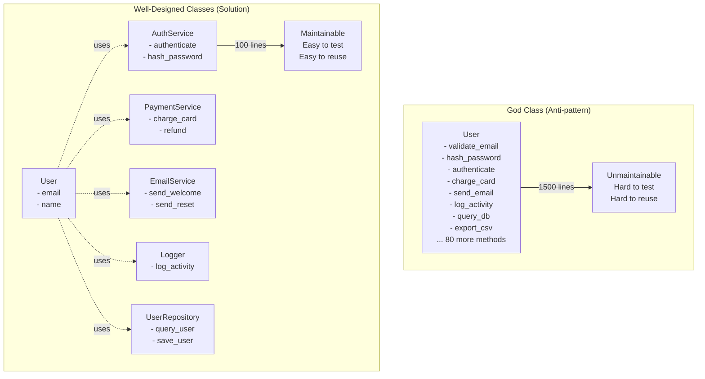

<Hero
  title="God Object / God Class"
  subtitle="One class doing too much with many responsibilities, violating single responsibility principle."
  imageAlt="God Object / God Class illustration"
  size="large"
/>

## TL;DR

A God Class does everything: user authentication, database access, payment processing, email notifications, and logging. It violates single responsibility principle, has 500+ lines, multiple reasons to change, and is impossible to test in isolation. Every change risks breaking unrelated features. Solution: decompose into single-responsibility classes (User, AuthService, PaymentService, NotificationService) each with one reason to change.

## Learning Objectives

You will be able to:
- Identify god class characteristics
- Apply single responsibility principle
- Decompose complex classes into cohesive units
- Design classes with clear boundaries
- Refactor legacy god classes systematically
- Measure class complexity objectively

## Motivating Scenario

You inherit a `User` class with 1500 lines:

```python
class User:
    def validate_email(self):      # User concern
    def hash_password(self):        # Auth concern
    def authenticate(self):         # Auth concern
    def charge_credit_card(self):   # Payment concern
    def send_welcome_email(self):   # Notification concern
    def log_activity(self):         # Logging concern
    def get_database_connection(self): # Database concern
    def query_user(self):          # Database concern
    def export_to_csv(self):       # Reporting concern
    # ... 80 more methods
```

Changing auth logic? Might break payment processing. Modifying logging? Could affect email sending. Testing a single method requires mocking 15 dependencies.

The class is unmaintainable because it violates SRP: "A class should have a single reason to change." This class has 10+ reasons.

## Core Explanation

**Why God Classes Form**

- **Easy Addition**: "Let's add payment to User class" feels simpler than creating new class
- **Lack of Refactoring**: Code accumulates without consolidation
- **Unclear Boundaries**: No one decides "this class is responsible for X only"
- **Convenience**: Everything in one place seems easier (it's not)

**Problems with God Classes**

1. **High Coupling**: Changes in one concern break others
2. **Hard to Test**: Tests need to mock everything
3. **Hard to Reuse**: Can't use payment logic without importing entire User class
4. **Hard to Understand**: New developers drown in complexity
5. **High Complexity**: Cyclomatic complexity through the roof

**Single Responsibility Principle**

"A class should have one reason to change."

A reason = a responsibility = a kind of change:
- User authentication changing? Auth logic changes.
- Payment processing changing? Payment logic changes.
- Email format changing? Email logic changes.

Each should be separate classes.

## Pattern Visualization

<Figure caption="God Class vs. Well-Designed Classes">

</Figure>

## Design Review Checklist

<Checklist items={[
  "Is the class > 200 lines?",
  "Does the class have 1 or many reasons to change?",
  "Could you remove a method and break unrelated functionality?",
  "Is the class constructor simple (< 5 parameters)?",
  "Can you name the class concisely (not User, Manager, Handler)?",
  "Are all methods used by the same callers?",
  "Can you test a single method without extensive mocking?",
  "Would removing functionality to another class be beneficial?",
  "Does the class depend on too many external systems?",
  "Are there clear cohesion groups (auth methods, payment methods, etc.)?"
]} />

## Signals of God Classes

| Red Flag | Example |
|----------|---------|
| > 500 lines | A class handling 10 responsibilities |
| Hard to name | `User`, `Manager`, `Handler`, `Processor` |
| Many dependencies | Constructor with 10+ parameters |
| Diverse methods | `authenticate()`, `sendEmail()`, `chargeCard()` |
| Everything uses it | Every part of code imports this class |
| Hard to mock | Tests need 20+ mocks |
| Frequent changes | Changes in one area break others |

## Refactoring Strategy

1. **Identify Responsibilities**: Group related methods
2. **Extract Classes**: Create new class for each group
3. **Move Methods**: Move methods to new classes
4. **Update Callers**: Redirect calls to new classes
5. **Test**: Ensure behavior unchanged
6. **Repeat**: Continue decomposing if needed

## Complete Refactoring Example

Let's refactor the monolithic `User` class from the motivating scenario step-by-step:

**Before (God Class - 1500 lines)**

```python
class User:
    def __init__(self, email, password, credit_card):
        self.email = email
        self.password_hash = self._hash_password(password)
        self.credit_card = credit_card
        self.db = DatabaseConnection.get_instance()

    # User concern
    def validate_email(self):
        # 50 lines of email validation
        pass

    # Auth concern
    def hash_password(self, password):
        # 30 lines of password hashing
        pass

    def authenticate(self, password):
        # 40 lines of auth logic
        pass

    # Payment concern
    def charge_credit_card(self, amount):
        # 100 lines of payment processing
        pass

    def refund_payment(self, transaction_id):
        # 80 lines of refund logic
        pass

    # Notification concern
    def send_welcome_email(self):
        # 60 lines of email sending
        pass

    def send_reset_email(self):
        # 60 lines of email logic
        pass

    # Logging concern
    def log_activity(self, action):
        # 50 lines of logging
        pass

    # Database concern
    def get_database_connection(self):
        # 30 lines of connection logic
        pass

    def query_user(self, user_id):
        # 40 lines of query logic
        pass

    # ... 80 more methods spread across 10+ responsibilities
```

**After (Well-Designed Classes)**

```python
# Domain model - single concern: user data
class User:
    def __init__(self, user_id: str, email: str, name: str):
        self.user_id = user_id
        self.email = email
        self.name = name

    def is_valid(self) -> bool:
        """Basic validation only"""
        return self.email and self.name

# Auth - single concern: authentication
class AuthService:
    def hash_password(self, password: str) -> str:
        return bcrypt.hashpw(password.encode(), bcrypt.gensalt(rounds=12))

    def verify_password(self, password: str, hash: str) -> bool:
        return bcrypt.checkpw(password.encode(), hash)

    def authenticate(self, email: str, password: str) -> Optional[User]:
        user = self.user_repo.find_by_email(email)
        if user and self.verify_password(password, user.password_hash):
            return user
        return None

# Payment - single concern: payment processing
class PaymentService:
    def charge(self, user_id: str, amount: float, card: Card) -> Transaction:
        transaction = self.processor.charge(card, amount)
        self.ledger.record_debit(user_id, amount, transaction.id)
        self.ledger.record_credit('company_account', amount, transaction.id)
        return transaction

    def refund(self, transaction_id: str) -> RefundRecord:
        original = self.transaction_repo.find(transaction_id)
        refund = self.processor.refund(transaction_id)
        # Reverse ledger entries
        return refund

# Notifications - single concern: sending emails
class NotificationService:
    def send_welcome(self, user: User) -> None:
        template = self.template_engine.render('welcome', {'user': user})
        self.email_provider.send(user.email, 'Welcome!', template)

    def send_password_reset(self, user: User, reset_token: str) -> None:
        template = self.template_engine.render('reset', {'token': reset_token})
        self.email_provider.send(user.email, 'Reset Password', template)

# Data access - single concern: persistence
class UserRepository:
    def find_by_id(self, user_id: str) -> Optional[User]:
        result = self.db.query('SELECT * FROM users WHERE id = ?', user_id)
        return self._map_to_user(result)

    def save(self, user: User) -> None:
        self.db.execute(
            'INSERT INTO users (id, email, name) VALUES (?, ?, ?)',
            user.user_id, user.email, user.name
        )

# Logging - single concern: audit trail
class ActivityLogger:
    def log(self, user_id: str, action: str, details: dict) -> None:
        entry = {
            'timestamp': datetime.now(),
            'user_id': user_id,
            'action': action,
            'details': details
        }
        self.logger.info(json.dumps(entry))

# Usage coordinating all services
class UserOnboardingService:
    def __init__(self, auth: AuthService, payment: PaymentService,
                 notification: NotificationService, user_repo: UserRepository,
                 logger: ActivityLogger):
        self.auth = auth
        self.payment = payment
        self.notification = notification
        self.user_repo = user_repo
        self.logger = logger

    def create_user(self, email: str, password: str, card: Card) -> User:
        # Each service handles its concern
        user = User(user_id=str(uuid4()), email=email, name=email.split('@')[0])
        user.password_hash = self.auth.hash_password(password)

        self.user_repo.save(user)
        self.logger.log(user.user_id, 'USER_CREATED', {'email': email})

        # Charge card
        transaction = self.payment.charge(user.user_id, 99.99, card)
        self.logger.log(user.user_id, 'PAYMENT_CHARGED', {'amount': 99.99})

        # Send welcome email
        self.notification.send_welcome(user)
        self.logger.log(user.user_id, 'EMAIL_SENT', {'type': 'welcome'})

        return user
```

**Benefits of Refactoring:**
- Each class has 50-150 lines (instead of 1500)
- Each class has one reason to change
- Testing: Mock a single service, not 10+ dependencies
- Reusability: PaymentService used by SubscriptionService, RefundService, etc.
- Maintainability: Developer working on auth doesn't touch payment code
- Scalability: PaymentService can be its own microservice

## Metrics for Detecting God Classes

Use these objective metrics to identify candidates for refactoring:

| Metric | Threshold | Why |
|--------|-----------|-----|
| Lines of Code | > 200-300 | Harder to understand, test, maintain |
| Number of Methods | > 15-20 | Too many responsibilities |
| Cyclomatic Complexity | > 10 | Too many decision paths |
| Number of Dependencies | > 5-6 | Too tightly coupled |
| Test Mocks Needed | > 8 | Can't test in isolation |
| Cohesion Score | < 0.5 | Methods not related |

Tools to measure:
- **Java**: Checkstyle, Sonar (detects god classes automatically)
- **Python**: Radon (cyclomatic complexity), Pylint (metrics)
- **JavaScript**: ESLint plugins, Code Climate
- **Go**: go-critic, gocyclo

## Common Scenarios

**Scenario: UserManager class**
```
UserManager
  - createUser()
  - deleteUser()
  - updateProfile()
  - changePassword()    ← Auth concern
  - resetPassword()
  - chargeUser()        ← Payment concern
  - sendEmail()         ← Notification concern
  - logActivity()       ← Logging concern
  - queryDatabase()     ← Data access concern
```
**Solution**: Extract AuthManager, PaymentService, EmailService, ActivityLog, UserRepository

**Scenario: RequestHandler class**
```
RequestHandler
  - parseRequest()
  - validateInput()
  - executeBusinessLogic()
  - formatResponse()
  - logMetrics()
  - handleErrors()
  - cacheResults()
  - publishEvents()
```
**Solution**: Chain of responsibility pattern, separate handlers for parsing/validation/business logic/formatting

## One Takeaway

<Callout tone="info">
One reason to change per class. When you can't explain a class in one sentence without using "and", it's a god class. Extract ruthlessly; small, focused classes are easier to test, reuse, and maintain.
</Callout>

## Self-Check Questions

1. **How do you identify god classes in a codebase?** Look for classes > 200 lines, > 15 methods, or classes you can't name concisely (User, Manager, Handler are red flags).

2. **What's the relationship between god classes and technical debt?** God classes are technical debt. They slow down development, increase bugs, and make testing expensive. Refactoring pays back quickly.

3. **When is it acceptable to have a large class?** Rarely. Even data objects should delegate behavior to services. If you must be large, at least group methods into inner classes or mixins.

## Next Steps

1. **Identify** god classes in your codebase (use metrics above)
2. **Analyze** which methods belong together (group by concern)
3. **Extract** each concern into its own class
4. **Test** each extracted class independently
5. **Refactor** callers to use new classes
6. **Document** new interfaces and contracts

## References

1. <a href="https://www.martinfowler.com/bliki/GodClass.html" target="_blank" rel="nofollow noopener noreferrer">Martin Fowler - God Class ↗️</a>
2. <a href="https://en.wikipedia.org/wiki/Single-responsibility_principle" target="_blank" rel="nofollow noopener noreferrer">Single Responsibility Principle ↗️</a>
3. <a href="https://refactoring.guru/extract-class" target="_blank" rel="nofollow noopener noreferrer">Refactoring: Extract Class ↗️</a>
4. <a href="https://www.cleancode.dev/" target="_blank" rel="nofollow noopener noreferrer">Clean Code Principles ↗️</a>
5. <a href="https://github.com/savonrb/gocyclo" target="_blank" rel="nofollow noopener noreferrer">Cyclomatic Complexity Tools ↗️</a>
