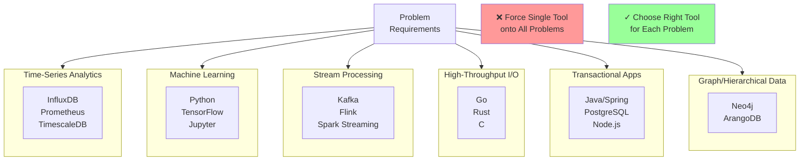

<Hero
  title="Golden Hammer"
  subtitle="Using one familiar solution for every problem, even when better alternatives exist."
  imageAlt="Golden Hammer illustration"
  size="large"
/>

## TL;DR

The Golden Hammer: every problem looks like a nail when you only have a hammer. Using SQL for time-series data (designed for graphs). Using Microservices for a 3-person startup's CRUD app. Always picking Java/Spring because that's what the team knows, regardless of fit. The tool becomes familiar, so it's reused everywhere, even where better alternatives exist. Solution: evaluate each problem's actual requirements and choose the right tool, not the familiar one.

## Learning Objectives

You will be able to:
- Evaluate problem requirements objectively
- Assess tool fitness for specific problems
- Recognize when familiarity biases tool selection
- Apply polyglot programming principles
- Understand technology tradeoffs
- Build case for tool diversity on teams

## Motivating Scenario

Your company is a Java/Spring Boot shop. Three problems arrive:

**Problem 1: Real-time Analytics**
Need to aggregate 1M events/second into dashboards. The team says: "Let's use Spring Boot with a PostgreSQL database."

Spring Boot is great for APIs. PostgreSQL is great for transactional data. But real-time analytics at 1M events/second? PostgreSQL becomes a bottleneck. Streaming platforms (Kafka, Flink) exist for this problem. Better choice: Kafka + Flink pipeline (can be implemented in any language).

**Problem 2: Machine Learning Model Training**
Need to train recommendation models from 10GB of user data. The team says: "Let's do it in Java."

Java works, but Python with scikit-learn/TensorFlow is 10x faster to develop ML models. Better choice: Python + Jupyter for prototyping, then optimize critical paths if needed.

**Problem 3: High-Throughput Network Handler**
Need to handle 1M concurrent connections. The team says: "Spring Boot REST API."

Spring has overhead suitable for business logic, not raw I/O. Go or Rust handle concurrency much more efficiently. Better choice: Go (simple concurrency model) or Rust (memory safety at scale).

By forcing Java/Spring onto all problems, you:
- Build suboptimal systems
- Take longer to deliver
- Hire only Java developers (limiting team diversity)
- Miss opportunities to learn new tools

## Core Explanation

**Why Golden Hammer Happens**

1. **Competence Bias**: You're good at Java, so Java feels safe
2. **Sunk Cost**: The team knows Spring, training is sunk cost
3. **Risk Aversion**: Unknown tools feel riskier (they're not)
4. **Organizational Momentum**: "We always do it this way"
5. **Hiring Constraints**: Limited to Java engineers

**The Costs**

- **Wrong Tool for Job**: Suboptimal performance, complex solutions
- **Slower Development**: Forcing a framework onto a problem
- **Technical Debt**: Building on weak foundations
- **Team Stagnation**: Never learning new approaches
- **Hiring Limitations**: Only candidates who know Java

**The Right Approach**

Evaluate each problem:
1. **What are the requirements?** (throughput, latency, scale)
2. **Is the chosen tool designed for this?**
3. **What are alternatives?**
4. **What are the tradeoffs?**
5. **Choose the best fit, not the familiar tool**

## Problem-Tool Fit Analysis

<Figure caption="Tools Designed for Different Problems">

</Figure>

## Technology Selection Examples

| Problem | Golden Hammer ❌ | Right Tool ✓ |
|---------|----------------|------------|
| Real-time streaming analytics | SQL database | Kafka + Flink |
| Machine learning models | Custom Java implementation | Python + TensorFlow |
| High-concurrency network service | Spring Boot | Go or Rust |
| Graph queries (friends, relationships) | SQL joins | Neo4j |
| Time-series data | PostgreSQL with timestamps | InfluxDB or TimescaleDB |
| Data transformation pipeline | Custom Java code | Apache Spark or Airflow |
| Real-time search | Custom SQL queries | Elasticsearch |
| Mobile app backend | REST API in Java | GraphQL or Firebase |

## Design Review Checklist

<Checklist items={[
  "Were alternative technologies evaluated for this problem?",
  "Is the chosen technology designed for this use case?",
  "Are there documented reasons why this tool is best?",
  "Would a different tool be significantly better?",
  "Is familiarity the main reason for this choice?",
  "Have performance requirements been met by this tool?",
  "Are there hiring/training costs with this choice?",
  "Could this be a polyglot opportunity?",
  "Have you consulted team expertise in other languages?",
  "Is the team willing to learn new tools for better solutions?"
]} />

## Showcase

<Showcase
  title="Signals of Golden Hammer"
  sections={[
    {label: "Anti-Signals (Problems)", body: "- Forcing one tool onto all problems\n- Familiarity as primary selection criterion\n- Suboptimal performance from wrong tool\n- Complex workarounds to fit square peg in round hole\n- Team only knows one language/framework", tone: "warning"}, {label: "Healthy Signals (Solutions)", body: "- Tool selection based on problem requirements\n- Multiple technologies in production as appropriate\n- Team with polyglot skills\n- Willingness to learn new tools\n- Right tool for each job, not familiar tool", tone: "positive"}
  ]}
/>

## Self-Check

1. **Why did you choose this technology?** If answer is "that's what we always use," red flag.

2. **Would a different tool be significantly better?** If yes, make the case for it.

3. **Is familiarity preventing better solutions?** If yes, explore alternatives.

## Next Steps

- **Evaluate**: For your next project, list 3 alternative technologies
- **Research**: Understand why each exists and what problems it solves
- **Experiment**: Pick one less-familiar tool and build a prototype
- **Learn**: Invest in team learning beyond comfort zone
- **Diversify**: Intentionally adopt polyglot approach

## Frameworks for Tool Evaluation

### Build-Measure-Learn Framework

Use data to guide technology decisions:

1. **Build**: Prototype solution with your familiar tool
2. **Measure**: Benchmark against requirements (latency, throughput, cost)
3. **Learn**: Compare results to alternative tools
4. **Decide**: Choose tool with best metrics, not familiarity

Example: Real-time analytics platform comparison

| Metric | Spring Boot + PostgreSQL | Kafka + Flink | InfluxDB + Grafana |
|--------|------------------------|---------------|--------------------|
| Throughput (events/sec) | 10K | 1M | 500K |
| Latency (p99) | 500ms | 100ms | 50ms |
| Development time | 1 week | 2 weeks | 3 days |
| Operational complexity | Low | High | Medium |
| Cost at scale | $$$$ | $$$ | $$ |

**Result**: For high-throughput analytics, Kafka + Flink is better despite longer development time.

### Technology Radar

Organize tools by maturity and applicability:

```
┌─────────────────────────────────────┐
│ Technology Radar                    │
├─────────────────────────────────────┤
│ ADOPT (Proven, use widely)          │
│  ✓ PostgreSQL (OLTP)                │
│  ✓ Java/Spring (business logic)     │
│  ✓ Docker (containerization)        │
│                                     │
│ TRIAL (Promising, limited use)      │
│  ◆ Go (high-throughput services)    │
│  ◆ GraphQL (alternative to REST)    │
│  ◆ Kubernetes (orchestration)       │
│                                     │
│ ASSESS (Interesting, evaluate)      │
│  ◇ Rust (systems programming)       │
│  ◇ WebAssembly (edge compute)       │
│  ◇ eBPF (kernel observability)      │
│                                     │
│ HOLD (Avoid for new projects)       │
│  ✗ Monolithic architectures         │
│  ✗ Manual deployment                │
│  ✗ Centralized logging              │
└─────────────────────────────────────┘
```

## Real-World Recovery: From Golden Hammer to Polyglot

**Before**: Java/Spring shop with single database

- All problems solved with Java: batch jobs, real-time pipelines, mobile backends
- Performance suffers; hiring limited to Java developers
- Time-to-market increases as Java is forced onto unsuitable problems

**Transition**:

1. **Identify mismatch**: Real-time analytics performance unacceptable
2. **Evaluate alternatives**: Kafka, Spark, Flink
3. **Pilot project**: Small team learns Kafka + Spark for one analytics feature
4. **Gradual adoption**: New projects can choose tools based on requirements
5. **Team investment**: Hiring Java engineers + Python data engineers + Go infrastructure engineers

**After**: Polyglot organization

- Java for business logic and transactional systems (best fit)
- Python for data science and analytics (best fit)
- Go for infrastructure and networking (best fit)
- Each team owns their technology choices within governance boundaries
- Faster feature delivery; better performance; broader talent pool

## Anti-Pattern Recognition Checklist

Ask yourself these questions to detect golden hammer before it's too late:

- **Are we choosing this tool because we already know it?** Red flag.
- **Would a different tool meet requirements better?** Red flag if answer is yes.
- **Are we forcing workarounds to fit this tool to the problem?** Red flag.
- **Is our team only hiring people who know this tool?** Red flag (team monoculture).
- **Are performance/cost metrics worse than alternatives?** Red flag.
- **Would switching tools reduce complexity?** Consider switching.
- **Does this tool make future maintenance harder?** Red flag.
- **Is the learning curve for alternatives reasonable?** Consider it as positive signal.

## Action Plan for Change

If you recognize golden hammer in your organization:

1. **Acknowledge**: Familiarity is comfortable but limits options. This is human nature, not a failure.

2. **Build the case**: Document where current tool performs poorly. Show metrics.

3. **Prototype**: Have team members prototype with alternative tools. Reduce "unknown risk" through hands-on experience.

4. **Gradual adoption**: Don't replace everything overnight. Use new tool for appropriate subset of problems.

5. **Invest in training**: Budget time for team to learn new tools. Pair experienced developers with learning developers.

6. **Celebrate diversity**: When you adopt a second technology successfully, celebrate the win. It signals growth.

7. **Document decisions**: Write down why you chose each technology. Revisit annually; allow changing minds based on new data.

## One Takeaway

<Callout tone="info">
The best tool is the one designed for your problem, not the one you already know. Learning new tools makes you a better engineer. Organizational success depends on polyglot skills, not mono-culture.
</Callout>

## References

1. <a href="https://en.wikipedia.org/wiki/Golden_hammer" target="_blank" rel="nofollow noopener noreferrer">Golden Hammer Anti-Pattern ↗️</a>
2. <a href="https://www.thoughtworks.com/radar" target="_blank" rel="nofollow noopener noreferrer">ThoughtWorks Technology Radar ↗️</a>
3. <a href="https://www.allthingsdistributed.com/2010/03/polyglot-programming.html" target="_blank" rel="nofollow noopener noreferrer">Polyglot Programming ↗️</a>
4. <a href="https://www.martinfowler.com/articles/patterns-of-distributed-systems/index.html" target="_blank" rel="nofollow noopener noreferrer">Patterns of Distributed Systems ↗️</a>
