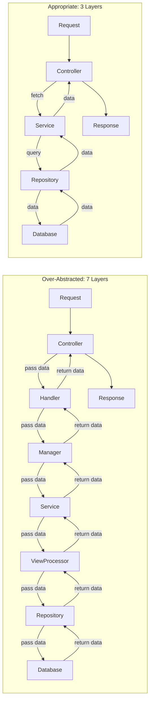

<Hero
  title="Over-Abstracting: Too Many Layers"
  subtitle="Adding abstraction layers beyond what's needed, reducing clarity."
  imageAlt="Over-Abstracting: Too Many Layers illustration"
  size="large"
/>

## TL;DR

Over-abstracting creates unnecessary indirection that makes code harder to follow without providing real benefits. A request passes through 8+ layers before doing anything useful. Simple tasks require understanding 15 files. Speculative abstractions "just in case" we need them later add complexity without solving current problems. The solution: use abstraction only when it solves an actual problem, keep architectures flat (2-3 layers), and resist the urge to abstract prematurely.

## Learning Objectives

You will be able to:
- Identify when abstraction adds value vs. when it adds complexity
- Design layered architectures with minimal indirection
- Understand the costs of each abstraction layer
- Refactor over-abstracted code back to simplicity
- Apply YAGNI (You Aren't Gonna Need It) principle to architecture
- Balance flexibility with understandability

## Motivating Scenario

You need to fetch a user's data and render it. In an over-abstracted codebase:

```
1. HTTP request arrives at Controller
2. Controller calls Handler
3. Handler calls Manager
4. Manager calls Service
5. Service calls Repository
6. Repository calls Mapper
7. Mapper calls Converter
8. Converter calls the Database
9. Returns back through 7 layers
```

Following this code path requires opening 15 files. Each layer does almost nothing—passes data, transforms it slightly, and passes it to the next layer. This is indirection without purpose.

Debugging is a nightmare. User says "the data is wrong." You trace through 8 layers. Each layer looks correct. By the time you reach the database, you've lost track of the original bug.

A simpler design:

```
1. Controller calls Service
2. Service queries Repository
3. Repository calls Database
```

Same functionality, 3 files instead of 15, clear data flow.

## Core Explanation

**Abstraction Has a Cost**

Each layer adds:
- **Mental Overhead**: One more thing to understand
- **Indirection**: Code path is harder to follow
- **Testing Complexity**: More mocks, more test setup
- **Performance**: Additional function calls (negligible but not zero)
- **Maintenance**: Another place to change when requirements evolve

Abstraction only pays for itself if the benefit exceeds the cost.

**When Abstraction Adds Value**

1. **Code Reuse**: Same logic needed in 3+ places
2. **Complexity Isolation**: A complex concern deserves its own layer
3. **Testing**: Mocking dependencies improves testability
4. **Future Flexibility**: Likely future changes (based on actual requirements, not speculation)

**Speculative Abstraction**

"We might need a Converter layer someday." This is speculation. Speculative abstraction:
- Solves problems that don't exist yet
- Adds complexity to the current system
- Often wrong (you don't actually need it later, or you need something different)
- Delays actual feature work

Rule: Don't abstract until you have 2-3 real use cases demanding it.

## Pattern Visualization

<Figure caption="Over-Abstraction vs. Appropriate Abstraction">

</Figure>

## Code Examples

<Tabs>
  <TabItem value="python" label="Python">
    <Tabs>
      <TabItem value="bad" label="Over-Abstracted (Anti-pattern)">
        ```python title="user_module.py" showLineNumbers
        # usercontroller.py
        class UserController:
            def __init__(self):
                self.handler = UserHandler()

            def get_user(self, user_id):
                return self.handler.handle_get_user(user_id)

        # userhandler.py
        class UserHandler:
            def __init__(self):
                self.manager = UserManager()

            def handle_get_user(self, user_id):
                return self.manager.manage_get_user(user_id)

        # usermanager.py
        class UserManager:
            def __init__(self):
                self.service = UserService()

            def manage_get_user(self, user_id):
                return self.service.get_user(user_id)

        # userservice.py
        class UserService:
            def __init__(self):
                self.processor = UserProcessor()

            def get_user(self, user_id):
                return self.processor.process_user_data(user_id)

        # userprocessor.py
        class UserProcessor:
            def __init__(self):
                self.repository = UserRepository()
                self.mapper = UserMapper()

            def process_user_data(self, user_id):
                user = self.repository.get_user(user_id)
                return self.mapper.map_user(user)

        # usermapper.py
        class UserMapper:
            def __init__(self):
                self.converter = UserConverter()

            def map_user(self, user):
                return self.converter.convert(user)

        # userconverter.py
        class UserConverter:
            def convert(self, user):
                return {
                    'id': user.id,
                    'name': user.name,
                    'email': user.email
                }

        # userrepository.py
        class UserRepository:
            def get_user(self, user_id):
                # Fetch from database
                return database.query('SELECT * FROM users WHERE id = ?', user_id)

        # To fetch a user:
        # Request → Controller → Handler → Manager → Service → Processor
        #           → Mapper → Converter → Repository → Database
        # That's 8 layers, each doing almost nothing!
        ```
      </TabItem>
      <TabItem value="good" label="Simplified (Solution)">
        ```python title="user_module.py" showLineNumbers
        from dataclasses import dataclass

        @dataclass
        class User:
            id: str
            name: str
            email: str

        class UserRepository:
            """Data access layer"""
            def get_user(self, user_id: str) -> User:
                # Fetch from database and return User object
                row = database.query('SELECT * FROM users WHERE id = ?', user_id)
                if not row:
                    return None
                return User(id=row['id'], name=row['name'], email=row['email'])

        class UserService:
            """Business logic layer"""
            def __init__(self):
                self.repository = UserRepository()

            def get_user(self, user_id: str) -> User:
                user = self.repository.get_user(user_id)
                if not user:
                    raise UserNotFoundError(f'User {user_id} not found')
                return user

        # usercontroller.py
        class UserController:
            """HTTP layer"""
            def __init__(self):
                self.service = UserService()

            def get_user(self, user_id: str) -> dict:
                user = self.service.get_user(user_id)
                return {
                    'id': user.id,
                    'name': user.name,
                    'email': user.email
                }

        # To fetch a user:
        # Request → Controller → Service → Repository → Database
        # That's 3 layers, each with a clear responsibility.
        # Code is easy to follow and understand.

        # Usage
        controller = UserController()
        result = controller.get_user('user123')
        print(result)  # {'id': 'user123', 'name': 'John', 'email': 'john@example.com'}

        # Testing is simple:
        def test_get_user():
            # Mock only the repository
            service = UserService()
            service.repository = MockUserRepository()
            result = service.get_user('user123')
            assert result.name == 'John'
        ```
      </TabItem>
    </Tabs>
  </TabItem>
  <TabItem value="go" label="Go">
    <Tabs>
      <TabItem value="bad" label="Over-Abstracted (Anti-pattern)">
        ```go title="user_module.go" showLineNumbers
        package user

        // usercontroller.go
        type UserController struct {
            handler *UserHandler
        }

        func (uc *UserController) GetUser(userID string) map[string]interface{} {
            return uc.handler.HandleGetUser(userID)
        }

        // userhandler.go
        type UserHandler struct {
            manager *UserManager
        }

        func (uh *UserHandler) HandleGetUser(userID string) map[string]interface{} {
            return uh.manager.ManageGetUser(userID)
        }

        // usermanager.go
        type UserManager struct {
            service *UserService
        }

        func (um *UserManager) ManageGetUser(userID string) map[string]interface{} {
            return um.service.GetUser(userID)
        }

        // userservice.go
        type UserService struct {
            processor *UserProcessor
        }

        func (us *UserService) GetUser(userID string) map[string]interface{} {
            return us.processor.ProcessUserData(userID)
        }

        // userprocessor.go
        type UserProcessor struct {
            repository *UserRepository
            mapper     *UserMapper
        }

        func (up *UserProcessor) ProcessUserData(userID string) map[string]interface{} {
            user := up.repository.GetUser(userID)
            return up.mapper.MapUser(user)
        }

        // usermapper.go
        type UserMapper struct {
            converter *UserConverter
        }

        func (um *UserMapper) MapUser(user *User) map[string]interface{} {
            return um.converter.Convert(user)
        }

        // userconverter.go
        type UserConverter struct{}

        func (uc *UserConverter) Convert(user *User) map[string]interface{} {
            return map[string]interface{}{
                "id":    user.ID,
                "name":  user.Name,
                "email": user.Email,
            }
        }

        // userrepository.go
        type UserRepository struct{}

        func (ur *UserRepository) GetUser(userID string) *User {
            // Fetch from database
            return database.QueryUser(userID)
        }

        // 8 layers! Each just passes data to the next.
        ```
      </TabItem>
      <TabItem value="good" label="Simplified (Solution)">
        ```go title="user_module.go" showLineNumbers
        package user

        type User struct {
            ID    string
            Name  string
            Email string
        }

        // userrepository.go
        type UserRepository struct {
            // Database connection
        }

        func (ur *UserRepository) GetUser(userID string) (*User, error) {
            row := database.Query("SELECT id, name, email FROM users WHERE id = ?", userID)
            if row == nil {
                return nil, errors.New("user not found")
            }
            return &User{
                ID:    row["id"].(string),
                Name:  row["name"].(string),
                Email: row["email"].(string),
            }, nil
        }

        // userservice.go
        type UserService struct {
            repository *UserRepository
        }

        func NewUserService(repo *UserRepository) *UserService {
            return &UserService{repository: repo}
        }

        func (us *UserService) GetUser(userID string) (*User, error) {
            user, err := us.repository.GetUser(userID)
            if err != nil {
                return nil, fmt.Errorf("failed to get user: %w", err)
            }
            if user == nil {
                return nil, errors.New("user not found")
            }
            return user, nil
        }

        // usercontroller.go
        type UserController struct {
            service *UserService
        }

        func NewUserController(service *UserService) *UserController {
            return &UserController{service: service}
        }

        func (uc *UserController) GetUser(userID string) (map[string]interface{}, error) {
            user, err := uc.service.GetUser(userID)
            if err != nil {
                return nil, err
            }

            return map[string]interface{}{
                "id":    user.ID,
                "name":  user.Name,
                "email": user.Email,
            }, nil
        }

        // Usage: Request → Controller → Service → Repository → Database
        // 3 layers, each with clear responsibility.

        func main() {
            repo := &UserRepository{}
            service := NewUserService(repo)
            controller := NewUserController(service)

            result, err := controller.GetUser("user123")
            if err != nil {
                log.Fatal(err)
            }
            fmt.Println(result)
        }

        // Testing is simple - mock only what you need
        func TestGetUser(t *testing.T) {
            mockRepo := &MockUserRepository{
                user: &User{ID: "123", Name: "John", Email: "john@example.com"},
            }
            service := NewUserService(mockRepo)
            user, _ := service.GetUser("123")
            assert.Equal(t, "John", user.Name)
        }
        ```
      </TabItem>
    </Tabs>
  </TabItem>
  <TabItem value="nodejs" label="Node.js">
    <Tabs>
      <TabItem value="bad" label="Over-Abstracted (Anti-pattern)">
        ```javascript title="user-module.js" showLineNumbers
        // userController.js
        class UserController {
            constructor() {
                this.handler = new UserHandler();
            }

            getUser(userId) {
                return this.handler.handleGetUser(userId);
            }
        }

        // userHandler.js
        class UserHandler {
            constructor() {
                this.manager = new UserManager();
            }

            handleGetUser(userId) {
                return this.manager.manageGetUser(userId);
            }
        }

        // userManager.js
        class UserManager {
            constructor() {
                this.service = new UserService();
            }

            manageGetUser(userId) {
                return this.service.getUser(userId);
            }
        }

        // userService.js
        class UserService {
            constructor() {
                this.processor = new UserProcessor();
            }

            getUser(userId) {
                return this.processor.processUserData(userId);
            }
        }

        // userProcessor.js
        class UserProcessor {
            constructor() {
                this.repository = new UserRepository();
                this.mapper = new UserMapper();
            }

            processUserData(userId) {
                const user = this.repository.getUser(userId);
                return this.mapper.mapUser(user);
            }
        }

        // userMapper.js
        class UserMapper {
            constructor() {
                this.converter = new UserConverter();
            }

            mapUser(user) {
                return this.converter.convert(user);
            }
        }

        // userConverter.js
        class UserConverter {
            convert(user) {
                return {
                    id: user.id,
                    name: user.name,
                    email: user.email
                };
            }
        }

        // userRepository.js
        class UserRepository {
            getUser(userId) {
                return database.query('SELECT * FROM users WHERE id = ?', userId);
            }
        }

        // 8 layers of indirection! Each layer just passes data.
        const controller = new UserController();
        const result = controller.getUser('user123');
        ```
      </TabItem>
      <TabItem value="good" label="Simplified (Solution)">
        ```javascript title="user-module.js" showLineNumbers
        // user.js
        class User {
            constructor(id, name, email) {
                this.id = id;
                this.name = name;
                this.email = email;
            }
        }

        // userRepository.js
        class UserRepository {
            getUser(userId) {
                const row = database.query('SELECT * FROM users WHERE id = ?', userId);
                if (!row) return null;
                return new User(row.id, row.name, row.email);
            }
        }

        // userService.js
        class UserService {
            constructor(repository) {
                this.repository = repository;
            }

            getUser(userId) {
                const user = this.repository.getUser(userId);
                if (!user) {
                    throw new Error(`User ${userId} not found`);
                }
                return user;
            }
        }

        // userController.js
        class UserController {
            constructor(service) {
                this.service = service;
            }

            getUser(userId) {
                const user = this.service.getUser(userId);
                return {
                    id: user.id,
                    name: user.name,
                    email: user.email
                };
            }
        }

        // Usage: Request → Controller → Service → Repository → Database
        // 3 layers, clear responsibility, easy to understand.

        const repository = new UserRepository();
        const service = new UserService(repository);
        const controller = new UserController(service);

        const result = controller.getUser('user123');
        console.log(result);

        // Testing is simple
        describe('UserService', () => {
            it('should get user', () => {
                const mockRepo = { getUser: () => new User('1', 'John', 'john@example.com') };
                const service = new UserService(mockRepo);
                const user = service.getUser('1');
                expect(user.name).toBe('John');
            });
        });

        module.exports = { User, UserRepository, UserService, UserController };
        ```
      </TabItem>
    </Tabs>
  </TabItem>
</Tabs>

## Patterns and Pitfalls

### Why Over-Abstraction Happens

**1. Pattern Enthusiasm**
After learning design patterns, developers want to use them everywhere. "We should have a Manager layer!" without asking if we need one.

**2. Enterprise Architecture Cargo Cult**
Copying large systems' architecture without understanding context. Big systems have many layers for good reasons (scaling, team distribution, legacy constraints).

**3. Future-Proofing Anxiety**
"What if we need to swap the database?" Add an abstraction layer just in case. But you don't swap databases. The abstraction stays forever.

**4. Avoiding Refactoring**
It feels easier to add a new layer than to refactor existing code. Layers accumulate.

### The YAGNI Principle

**"You Aren't Gonna Need It"**

Build what you need now, not what you might need someday. Resist speculative abstraction. If you later need abstraction, you can refactor.

The cost of adding abstraction later (when you know you need it) is lower than the cost of carrying unnecessary abstraction forever.

## When This Happens / How to Detect

**Red Flags:**

1. A request flows through 5+ classes to do something simple
2. You have classes like `Handler`, `Manager`, `Processor` that just pass data
3. No one understands why a layer exists
4. Tests require mocking 8+ dependencies for one assertion
5. Adding a feature requires changes in 6+ files
6. One layer has no business logic, just delegation
7. There's a "converter" layer that does string-to-object conversion
8. Comments like "This layer exists for future flexibility"

**Measurement:**

Count the layers for a simple user story:

```
Simple change: GET /users/123 and return JSON

Layers touched:
1. HttpHandler
2. RequestRouter
3. Controller
4. Handler
5. Manager
6. Service
7. DataProcessor
8. Repository
9. Database

Should be: Controller → Service → Repository
```

## How to Fix / Refactor

### Step 1: Trace a Request

Pick a simple user story and trace the code path:

```javascript
controller.getUser(123)
  → handler.handleGetUser(123)
    → manager.manageGetUser(123)
      → service.getUser(123)
        → processor.processUser(123)
          → mapper.mapUser(...)
            → converter.convert(...)
              → repository.getUser(123)
```

Count the layers (8).

### Step 2: Evaluate Each Layer

Does this layer:
- Solve a real problem?
- Hide complexity?
- Enable code reuse?
- Enable testing?

If none of these, mark it for removal.

### Step 3: Consolidate

Merge related layers:

```javascript
// Before
controller.getUser → handler.handleGetUser → manager.manageGetUser

// After
controller.getUser (handler and manager logic are inlined)
```

### Step 4: Test After Each Change

Ensure behavior is preserved. Integration tests verify the change is correct.

## Operational Considerations

**Refactoring Legacy Over-Abstraction**

Use the "bubble up" technique:
1. The top layer directly calls the bottom layer (skipping middle layers)
2. If tests still pass, the middle layer was unnecessary
3. Remove it
4. Repeat

**Knowing When to Backfill Abstraction**

When you have 3+ similar operations needing the same abstraction, create it. Not before.

## Design Review Checklist

<Checklist items={[
  "Is the request path through 3 or fewer layers?",
  "Does each layer have a clear, single responsibility?",
  "Are there any layers that just pass data without transforming?",
  "Can tests mock only the dependencies they need (< 3 mocks)?",
  "Are all layers used by actual features, not speculative?",
  "Is there duplicate business logic across layers?",
  "Can a new developer understand the layer structure in 10 minutes?",
  "Would removing any layer break functionality?",
  "Are layers justified by actual requirements, not future speculation?",
  "Is the architecture simpler than the problem it solves?"
]} />

## Showcase

<Showcase
  title="Signals of Over-Abstraction"
  sections={[
    {label: "Anti-Signals (Problems)", body: "- Request flows through 7+ layers\n- Classes like Handler, Manager, Processor doing delegation only\n- Layer exists 'for future flexibility'\n- Tests mock 10+ dependencies\n- Adding feature requires changes in 6+ files\n- Hard to explain what a layer does", tone: "warning"}, {label: "Healthy Signals (Solutions)", body: "- Request flows through 2-3 layers\n- Each class/layer has clear responsibility\n- Layers solve actual, current problems\n- Tests mock 1-2 dependencies\n- Feature changes localized to 1-2 layers\n- Layers are easy to explain and understand", tone: "positive"}
  ]}
/>

## Self-Check

1. **Can you explain what each layer does in one sentence?** If a layer's purpose is vague, it might be unnecessary.

2. **How many layers does a GET request pass through?** If > 3, likely over-abstracted.

3. **Would removing a layer break functionality or just make code less maintainable?** If it would break things, it's necessary. If removing it just requires minor refactoring, it was unnecessary.

## Next Steps

- **Map**: Trace a simple request through your codebase
- **Count**: How many layers does it pass through?
- **Evaluate**: Does each layer solve a problem?
- **Consolidate**: Merge unnecessary layers
- **Test**: Ensure behavior is unchanged after refactoring

## One Takeaway

<Callout tone="info">
Don't abstract for flexibility you don't yet need. Build what solves today's problem. When you have 2-3 real use cases, then abstract.
</Callout>

## References

1. <a href="https://en.wikipedia.org/wiki/You_aren%27t_gonna_need_it" target="_blank" rel="nofollow noopener noreferrer">YAGNI: You Aren't Gonna Need It ↗️</a>
2. <a href="https://refactoring.guru/refactoring/techniques/extract-method" target="_blank" rel="nofollow noopener noreferrer">Extract Method Pattern ↗️</a>
3. <a href="https://www.martinfowler.com/articles/patterns-of-distributed-systems/" target="_blank" rel="nofollow noopener noreferrer">Patterns of Distributed Systems ↗️</a>
4. <a href="https://en.wikipedia.org/wiki/Indirection" target="_blank" rel="nofollow noopener noreferrer">Indirection in Software Design ↗️</a>
