<Hero
  title="Spaghetti Code"
  subtitle="Complex, tangled control flow without clear structure, making code hard to understand and modify."
  imageAlt="Spaghetti Code illustration"
  size="large"
/>

## TL;DR

Spaghetti code has deeply nested conditionals, tangled control flow, and unclear logic paths that are hard to follow. Functions with 500+ lines of nested ifs and loops require readers to mentally track complex state. This makes debugging a nightmare and changing the code risky. Solution: use guard clauses to flatten nesting, extract methods to clarify intent, and keep functions short and focused.

## Learning Objectives

You will be able to:
- Identify spaghetti code patterns in your codebase
- Understand why deeply nested code is hard to maintain
- Apply guard clauses to eliminate nested conditionals
- Extract methods to clarify intent and reduce complexity
- Measure code complexity with objective metrics
- Refactor legacy spaghetti code systematically

## Motivating Scenario

You inherit a legacy `processOrder` function. It's 800 lines long. The logic looks like:

```
if condition1
  if condition2
    if condition3
      if condition4
        do something
      else
        do another thing
      endif
    else
      do third thing
    endif
  else
    if condition5
      do fourth thing
    else
      if condition6
        do fifth thing
      endif
    endif
  endif
else
  if condition7
    do sixth thing
  endif
endif
```

Reading this requires holding 4-5 conditions in your mind simultaneously. Find a bug? Good luck figuring out which of the 12 possible code paths is executing.

Someone needs to add a new validation rule. Where does it go? They make a change, and three unrelated features break. No one knows why—the function is too complex to reason about.

Three weeks of debugging later, you realize: this function does too much and is structured in the worst possible way.

## Core Explanation

**What Makes Code Spaghetti?**

Spaghetti code has these characteristics:

1. **Deeply Nested Conditionals**: 3+ levels of if/else/for/while
2. **Long Functions**: 200+ lines doing unrelated things
3. **Unclear Intent**: Names like `process()`, `handle()`, `doStuff()`
4. **Tangled Logic**: Data flows unpredictably through the function
5. **Hard to Test**: Can't test individual paths without massive setup
6. **No Cohesion**: The function does 5 unrelated things

**Why Nesting Kills Readability**

Each nesting level adds cognitive load:
- 1 level: Easy to understand (one path)
- 2 levels: Still manageable (2 branches to track)
- 3 levels: Hard (8 possible paths)
- 4 levels: Very hard (16 possible paths)
- 5+ levels: Impossible (32+ paths)

Your brain can't hold 32 execution paths in memory at once.

**Cyclomatic Complexity**

A metric that measures code paths:
- CC = 1-5: Simple, easy to test
- CC = 6-10: Moderate, getting hard to test
- CC = 11-20: Complex, testing difficult
- CC > 20: Unmaintainable

A typical spaghetti function has CC = 40+.

## Pattern Visualization

```mermaid
flowchart TB
    subgraph Spaghetti["Spaghetti Code: Deeply Nested"]
        Start["Start: processOrder"]
        C1{"Check<br/>customer<br/>valid?"}
        N1["No: error"]
        Y1["Yes"]
        C2{"Check<br/>items<br/>exist?"}
        N2["No: error"]
        Y2["Yes"]
        C3{"Check<br/>stock<br/>available?"}
        N3["No: error"]
        Y3["Yes"]
        C4{"Check<br/>payment<br/>valid?"}
        N4["No: error"]
        Y4["Yes"]
        Process["Process order"]
        End["Return result"]

        Start --> C1
        C1 -->|No| N1
        C1 -->|Yes| Y1
        Y1 --> C2
        C2 -->|No| N2
        C2 -->|Yes| Y2
        Y2 --> C3
        C3 -->|No| N3
        C3 -->|Yes| Y3
        Y3 --> C4
        C4 -->|No| N4
        C4 -->|Yes| Y4
        Y4 --> Process
        N1 --> End
        N2 --> End
        N3 --> End
        N4 --> End
        Process --> End
    end

    subgraph Clean["Clean Code: Guard Clauses"]
        CStart["Start: processOrder"]
        Guard1{"Customer valid?"}
        Guard1No["Return error"]
        Guard1Yes["Continue"]
        Guard2{"Items exist?"}
        Guard2No["Return error"]
        Guard2Yes["Continue"]
        Guard3{"Stock available?"}
        Guard3No["Return error"]
        Guard3Yes["Continue"]
        Guard4{"Payment valid?"}
        Guard4No["Return error"]
        Guard4Yes["Process order"]
        CEnd["Return result"]

        CStart --> Guard1
        Guard1 -->|No| Guard1No
        Guard1 -->|Yes| Guard1Yes
        Guard1No --> CEnd
        Guard1Yes --> Guard2
        Guard2 -->|No| Guard2No
        Guard2 -->|Yes| Guard2Yes
        Guard2No --> CEnd
        Guard2Yes --> Guard3
        Guard3 -->|No| Guard3No
        Guard3 -->|Yes| Guard3Yes
        Guard3No --> CEnd
        Guard3Yes --> Guard4
        Guard4 -->|No| Guard4No
        Guard4 -->|Yes| Guard4Yes
        Guard4No --> CEnd
        Guard4Yes --> CEnd
    end
```

<Figure caption="Spaghetti Code vs. Clean Code Structure">

</Figure>

## Code Examples

<Tabs>
  <TabItem value="python" label="Python">
    <Tabs>
      <TabItem value="bad" label="Spaghetti (Anti-pattern)">
        ```python title="order_processor.py" showLineNumbers
        def process_order(order):
            """
            Process an order and return result.
            WARNING: This function is 400+ lines of nested conditionals!
            """
            if order:
                if order.customer:
                    if order.customer.is_active:
                        if order.items:
                            total = 0
                            for item in order.items:
                                if item.quantity > 0:
                                    if item.price > 0:
                                        total += item.price * item.quantity
                                    else:
                                        log_error(f"Invalid item price: {item.id}")
                                        return {"success": False, "error": "Invalid price"}
                                else:
                                    log_error(f"Invalid quantity for item: {item.id}")
                                    return {"success": False, "error": "Invalid quantity"}

                            if total > 0:
                                if order.customer.balance >= total:
                                    if order.shipping_address:
                                        if order.payment_method:
                                            if order.payment_method.is_valid():
                                                try:
                                                    charge_result = charge_payment(
                                                        order.customer,
                                                        order.payment_method,
                                                        total
                                                    )
                                                    if charge_result.success:
                                                        if order.customer.loyalty_member:
                                                            discount = total * 0.1
                                                            apply_discount(order, discount)
                                                            new_total = total - discount
                                                        else:
                                                            new_total = total

                                                        if update_inventory(order.items):
                                                            if send_confirmation_email(order.customer.email):
                                                                if create_shipment(order):
                                                                    return {
                                                                        "success": True,
                                                                        "total": new_total,
                                                                        "message": "Order processed"
                                                                    }
                                                                else:
                                                                    return {
                                                                        "success": False,
                                                                        "error": "Failed to create shipment"
                                                                    }
                                                            else:
                                                                return {
                                                                    "success": False,
                                                                    "error": "Failed to send email"
                                                                }
                                                        else:
                                                            return {
                                                                "success": False,
                                                                "error": "Inventory update failed"
                                                            }
                                                    else:
                                                        return {
                                                            "success": False,
                                                            "error": f"Payment failed: {charge_result.error}"
                                                        }
                                                except Exception as e:
                                                    log_exception(e)
                                                    return {
                                                        "success": False,
                                                        "error": "Payment processing error"
                                                    }
                                            else:
                                                return {
                                                    "success": False,
                                                    "error": "Invalid payment method"
                                                }
                                        else:
                                            return {
                                                "success": False,
                                                "error": "No payment method specified"
                                            }
                                    else:
                                        return {
                                            "success": False,
                                            "error": "No shipping address"
                                        }
                                else:
                                    return {
                                        "success": False,
                                        "error": "Insufficient balance"
                                    }
                            else:
                                return {
                                    "success": False,
                                    "error": "Order total is zero"
                                }
                        else:
                            return {
                                "success": False,
                                "error": "Order has no items"
                            }
                    else:
                        return {
                            "success": False,
                            "error": "Customer account is not active"
                        }
                else:
                    return {
                        "success": False,
                        "error": "Order has no customer"
                    }
            else:
                return {
                    "success": False,
                    "error": "Order is null"
                }

        # This is unmaintainable! Cyclomatic complexity > 30
        ```
      </TabItem>
      <TabItem value="good" label="Clean Code (Solution)">
        ```python title="order_processor.py" showLineNumbers
        from dataclasses import dataclass
        from typing import List
        from enum import Enum

        class ProcessingError(Exception):
            def __init__(self, message: str):
                self.message = message
                super().__init__(message)

        @dataclass
        class ProcessResult:
            success: bool
            total: float = 0
            message: str = ""

        class OrderValidator:
            """Separate validation concerns"""

            @staticmethod
            def validate_order(order) -> None:
                """Validate order structure - guard clauses"""
                if not order:
                    raise ProcessingError("Order is required")
                if not order.customer:
                    raise ProcessingError("Order must have customer")
                if not order.items:
                    raise ProcessingError("Order must have items")
                if not order.shipping_address:
                    raise ProcessingError("Shipping address required")
                if not order.payment_method:
                    raise ProcessingError("Payment method required")

            @staticmethod
            def validate_customer(customer) -> None:
                """Validate customer"""
                if not customer.is_active:
                    raise ProcessingError("Customer account not active")

            @staticmethod
            def validate_items(items: List) -> None:
                """Validate items"""
                if not items:
                    raise ProcessingError("Order must have items")

                for item in items:
                    if item.quantity <= 0:
                        raise ProcessingError(f"Invalid quantity for {item.id}")
                    if item.price <= 0:
                        raise ProcessingError(f"Invalid price for {item.id}")

            @staticmethod
            def validate_payment(customer, total) -> None:
                """Validate payment can be processed"""
                if customer.balance < total:
                    raise ProcessingError("Insufficient balance")
                if not customer.payment_method.is_valid():
                    raise ProcessingError("Invalid payment method")

        class OrderCalculator:
            """Handle price calculations"""

            @staticmethod
            def calculate_subtotal(items: List) -> float:
                """Calculate order subtotal"""
                return sum(item.price * item.quantity for item in items)

            @staticmethod
            def apply_loyalty_discount(total: float, is_loyalty_member: bool) -> float:
                """Apply discount if customer is loyalty member"""
                if is_loyalty_member:
                    return total * 0.9  # 10% discount
                return total

        class OrderProcessor:
            """Main orchestration - simple and clear"""

            @staticmethod
            def process_order(order) -> ProcessResult:
                """
                Process order with clear control flow.
                Guard clauses eliminate nesting.
                Each step is a single responsibility.
                """
                try:
                    # Validate first (guard clauses - early returns)
                    OrderValidator.validate_order(order)
                    OrderValidator.validate_customer(order.customer)
                    OrderValidator.validate_items(order.items)

                    # Calculate
                    subtotal = OrderCalculator.calculate_subtotal(order.items)
                    total = OrderCalculator.apply_loyalty_discount(
                        subtotal, order.customer.is_loyalty_member
                    )

                    # Validate payment
                    OrderValidator.validate_payment(order.customer, total)

                    # Process payment
                    charge_result = charge_payment(
                        order.customer,
                        order.payment_method,
                        total
                    )
                    if not charge_result.success:
                        raise ProcessingError(f"Payment failed: {charge_result.error}")

                    # Update inventory
                    if not update_inventory(order.items):
                        raise ProcessingError("Inventory update failed")

                    # Send confirmation
                    if not send_confirmation_email(order.customer.email):
                        raise ProcessingError("Failed to send confirmation email")

                    # Create shipment
                    if not create_shipment(order):
                        raise ProcessingError("Failed to create shipment")

                    # Success!
                    return ProcessResult(
                        success=True,
                        total=total,
                        message="Order processed successfully"
                    )

                except ProcessingError as e:
                    return ProcessResult(
                        success=False,
                        message=e.message
                    )
                except Exception as e:
                    log_exception(e)
                    return ProcessResult(
                        success=False,
                        message="Unexpected error processing order"
                    )

        # Usage
        result = OrderProcessor.process_order(order)
        if result.success:
            print(f"Order total: ${result.total}")
        else:
            print(f"Error: {result.message}")
        ```
      </TabItem>
    </Tabs>
  </TabItem>
  <TabItem value="go" label="Go">
    <Tabs>
      <TabItem value="bad" label="Spaghetti (Anti-pattern)">
        ```go title="order_processor.go" showLineNumbers
        package main

        func ProcessOrder(order *Order) map[string]interface{} {
            if order != nil {
                if order.Customer != nil {
                    if order.Customer.IsActive {
                        if len(order.Items) > 0 {
                            total := 0.0
                            for _, item := range order.Items {
                                if item.Quantity > 0 {
                                    if item.Price > 0 {
                                        total += item.Price * float64(item.Quantity)
                                    } else {
                                        return map[string]interface{}{
                                            "success": false,
                                            "error":   "Invalid item price",
                                        }
                                    }
                                } else {
                                    return map[string]interface{}{
                                        "success": false,
                                        "error":   "Invalid quantity",
                                    }
                                }
                            }

                            if total > 0 {
                                if order.Customer.Balance >= total {
                                    if order.ShippingAddress != "" {
                                        if order.PaymentMethod != nil {
                                            chargeResult := ChargePayment(order.Customer, total)
                                            if chargeResult {
                                                finalTotal := total
                                                if order.Customer.IsLoyaltyMember {
                                                    finalTotal = total * 0.9
                                                }
                                                if UpdateInventory(order.Items) {
                                                    if SendEmail(order.Customer.Email) {
                                                        if CreateShipment(order) {
                                                            return map[string]interface{}{
                                                                "success": true,
                                                                "total":   finalTotal,
                                                            }
                                                        } else {
                                                            return map[string]interface{}{
                                                                "success": false,
                                                                "error":   "Shipment creation failed",
                                                            }
                                                        }
                                                    } else {
                                                        return map[string]interface{}{
                                                            "success": false,
                                                            "error":   "Email send failed",
                                                        }
                                                    }
                                                } else {
                                                    return map[string]interface{}{
                                                        "success": false,
                                                        "error":   "Inventory update failed",
                                                    }
                                                }
                                            } else {
                                                return map[string]interface{}{
                                                    "success": false,
                                                    "error":   "Payment failed",
                                                }
                                            }
                                        } else {
                                            return map[string]interface{}{
                                                "success": false,
                                                "error":   "No payment method",
                                            }
                                        }
                                    } else {
                                        return map[string]interface{}{
                                            "success": false,
                                            "error":   "No shipping address",
                                        }
                                    }
                                } else {
                                    return map[string]interface{}{
                                        "success": false,
                                        "error":   "Insufficient balance",
                                    }
                                }
                            } else {
                                return map[string]interface{}{
                                    "success": false,
                                    "error":   "Order total is zero",
                                }
                            }
                        } else {
                            return map[string]interface{}{
                                "success": false,
                                "error":   "No items in order",
                            }
                        }
                    } else {
                        return map[string]interface{}{
                            "success": false,
                            "error":   "Customer inactive",
                        }
                    }
                } else {
                    return map[string]interface{}{
                        "success": false,
                        "error":   "No customer",
                    }
                }
            } else {
                return map[string]interface{}{
                    "success": false,
                    "error":   "Order is nil",
                }
            }
        }
        ```
      </TabItem>
      <TabItem value="good" label="Clean Code (Solution)">
        ```go title="order_processor.go" showLineNumbers
        package main

        import (
            "errors"
            "fmt"
        )

        type ProcessResult struct {
            Success bool
            Total   float64
            Message string
        }

        type OrderValidator struct{}

        func (v *OrderValidator) ValidateOrder(order *Order) error {
            if order == nil {
                return errors.New("order is required")
            }
            if order.Customer == nil {
                return errors.New("customer is required")
            }
            if len(order.Items) == 0 {
                return errors.New("order must have items")
            }
            if order.ShippingAddress == "" {
                return errors.New("shipping address required")
            }
            if order.PaymentMethod == nil {
                return errors.New("payment method required")
            }
            return nil
        }

        func (v *OrderValidator) ValidateCustomer(customer *Customer) error {
            if !customer.IsActive {
                return errors.New("customer inactive")
            }
            return nil
        }

        func (v *OrderValidator) ValidateItems(items []*OrderItem) error {
            for _, item := range items {
                if item.Quantity <= 0 {
                    return fmt.Errorf("invalid quantity for item %s", item.ID)
                }
                if item.Price <= 0 {
                    return fmt.Errorf("invalid price for item %s", item.ID)
                }
            }
            return nil
        }

        func (v *OrderValidator) ValidatePayment(customer *Customer, total float64) error {
            if customer.Balance < total {
                return errors.New("insufficient balance")
            }
            return nil
        }

        type OrderCalculator struct{}

        func (c *OrderCalculator) CalculateSubtotal(items []*OrderItem) float64 {
            total := 0.0
            for _, item := range items {
                total += item.Price * float64(item.Quantity)
            }
            return total
        }

        func (c *OrderCalculator) ApplyLoyaltyDiscount(total float64, isLoyalty bool) float64 {
            if isLoyalty {
                return total * 0.9
            }
            return total
        }

        type OrderProcessor struct {
            validator   *OrderValidator
            calculator  *OrderCalculator
        }

        func NewOrderProcessor() *OrderProcessor {
            return &OrderProcessor{
                validator:   &OrderValidator{},
                calculator:  &OrderCalculator{},
            }
        }

        func (p *OrderProcessor) ProcessOrder(order *Order) ProcessResult {
            // Guard clauses - validate first
            if err := p.validator.ValidateOrder(order); err != nil {
                return ProcessResult{Success: false, Message: err.Error()}
            }

            if err := p.validator.ValidateCustomer(order.Customer); err != nil {
                return ProcessResult{Success: false, Message: err.Error()}
            }

            if err := p.validator.ValidateItems(order.Items); err != nil {
                return ProcessResult{Success: false, Message: err.Error()}
            }

            // Calculate
            subtotal := p.calculator.CalculateSubtotal(order.Items)
            total := p.calculator.ApplyLoyaltyDiscount(subtotal, order.Customer.IsLoyaltyMember)

            // Validate payment
            if err := p.validator.ValidatePayment(order.Customer, total); err != nil {
                return ProcessResult{Success: false, Message: err.Error()}
            }

            // Process payment
            if !ChargePayment(order.Customer, total) {
                return ProcessResult{Success: false, Message: "payment failed"}
            }

            // Update inventory
            if !UpdateInventory(order.Items) {
                return ProcessResult{Success: false, Message: "inventory update failed"}
            }

            // Send confirmation
            if !SendEmail(order.Customer.Email) {
                return ProcessResult{Success: false, Message: "email send failed"}
            }

            // Create shipment
            if !CreateShipment(order) {
                return ProcessResult{Success: false, Message: "shipment creation failed"}
            }

            return ProcessResult{
                Success: true,
                Total:   total,
                Message: "order processed successfully",
            }
        }
        ```
      </TabItem>
    </Tabs>
  </TabItem>
  <TabItem value="nodejs" label="Node.js">
    <Tabs>
      <TabItem value="bad" label="Spaghetti (Anti-pattern)">
        ```javascript title="order-processor.js" showLineNumbers
        function processOrder(order) {
            // 500+ lines of nested conditionals!
            if (order) {
                if (order.customer) {
                    if (order.customer.isActive) {
                        if (order.items && order.items.length > 0) {
                            let total = 0;
                            for (let item of order.items) {
                                if (item.quantity > 0) {
                                    if (item.price > 0) {
                                        total += item.price * item.quantity;
                                    } else {
                                        return { success: false, error: 'Invalid price' };
                                    }
                                } else {
                                    return { success: false, error: 'Invalid quantity' };
                                }
                            }

                            if (total > 0) {
                                if (order.customer.balance >= total) {
                                    if (order.shippingAddress) {
                                        if (order.paymentMethod) {
                                            const chargeResult = chargePayment(
                                                order.customer,
                                                order.paymentMethod,
                                                total
                                            );

                                            if (chargeResult.success) {
                                                let finalTotal = total;
                                                if (order.customer.loyaltyMember) {
                                                    finalTotal = total * 0.9;
                                                }

                                                if (updateInventory(order.items)) {
                                                    if (sendConfirmationEmail(order.customer.email)) {
                                                        if (createShipment(order)) {
                                                            return {
                                                                success: true,
                                                                total: finalTotal
                                                            };
                                                        } else {
                                                            return {
                                                                success: false,
                                                                error: 'Shipment failed'
                                                            };
                                                        }
                                                    } else {
                                                        return {
                                                            success: false,
                                                            error: 'Email failed'
                                                        };
                                                    }
                                                } else {
                                                    return {
                                                        success: false,
                                                        error: 'Inventory failed'
                                                    };
                                                }
                                            } else {
                                                return {
                                                    success: false,
                                                    error: chargeResult.error
                                                };
                                            }
                                        } else {
                                            return { success: false, error: 'No payment method' };
                                        }
                                    } else {
                                        return { success: false, error: 'No address' };
                                    }
                                } else {
                                    return { success: false, error: 'Insufficient balance' };
                                }
                            } else {
                                return { success: false, error: 'Zero total' };
                            }
                        } else {
                            return { success: false, error: 'No items' };
                        }
                    } else {
                        return { success: false, error: 'Customer inactive' };
                    }
                } else {
                    return { success: false, error: 'No customer' };
                }
            } else {
                return { success: false, error: 'No order' };
            }
        }
        ```
      </TabItem>
      <TabItem value="good" label="Clean Code (Solution)">
        ```javascript title="order-processor.js" showLineNumbers
        class ProcessResult {
            constructor(success, total = 0, message = '') {
                this.success = success;
                this.total = total;
                this.message = message;
            }
        }

        class OrderValidator {
            static validateOrder(order) {
                if (!order) throw new Error('Order required');
                if (!order.customer) throw new Error('Customer required');
                if (!order.items || order.items.length === 0) throw new Error('Items required');
                if (!order.shippingAddress) throw new Error('Shipping address required');
                if (!order.paymentMethod) throw new Error('Payment method required');
            }

            static validateCustomer(customer) {
                if (!customer.isActive) throw new Error('Customer inactive');
            }

            static validateItems(items) {
                for (const item of items) {
                    if (item.quantity <= 0) throw new Error(`Invalid quantity: ${item.id}`);
                    if (item.price <= 0) throw new Error(`Invalid price: ${item.id}`);
                }
            }

            static validatePayment(customer, total) {
                if (customer.balance < total) throw new Error('Insufficient balance');
            }
        }

        class OrderCalculator {
            static calculateSubtotal(items) {
                return items.reduce((sum, item) => sum + (item.price * item.quantity), 0);
            }

            static applyLoyaltyDiscount(total, isLoyalty) {
                return isLoyalty ? total * 0.9 : total;
            }
        }

        class OrderProcessor {
            static processOrder(order) {
                try {
                    // Guard clauses - validate early
                    OrderValidator.validateOrder(order);
                    OrderValidator.validateCustomer(order.customer);
                    OrderValidator.validateItems(order.items);

                    // Calculate
                    const subtotal = OrderCalculator.calculateSubtotal(order.items);
                    const total = OrderCalculator.applyLoyaltyDiscount(
                        subtotal,
                        order.customer.loyaltyMember
                    );

                    // Validate payment
                    OrderValidator.validatePayment(order.customer, total);

                    // Process each step
                    const chargeResult = chargePayment(order.customer, order.paymentMethod, total);
                    if (!chargeResult.success) throw new Error(`Payment failed: ${chargeResult.error}`);

                    if (!updateInventory(order.items)) throw new Error('Inventory update failed');
                    if (!sendConfirmationEmail(order.customer.email)) throw new Error('Email send failed');
                    if (!createShipment(order)) throw new Error('Shipment creation failed');

                    return new ProcessResult(true, total, 'Order processed successfully');

                } catch (error) {
                    return new ProcessResult(false, 0, error.message);
                }
            }
        }

        // Usage
        const result = OrderProcessor.processOrder(order);
        console.log(result.success ? `Order total: $${result.total}` : `Error: ${result.message}`);

        module.exports = { OrderProcessor, OrderValidator, OrderCalculator, ProcessResult };
        ```
      </TabItem>
    </Tabs>
  </TabItem>
</Tabs>

## Patterns and Pitfalls

### How Spaghetti Code Develops

**1. Accidental Complexity**
Start with a simple function. Requirements grow. Add a condition. Then another. Before you know it, you have 7 levels of nesting.

**2. Lack of Refactoring**
"We'll clean this up later." Later never comes. The function grows organically into a monster.

**3. Fear of Breaking Things**
"If I extract a method, might I break something?" This fear prevents refactoring, letting complexity compound.

**4. No Design Upfront**
Writing code without thinking about the overall flow leads to spaghetti. No one plan; code just grows.

### Cyclomatic Complexity

Use tools to measure complexity:

```
CC = number of decision points + 1
```

A function with 5 if statements has CC = 6. If those ifs are nested, CC explodes exponentially.

## When This Happens / How to Detect

**Red Flags:**

1. Functions > 200 lines
2. 3+ levels of nesting
3. Difficulty naming the function (it does too much)
4. Tests require mocking 10+ dependencies
5. Comments explaining "if we reach here, this means..."
6. No one wants to modify the function (fear factor)
7. Variable names like `flag`, `temp`, `counter`
8. Multiple `break`/`continue` statements in loops

**Automated Detection:**

```bash
# SonarQube: Cyclomatic Complexity
sonarqube check --metric complexity

# ESLint: Complex function detection
eslint --rule "complexity: [warn, 10]" src/

# Python: Radon
radon cc filename.py --min B
```

## How to Fix / Refactor

### Step 1: Measure Baseline

Get the cyclomatic complexity before refactoring:

```bash
radon cc order_processor.py  # CC = 35 (unmaintainable)
```

### Step 2: Apply Guard Clauses

Replace nested ifs with early returns:

```python
# Before: Nested
if condition1:
    if condition2:
        if condition3:
            do_something()

# After: Guard clauses
if not condition1:
    return
if not condition2:
    return
if not condition3:
    return
do_something()
```

### Step 3: Extract Methods

Pull out distinct concerns into separate methods:

```python
# Before: One big function
def process():
    validate()
    calculate()
    process_payment()
    update_inventory()

# After: Extracted methods
def process():
    self._validate()
    total = self._calculate()
    self._process_payment(total)
    self._update_inventory()

def _validate(self):
    # Just validation logic
    pass
```

### Step 4: Test After Each Change

Use tests to ensure behavior doesn't change:

```python
def test_process_order_with_valid_input():
    # Before and after refactoring should pass the same tests
    assert process_order(valid_order).success == True
```

## Operational Considerations

**Legacy Code**

When refactoring spaghetti code, use the "Sprout Method" pattern:

1. Extract untested code into a separate method
2. Write tests for the new method
3. Call from original location
4. Gradually refactor

**Preventing Future Spaghetti**

- Set a max cyclomatic complexity threshold (10-15)
- Code review focuses on method size and nesting
- Automated checks block high-complexity code

## Design Review Checklist

<Checklist items={[
  "Is cyclomatic complexity < 10 for all functions?",
  "Are functions < 50 lines?",
  "Is nesting depth < 3 levels?",
  "Are guard clauses used instead of nested ifs?",
  "Can you name the function concisely (not 'Process' or 'Handle')?",
  "Are separate concerns extracted into separate methods?",
  "Are loops easy to understand (no complex nested logic)?",
  "Can a new developer understand the function in 2 minutes?",
  "Are error cases handled early (guard clauses)?",
  "Is the happy path obvious and linear?"
]} />

## Showcase

<Showcase
  title="Signals of Spaghetti Code"
  sections={[
    {label: "Anti-Signals (Problems)", body: "- 400+ line functions\n- 6+ levels of nesting\n- Cyclomatic complexity > 20\n- Comments like 'If we reach here...'\n- Developers afraid to modify\n- Multiple nested loops with breaks", tone: "warning"}, {label: "Healthy Signals (Solutions)", body: "- 30-50 line functions\n- 1-2 levels of nesting max\n- Cyclomatic complexity < 10\n- Code is self-documenting\n- Easy to understand and modify\n- Clear linear flow", tone: "positive"}
  ]}
/>

## Self-Check

1. **Can you explain what your function does in one sentence?** If not, it does too much.

2. **How many levels of indentation in your worst function?** If > 3, refactor.

3. **Would you be afraid to change this function?** If yes, it's spaghetti code.

## Next Steps

- **Measure**: Check cyclomatic complexity of your codebase
- **Identify**: Find functions > 200 lines
- **Refactor**: Extract one method per week
- **Test**: Write tests before refactoring
- **Monitor**: Add complexity checks to CI/CD

## One Takeaway

<Callout tone="info">
Nested conditions multiply complexity exponentially. Use guard clauses to eliminate nesting, extract methods to clarify intent, and keep functions short.
</Callout>

## References

1. <a href="https://en.wikipedia.org/wiki/Cyclomatic_complexity" target="_blank" rel="nofollow noopener noreferrer">Cyclomatic Complexity ↗️</a>
2. <a href="https://refactoring.guru/refactoring/techniques/extract-method" target="_blank" rel="nofollow noopener noreferrer">Refactoring: Extract Method ↗️</a>
3. <a href="https://www.sonarsource.com/solutions/code-quality/" target="_blank" rel="nofollow noopener noreferrer">SonarQube - Code Quality Analysis ↗️</a>
4. <a href="https://radon.readthedocs.io/" target="_blank" rel="nofollow noopener noreferrer">Radon - Code Metrics ↗️</a>
