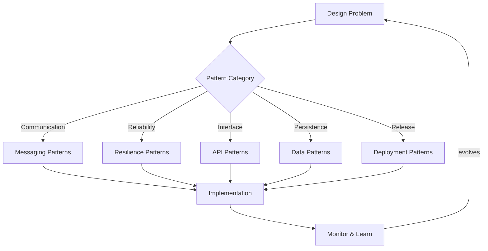

## What this is

A catalog of proven solutions to recurring design problems in distributed systems. These patterns capture hard-won knowledge about what works at scale, providing blueprints for messaging, resilience, data handling, and deployment strategies. Essential when building systems that need to evolve, integrate with other services, or handle real-world failure modes.

## When to use it

- Designing new services where integration patterns and failure modes matter from day one.
- Scaling existing systems beyond single-node limits (multiple databases, service boundaries, async processing).
- System integration projects where different teams or vendors need consistent approaches.
- Architecture reviews where patterns provide shared vocabulary and proven trade-offs.
- Legacy modernization where proven patterns reduce risk of large-scale changes.

## When not to

- Simple applications with straightforward data flows and no integration requirements.
- Proof-of-concept work where pattern overhead exceeds learning value.
- Well-established systems where changing patterns would introduce more risk than benefit.
- Teams new to distributed systems who need fundamentals before advanced patterns.

## Core decisions

- Messaging approach: synchronous APIs vs. asynchronous events vs. hybrid patterns based on consistency needs.
- Resilience strategy: circuit breakers, bulkheads, timeouts, and retry policies that match your failure tolerance.
- API boundaries: how services expose functionality while maintaining backward compatibility and clear contracts.
- Data patterns: consistency models, partitioning strategies, and cache policies that support your access patterns.
- Deployment approach: blue-green, canary, or rolling deployments based on risk tolerance and rollback requirements.
- Trade-off: pattern complexity vs. operational simplicity — choose patterns that your team can operate reliably.

## Mental model

_Figure: Pattern selection based on problem domain, with feedback loop for continuous refinement._

## What to read next

- [Explore Messaging patterns for async communication](/docs/architectural-patterns/messaging)
- [Build fault tolerance with Resilience patterns](/docs/architectural-patterns/resilience)
- [Design clean interfaces with API patterns](/docs/architectural-patterns/api-design)
- [Handle persistence with Data patterns](/docs/architectural-patterns/data)
- [Deploy safely with Deployment patterns](/docs/architectural-patterns/deployment-topology)
- [Recognize and avoid Anti-patterns](/docs/architectural-patterns/anti-patterns)

:::note
Orientation: Messaging and Resilience patterns address the most common distributed system challenges. API Design provides interface fundamentals that support all other patterns.
:::
