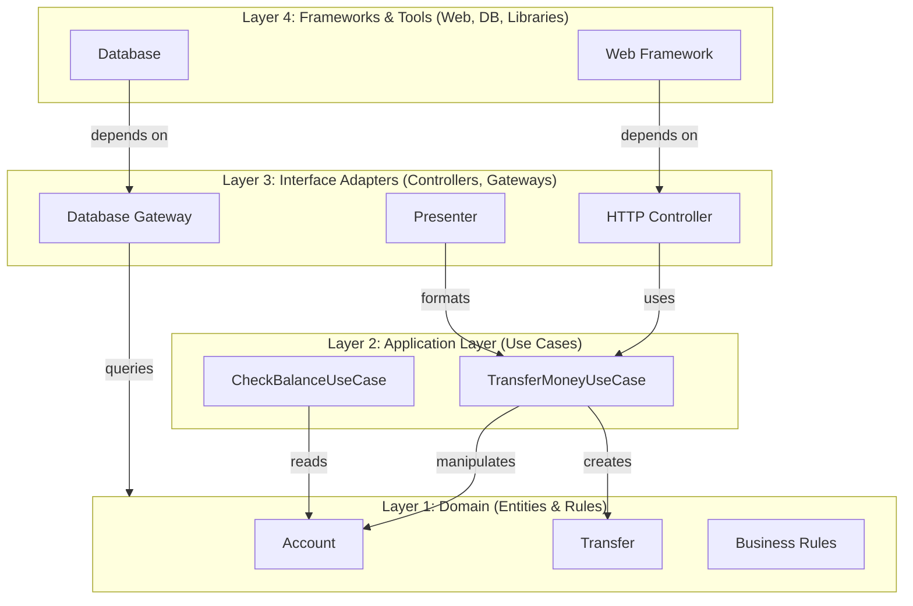

<Hero title="Clean / Onion Architecture" subtitle="Concentric layers with domain at core, dependencies pointing inward" imageAlt="Clean/Onion architecture with concentric layers" size="large" />

## TL;DR

Clean (Onion) Architecture organizes code into concentric layers: at the center is domain logic (entities, business rules), surrounded by application logic (use cases), then interface adapters (controllers, presenters), and outermost is frameworks & tools. All dependencies point inward toward the domain. Testable, framework-agnostic, maintainable. Similar to hexagonal but emphasizes concentric layers explicitly.

## Learning Objectives

- Understand concentric layers and dependency direction
- Design use cases (application layer)
- Isolate domain from web/database frameworks
- Implement interfaces and adapters cleanly
- Recognize the difference from layered architecture

## Motivating Scenario

You're building a banking application. The core domain (Account, Transfer, Balance rules) should never know about Spring controllers, REST endpoints, or Hibernate. The use cases (TransferMoney, CheckBalance) orchestrate domain entities without knowing who's calling (HTTP, CLI, mobile app) or where data lives (SQL, NoSQL). Clean architecture achieves this layering with strict dependency rules.

## Core Concepts

Clean Architecture defines **concentric layers** with strict dependency rules:

**Layer 1 (Core): Entities**
Domain objects with pure business rules. Reusable across use cases. Example: Account, Transfer, Money.

**Layer 2: Use Cases (Application Logic)**
Orchestrate entities to fulfill user requests. Each use case is a single, testable flow. Example: TransferMoneyUseCase, CheckBalanceUseCase.

**Layer 3: Interface Adapters**
Convert between external world (HTTP, database) and use cases. Controllers, presenters, gateways.

**Layer 4 (Outermost): Frameworks & Tools**
Web frameworks, databases, libraries. Implement the innermost interfaces.

<Figure caption="Clean architecture concentric layers">

</Figure>

### The Dependency Rule

**All dependencies point inward toward the domain.**

Outer layers depend on inner layers, NEVER vice versa. Domain entities never import from use cases, controllers, or frameworks. This inversion keeps domain independent.

### Concentric Layer Responsibilities

**Entities**: Implement business rules, validation logic, calculations. Pure business logic.

**Use Cases**: High-level application rules. Orchestrate entities. Handle workflows. May use repositories (interfaces) to get data.

**Interface Adapters**: Convert use case inputs/outputs to/from external formats (HTTP requests/responses, database rows).

**Frameworks & Libraries**: Specific technologies. Spring, Django, PostgreSQL are here. Kept at the edges.

## Practical Example

```python
# Layer 1: Domain (Entities)
class Account:
    def __init__(self, account_id: int, balance: float):
        self.account_id = account_id
        self.balance = balance

    def withdraw(self, amount: float):
        """Business rule: can't withdraw more than balance."""
        if amount > self.balance:
            raise ValueError("Insufficient funds")
        self.balance -= amount

    def deposit(self, amount: float):
        if amount <= 0:
            raise ValueError("Deposit must be positive")
        self.balance += amount

class Transfer:
    def __init__(self, from_account: Account, to_account: Account, amount: float):
        self.from_account = from_account
        self.to_account = to_account
        self.amount = amount

    def execute(self):
        """Business rule: transfer is atomic."""
        self.from_account.withdraw(self.amount)
        self.to_account.deposit(self.amount)

# Layer 2: Use Cases (Application Logic)
from abc import ABC, abstractmethod

class AccountRepository(ABC):
    """Gateway interface (not a concrete DB class)."""
    @abstractmethod
    def get_account(self, account_id: int) -> Account:
        pass

    @abstractmethod
    def save_account(self, account: Account):
        pass

class TransferMoneyUseCase:
    def __init__(self, repo: AccountRepository):
        self.repo = repo

    def execute(self, from_id: int, to_id: int, amount: float):
        """Use case: transfer money between accounts."""
        from_account = self.repo.get_account(from_id)
        to_account = self.repo.get_account(to_id)

        transfer = Transfer(from_account, to_account, amount)
        transfer.execute()

        # Persist updated accounts
        self.repo.save_account(from_account)
        self.repo.save_account(to_account)

        return {"status": "success", "amount": amount}

class CheckBalanceUseCase:
    def __init__(self, repo: AccountRepository):
        self.repo = repo

    def execute(self, account_id: int):
        """Use case: check account balance."""
        account = self.repo.get_account(account_id)
        return {"account_id": account_id, "balance": account.balance}

# Layer 3: Interface Adapters
class TransferController:
    """HTTP adapter (depends on use case, not DB)."""
    def __init__(self, use_case: TransferMoneyUseCase):
        self.use_case = use_case

    def handle_request(self, request):
        """Convert HTTP request to use case input."""
        from_id = request.get('from_account')
        to_id = request.get('to_account')
        amount = float(request.get('amount'))

        result = self.use_case.execute(from_id, to_id, amount)
        return {"statusCode": 200, "body": result}

class TransferPresenter:
    """Format use case output for HTTP response."""
    def format_response(self, result):
        return {"status": result["status"], "amount": result["amount"]}

# Layer 4: Frameworks & Tools (SQL implementation of gateway)
import psycopg2

class PostgresAccountRepository(AccountRepository):
    def __init__(self, connection_string: str):
        self.conn = psycopg2.connect(connection_string)

    def get_account(self, account_id: int) -> Account:
        cursor = self.conn.cursor()
        cursor.execute("SELECT id, balance FROM accounts WHERE id = %s", (account_id,))
        row = cursor.fetchone()
        return Account(row[0], row[1])

    def save_account(self, account: Account):
        cursor = self.conn.cursor()
        cursor.execute(
            "UPDATE accounts SET balance = %s WHERE id = %s",
            (account.balance, account.account_id)
        )
        self.conn.commit()

# Wiring (Dependency Injection)
repo = PostgresAccountRepository("dbname=bank user=app")
transfer_use_case = TransferMoneyUseCase(repo)
controller = TransferController(transfer_use_case)

# Handle request
request = {"from_account": 1, "to_account": 2, "amount": 100}
response = controller.handle_request(request)
```

## When to Use / When Not to Use

<Vs highlight={[1]} items={[
{
    label: "Use Clean Architecture When:",
    points: [
      "Business logic is complex and worth protecting from frameworks",
      "Testing business rules independent of HTTP/Database is valuable",
      "Plan to swap frameworks or databases",
      "Building applications, not simple scripts",
      "Team understands dependency inversion and can maintain discipline"
    ],
    highlightTone: "positive"
  },
{
    label: "Avoid Clean Architecture When:",
    points: [
      "Building simple CRUD applications with thin logic",
      "Team is small and doesn't need architecture discipline",
      "Premature abstraction would add overhead",
      "Framework (Rails, Laravel) is the primary tool"
    ],
    highlightTone: "warning"
  }
]} />

## Patterns and Pitfalls

<Showcase title="Patterns and Pitfalls" sections={[
  {
    label: "Pitfall: Entities as Data Transfer Objects",
    body: "Domain entities used directly as HTTP request/response models. Violates layer boundaries. Create separate DTOs for external communication. Convert to/from entities at adapter layer."
  },
  {
    label: "Pitfall: Use Cases Too Fine-Grained",
    body: "One use case per HTTP endpoint. Leads to dozens of use case classes. Use cases should represent meaningful workflows, not HTTP routes. One use case may serve multiple endpoints.",
    tone: "positive"
  },
  {
    label: "Pitfall: Leaky Abstraction",
    body: "Repository interface exposes database-specific details. Repositories should talk in domain language, not SQL."
  },
  {
    label: "Pattern: Interactors",
    body: "Use case classes often called 'interactors.' Clear name for orchestration logic. Name classes clearly: TransferMoneyUseCase or TransferMoneyInteractor."
  },
  {
    label: "Pattern: Response Objects",
    body: "Use cases return response objects (not domain entities), formatted for presenters. Define response DTOs. Use case returns these; presenter formats them for HTTP."
  }
]} />

## Design Review Checklist

<Checklist items={[
  "Are domain entities independent of frameworks and libraries?",
  "Do use cases orchestrate entities without knowing about HTTP/Database?",
  "Are all dependencies pointing inward (toward domain)?",
  "Can domain logic be tested without mocking HTTP or Database?",
  "Are HTTP and Database details confined to outermost layers?",
  "Is repository interface expressed in domain language, not SQL?",
  "Are DTOs separate from domain entities?",
  "Can you swap the database without rewriting use cases?",
  "Can you swap the web framework without rewriting use cases?",
  "Is the dependency flow clear and unidirectional?"
]} />

## Self-Check

1. **How is Clean Architecture different from Layered Architecture?** Clean has strict dependency direction (inward only) and puts domain at the core. Layered is just horizontal separation; dependencies can go any direction.
2. **Why separate entities from DTOs?** Entities are domain models with business rules. DTOs are just data containers. Mixing them couples domain to external formats.
3. **What's the purpose of the repository interface in the use case layer?** It abstracts data access. Use case doesn't know if data comes from SQL, NoSQL, or a cache. Repository implements the interface.

:::info
**One Takeaway**: Clean Architecture is hexagonal architecture with explicitly named concentric layers. Use it when business logic deserves protection from frameworks. The investment in layer separation pays off as systems grow and frameworks change.

:::

## Next Steps

- **Domain-Driven Design**: Apply within domain layer for complex business domains
- **Test Pyramid**: Write tests at multiple layers leveraging clean architecture
- **CQRS & Event Sourcing**: Combine with clean architecture for complex domains
- **Dependency Injection**: Wire layers together cleanly
- **Package Structure**: Organize code by use cases, not layers

## References

- Martin, R. C. (2017). *Clean Architecture*. Prentice Hall. ↗️
- Palermo, J. (2008). Onion Architecture. jeffreypalermo.com ↗️
- Evans, E. (2003). *Domain-Driven Design*. Addison-Wesley. ↗️