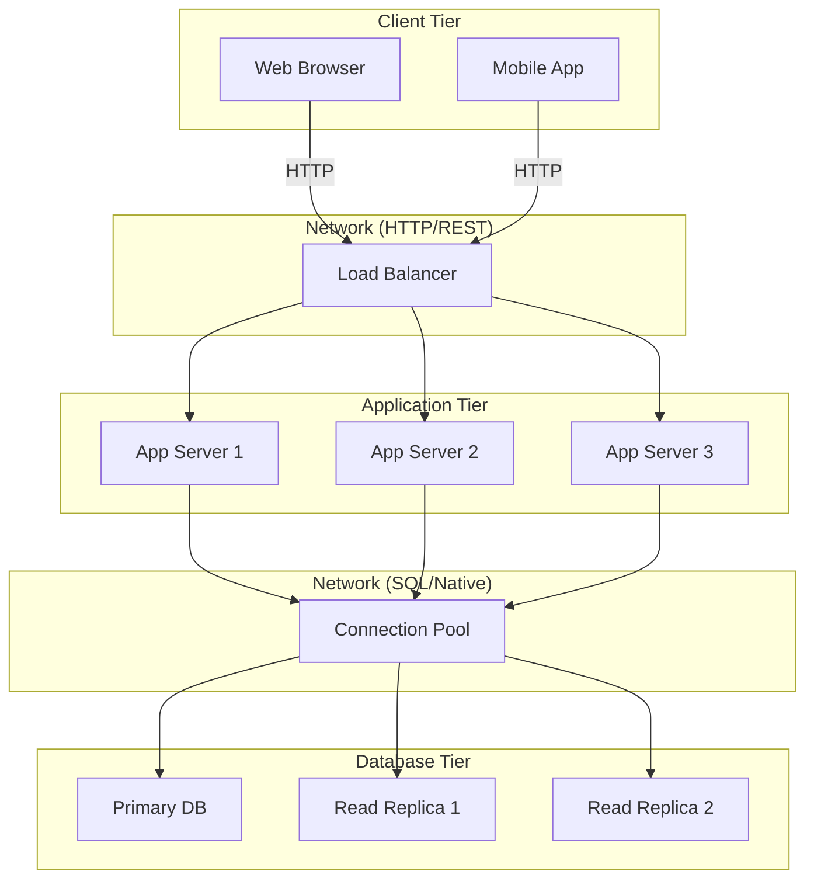

<Hero title="Client-Server / 3-Tier Architecture" subtitle="Separate presentation from business logic and data, optimize each tier independently" imageAlt="3-tier architecture with client, application, and database tiers" size="large" />

## TL;DR

3-tier architecture distributes the application across three separate tiers: **Client (presentation)**, **Application Server (business logic)**, and **Database Server (persistence)**. This network-level separation allows independent scaling and technology choices for each tier. Dominant pattern for enterprise web applications, but introduces network latency, complexity, and testing challenges compared to layered monoliths.

## Learning Objectives

- Understand the three tiers and their network-level separation
- Compare 2-tier (client-database) vs 3-tier vs n-tier topologies
- Identify scaling and deployment advantages of tier separation
- Recognize distributed system challenges: latency, consistency, debugging
- Know when to scale individual tiers vs transitioning to microservices

## Motivating Scenario

Your e-commerce platform has grown: the web frontend needs JavaScript-heavy interactivity, the backend API serves mobile clients and third-party integrations, and the database faces heavy load. Instead of scaling a monolithic server, you separate concerns: a lightweight client tier (browser/mobile), a scalable application server tier (multiple instances behind load balancer), and a database tier (replicated for read scaling). Each tier scales independently based on its bottleneck.

## Core Concepts

3-tier architecture places **network boundaries** between logical tiers, enabling independent scaling and deployment:

```
┌──────────────────┐
│   Client Tier    │  Web browser, mobile app
├──────────────────┤ (Network)
│ Application Tier │  REST API, business logic servers
├──────────────────┤ (Network)
│  Database Tier   │  SQL/NoSQL, persistence layer
└──────────────────┘
```

**Key differences from layered monolith:**
- Each tier runs in a **separate process** (possibly separate machine)
- Tiers communicate over **network protocols** (HTTP, RPC, etc.)
- Each tier can be **scaled independently** (more app servers without changing DB)
- **Technology heterogeneity**: client in JavaScript, app server in Java, DB in PostgreSQL
- **Distributed system complexity**: latency, eventual consistency, partial failures

<Figure caption="3-tier architecture with network boundaries and load balancing">

</Figure>

### Tier Responsibilities

**Client Tier**: User interface, presentation logic, client-side validation, session management (cookies/tokens). Can be thin (mostly HTTP requests) or rich (lots of local logic).

**Application Tier**: Business logic, workflows, authorization, coordination between client and database. Stateless (or share state in distributed cache) to enable horizontal scaling.

**Database Tier**: Data persistence, consistency, replication, backups. Often separated further into read replicas, write-primary configurations.

## Practical Example

<Tabs>
  <TabItem value="client" label="Client Tier (JavaScript)">
    ```javascript
    // Client-side - Web Browser
    async function createOrder(items) {
      // Client-side validation
      if (!items || items.length === 0) {
        throw new Error('Order must contain items');
      }

      // Network call to Application Tier
      const response = await fetch('/api/orders', {
        method: 'POST',
        headers: {
          'Content-Type': 'application/json',
          'Authorization': `Bearer ${localStorage.getItem('token')}`
        },
        body: JSON.stringify({ items })
      });

      if (!response.ok) {
        throw new Error(`Server error: ${response.statusText}`);
      }

      return await response.json();
    }

    // User interacts with client
    document.getElementById('checkout').addEventListener('click', async () => {
      try {
        const order = await createOrder(cartItems);
        displaySuccess(`Order ${order.id} created!`);
      } catch (error) {
        displayError(error.message);
      }
    });
    ```
  </TabItem>

  <TabItem value="application" label="Application Tier (Node.js)">
    ```javascript
    // Application Tier - Node.js / Express
    const express = require('express');
    const { Pool } = require('pg');
    const app = express();

    const db = new Pool({
      host: 'db-primary.internal',  // Database Tier address
      user: 'app',
      password: process.env.DB_PASSWORD,
      database: 'ecommerce'
    });

    app.post('/api/orders', authenticate, async (req, res) => {
      try {
        const { items } = req.body;
        const userId = req.user.id;

        // Business logic
        if (!items || items.length === 0) {
          return res.status(400).json({ error: 'No items' });
        }

        let total = 0;
        const prices = await db.query(
          'SELECT id, price FROM products WHERE id = ANY($1)',
          [[items.map(i => i.productId)]]
        );

        for (const item of items) {
          const price = prices.find(p => p.id === item.productId);
          if (!price) return res.status(404).json({ error: 'Product not found' });
          total += price.price * item.quantity;
        }

        // Persist order to Database Tier
        const result = await db.query(
          'INSERT INTO orders (user_id, total, status) VALUES ($1, $2, $3) RETURNING id',
          [userId, total, 'pending']
        );

        res.status(201).json({ id: result.rows[0].id, total });
      } catch (error) {
        res.status(500).json({ error: error.message });
      }
    });

    app.listen(3000);
    ```
  </TabItem>

  <TabItem value="database" label="Database Tier (PostgreSQL)">
    ```sql
    -- Database Tier - PostgreSQL (read-replica configuration)
    -- Primary database (writes)
    CREATE TABLE orders (
        id BIGSERIAL PRIMARY KEY,
        user_id BIGINT NOT NULL,
        total DECIMAL(10, 2) NOT NULL,
        status VARCHAR(20) DEFAULT 'pending',
        created_at TIMESTAMP DEFAULT NOW()
    );

    CREATE TABLE order_items (
        id BIGSERIAL PRIMARY KEY,
        order_id BIGINT REFERENCES orders(id),
        product_id BIGINT NOT NULL,
        quantity INT NOT NULL,
        unit_price DECIMAL(10, 2) NOT NULL
    );

    CREATE INDEX idx_orders_user_id ON orders(user_id);
    CREATE INDEX idx_orders_created ON orders(created_at);

    -- Replicated to read replicas (for scaling read queries)
    -- Application tier connects to primary for writes,
    -- read replicas for SELECT queries
    ```
  </TabItem>
</Tabs>

## Tier Scaling Patterns

| Scenario | Approach |
|----------|----------|
| **Client slow** | Optimize JavaScript, reduce bundle size, implement lazy loading, use CDN |
| **App server bottleneck** | Add more servers behind load balancer, implement caching layer |
| **Database bottleneck (reads)** | Add read replicas, implement query caching, denormalization |
| **Database bottleneck (writes)** | Optimize indexes, use connection pooling, consider sharding |
| **Network latency between tiers** | Colocate servers in same data center, use dedicated networks, batch requests |

## When to Use / When Not to Use

<Vs highlight={[1]} items={[
{
    label: "Use 3-Tier Architecture When:",
    points: [
      "Application has multiple client types (web, mobile, third-party API consumers)",
      "Tiers have different scaling profiles (app servers need rapid scale, DB stays stable)",
      "You need to upgrade or deploy tiers independently",
      "Client requires rich interactivity or offline capabilities",
      "Database team manages replication and failover separately from app team",
      "Organization structure mirrors the tiers (frontend, backend, DBA teams)"
    ],
    highlightTone: "positive"
  },
{
    label: "Avoid 3-Tier Architecture When:",
    points: [
      "Building a small internal tool where colocating tiers is simpler",
      "Network latency or unreliability is a critical constraint",
      "You need per-transaction coordination across tiers (eventual consistency unacceptable)",
      "Each service needs truly independent technology stacks (microservices better)",
      "Real-time event processing dominates (event-driven better)",
      "Team is too small to manage operational complexity of distributed system"
    ],
    highlightTone: "warning"
  }
]} />

## Patterns and Pitfalls

<Showcase title="Patterns and Pitfalls" sections={[
  {
    label: "Pitfall: Chatty Client-Server Interface",
    body: "Client makes many small requests instead of batch operations. N+1 queries at network scale. Aggregate operations into batch APIs. GraphQL with dataloader. Implement caching at client and server."
  },
  {
    label: "Pitfall: Shared Session State Without Coordination",
    body: "Application tier servers store session state locally; client request bounces between servers, losing context. Use sticky sessions (route to same server) or externalize session to Redis. Preferred: stateless app tier."
  },
  {
    label: "Pitfall: Synchronous Request Chain Across All Tiers",
    body: "Client → App Tier → DB Tier, all blocking. One slow DB query cascades into client timeout. Implement query caching, connection pooling at app tier. Use async/await to unblock client while DB operations complete."
  },
  {
    label: "Pattern: Load Balancing",
    body: "Multiple instances of app servers behind load balancer; hides server count and location from client. Use hardware or software LB (HAProxy, AWS ELB). Implement health checks. Distribute based on connection count or response time."
  },
  {
    label: "Pattern: Read Replicas",
    body: "Separate database read traffic from writes. Writes go to primary, reads from replicas. Configure database replication. Route app tier SELECT queries to read replicas, INSERT/UPDATE/DELETE to primary."
  },
  {
    label: "Pattern: Connection Pooling",
    body: "App servers reuse database connections instead of creating new one per request. PgBouncer for PostgreSQL, HikariCP for Java, etc. Prevents database connection exhaustion."
  }
]} />

## Design Review Checklist

<Checklist items={[
  "Is each tier running in a separate process/server (true network separation)?",
  "Can you scale the application tier without touching the client or database?",
  "Are client-server API calls batched and efficient (not N+1 queries)?",
  "Is the application tier stateless (or state is in external cache)?",
  "Do you have load balancing in front of application servers?",
  "Is the database configured with replication for read scaling?",
  "Can you deploy a new version of one tier without downtime to others?",
  "Are network calls between tiers handled gracefully (retry logic, timeouts)?",
  "Do you understand the latency of network calls between tiers?",
  "Is sensitive data not cached at the client tier (authentication tokens secure)?"
]} />

## Self-Check

1. **Why separate the application tier from the database tier?** Enables independent scaling, technology choices, and team ownership. Database can replicate, app can load-balance.
2. **What's a critical challenge of 3-tier that doesn't exist in a monolith?** Network latency, distributed failures (network partition, one server down), eventual consistency issues.
3. **When would 2-tier (client-database) be acceptable vs 3-tier?** 2-tier works for small systems with low concurrency. 3-tier needed once you need independent scaling or to decouple client from database technology.

:::info
**One Takeaway**: 3-tier is the enterprise standard for web applications because it enables independent scaling and deployment. But it introduces distributed system complexity. Don't prematurely add a separate app tier if you're starting small; migrate when the monolith becomes a bottleneck.

:::

## Next Steps

- **Microservices Architecture**: Further decompose application tier into independent services
- **Caching Patterns**: Add cache tier between application and database (Redis, Memcached)
- **Event-Driven Architecture**: Replace synchronous app-tier logic with event streams
- **Cloud Deployment**: How containerization and orchestration enable 3-tier at scale (Kubernetes)
- **API Design**: Optimize client-server interface for network efficiency

## References

- Richards, M., & Ford, N. (2020). *Fundamentals of Software Architecture*. O'Reilly. ↗️
- Newman, S. (2015). *Building Microservices*. O'Reilly. (Chapters 1-2 cover 3-tier evolution) ↗️
- Nygard, M. (2007). *Release It!* Pragmatic Bookshelf. ↗️