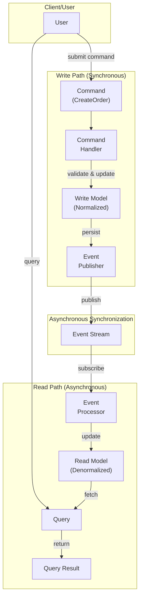

<Hero title="CQRS (Command Query Responsibility Segregation)" subtitle="Separate read and write models for independent optimization and scalability" imageAlt="CQRS architecture with separate command and query models" size="large" />

## TL;DR

CQRS separates data writes (commands) from data reads (queries) into two different models and potentially two different databases. Writes go to a write-optimized model (normalized, transactional); reads hit a read-optimized model (denormalized, replicated). Updates to the read model are asynchronous, often driven by events. Enables independent scaling, different consistency strategies, and optimized models for specific query patterns.

## Learning Objectives

- Understand command vs query separation
- Design read and write models independently
- Handle eventual consistency between models
- Implement event-driven synchronization
- Know when CQRS is worth the added complexity

## Motivating Scenario

Your analytics dashboard queries thousands of aggregations (users by region, revenue by product, trends over time) from a single denormalized read model while orders write to a normalized transactional database. Without CQRS, you'd either update the analytics model synchronously (slow writes), or keep it normalized (slow reads). CQRS lets each model be optimized for its access pattern.

## Core Concepts

CQRS splits the traditional single model into **two models with different responsibilities**:

**Command Model (Write)**: Optimized for consistency and transactions. Normalized schema. Updates are immediate, ACID.

**Query Model (Read)**: Optimized for query performance. Denormalized, replicated. Updated asynchronously (eventually consistent).

**Synchronization**: Events bridge the two models. When writes succeed, events are published; subscribers update the read model.

<Figure caption="CQRS architecture with separate command and query models">

</Figure>

### Key Characteristics

**Separate Models**: Write model optimized for transactions and consistency. Read model optimized for queries.

**Independent Scaling**: Reads scale separately from writes (more read replicas, fewer write instances).

**Asynchronous Synchronization**: Read model may lag behind writes (eventual consistency).

**Event-Driven**: Events communicate state changes from write to read model.

**Specific Query Optimization**: Read model structured for specific queries (no joins, materialized views).

## Practical Example

```python
# Write Model (Normalized, Transactional)
class OrderAggregate:
    """Domain aggregate for order writes."""
    def __init__(self, order_id: int):
        self.order_id = order_id
        self.items = []
        self.total = 0
        self.status = 'pending'

    def add_item(self, product_id: int, quantity: int, price: float):
        self.items.append({'product_id': product_id, 'qty': quantity, 'price': price})
        self.total += quantity * price

    def confirm(self) -> list:
        """Create events when order is confirmed."""
        events = []
        events.append({
            'type': 'OrderCreated',
            'order_id': self.order_id,
            'total': self.total,
            'timestamp': datetime.now()
        })
        for item in self.items:
            events.append({
                'type': 'ItemAdded',
                'order_id': self.order_id,
                'product_id': item['product_id'],
                'quantity': item['qty']
            })
        self.status = 'confirmed'
        return events

# Command Handler (handles writes)
class CreateOrderCommandHandler:
    def __init__(self, write_repo, event_publisher):
        self.write_repo = write_repo
        self.event_publisher = event_publisher

    def handle(self, command: dict):
        """Handle CreateOrder command."""
        order = OrderAggregate(command['order_id'])
        for item in command['items']:
            order.add_item(item['product_id'], item['qty'], item['price'])

        # Save to write model (normalized database)
        self.write_repo.save(order)

        # Publish events
        events = order.confirm()
        for event in events:
            self.event_publisher.publish(event)

        return order

# Query Model (Denormalized, Read-Optimized)
class OrderQueryModel:
    """Read model - optimized for specific queries."""
    def __init__(self, db):
        self.db = db

    def get_recent_orders(self, user_id: int, limit: int = 10) -> list:
        """Precomputed denormalized view."""
        return self.db.query(
            "SELECT order_id, total, status, items_count, created_at "
            "FROM orders_summary "
            "WHERE user_id = %s "
            "ORDER BY created_at DESC "
            "LIMIT %s",
            (user_id, limit)
        )

    def get_sales_by_product(self) -> list:
        """Another denormalized view optimized for this query."""
        return self.db.query(
            "SELECT product_id, product_name, total_units_sold, revenue "
            "FROM product_sales_summary "
            "ORDER BY revenue DESC"
        )

# Event Processor (keeps read model in sync)
class OrderEventProcessor:
    def __init__(self, read_db):
        self.read_db = read_db

    def handle_order_created(self, event: dict):
        """Update read model when OrderCreated event arrives."""
        self.read_db.execute(
            "INSERT INTO orders_summary (order_id, total, items_count, status, created_at) "
            "VALUES (%s, %s, %s, %s, %s)",
            (event['order_id'], event['total'], 0, 'confirmed', event['timestamp'])
        )

    def handle_item_added(self, event: dict):
        """Update read model when ItemAdded event arrives."""
        self.read_db.execute(
            "UPDATE orders_summary SET items_count = items_count + 1 "
            "WHERE order_id = %s",
            (event['order_id'],)
        )

        # Also update product sales summary
        self.read_db.execute(
            "UPDATE product_sales_summary SET total_units_sold = total_units_sold + %s "
            "WHERE product_id = %s",
            (event['quantity'], event['product_id'])
        )

    def process_event(self, event: dict):
        """Route event to appropriate handler."""
        if event['type'] == 'OrderCreated':
            self.handle_order_created(event)
        elif event['type'] == 'ItemAdded':
            self.handle_item_added(event)

# Usage
write_repo = OrderRepository()
event_publisher = EventPublisher()
command_handler = CreateOrderCommandHandler(write_repo, event_publisher)

# Handle write command
command = {
    'order_id': 123,
    'items': [
        {'product_id': 1, 'qty': 2, 'price': 50.00},
        {'product_id': 2, 'qty': 1, 'price': 100.00}
}
order = command_handler.handle(command)

# Read from optimized query model (may be slightly stale)
query_model = OrderQueryModel(read_db)
recent_orders = query_model.get_recent_orders(user_id=456)
sales_by_product = query_model.get_sales_by_product()
```

## When to Use / When Not to Use

<Vs highlight={[1]} items={[
{
    label: "Use CQRS When:",
    points: [
      "Read and write loads are dramatically different (many readers, few writers)",
      "Queries require complex denormalization or aggregations",
      "Need to scale reads independently from writes",
      "Multiple different views of the same data (different query patterns)",
      "Building complex domain with many business rules (pairs well with event sourcing)"
    ],
    highlightTone: "positive"
  },
{
    label: "Avoid CQRS When:",
    points: [
      "Read and write loads are similar",
      "Simple CRUD with uniform query patterns",
      "Team unfamiliar with eventual consistency",
      "Consistency is paramount (financial transactions)",
      "Added complexity isn't justified by performance gains"
    ],
    highlightTone: "warning"
  }
]} />

## Patterns and Pitfalls

<Showcase title="Patterns and Pitfalls" sections={[
  {
    label: "Pitfall: Eventual Consistency Surprises",
    body: "User updates an order, immediately queries for it, sees old data (write hasn't propagated to read model yet). Design UI to show immediate response. Acknowledge writes optimistically. Or use read-your-own-writes consistency."
  ,
    body: "User updates an order, immediately queries for it, sees old data (write hasn't propagated to read model yet). Design UI to show immediate response. Acknowledge writes optimistically. Or use read-your-own-writes consistency.",
    tone: "warning"
  },
  {
    label: "Pitfall: Complex Synchronization",
    body: "Events are lost, read model falls out of sync, hard to recover. Use durable event store. Implement event replay. Monitor sync lag."
  },
  {
    label: "Pitfall: Read Model Divergence",
    body: "Multiple read models for different queries; keeping all in sync becomes complex. Start with one read model. Add more only if justified by performance. Consider CQRS too premature."
  },
  {
    label: "Pattern: Event Sourcing",
    body: "Combine CQRS with event sourcing: write model stores events only, read model is materialized from events. Events are single source of truth. Read models are projections. Can replay to rebuild."
  },
  {
    label: "Pattern: Read Model Rebuild",
    body: "Rebuild read model from event stream if it gets corrupted or logic changes. Implement rebuild capability. Store all events immutably."
  }
]} />

## Design Review Checklist

<Checklist items={[
  "Are write and read loads actually different enough to justify separation?",
  "Is the synchronization between models explicit and observable?",
  "Can you handle read model lag (eventual consistency)?",
  "Are events durable and immutable?",
  "Can you rebuild read models from events?",
  "Is event synchronization monitored for failures?",
  "Are there multiple read models? Is the complexity justified?",
  "Can users tolerate seeing stale data?",
  "Is the command/query boundary clear and well-defined?",
  "Have you considered simpler alternatives (caching, read replicas)?"
]} />

## Self-Check

1. **What's the core benefit of CQRS?** Independent optimization of read and write paths. Reads can be heavily denormalized; writes can focus on consistency.
2. **What's the main challenge?** Eventual consistency. Read model lags behind writes. Users might see stale data briefly.
3. **When is CQRS premature?** When read/write loads are similar, or queries are simple. CQRS adds operational complexity; only use if the benefit is clear.

:::info
**One Takeaway**: CQRS shines when read queries are expensive and need denormalization, or read/write loads are asymmetric. Don't use CQRS for simple applications. Consider it as a scaling solution after the basic architecture is proven.
:::

## Next Steps

- **Event Sourcing**: Store full event history; materialize read models from events
- **Message Queues**: Reliable event synchronization (Kafka, RabbitMQ)
- **Projections**: Building and maintaining read models from events
- **Sagas**: Coordinating distributed transactions across CQRS boundaries
- **Performance Monitoring**: Track read model lag and synchronization health

## References

- Fowler, M. (2011). CQRS. martinfowler.com ↗️
- Young, G. (2010). Event Sourcing and CQRS. youtube.com ↗️
- Richards, M., & Ford, N. (2020). *Fundamentals of Software Architecture*. O'Reilly. ↗️