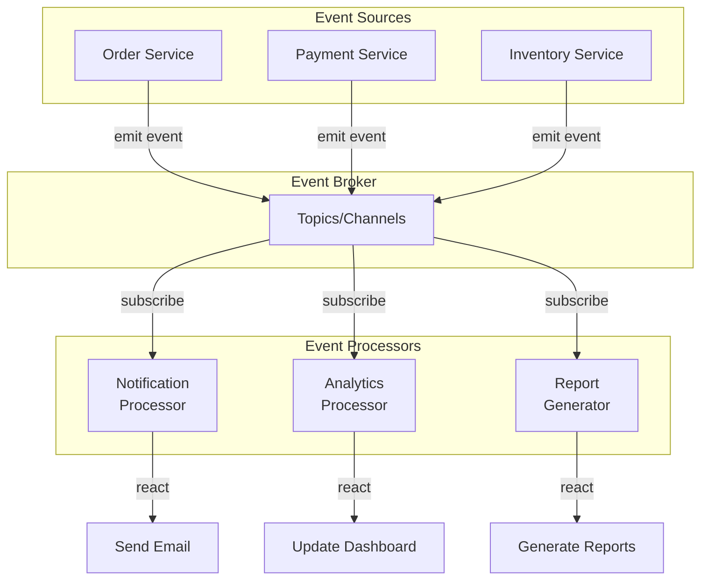
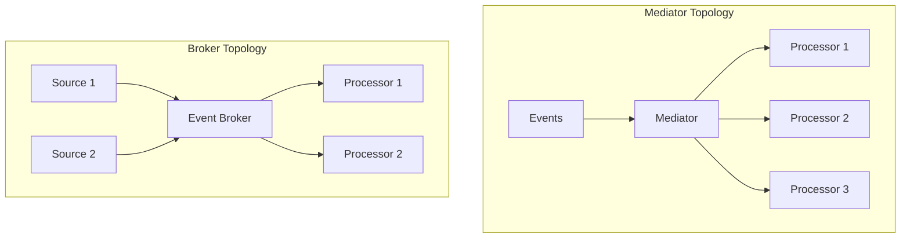

<Hero title="Event-Driven Architecture (EDA)" subtitle="Components react to and emit events, enabling asynchronous, decoupled communication" imageAlt="Event-driven architecture with event broker and processors" size="large" />

## TL;DR

Event-driven architecture uses asynchronous events as the primary communication mechanism. Components emit domain events (OrderCreated, PaymentProcessed) to an event broker (Kafka, RabbitMQ), and other components react by subscribing. Enables loose coupling, scalability, and natural representation of business workflows. Complexity trade-off: eventual consistency, distributed tracing, and event ordering.

## Learning Objectives

- Understand event-driven patterns: mediator vs broker topology
- Design domain events and event streams
- Handle eventual consistency and event ordering challenges
- Implement event processors and subscribers
- Recognize when to use asynchronous vs synchronous communication

## Motivating Scenario

Your e-commerce platform processes orders. When an order is created, multiple things must happen: charge payment, reserve inventory, send confirmation email, update analytics. In synchronous architecture, OrderService calls PaymentService, InventoryService, NotificationService sequentially. If one fails, the whole thing fails. In event-driven architecture, OrderService publishes "OrderCreated" event. Payment, Inventory, and Notification services independently subscribe and react. If Notification fails, Order and Payment still succeed.

## Core Concepts

Event-driven architecture revolves around **events** and **event handling**:

**Event**: Immutable record of something that happened. Example: OrderCreated(id=123, user=456, total=99.99, timestamp=...).

**Event Broker**: Central pub-sub system (Kafka, RabbitMQ, AWS SNS) that routes events to subscribers.

**Event Processor**: Component that reacts to events and potentially emits new events.

<Figure caption="Event-driven architecture with broker topology">

</Figure>

### Two Main Topologies

**Broker Topology**: Central event broker (Kafka, RabbitMQ). Components publish to broker; broker routes to subscribers. Loose coupling, but broker is central point of failure.

**Mediator Topology**: Central mediator orchestrates event flow. Good for simple workflows but can become bottleneck. Less common than broker.

<Figure caption="Mediator vs Broker Comparison">

</Figure>

## Practical Example

<Tabs>
  <TabItem value="event" label="Domain Events">
    ```python
    # events.py - Define domain events
    from dataclasses import dataclass
    from datetime import datetime
    from typing import List

    @dataclass
    class OrderCreated:
        """Event: Order has been created."""
        order_id: int
        user_id: int
        total: float
        items: List[dict]
        timestamp: datetime

    @dataclass
    class PaymentProcessed:
        """Event: Payment has been processed."""
        order_id: int
        amount: float
        status: str  # 'success' or 'failed'
        timestamp: datetime

    @dataclass
    class InventoryReserved:
        """Event: Inventory has been reserved."""
        order_id: int
        items: List[dict]
        timestamp: datetime

    @dataclass
    class OrderConfirmed:
        """Event: Order confirmed (all steps done)."""
        order_id: int
        user_id: int
        timestamp: datetime
    ```
  </TabItem>

  <TabItem value="broker" label="Event Broker (Kafka)">
    ```python
    # event_broker.py - Simple event broker abstraction
    from typing import Callable, Type, List
    from abc import ABC, abstractmethod

    class EventBroker(ABC):
        """Abstract event broker interface."""
        @abstractmethod
        def publish(self, event: object):
            pass

        @abstractmethod
        def subscribe(self, event_type: Type, handler: Callable):
            pass

    # Implementation with Kafka
    from kafka import KafkaProducer, KafkaConsumer
    import json

    class KafkaEventBroker(EventBroker):
        def __init__(self, bootstrap_servers='localhost:9092'):
            self.producer = KafkaProducer(
                bootstrap_servers=bootstrap_servers,
                value_serializer=lambda v: json.dumps(v.__dict__).encode('utf-8')
            )
            self.subscribers = {}

        def publish(self, event: object):
            """Publish event to Kafka topic."""
            event_type = type(event).__name__
            self.producer.send(event_type, value=event)
            print(f"Published {event_type}")

        def subscribe(self, event_type: Type, handler: Callable):
            """Subscribe to events of a type."""
            topic = event_type.__name__
            if topic not in self.subscribers:
                self.subscribers[topic] = []
            self.subscribers[topic].append(handler)
            print(f"Subscribed to {topic}")
    ```
  </TabItem>

  <TabItem value="source" label="Event Source (Order Service)">
    ```python
    # order_service.py - Emits events
    from events import OrderCreated
    from event_broker import event_broker
    from datetime import datetime

    class OrderService:
        def __init__(self, broker):
            self.broker = broker

        def create_order(self, user_id: int, items: list):
            # Business logic
            total = sum(item['price'] * item['qty'] for item in items)
            order_id = self.save_order(user_id, items, total)

            # Emit event
            event = OrderCreated(
                order_id=order_id,
                user_id=user_id,
                total=total,
                items=items,
                timestamp=datetime.now()
            )
            self.broker.publish(event)

            return order_id

        def save_order(self, user_id: int, items: list, total: float):
            # Save to database
            return 12345  # simulated
    ```
  </TabItem>

  <TabItem value="processors" label="Event Processors">
    ```python
    # payment_processor.py
    from events import OrderCreated, PaymentProcessed
    from event_broker import event_broker
    from datetime import datetime

    class PaymentProcessor:
        def __init__(self, broker):
            self.broker = broker
            # Subscribe to OrderCreated events
            broker.subscribe(OrderCreated, self.on_order_created)

        def on_order_created(self, event: OrderCreated):
            """React to OrderCreated event."""
            try:
                # Process payment (mock)
                print(f"Processing payment of ${event.total} for order {event.order_id}")
                success = self.charge_card(event.user_id, event.total)

                # Emit PaymentProcessed event
                payment_event = PaymentProcessed(
                    order_id=event.order_id,
                    amount=event.total,
                    status='success' if success else 'failed',
                    timestamp=datetime.now()
                )
                self.broker.publish(payment_event)
            except Exception as e:
                print(f"Payment processing failed: {e}")

        def charge_card(self, user_id: int, amount: float) -> bool:
            # Call payment gateway
            return True

    # notification_processor.py
    from events import OrderCreated, PaymentProcessed, InventoryReserved, OrderConfirmed

    class NotificationProcessor:
        def __init__(self, broker):
            self.broker = broker
            broker.subscribe(OrderCreated, self.on_order_created)
            broker.subscribe(PaymentProcessed, self.on_payment_processed)
            broker.subscribe(OrderConfirmed, self.on_order_confirmed)

        def on_order_created(self, event: OrderCreated):
            print(f"Sending order confirmation email to user {event.user_id}")

        def on_payment_processed(self, event: PaymentProcessed):
            if event.status == 'success':
                print(f"Sending payment receipt for order {event.order_id}")

        def on_order_confirmed(self, event: OrderConfirmed):
            print(f"Sending shipment notification to user {event.user_id}")
    ```
  </TabItem>

  <TabItem value="main" label="Application Bootstrap">
    ```python
    # main.py
    from event_broker import KafkaEventBroker
    from order_service import OrderService
    from payment_processor import PaymentProcessor
    from notification_processor import NotificationProcessor

    if __name__ == '__main__':
        # Initialize broker
        broker = KafkaEventBroker()

        # Initialize services (order source)
        order_service = OrderService(broker)

        # Initialize processors (event subscribers)
        payment_processor = PaymentProcessor(broker)
        notification_processor = NotificationProcessor(broker)

        # Create an order
        order_id = order_service.create_order(
            user_id=456,
            items=[
                {'product_id': 1, 'price': 50.00, 'qty': 1},
                {'product_id': 2, 'price': 25.00, 'qty': 2}
        )

        # Output:
        # Published OrderCreated
        # Processing payment of $100.00 for order 12345
        # Sending order confirmation email to user 456
        # Published PaymentProcessed
        # Sending payment receipt for order 12345
    ```
  </TabItem>
</Tabs>

## When to Use / When Not to Use

<Vs highlight={[1]} items={[
{
    label: "Use Event-Driven Architecture When:",
    points: [
      "Need loose coupling between services/components",
      "Business workflows involve multiple systems reacting to state changes",
      "High-throughput, real-time data processing (financial transactions, analytics)",
      "Need to maintain audit trail of what happened and when",
      "Can tolerate eventual consistency (payment takes a few seconds to appear)",
      "Scaling specific processors without scaling entire system"
    ],
    highlightTone: "positive"
  },
{
    label: "Avoid Event-Driven Architecture When:",
    points: [
      "Need immediate, synchronous responses (user-facing forms)",
      "Events have complex ordering dependencies",
      "Transactions must be ACID across multiple services",
      "Team is unfamiliar with asynchronous programming and event semantics",
      "System is simple enough that synchronous calls work fine"
    ],
    highlightTone: "warning"
  }
]} />

## Patterns and Pitfalls

<Showcase title="Patterns and Pitfalls" sections={[
  {
    label: "Pitfall: Lost Events",
    body: "Event published but never persisted. System crashes, event is gone. Use durable event broker (Kafka, not in-memory). Implement dead letter queues for failed processing."
  },
  {
    label: "Pitfall: Event Ordering",
    body: "Events arrive out of order. OrderCreated arrives before PaymentProcessed, causing logic errors. Design events to be order-independent. Use sequence numbers or timestamps. Single partition per user ID."
  },
  {
    label: "Pitfall: Eventual Consistency",
    body: "User creates order, page shows order as paid before payment actually processed. Be explicit about consistency guarantees. Update UI optimistically, then correct if payment fails."
  ,
    body: "User creates order, page shows order as paid before payment actually processed. Be explicit about consistency guarantees. Update UI optimistically, then correct if payment fails.",
    tone: "warning"
  },
  {
    label: "Pattern: Event Sourcing",
    body: "Store the entire event stream as the source of truth, not just current state. Every state change is an event. Replay events to reconstruct state. Enables auditing and recovery."
  },
  {
    label: "Pattern: Dead Letter Queues",
    body: "Events that fail processing are routed to a separate queue for investigation. Implement retry logic with exponential backoff. Route persistent failures to DLQ."
  },
  {
    label: "Pattern: Correlation IDs",
    body: "Track a request through multiple event hops for debugging and tracing. Include correlation_id in every event. Log with correlation ID for easy troubleshooting."
  }
]} />

## Design Review Checklist

<Checklist items={[
  "Are events immutable and capture what happened, not what to do?",
  "Is the event broker production-ready (durable, replicated, monitored)?",
  "Do event processors handle duplicate events gracefully (idempotent)?",
  "Can you replay events from scratch to verify system behavior?",
  "Is event schema versioning strategy defined (breaking changes)?",
  "Do you have a dead letter queue for failed event processing?",
  "Is the order of event processing well-defined (or irrelevant)?",
  "Can you trace a request through the event stream (correlation IDs)?",
  "Is eventual consistency acceptable for this use case?",
  "Are event processors tested with realistic event scenarios?"
]} />

## Self-Check

1. **What's the main benefit of event-driven architecture?** Loose coupling and ability to add new processors without modifying existing code. Sources don't need to know about processors.
2. **Why is eventual consistency a challenge?** Users expect immediate feedback. Payment takes a few seconds to process; UI might show paid before payment actually succeeded.
3. **When would you choose synchronous communication over async events?** User-facing operations that need immediate feedback (form submission, login).

:::info
**One Takeaway**: Event-driven architecture excels at decoupling and scalability, but introduces complexity around ordering, consistency, and debugging. Use it when you have naturally asynchronous workflows (order processing, data pipelines). Don't force it on simple, synchronous operations.

:::

## Next Steps

- **Event Sourcing**: Store events as the system of record, not derived state
- **CQRS**: Separate read and write models with events as the bridge
- **Message Broker Patterns**: Kafka, RabbitMQ, AWS SNS/SQS trade-offs
- **Distributed Tracing**: Track requests through event processors (OpenTelemetry)
- **Complex Event Processing**: Correlate and aggregate events (Flink, Kafka Streams)

## References

- Richards, M., & Ford, N. (2020). *Fundamentals of Software Architecture*. O'Reilly. ↗️
- Newman, S. (2015). *Building Microservices*. O'Reilly. ↗️
- Humble, J., & Farley, D. (2010). *Continuous Delivery*. Addison-Wesley. ↗️
- Fowler, M. (2017). Event Sourcing. martinfowler.com ↗️