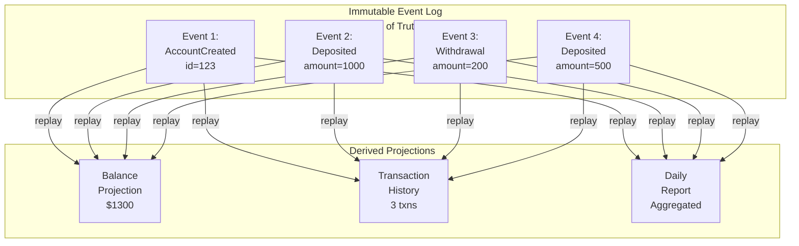

<Hero title="Event Sourcing" subtitle="Store event stream as source of truth, reconstruct state by replaying events" imageAlt="Event sourcing with immutable event log and state reconstruction" size="large" />

## TL;DR

Event Sourcing stores **the full sequence of events** (AccountCreated, MoneyDeposited, WithdrawalRequested) as the source of truth, not the current state (balance = $500). Current state is derived by replaying all events. Enables perfect audit trail, temporal queries ("what was the balance on Jan 15?"), debugging ("replay events to find when the bug started"), and easy recovery. Tradeoffs: eventual consistency with projections, storage overhead, complex queries.

## Learning Objectives

- Understand event log as source of truth vs derived state
- Implement event stores and replaying
- Design domain events for auditability
- Create projections (read models) from events
- Handle versioning and schema evolution
- Recognize when event sourcing is worth the complexity

## Motivating Scenario

You run a bank. Current architecture: balance table (account_id → balance). Regulator asks "prove the balance was correct on December 15th." You can't—you only have today's balance. With event sourcing: log every transaction (Deposit, Withdrawal, Transfer). Replay all events up to Dec 15 to get historical balance. Auditors happy. You also discover a bug: "withdrawals weren't deducted correctly in November." Replay events after the fix to verify correctness.

## Core Concepts

Event Sourcing flips the traditional data model:

**Traditional**: Current state is stored. History is derived.
**Event Sourcing**: Event log is stored. Current state is derived.

**Event**: Immutable record of something that happened. Example: AccountCreated, MoneyDeposited(amount=100), WithdrawalRequested(amount=50).

**Event Store**: Immutable append-only log of all events. Single source of truth.

**Projection**: Derived view built by replaying events. Example: account balance, list of transactions.

**Snapshot**: Cached state at a point in time (to optimize replay).

<Figure caption="Event sourcing: event log as source of truth">

</Figure>

### Key Characteristics

**Immutable History**: Events are never deleted or modified. Append-only log.

**Complete Audit Trail**: Every change is recorded with timestamp, user, reason.

**Temporal Queries**: Query state at any point in history.

**Debugging**: Replay events to understand exact sequence of state changes.

**Event Versioning**: Handle schema changes in events gracefully (upcasting old events).

**Projections**: Build multiple read models from same event stream (balance, history, analytics).

## Practical Example

```python
# Domain Events (immutable)
from dataclasses import dataclass
from datetime import datetime

@dataclass
class AccountCreated:
    account_id: int
    owner: str
    initial_balance: float
    timestamp: datetime

@dataclass
class MoneyDeposited:
    account_id: int
    amount: float
    timestamp: datetime

@dataclass
class WithdrawalRequested:
    account_id: int
    amount: float
    timestamp: datetime

@dataclass
class WithdrawalApproved:
    account_id: int
    amount: float
    timestamp: datetime

# Event Store (immutable append-only log)
class EventStore:
    def __init__(self):
        self.events = []

    def append(self, event):
        """Append event to log (immutable)."""
        self.events.append((len(self.events), event))

    def get_events(self, account_id: int, since: datetime = None):
        """Get all events for an account."""
        for idx, event in self.events:
            if hasattr(event, 'account_id') and event.account_id == account_id:
                if since is None or event.timestamp >= since:
                    yield event

    def replay_all(self):
        """Return full event log."""
        return [event for _, event in self.events]

# Account Aggregate (rebuilt from events)
class Account:
    def __init__(self, account_id: int):
        self.account_id = account_id
        self.balance = 0
        self.owner = None
        self.transactions = []

    def apply_event(self, event):
        """Apply event to current state."""
        if isinstance(event, AccountCreated):
            self.owner = event.owner
            self.balance = event.initial_balance
        elif isinstance(event, MoneyDeposited):
            self.balance += event.amount
            self.transactions.append(f"Deposit: +{event.amount}")
        elif isinstance(event, WithdrawalApproved):
            self.balance -= event.amount
            self.transactions.append(f"Withdrawal: -{event.amount}")

    @staticmethod
    def from_events(account_id: int, events: list):
        """Reconstruct account by replaying events."""
        account = Account(account_id)
        for event in events:
            account.apply_event(event)
        return account

# Projections (read models)
class BalanceProjection:
    def __init__(self, event_store: EventStore):
        self.event_store = event_store
        self.balances = {}

    def get_balance(self, account_id: int) -> float:
        """Get current balance by replaying events."""
        events = list(self.event_store.get_events(account_id))
        account = Account.from_events(account_id, events)
        return account.balance

    def get_balance_at(self, account_id: int, at_timestamp: datetime) -> float:
        """Get historical balance."""
        events = list(self.event_store.get_events(account_id, since=None))
        events = [e for e in events if e.timestamp <= at_timestamp]
        account = Account.from_events(account_id, events)
        return account.balance

class TransactionHistoryProjection:
    def __init__(self, event_store: EventStore):
        self.event_store = event_store

    def get_transactions(self, account_id: int) -> list:
        """Get transaction history."""
        events = list(self.event_store.get_events(account_id))
        account = Account.from_events(account_id, events)
        return account.transactions

# Usage
event_store = EventStore()

# Events happen
event_store.append(AccountCreated(
    account_id=123,
    owner="Alice",
    initial_balance=1000.0,
    timestamp=datetime(2024, 1, 1)
))

event_store.append(MoneyDeposited(
    account_id=123,
    amount=500.0,
    timestamp=datetime(2024, 1, 5)
))

event_store.append(WithdrawalApproved(
    account_id=123,
    amount=200.0,
    timestamp=datetime(2024, 1, 10)
))

# Projections
balance_proj = BalanceProjection(event_store)
history_proj = TransactionHistoryProjection(event_store)

# Query current balance (replay all events)
current_balance = balance_proj.get_balance(123)
print(f"Current balance: ${current_balance}")  # $1300

# Query historical balance (replay events up to date)
balance_on_jan_6 = balance_proj.get_balance_at(123, datetime(2024, 1, 6))
print(f"Balance on Jan 6: ${balance_on_jan_6}")  # $1500

# Query transaction history
transactions = history_proj.get_transactions(123)
print(f"Transactions: {transactions}")  # ['Deposit: +500', 'Withdrawal: -200']
```

## When to Use / When Not to Use

<Vs highlight={[1]} items={[
{
    label: "Use Event Sourcing When:",
    points: [
      "Audit trail is critical (financial, healthcare, compliance)",
      "Need temporal queries (\"what was the state on date X?\") ",
      "Debugging complex state changes is valuable",
      "Multiple read models needed (balance, history, analytics)",
      "Can tolerate eventual consistency in projections",
      "Domain benefits from thinking in terms of events"
    ],
    highlightTone: "positive"
  },
{
    label: "Avoid Event Sourcing When:",
    points: [
      "Simple CRUD with no audit requirements",
      "Event log would be enormous (billions of events)",
      "Real-time queries critical and replays too slow",
      "Team unfamiliar with event-driven thinking",
      "Consistency is paramount (financial transactions)",
      "Storage is severely constrained"
    ],
    highlightTone: "warning"
  }
]} />

## Patterns and Pitfalls

<Showcase title="Patterns and Pitfalls" sections={[
  {
    label: "Pitfall: Event Versioning Hell",
    body: "Events changed over time. Old events can't be replayed (schema mismatch). Version events. Implement upcasting (convert old events to new schema). Document breaking changes."
  },
  {
    label: "Pitfall: Snapshot Staleness",
    body: "Snapshots aren't updated. Replaying from old snapshot misses new events. Invalidate snapshots when event schema changes. Store snapshot version with events."
  },
  {
    label: "Pitfall: Projection Lag",
    body: "Balance projection hasn't processed all events yet. User sees stale balance. Accept eventual consistency. Or ensure synchronous update of critical projections."
  },
  {
    label: "Pattern: Snapshots",
    body: "Save aggregate state at intervals (e.g., every 100 events) to speed up replay. Snapshot every N events or every X time period. Trade storage for replay speed."
  },
  {
    label: "Pattern: Event Upcasting",
    body: "Convert old event format to new format automatically during replay. Define upcasting functions. Test carefully to ensure correctness."
  },
  {
    label: "Pattern: Temporal Queries",
    body: "Answer \"what was the state on this date?\" by replaying events up to that point. Store timestamps with events. Implement filtering in replay logic."
  }
]} />

## Design Review Checklist

<Checklist items={[
  "Is the event log append-only and immutable?",
  "Are events versioned (schema evolution handled)?",
  "Is event upcasting implemented for breaking changes?",
  "Are snapshots used to optimize replay for large histories?",
  "Are projections clearly defined and tested?",
  "Can you rebuild projections from scratch?",
  "Is the event store durable and replicated?",
  "Are temporal queries (historical state) needed and supported?",
  "Is event replay tested with realistic data volumes?",
  "Have you measured event log storage and replay performance?"
]} />

## Self-Check

1. **What's the main benefit of event sourcing?** Complete audit trail, temporal queries, and ability to debug by replaying events. You never lose history.
2. **What's the main tradeoff?** Complexity: event versioning, projections, eventual consistency. Storage overhead (storing all events vs just current state).
3. **When would you NOT use event sourcing?** Simple systems with no audit requirements, or massive event volumes that would consume too much storage.

:::info
**One Takeaway**: Event sourcing is powerful for domains with regulatory requirements, temporal queries, or deep debugging needs. Start with CQRS (read/write separation) and projections first. Graduate to event sourcing only when the benefits justify the operational complexity.

:::

## Next Steps

- **Event Store Implementations**: EventStoreDB, Kafka, PostgreSQL append-only tables
- **CQRS + Event Sourcing**: Combine for optimal scaling and flexibility
- **Sagas & Compensations**: Handle distributed transactions with event sourcing
- **Domain Events**: Designing rich, meaningful events for your domain
- **Event Versioning Strategies**: Upcasting, event transformation

## References

- Fowler, M. (2005). Event Sourcing. martinfowler.com ↗️
- Young, G. (2010). CQRS Documents. cqrs.files.wordpress.com ↗️
- EventStoreDB Documentation ↗️
- Richards, M., & Ford, N. (2020). *Fundamentals of Software Architecture*. O'Reilly. ↗️