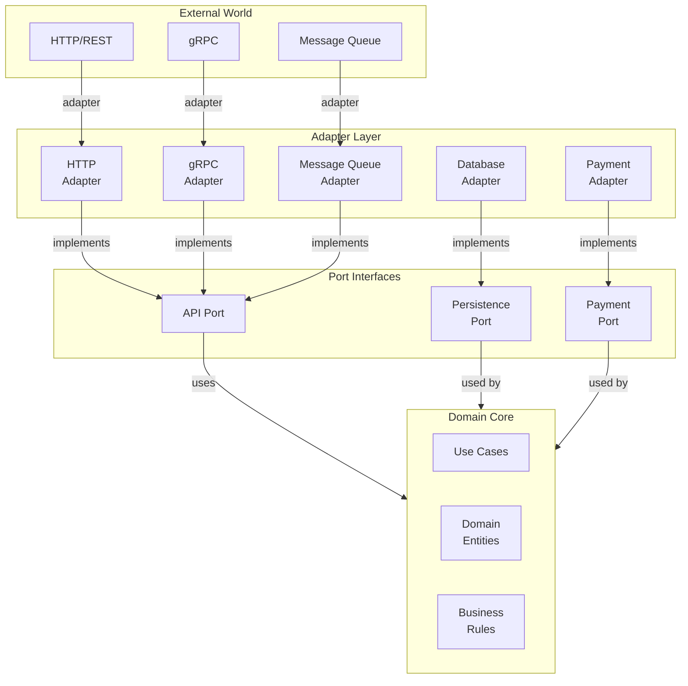

<Hero title="Hexagonal / Ports & Adapters Architecture" subtitle="Isolate core domain logic behind ports, swap implementations via adapters" imageAlt="Hexagonal architecture with domain core and adapter implementations" size="large" />

## TL;DR

Hexagonal (Ports & Adapters) architecture places domain logic at the core, surrounded by ports (interfaces for external dependencies) and adapters (implementations of those interfaces). The core doesn't depend on any external framework or technology. Enables complete isolation of business logic, making it trivial to test and swap implementations (fake database for testing, real for production).

## Learning Objectives

- Understand ports (abstractions) vs adapters (implementations)
- Design domain-centric architecture with inverted dependencies
- Implement primary and secondary ports
- Create testable code through interface-based design
- Apply hexagonal architecture to different application styles

## Motivating Scenario

You're building an order processing system. The core business logic (calculate discounts, validate quantities) should never depend on HTTP framework, database, or payment gateway. If you decide to switch from PostgreSQL to MongoDB, or REST to gRPC, core logic shouldn't change. Hexagonal architecture achieves this: define ports (interfaces) for database and payment services, implement them as adapters, wire them at startup.

## Core Concepts

Hexagonal (Ports & Adapters) inverts traditional layered architecture dependencies:

**Core Domain**: Business logic, use cases, entities. Has no external dependencies.

**Ports**: Interfaces defining what external capabilities the domain needs. Example: PaymentPort, DatabasePort.

**Adapters**: Implementations of ports for specific technologies. PostgresAdapter, MongoAdapter, StripeAdapter.

The hexagon represents isolation: all external dependencies are outside the hexagon, accessed through ports.

<Figure caption="Hexagonal architecture with domain core and adapter ring">

</Figure>

### Key Characteristics

**Domain-Centric**: Business logic is the center. Everything else is infrastructure.

**No Framework Dependencies in Core**: Core domain doesn't import Spring, Django, or any web framework.

**Interface-Based Design**: Dependencies are abstractions (interfaces), not concrete classes.

**Inversion of Control**: External systems depend on domain, not vice versa.

**Easy Testing**: Mock any adapter, test domain in isolation.

## Practical Example

```python
# domain/ports.py - Define abstractions
from abc import ABC, abstractmethod
from dataclasses import dataclass

@dataclass
class Order:
    id: int
    user_id: int
    items: list
    total: float
    status: str

class PersistencePort(ABC):
    """Port: Persistence abstraction."""
    @abstractmethod
    def save_order(self, order: Order) -> Order:
        pass

    @abstractmethod
    def get_order(self, order_id: int) -> Order:
        pass

class PaymentPort(ABC):
    """Port: Payment processing abstraction."""
    @abstractmethod
    def process_payment(self, amount: float, card_token: str) -> bool:
        pass

# domain/services.py - Core domain logic (no external deps)
class OrderService:
    def __init__(self, persistence: PersistencePort, payment: PaymentPort):
        self.persistence = persistence
        self.payment = payment

    def create_order(self, user_id: int, items: list):
        # Business logic (pure domain, no frameworks)
        if not items:
            raise ValueError("Order must contain items")

        total = sum(item['price'] * item['qty'] for item in items)
        if total <= 0:
            raise ValueError("Order total must be positive")

        # Call ports (abstractions), not concrete implementations
        payment_ok = self.payment.process_payment(total, user_id)
        if not payment_ok:
            raise ValueError("Payment failed")

        order = Order(id=None, user_id=user_id, items=items, total=total, status='confirmed')
        saved_order = self.persistence.save_order(order)
        return saved_order

# adapters/persistence.py - PostgreSQL adapter
import psycopg2
from domain.ports import PersistencePort, Order

class PostgresAdapter(PersistencePort):
    def __init__(self, connection_string: str):
        self.conn = psycopg2.connect(connection_string)

    def save_order(self, order: Order) -> Order:
        cursor = self.conn.cursor()
        cursor.execute(
            "INSERT INTO orders (user_id, total, status) VALUES (%s, %s, %s) RETURNING id",
            (order.user_id, order.total, order.status)
        )
        order_id = cursor.fetchone()[0]
        self.conn.commit()
        order.id = order_id
        return order

    def get_order(self, order_id: int) -> Order:
        cursor = self.conn.cursor()
        cursor.execute("SELECT id, user_id, total, status FROM orders WHERE id = %s", (order_id,))
        row = cursor.fetchone()
        return Order(id=row[0], user_id=row[1], items=[], total=row[2], status=row[3])

# adapters/payment.py - Stripe adapter
import stripe
from domain.ports import PaymentPort

class StripeAdapter(PaymentPort):
    def __init__(self, api_key: str):
        stripe.api_key = api_key

    def process_payment(self, amount: float, card_token: str) -> bool:
        try:
            charge = stripe.Charge.create(amount=int(amount * 100), currency='usd', source=card_token)
            return charge['status'] == 'succeeded'
        except stripe.error.CardError:
            return False

# adapters/payment_mock.py - Mock adapter for testing
from domain.ports import PaymentPort

class MockPaymentAdapter(PaymentPort):
    def __init__(self, should_fail: bool = False):
        self.should_fail = should_fail
        self.calls = []

    def process_payment(self, amount: float, card_token: str) -> bool:
        self.calls.append({'amount': amount, 'card_token': card_token})
        return not self.should_fail

# main.py - Wire it up
from adapters.persistence import PostgresAdapter
from adapters.payment import StripeAdapter
from domain.services import OrderService

if __name__ == '__main__':
    # Production
    persistence = PostgresAdapter("dbname=myapp user=app")
    payment = StripeAdapter("sk_live_...")
    order_service = OrderService(persistence, payment)

# test.py - Testing with mocks
from adapters.payment_mock import MockPaymentAdapter
from domain.services import OrderService
from adapters.memory_persistence import InMemoryPersistenceAdapter

def test_create_order():
    persistence = InMemoryPersistenceAdapter()
    payment = MockPaymentAdapter()
    service = OrderService(persistence, payment)

    order = service.create_order(user_id=123, items=[{'price': 10, 'qty': 1}])
    assert order.id is not None
    assert order.total == 10
    assert len(payment.calls) == 1
```

## When to Use / When Not to Use

<Vs highlight={[1]} items={[
{
    label: "Use Hexagonal When:",
    points: [
      "Domain logic is complex and worth protecting from external concerns",
      "Likely to swap implementations (DB, payment processor, API framework)",
      "Testing core logic without external dependencies is valuable",
      "Building libraries or frameworks that others depend on",
      "Domain is the real value; infrastructure is interchangeable"
    ],
    highlightTone: "positive"
  },
{
    label: "Avoid Hexagonal When:",
    points: [
      "Building simple CRUD applications where logic is thin",
      "Framework (Spring, Rails, Django) is the natural structure",
      "Premature abstraction adds unnecessary complexity",
      "Team doesn't understand dependency inversion principle"
    ],
    highlightTone: "warning"
  }
]} />

## Patterns and Pitfalls

<Showcase title="Patterns and Pitfalls" sections={[
  {
    label: "Pitfall: Leaky Abstraction",
    body: "Port interface exposes database-specific details (SQL queries, connection pooling). Ports should be domain-centric. Hide DB details behind the port interface."
  },
  {
    label: "Pitfall: Bloated Core",
    body: "Core domain grows to handle edge cases in adapters. Defeats isolation. Keep core focused on business rules. Handle adapter-specific logic in adapters."
  },
  {
    label: "Pattern: Primary & Secondary Ports",
    body: "Primary ports: how external world triggers domain (HTTP, events). Secondary ports: how domain triggers external (DB, email). Clearly distinguish primary (inbound) from secondary (outbound) ports."
  },
  {
    label: "Pattern: Adapter Chain",
    body: "Multiple implementations of same port (Postgres, MongoDB, in-memory for testing). Wire different adapters for different contexts (test vs prod)."
  }
]} />

## Design Review Checklist

<Checklist items={[
  "Does core domain have zero framework dependencies?",
  "Are all external dependencies abstracted behind ports?",
  "Can you swap an adapter (e.g., PostgreSQL to MongoDB) without changing domain?",
  "Are domain entities separate from data transfer objects (DTOs)?",
  "Can domain be tested with mock adapters?",
  "Are ports focused on domain concepts, not infrastructure?",
  "Is the core domain easy to understand without knowing adapter details?",
  "Can adapters be developed/tested independently?",
  "Is the dependency flow unidirectional (toward the core)?"
]} />

## Self-Check

1. **What's the main benefit of hexagonal architecture?** Complete isolation of domain logic from external concerns. Trivial to test, swap implementations, change frameworks.
2. **How is it different from layered architecture?** Layered has inbound dependencies (each layer depends on the layer below). Hexagonal inverts this: everything depends on the core domain through ports.
3. **When might you NOT use hexagonal?** Simple CRUD apps where logic is thin, or when framework structure is natural and sufficient.

:::info
**One Takeaway**: Hexagonal architecture shines when domain logic is complex and worth protecting. Use it to build frameworks and libraries. For business applications, it's valuable when you anticipate infrastructure changes (switching databases, payment processors).

:::

## Next Steps

- **Clean Architecture**: Expansion of hexagonal with concentric circles of isolation
- **Domain-Driven Design**: Apply hexagonal within bounded contexts
- **Testing Strategies**: Comprehensive testing enabled by hexagonal isolation
- **API Design**: Implement primary ports (HTTP, gRPC) cleanly
- **Adapter Patterns**: Implement adapters for common technologies

## Testing Strategies with Hexagonal

```python
# Complete test suite leveraging hexagonal isolation

import pytest
from unittest.mock import Mock

class TestOrderService:
    """Test service with mocked adapters."""

    def test_create_order_success(self):
        # Mock adapters
        persistence = Mock(spec=PersistencePort)
        payment = Mock(spec=PaymentPort)

        persistence.save_order.return_value = Order(id=1, status='confirmed')
        payment.process_payment.return_value = True

        service = OrderService(persistence, payment)
        order = service.create_order(123, [{'price': 10, 'qty': 1}])

        assert order.id == 1
        assert payment.process_payment.called

    def test_create_order_payment_fails(self):
        """Test behavior when payment fails."""
        persistence = Mock(spec=PersistencePort)
        payment = Mock(spec=PaymentPort)
        payment.process_payment.return_value = False

        service = OrderService(persistence, payment)

        with pytest.raises(ValueError, match="Payment failed"):
            service.create_order(123, [{'price': 10, 'qty': 1}])

        # Verify save was NOT called (no partial state)
        persistence.save_order.assert_not_called()

# Integration test: real persistence, real payment (or staging)
@pytest.fixture
def staging_adapters():
    """Use staging infrastructure for integration tests."""
    persistence = PostgresAdapter("postgresql://staging-db")
    payment = StripeAdapter("sk_test_...")  # Test API key
    return persistence, payment

def test_order_creation_integration(staging_adapters):
    """Integration test with real adapters."""
    persistence, payment = staging_adapters
    service = OrderService(persistence, payment)

    order = service.create_order(123, [{'price': 10, 'qty': 1}])

    # Verify order persisted
    retrieved = persistence.get_order(order.id)
    assert retrieved.id == order.id
    assert retrieved.status == 'confirmed'
```

## Migration from Layered Architecture

```
Before (Layered: Controller → Service → Repository → Database):
┌─────────────────────────────────────────┐
│ Controller (HTTP)                       │ (depends on Service)
├─────────────────────────────────────────┤
│ Service (Business Logic)                │ (depends on Repository)
├─────────────────────────────────────────┤
│ Repository (Database)                   │
└─────────────────────────────────────────┘

Problems:
- Service depends on Repository interface
- Changing database requires changing Service
- Hard to test without database

After (Hexagonal: Domain Core surrounded by Adapters):
┌──────────────────────────────────────────────────────────┐
│                                                          │
│  ┌──────────────────────────────────────────┐           │
│  │  Domain Core (Business Rules)            │           │
│  │  ├─ Entities                             │           │
│  │  ├─ Services                             │           │
│  │  └─ Use Cases                            │           │
│  └──────────────────────────────────────────┘           │
│                                                          │
│  Ports (Interfaces)                                      │
│  ├─ Persistence Port                                     │
│  ├─ Payment Port                                         │
│  └─ Notification Port                                    │
│                                                          │
├──────────────────────────────────────────────────────────┤
│ Adapters (Implementation)                               │
│ ├─ HTTP Adapter                                          │
│ ├─ Postgres Adapter                                      │
│ ├─ Stripe Adapter                                        │
│ ├─ Email Adapter                                         │
│ └─ In-Memory Test Adapter                                │
└──────────────────────────────────────────────────────────┘

Benefits:
- Domain depends on nothing (no framework)
- Can swap adapters (Postgres ↔ MongoDB)
- Easy to test (mock adapters)
```

## References

- Cockburn, A. (2005). Hexagonal Architecture. alistair.cockburn.us ↗️
- Clean Code Blog: Screaming Architecture ↗️
- Evans, E. (2003). *Domain-Driven Design*. Addison-Wesley. ↗️
- Real-world hexagonal implementation examples ↗️