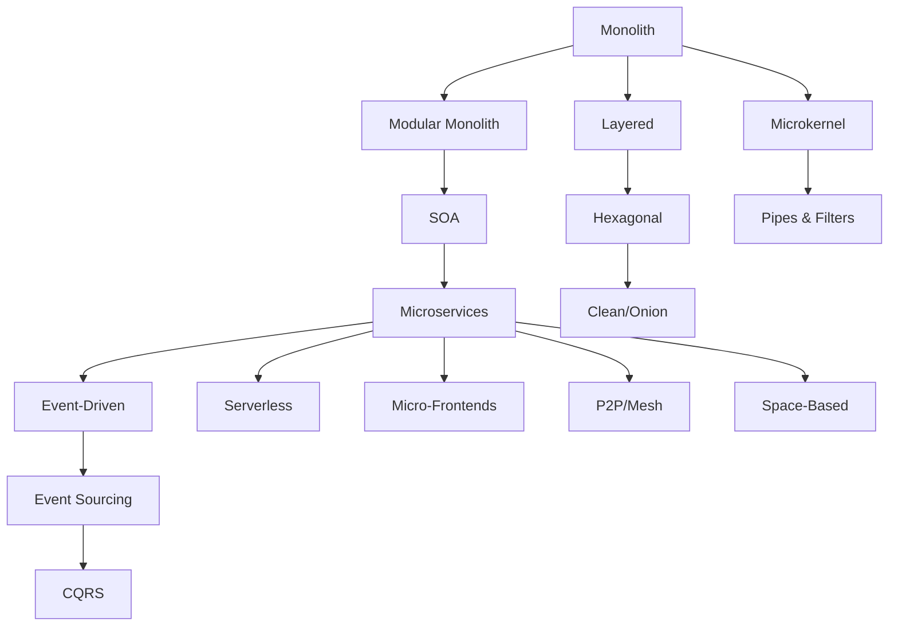

import { useCurrentSidebarCategory } from "@docusaurus/theme-common";

# Architectural Styles

Architectural styles define the high-level structure of a software system—how its major components interact, communicate, and distribute responsibilities. Each style offers distinct tradeoffs in complexity, scalability, resilience, and team organization.

This section explores 16 proven architectural patterns ranging from traditional monolithic systems to distributed event-driven architectures. Understanding when to apply each style—and when to avoid it—is fundamental to making sound design decisions that balance immediate delivery with long-term maintainability.

## Why Architectural Styles Matter

The style you choose shapes:
- **Communication patterns** between teams and components
- **Deployment and scaling strategies**
- **Failure boundaries and resilience**
- **Technology choices and tooling**
- **Cost and operational complexity**

No single style is "best." The optimal choice depends on your system's scale, domain complexity, team structure, and constraints.

## The Spectrum of Styles

Architectural styles exist on a spectrum from tight coupling to loose coupling, from centralized to distributed, and from monolithic to decomposed:

<Figure caption="Architectural styles spectrum">

</Figure>

## Quick Selection Guide

| **Scale** | **Coupling** | **Recommended Styles** |
|-----------|-------------|----------------------|
| Small/MVP | Tight | Monolith, Layered |
| Growing | Moderate | Modular Monolith, Microkernel |
| Large | Loose | Microservices, Event-Driven |
| Real-time/Scalable | Distributed | Serverless, Space-Based, P2P |
| Event-centric | Async | Event-Driven, Event Sourcing, CQRS |

## How to Use This Section

Each article includes:
- **Core concepts** with visual diagrams
- **Topology and structure** showing how components interact
- **Practical examples** with code or configuration patterns
- **Pros and cons** explicitly compared
- **When to use** decision criteria
- **Related styles** for deeper exploration

<DocCardList items={useCurrentSidebarCategory().items} />
