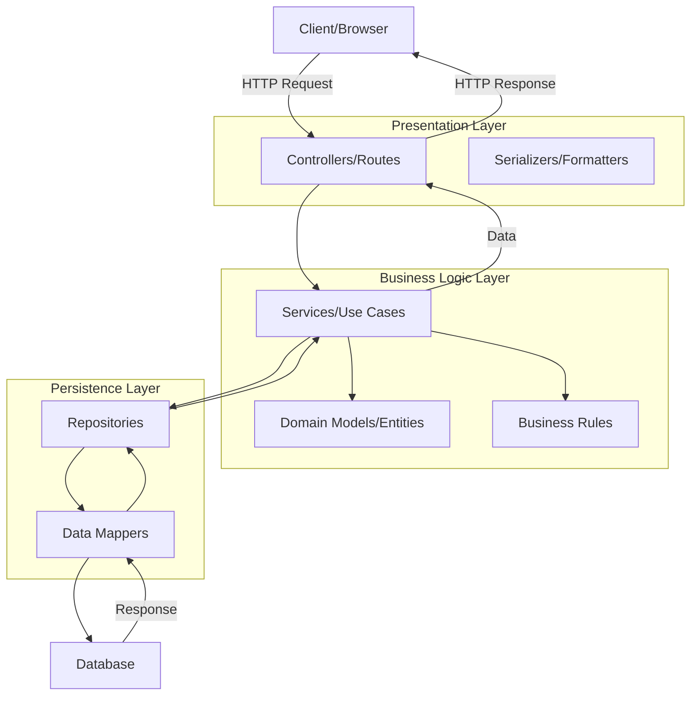

<Hero title="Layered (N-Tier) Architecture" subtitle="Organize code into horizontal layers of related responsibilities" imageAlt="Layered architecture with presentation, business logic, and data layers" size="large" />

## TL;DR

Layered architecture organizes code into horizontal layers—typically presentation, business logic, and persistence—where each layer has a specific responsibility. It's the most common monolithic style, easy to understand, but can become a "big ball of mud" if not disciplined. Works well for small-to-medium applications and teams just starting architectural thinking.

## Learning Objectives

- Understand the layered/n-tier model and typical layer responsibilities
- Identify common pitfalls like layer violations and lack of cohesion
- Evaluate when layered architecture is appropriate
- Recognize how layering can degrade without clear boundaries
- Transition to modular monolith or other patterns as complexity grows

## Motivating Scenario

Your team is building a web-based inventory management system. The initial scope is modest: 15-20 business entities, REST API, PostgreSQL database. You need a structure that's easy to onboard developers into without premature optimization. Layered architecture offers this—clear separation between HTTP handling, business rules, and database access.

## Core Concepts

Layered architecture divides a monolithic application into **horizontal tiers**, each encapsulating a specific domain of responsibility:

```
┌─────────────────────────────────┐
│   Presentation Layer            │  HTTP, REST, UI views
├─────────────────────────────────┤
│   Business Logic Layer          │  Domain rules, use cases
├─────────────────────────────────┤
│   Persistence Layer             │  Database access, ORM
├─────────────────────────────────┤
│   Database Layer                │  SQL, NoSQL storage
└─────────────────────────────────┘
```

Each layer:
- **Depends downward** (presentation → logic → persistence)
- **Has a specific role** (separate concerns)
- **Isolates technology changes** (swap ORM without affecting business rules)
- **Is testable in isolation** (mock lower layers)

<Figure caption="Typical layered architecture topology with request flow">

</Figure>

### Common Layer Structure

**Presentation Layer**: Handles HTTP requests, validation, serialization. No business logic.
**Business Logic Layer**: Domain models, service classes, use cases, rules engines.
**Persistence Layer**: Repositories, data access objects, ORM interactions.
**Database Layer**: SQL, document stores, caches.

Some systems add additional layers: API Gateway, Caching, External Service Integrations.

## Practical Example

<Tabs>
  <TabItem value="python" label="Python (FastAPI)">
    ```python
    # presentation/routes.py
    from fastapi import APIRouter, Depends
    from business.services import ProductService
    from models import ProductCreate, ProductResponse

    router = APIRouter(prefix="/products")

    @router.post("/", response_model=ProductResponse)
    async def create_product(product: ProductCreate,
                            service: ProductService = Depends()):
        return await service.create_product(product)

    @router.get("/{id}", response_model=ProductResponse)
    async def get_product(id: int, service: ProductService = Depends()):
        return await service.get_product(id)
    ```

    ```python
    # business/services.py
    class ProductService:
        def __init__(self, repo: ProductRepository):
            self.repo = repo

        async def create_product(self, data: ProductCreate):
            if not data.price > 0:
                raise ValueError("Price must be positive")

            product = Product(name=data.name, price=data.price)
            return await self.repo.save(product)

        async def get_product(self, id: int):
            product = await self.repo.find_by_id(id)
            if not product:
                raise NotFoundError(f"Product {id} not found")
            return product
    ```

    ```python
    # persistence/repositories.py
    class ProductRepository:
        def __init__(self, db_session):
            self.db = db_session

        async def save(self, product: Product):
            self.db.add(product)
            await self.db.commit()
            return product

        async def find_by_id(self, id: int):
            return await self.db.query(Product).filter(
                Product.id == id
            ).first()
    ```
  </TabItem>

  <TabItem value="java" label="Java (Spring Boot)">
    ```java
    // presentation/controller/ProductController.java
    @RestController
    @RequestMapping("/api/products")
    public class ProductController {
        private final ProductService service;

        public ProductController(ProductService service) {
            this.service = service;
        }

        @PostMapping
        public ResponseEntity<ProductDTO> create(@RequestBody ProductCreateDTO dto) {
            Product product = service.createProduct(dto);
            return ResponseEntity.status(CREATED).body(toDTO(product));
        }

        @GetMapping("/{id}")
        public ResponseEntity<ProductDTO> getById(@PathVariable Long id) {
            Product product = service.getProductById(id);
            return ResponseEntity.ok(toDTO(product));
        }
    }
    ```

    ```java
    // business/service/ProductService.java
    @Service
    public class ProductService {
        private final ProductRepository repository;

        public ProductService(ProductRepository repository) {
            this.repository = repository;
        }

        public Product createProduct(ProductCreateDTO dto) {
            if (dto.getPrice().compareTo(BigDecimal.ZERO) <= 0) {
                throw new InvalidPriceException("Price must be positive");
            }

            Product product = new Product();
            product.setName(dto.getName());
            product.setPrice(dto.getPrice());

            return repository.save(product);
        }

        public Product getProductById(Long id) {
            return repository.findById(id)
                .orElseThrow(() -> new ProductNotFoundException(id));
        }
    }
    ```

    ```java
    // persistence/repository/ProductRepository.java
    @Repository
    public interface ProductRepository extends JpaRepository<Product, Long> {
        Product findByName(String name);
    }
    ```
  </TabItem>

  <TabItem value="typescript" label="TypeScript (Express)">
    ```typescript
    // presentation/routes.ts

    export const productRouter = Router();
    const service = new ProductService();

    productRouter.post('/', async (req: Request, res: Response) => {
      try {
        const product = await service.createProduct(req.body);
        res.status(201).json(product);
      } catch (error) {
        res.status(400).json({ error: error.message });
      }
    });

    productRouter.get('/:id', async (req: Request, res: Response) => {
      try {
        const product = await service.getProduct(parseInt(req.params.id));
        res.json(product);
      } catch (error) {
        res.status(404).json({ error: error.message });
      }
    });
    ```

    ```typescript
    // business/ProductService.ts

    export class ProductService {
      private repo = new ProductRepository();

      async createProduct(data: { name: string; price: number }) {
        if (data.price <= 0) {
          throw new Error('Price must be positive');
        }

        const product = { name: data.name, price: data.price };
        return await this.repo.save(product);
      }

      async getProduct(id: number) {
        const product = await this.repo.findById(id);
        if (!product) throw new Error(`Product ${id} not found`);
        return product;
      }
    }
    ```

    ```typescript
    // persistence/ProductRepository.ts

    export class ProductRepository {
      private db = new Database();

      async save(product: any) {
        return await this.db.insert('products', product);
      }

      async findById(id: number) {
        return await this.db.query('SELECT * FROM products WHERE id = ?', [id]);
      }
    }
    ```
  </TabItem>
</Tabs>

## When to Use / When Not to Use

<Vs highlight={[1]} items={[
{
    label: "Use Layered Architecture When:",
    points: [
      "Building a small-to-medium monolithic application (< 2M LOC)",
      "Team is new to architectural thinking and needs a clear, easy structure",
      "Domain logic is well-defined and doesn't require frequent cross-cutting concerns",
      "Deployment as a single unit is acceptable",
      "You want maximum code reuse and minimal infrastructure complexity"
    ],
    highlightTone: "positive"
  },
{
    label: "Avoid Layered Architecture When:",
    points: [
      "System has independent scalability needs (some components scale faster than others)",
      "Multiple teams need independent deployment cycles",
      "You need fine-grained failure isolation (one failure shouldn't crash the entire app)",
      "Real-time event processing dominates the architecture",
      "Domain is highly complex with many bounded contexts"
    ],
    highlightTone: "warning"
  }
]} />

## Patterns and Pitfalls

<Showcase title="Patterns and Pitfalls" sections={[
  {
    label: "Pitfall: The Anemic Model",
    body: "Business logic bleeds into service layer; entities become mere data holders. Sign: ProductService with 50+ methods. Move logic into domain entities. Let Product validate itself, calculate discounts, etc. Keep services thin."
  },
  {
    label: "Pitfall: Layer Violations",
    body: "Controllers call repositories directly, or persistence code appears in domain models. Breaks separation of concerns. Enforce dependency direction: presentation → business → persistence. Use code reviews, static analysis, package visibility rules."
  },
  {
    label: "Pitfall: The Spaghetti Service",
    body: "A single service class grows to thousands of lines, handling unrelated domains (CreateProductService, UpdateInventory, SendNotifications). Break services by domain/use case. CreateProductService, UpdateInventoryService, NotificationService. Consider moving to microkernel or modular monolith."
  },
  {
    label: "Pattern: Repository Pattern",
    body: "Abstract data access behind repositories. Enables testing with in-memory implementations, swapping databases without touching business logic. Define repository interfaces in business layer, implement in persistence layer. Inject repositories into services."
  },
  {
    label: "Pattern: Dependency Injection",
    body: "Use DI frameworks (Spring, FastAPI Depends, etc.) to wire layers together, making testing and refactoring easier. Declare dependencies explicitly in constructors. Avoid service locators; use constructor injection."
  },
  {
    label: "Pattern: Cross-Cutting Concerns",
    body: "Logging, authentication, transaction management scatter across layers. Use middleware/interceptors/aspects to centralize. Configure logging, auth, transaction handling at framework level. Keep business code clean."
  }
]} />

## Design Review Checklist

<Checklist items={[
  "Does each layer have a single, clear responsibility? (presentation = HTTP, business = rules, persistence = access)",
  "Are all dependencies flowing downward (no layer depending on layers above it)?",
  "Can you test business logic without a database? (Repository mocked in unit tests)",
  "Can you understand what a new entity or use case does by walking through the layers?",
  "Are there any layers that have grown beyond ~500 lines? (Sign of mixed responsibilities)",
  "Do controllers/routes contain no business logic whatsoever?",
  "Are repositories used only by services, not directly by controllers?",
  "Is there a clear place to add a new use case (feature) without touching existing code?",
  "Could you swap the persistence technology (SQL → NoSQL) without rewriting business logic?"
]} />

## Self-Check

1. **What is the primary purpose of separating code into layers?** Isolate responsibility, enable independent testing, localize technology changes.
2. **Why should presentation logic never call repositories directly?** Creates coupling to data storage; breaks testability; violates layer semantics.
3. **When does layered architecture become a liability?** When system complexity grows, independent scaling is needed, or multiple teams require separate deployment cycles.

:::info
**One Takeaway**: Layered architecture is the starting point for most applications. It's easy to explain, structure, and test. Use it until you have a clear reason not to (independent scaling, multiple teams, event-driven workloads). Don't prematurely jump to microservices.
:::

## Next Steps

- **Modular Monolith**: Scale layered architecture by adding domain boundaries and module-level independence
- **Microkernel (Plug-in) Architecture**: Separate core from plug-in modules for more flexibility
- **Hexagonal Architecture**: Alternative approach to layering with ports and adapters
- **Clean/Onion Architecture**: Invert dependency direction to put domain at the core
- **Event-Driven Architecture**: Shift to async communication as system grows

## References

- Richards, M., & Ford, N. (2020). *Fundamentals of Software Architecture*. O'Reilly. ↗️
- Martin, R. C. (2017). *Clean Architecture*. Prentice Hall. (Chapters 24-26 on layering) ↗️
- Nygard, M. (2007). *Release It!* Pragmatic Bookshelf. (Chapter on architecture patterns) ↗️