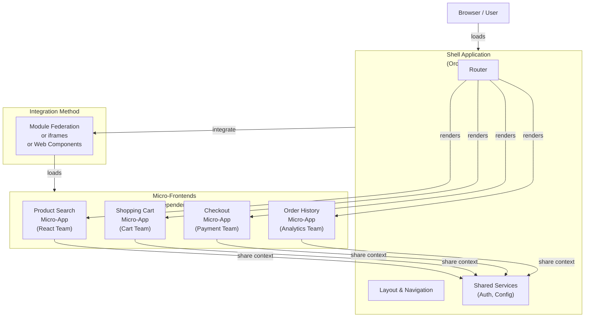

<Hero title="Micro-Frontends Architecture" subtitle="Decompose frontend into independent, deployable micro-applications" imageAlt="Micro-frontends architecture with independent UI applications" size="large" />

## TL;DR

Micro-Frontends extends microservices thinking to the frontend: decompose a monolithic UI into small, independent applications, each owned by a team, deployed separately. A shell (container/shell app) assembles them into a unified interface. Enables frontend team independence, different frameworks per micro-app, and independent deployment. Tradeoffs: shared dependencies, performance (multiple bundles), consistency (multiple apps, different behaviors).

## Learning Objectives

- Understand micro-frontend decomposition strategies
- Implement different integration approaches (iframes, module federation, web components)
- Design shared state and communication between micro-apps
- Handle styling and shared dependencies
- Know when micro-frontends are justified

## Motivating Scenario

Your e-commerce platform has a monolithic React application (200k LOC). Product Search, Shopping Cart, Checkout, and Order History teams all edit the same codebase. Cart team wants to deploy twice daily; Search team deploys weekly. Testing is complex (all teams' code must be tested together). Solution: decompose into micro-frontends. Search UI is a separate React app (owned by Search team), deployed independently. Cart UI is another app (owned by Cart team). A shell app assembles them. Teams deploy independently.

## Core Concepts

Micro-Frontends decomposes the frontend into **small, autonomous applications** integrated at runtime or build time:

**Shell (Container)**: The main application that orchestrates micro-apps. Handles routing, layout, shared services.

**Micro-App**: An independent UI application (React, Vue, Angular component) owned by a team. Can be deployed separately.

**Integration Method**: How shell and micro-apps communicate and share code. Options: iframes, module federation, web components, dynamic script loading.

**Shared Dependencies**: Common libraries (React, Redux) that all micro-apps use (or each includes separately for independence).

<Figure caption="Micro-frontends architecture with shell and independent applications">

</Figure>

### Integration Approaches

**iframes**: Isolation (separate DOM, CSS, JS). Slowest, but safest.

**Module Federation**: Webpack 5+ feature. Share dependencies, load micro-apps at runtime.

**Web Components**: Encapsulated components with Shadow DOM. Framework-agnostic.

**Dynamic Script Loading**: Load micro-app bundles dynamically. Requires coordination.

## Practical Example

```javascript
// Shell Application (webpack.config.js with Module Federation)
const { ModuleFederationPlugin } = require("webpack").container;

module.exports = {
  mode: "development",
  entry: "./src/index",
  output: {
    path: path.resolve(__dirname, "dist"),
    filename: "[name].[contenthash].js"
  },
  devServer: { port: 3000, historyApiFallback: true },
  plugins: [
    new ModuleFederationPlugin({
      name: "shell",
      filename: "remoteEntry.js",
      remotes: {
        productSearch: "productSearch@http://localhost:3001/remoteEntry.js",
        cart: "cart@http://localhost:3002/remoteEntry.js",
        checkout: "checkout@http://localhost:3003/remoteEntry.js"
      },
      shared: ["react", "react-dom", "redux", "react-redux"]
    })
  ]
};

// Shell App (index.jsx)

const ProductSearchApp = React.lazy(() => import("productSearch/App"));
const CartApp = React.lazy(() => import("cart/App"));
const CheckoutApp = React.lazy(() => import("checkout/App"));

export default function ShellApp() {
  const [cart, setCart] = useState([]);

  return (
    <Router>
      <div style={{ display: "flex" }}>
        <nav style={{ width: "20%", borderRight: "1px solid gray" }}>
          <h1>E-Commerce</h1>
          <a href="/">Search</a>
          <a href="/cart">Cart ({cart.length})</a>
          <a href="/checkout">Checkout</a>
        </nav>
        <main style={{ width: "80%", padding: "20px" }}>
          <Suspense fallback={<div>Loading...</div>}>
            <Routes>
              <Route path="/" element={<ProductSearchApp onAddToCart={(item) => setCart([...cart, item])} />} />
              <Route path="/cart" element={<CartApp sections={cart} />} />
              <Route path="/checkout" element={<CheckoutApp />} />
            </Routes>
          </Suspense>
        </main>
      </div>
    </Router>
  );
}
```

```javascript
// Product Search Micro-App (webpack.config.js)
const { ModuleFederationPlugin } = require("webpack").container;

module.exports = {
  mode: "development",
  entry: "./src/index",
  output: {
    path: path.resolve(__dirname, "dist"),
    filename: "[name].[contenthash].js"
  },
  devServer: { port: 3001, historyApiFallback: true },
  plugins: [
    new ModuleFederationPlugin({
      name: "productSearch",
      filename: "remoteEntry.js",
      exposes: {
        "./App": "./src/App"  // Export App component
      },
      shared: ["react", "react-dom"]
    })
  ]
};

// Product Search App (src/App.jsx)

export default function ProductSearchApp({ onAddToCart }) {
  const [products, setProducts] = useState([]);

  useEffect(() => {
    // Fetch products from backend
    fetch("/api/products")
      .then(r => r.json())
      .then(setProducts);
  }, []);

  return (
    <div>
      <h2>Product Search</h2>
      {products.map(p => (
        <div key={p.id} style={{ border: "1px solid #ccc", padding: "10px", marginBottom: "10px" }}>
          <h3>{p.name}</h3>
          <p>{p.description}</p>
          <button onClick={() => onAddToCart(p)}>Add to Cart</button>
        </div>
      ))}
    </div>
  );
}
```

```javascript
// Cart Micro-App (separate deployment)
// webpack.config.js - similar setup
// src/App.jsx

export default function CartApp({ items }) {
  const total = items.reduce((sum, item) => sum + item.price, 0);

  return (
    <div>
      <h2>Shopping Cart</h2>
      {items.length === 0 ? (
        <p>Cart is empty</p>
      ) : (
        <>
          <ul>
            {items.map(item => (
              <li key={item.id}>{item.name} - ${item.price}</li>
            ))}
          </ul>
          <h3>Total: ${total}</h3>
        </>
      )}
    </div>
  );
}
```

## When to Use / When Not to Use

<Vs highlight={[1]} items={[
{
    label: "Use Micro-Frontends When:",
    points: [
      "Frontend is large (100k+ LOC) with multiple teams",
      "Teams need independent deployment (Product vs Cart vs Checkout)",
      "Teams want to use different frameworks (React, Vue, Angular)",
      "Need to scale frontend team velocity",
      "Consistency is less important than independence",
      "Can tolerate added complexity (bundle size, build tooling)"
    ],
    highlightTone: "positive"
  },
{
    label: "Avoid Micro-Frontends When:",
    points: [
      "Frontend is small or monolithic (&lt;50k LOC)",
      "Single team maintains it",
      "Consistent UX/styling is paramount",
      "Bundle size and performance are critical",
      "Team lacks sophistication for distributed frontend",
      "Low latency (every extra HTTP request matters)"
    ],
    highlightTone: "warning"
  }
]} />

## Patterns and Pitfalls

<Showcase title="Patterns and Pitfalls" sections={[
  {
    label: "Pitfall: Bundle Bloat",
    body: "Each micro-app bundles React, Redux, etc. Total bundle size massive. Use Module Federation to share dependencies. Or accept bundle size tradeoff."
  },
  {
    label: "Pitfall: Shared State Chaos",
    body: "Multiple micro-apps update Redux store differently. Global state out of sync. Define shared state schema clearly. Use message passing or event-driven communication."
  },
  {
    label: "Pitfall: Styling Conflicts",
    body: "Global CSS from one micro-app breaks styling in another. Use CSS-in-JS (styled-components, CSS modules) for isolation. Or shadow DOM (Web Components)."
  },
  {
    label: "Pattern: Shared Context",
    body: "Shell provides shared authentication, config, services via Context or props. Wrap micro-apps with shared providers. Or use localStorage/sessionStorage for lightweight sharing."
  },
  {
    label: "Pattern: Event Bus",
    body: "Micro-apps publish/subscribe to events for loose coupling. Simple PubSub in shared library. Or use proper event system."
  }
]} />

## Design Review Checklist

<Checklist items={[
  "Is the frontend large and complex enough to justify decomposition?",
  "Are micro-app boundaries aligned with team boundaries?",
  "Is the integration method (Module Federation, iframes) appropriate?",
  "Are shared dependencies optimized (not duplicated)?",
  "Is shared state management simple and clear?",
  "Are styling conflicts prevented (CSS-in-JS, shadow DOM)?",
  "Can each micro-app be tested independently?",
  "Can each micro-app be deployed independently?",
  "Is the shell app thin (orchestration only)?",
  "Have you stress-tested bundle size and performance?"
]} />

## Shared State Management Patterns

### Event Bus Pattern

```javascript
class EventBus {
    constructor() {
        this.subscribers = {};
    }

    subscribe(event, handler) {
        if (!this.subscribers[event]) {
            this.subscribers[event] = [];
        }
        this.subscribers[event].push(handler);
        return () => {
            this.subscribers[event] = this.subscribers[event].filter(h => h !== handler);
        };
    }

    publish(event, data) {
        if (this.subscribers[event]) {
            this.subscribers[event].forEach(handler => handler(data));
        }
    }
}

const eventBus = new EventBus();

// Product Search publishes "product-selected"
eventBus.publish('product-selected', { id: 'PROD-001', name: 'Laptop' });

// Cart subscribes to product selection
eventBus.subscribe('product-selected', (product) => {
    // Add to cart or update UI
    cartApp.addItem(product);
});

// Checkout subscribes to cart updates
eventBus.subscribe('cart-updated', (cart) => {
    checkoutApp.updateTotal(cart.total);
});
```

### Shared Context Pattern

```javascript
// Shell creates shared context
class SharedContext {
    constructor() {
        this.user = null;
        this.cart = [];
        this.subscribers = [];
    }

    setUser(user) {
        this.user = user;
        this.notify();
    }

    addToCart(item) {
        this.cart.push(item);
        this.notify();
    }

    subscribe(handler) {
        this.subscribers.push(handler);
        return () => {
            this.subscribers = this.subscribers.filter(h => h !== handler);
        };
    }

    notify() {
        this.subscribers.forEach(handler => handler(this));
    }
}

const context = new SharedContext();

// Micro-apps access shared context
ProductSearchApp.init({ context });
CartApp.init({ context });
CheckoutApp.init({ context });
```

## Integration Techniques Comparison

| Technique | Isolation | Performance | Framework | Bundle Size |
|-----------|-----------|-------------|-----------|-------------|
| iframes | High | Low (extra HTTP) | Any | Duplicated |
| Module Fed. | Medium | High (shared) | Webpack 5+ | Optimized |
| Web Components | High | Medium | Any | Overhead |
| Script Load | Low | High | Any | Duplicated |

## Styling Isolation Solutions

```javascript
// Option 1: CSS Modules (scoped classnames)
// Button.module.css
.button {
    padding: 10px;
    border-radius: 4px;
}

// Button.js
import styles from './Button.module.css';
export function Button() {
    return <button className={styles.button}>Click me</button>;
    // Outputs: <button class="_Button_button_x7h2k">Click me</button>
}

// Option 2: CSS-in-JS (styled-components)
import styled from 'styled-components';

const StyledButton = styled.button`
    padding: 10px;
    border-radius: 4px;
    background: ${props => props.primary ? 'blue' : 'gray'};
`;

export function Button() {
    return <StyledButton primary>Click me</StyledButton>;
}

// Option 3: Shadow DOM (Web Components)
class MyButton extends HTMLElement {
    connectedCallback() {
        const shadow = this.attachShadow({ mode: 'open' });
        shadow.innerHTML = `
            <style>
                button { padding: 10px; border-radius: 4px; }
            </style>
            <button><slot></slot></button>
        `;
    }
}
customElements.define('my-button', MyButton);

// Shadow DOM isolates styles; external CSS can't affect button
```

## Testing Micro-Frontends

```javascript
// Unit test micro-app in isolation
describe('ProductSearch Micro-App', () => {
    it('should add item to cart on selection', () => {
        const mockContext = { addToCart: jest.fn() };
        const app = new ProductSearchApp(mockContext);

        app.selectProduct({ id: 'P1', name: 'Laptop' });

        expect(mockContext.addToCart).toHaveBeenCalledWith({
            id: 'P1', name: 'Laptop'
        });
    });
});

// Integration test: multiple micro-apps interacting
describe('Cart and Checkout Integration', () => {
    it('should update checkout when cart changes', () => {
        const context = new SharedContext();
        const cart = new CartApp(context);
        const checkout = new CheckoutApp(context);

        context.addToCart({ price: 99.99 });

        expect(checkout.getTotal()).toEqual(99.99);
    });
});

// E2E test: entire application flow
describe('Micro-Frontends E2E', () => {
    it('should complete purchase flow', async () => {
        await page.goto('http://localhost:3000');
        await page.click('button:has-text("Search Products")');
        await page.fill('input[placeholder="Search"]', 'Laptop');
        await page.click('button:has-text("Add to Cart")');
        await page.click('a:has-text("Cart")');
        expect(await page.textContent('total')).toContain('$99.99');
        await page.click('button:has-text("Checkout")');
        expect(page.url()).toContain('/checkout');
    });
});
```

## Self-Check

1. **What's the main benefit of micro-frontends?** Team independence and independent deployment. Teams can work on different UI pieces without coordination or merge conflicts.

2. **What's the main tradeoff?** Complexity in bundling (managing shared dependencies), state management (coordinating across apps), styling (preventing conflicts), and bundle size (potential duplication).

3. **When would you NOT use micro-frontends?**
   - Small frontend (< 50k LOC)
   - Single team
   - Performance is critical (bundle size matters)
   - Consistent UX/styling paramount
   - Team lacks infrastructure sophistication

4. **How do you share state between micro-apps?** Event bus, context API, or shared store (Redux). Each has tradeoffs in coupling and complexity.

5. **What's the most important skill for micro-frontend architecture?** Clear team boundaries and communication. Technical choices matter less than organizational alignment.

:::info
**One Takeaway**: Micro-frontends are microservices for the frontend. Use when you have multiple frontend teams needing independence. For small teams or single-developer projects, the complexity isn't worth it.

:::

## Next Steps

- **Module Federation**: Webpack 5+ for sharing code across micro-apps
- **Web Components**: Framework-agnostic component model for isolation
- **Design Systems**: Shared component libraries for consistency
- **Shared State Management**: Redux, Zustand across micro-apps
- **Performance Optimization**: Lazy loading, code splitting for micro-frontends

## References

- Lerner, G. Micro Frontends. martinfowler.com ↗️
- Module Federation Documentation. webpack.js.org ↗️
- Web Components MDN Documentation ↗️