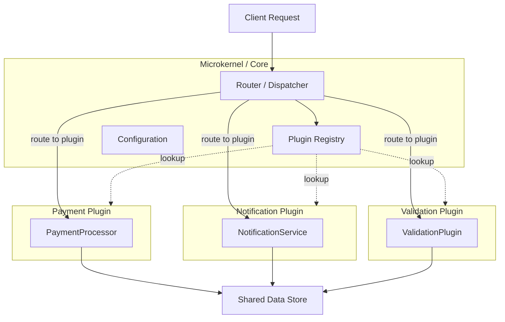
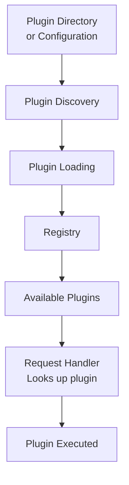

<Hero title="Microkernel (Plug-in) Architecture" subtitle="Core system with plug-in modules that extend functionality without modifying core" imageAlt="Microkernel architecture with core and plugin modules" size="large" />

## TL;DR

Microkernel architecture separates a minimal core system from optional plug-in modules. The core handles essential operations; plug-ins extend functionality without modifying core code. Useful for customizable products, rule engines, and workflow systems where different users need different features. Simpler than microservices, but couples all plug-ins through the registry and core.

## Learning Objectives

- Understand microkernel (core) vs plug-in (extensions) separation
- Design extension points and plug-in interfaces
- Implement a plug-in registry and discovery mechanism
- Identify when microkernel is better than modular monolith or microservices
- Recognize pitfalls: plug-in ordering, plugin interdependencies

## Motivating Scenario

Your company builds a business rules engine for insurance claims processing. Some customers want custom claim validation logic, others want different approval workflows. Instead of forking the codebase per customer, you design a core rules engine (microkernel) with extension points for custom validators and processors (plug-ins). Each customer's custom logic is a plug-in loaded at runtime.

## Core Concepts

Microkernel splits an application into two parts:

**Core System**: Handles essential, common operations. Small, stable, rarely changes. Examples: router, config loader, database connection.

**Plug-in Modules**: Optional, pluggable features. Each can be independently enabled, disabled, or replaced. Examples: PayPal payment processor, Stripe payment processor.

<Figure caption="Microkernel architecture with plugin registry">

</Figure>

### Core Characteristics

**Small Core**: Minimal, essential logic. Router, configuration, plugin loading.

**Plugin Interface**: Well-defined contract. All plugins implement a common interface or follow a naming convention.

**Plugin Registry**: Central place to discover and load plugins. Can be file-system based (load from plugin directory), or code-based (register in dependency injection container).

**Extension Points**: Documented places where plugins hook in. Examples: payment processor interface, validator interface.

**Isolation**: Each plugin is independent; can be tested, developed, deployed in isolation.

<Figure caption="Plugin lifecycle: discovery, loading, registration">

</Figure>

## Practical Example

<Tabs>
  <TabItem value="core" label="Core System">
    ```python
    # core/plugin_registry.py
    from typing import Dict, Type, Any
    import importlib
    import os

    class PluginRegistry:
        def __init__(self):
            self.plugins: Dict[str, Type] = {}

        def register(self, plugin_type: str, plugin_class: Type):
            """Register a plugin class by type."""
            self.plugins[plugin_type] = plugin_class

        def load_plugins(self, plugin_dir: str = "./plugins"):
            """Auto-discover and load plugins from directory."""
            if not os.path.exists(plugin_dir):
                return

            for filename in os.listdir(plugin_dir):
                if filename.endswith('.py') and not filename.startswith('_'):
                    module_name = filename[:-3]
                    try:
                        module = importlib.import_module(f"plugins.{module_name}")
                        # Plugins define __plugin_type__ and __plugin_class__
                        if hasattr(module, '__plugin_type__'):
                            plugin_type = module.__plugin_type__
                            plugin_class = module.__plugin_class__
                            self.register(plugin_type, plugin_class)
                            print(f"Loaded plugin: {plugin_type}")
                    except Exception as e:
                        print(f"Failed to load {module_name}: {e}")

        def get_plugin(self, plugin_type: str) -> Type:
            """Retrieve a plugin by type."""
            if plugin_type not in self.plugins:
                raise ValueError(f"Plugin {plugin_type} not registered")
            return self.plugins[plugin_type]

        def list_plugins(self) -> list:
            """List all registered plugins."""
            return list(self.plugins.keys())

    # core/interfaces.py
    from abc import ABC, abstractmethod

    class PaymentProcessor(ABC):
        """Extension point: payment processors."""
        @abstractmethod
        def process_payment(self, amount: float, account: str) -> bool:
            pass

    class NotificationService(ABC):
        """Extension point: notification services."""
        @abstractmethod
        def send(self, user_id: str, message: str) -> bool:
            pass

    # core/router.py
    class RequestRouter:
        def __init__(self, registry: PluginRegistry):
            self.registry = registry

        def handle_payment_request(self, payment_type: str, amount: float):
            try:
                processor_class = self.registry.get_plugin(f"payment_{payment_type}")
                processor = processor_class()
                return processor.process_payment(amount, account="default")
            except Exception as e:
                return {"error": str(e)}

        def handle_notification(self, service_type: str, user_id: str, message: str):
            try:
                service_class = self.registry.get_plugin(f"notify_{service_type}")
                service = service_class()
                return service.send(user_id, message)
            except Exception as e:
                return {"error": str(e)}
    ```
  </TabItem>

  <TabItem value="plugins" label="Plugin Implementations">
    ```python
    # plugins/payment_stripe.py
    from core.interfaces import PaymentProcessor

    class StripePaymentProcessor(PaymentProcessor):
        def process_payment(self, amount: float, account: str) -> bool:
            # Call Stripe API
            print(f"Processing ${amount} with Stripe for {account}")
            # Simulate API call
            return True

    __plugin_type__ = "payment_stripe"
    __plugin_class__ = StripePaymentProcessor

    # plugins/payment_paypal.py
    from core.interfaces import PaymentProcessor

    class PayPalPaymentProcessor(PaymentProcessor):
        def process_payment(self, amount: float, account: str) -> bool:
            print(f"Processing ${amount} with PayPal for {account}")
            return True

    __plugin_type__ = "payment_paypal"
    __plugin_class__ = PayPalPaymentProcessor

    # plugins/notify_email.py
    from core.interfaces import NotificationService

    class EmailNotificationService(NotificationService):
        def send(self, user_id: str, message: str) -> bool:
            print(f"Sending email to user {user_id}: {message}")
            return True

    __plugin_type__ = "notify_email"
    __plugin_class__ = EmailNotificationService

    # plugins/notify_sms.py
    from core.interfaces import NotificationService

    class SMSNotificationService(NotificationService):
        def send(self, user_id: str, message: str) -> bool:
            print(f"Sending SMS to user {user_id}: {message}")
            return True

    __plugin_type__ = "notify_sms"
    __plugin_class__ = SMSNotificationService
    ```
  </TabItem>

  <TabItem value="main" label="Application Bootstrap">
    ```python
    # main.py
    from core.plugin_registry import PluginRegistry
    from core.router import RequestRouter

    def main():
        # Initialize core
        registry = PluginRegistry()

        # Auto-discover plugins from ./plugins directory
        registry.load_plugins("./plugins")

        print(f"Available plugins: {registry.list_plugins()}")
        # Output: ['payment_stripe', 'payment_paypal', 'notify_email', 'notify_sms']

        # Create router with registry
        router = RequestRouter(registry)

        # Handle requests
        result1 = router.handle_payment_request("stripe", 99.99)
        print(f"Stripe payment: {result1}")

        result2 = router.handle_payment_request("paypal", 50.00)
        print(f"PayPal payment: {result2}")

        result3 = router.handle_notification("email", "user123", "Order shipped!")
        print(f"Email notification: {result3}")

        # Can add new plugins at runtime without restarting core
        # Or disable plugins by removing from directory

    if __name__ == '__main__':
        main()
    ```
  </TabItem>

  <TabItem value="config" label="Configuration-Based Registration">
    ```yaml
    # config/plugins.yml
    plugins:
      - type: payment_stripe
        enabled: true
        module: plugins.payment_stripe
        class: StripePaymentProcessor

      - type: payment_paypal
        enabled: false
        module: plugins.payment_paypal
        class: PayPalPaymentProcessor

      - type: notify_email
        enabled: true
        module: plugins.notify_email
        class: EmailNotificationService

      - type: notify_sms
        enabled: true
        module: plugins.notify_sms
        class: SMSNotificationService
    ```

    ```python
    # core/config_loader.py
    import yaml
    from core.plugin_registry import PluginRegistry
    import importlib

    def load_from_config(registry: PluginRegistry, config_file: str):
        with open(config_file, 'r') as f:
            config = yaml.safe_load(f)

        for plugin_config in config['plugins']:
            if not plugin_config.get('enabled', True):
                continue

            module = importlib.import_module(plugin_config['module'])
            plugin_class = getattr(module, plugin_config['class'])
            registry.register(plugin_config['type'], plugin_class)

        return registry
    ```
  </TabItem>
</Tabs>

## When to Use / When Not to Use

<Vs highlight={[1]} items={[
{
    label: "Use Microkernel When:",
    points: [
      "Building a customizable product with optional features (e.g., e-commerce platform with optional payment processors)",
      "Need to add new features (plugins) without modifying core code",
      "Plugins are independent and don't heavily depend on each other",
      "Want simpler deployment than microservices but more flexibility than monolith",
      "Rules engine, workflow engine, or templating system"
    ],
    highlightTone: "positive"
  },
{
    label: "Avoid Microkernel When:",
    points: [
      "Plugins have complex interdependencies (defeats purpose of modularity)",
      "Plugins need independent scaling (use microservices instead)",
      "Core system changes frequently (defeats purpose of stable core)",
      "Need true network isolation and fault boundaries (use microservices)",
      "Plugin initialization order matters heavily (sign of poor design)"
    ],
    highlightTone: "warning"
  }
]} />

## Patterns and Pitfalls

<Showcase title="Patterns and Pitfalls" sections={[
  {
    label: "Pitfall: Plugin Interdependencies",
    body: "Plugin A depends on Plugin B. If B is disabled or fails, A breaks. Keep plugins independent. If they need to communicate, use event-driven approach or pass data through core."
  },
  {
    label: "Pitfall: Core Bloat",
    body: "Core accumulates too many responsibilities trying to serve all plugins. Keep core minimal. Any logic that could be plugin-specific should be in a plugin."
  },
  {
    label: "Pitfall: Plugin Discovery Fragility",
    body: "Plugins fail to load due to missing dependencies or wrong class names. Use explicit configuration (YAML) with validation. Log detailed errors. Fail fast on load errors."
  },
  {
    label: "Pattern: Plugin Metadata",
    body: "Each plugin declares version, dependencies, authors. Registry validates on load. Define a manifest or metadata interface. Check compatibility before registration."
  },
  {
    label: "Pattern: Plugin Lifecycle",
    body: "Plugins can be loaded, initialized, unloaded. Not just static registration. Implement init() and shutdown() methods. Allow hot-swapping plugins without restart."
  },
  {
    label: "Pattern: Namespace Isolation",
    body: "Each plugin gets its own namespace or registry to avoid naming conflicts. Prefix plugin names by category (payment_*, notification_*, etc). Use hierarchical registry."
  }
]} />

## Design Review Checklist

<Checklist items={[
  "Is the core system truly minimal? (< 500 LOC ideally)",
  "Are all extension points clearly documented with examples?",
  "Can a plugin be added without modifying core code?",
  "Do all plugins implement a common interface or naming convention?",
  "Is the plugin registry easy to understand and extend?",
  "Can plugins be tested in isolation with mocked core?",
  "Do plugins have explicit dependencies declared?",
  "Is plugin initialization order deterministic and documented?",
  "Can you list, enable, disable plugins at runtime?",
  "Are there namespace conflicts between plugins (e.g., two payment_stripe plugins)?"
]} />

## Self-Check

1. **What's the key difference between microkernel and modular monolith?** Microkernel has a minimal core with optional plugins; modular monolith keeps all modules in one codebase with equal importance.
2. **When would plugin interdependencies be a problem?** If Plugin A needs Plugin B, disabling B breaks A. Defeats modularity. Plugins should be independent.
3. **How could you test a plugin in isolation?** Mock the core registry and interfaces. Test the plugin without loading other plugins or the real core.

:::info
**One Takeaway**: Microkernel shines for customizable products where different customers use different features. Keep the core absolutely minimal; don't let it become a dumping ground for shared logic. Use clear extension points and explicit plugin registration.
:::

## Next Steps

- **Modular Monolith**: Alternative when plugins have frequent interdependencies
- **Microservices**: When plugins need independent scaling or deployment
- **Rule Engine Architecture**: Apply microkernel concepts to business rules
- **Plugin Discovery Patterns**: Java SPI, OSGi, or custom mechanisms
- **Configuration Management**: Externalize plugin configuration for easy customization

## References

- Richards, M., & Ford, N. (2020). *Fundamentals of Software Architecture*. O'Reilly. ↗️
- Newman, S. (2015). *Building Microservices*. O'Reilly. ↗️
- Apache Foundation OSGi documentation ↗️