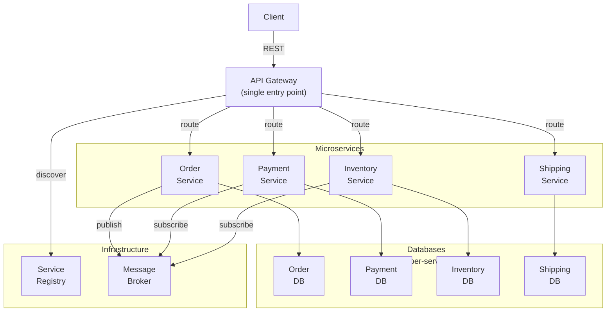

<Hero title="Microservices Architecture" subtitle="Fine-grained services with independent deployment, scaling, and technology choices" imageAlt="Microservices architecture with multiple services and API gateway" size="large" />

## TL;DR

Microservices decomposes an application into small, independently deployable services, each owned by a team, with its own database and technology stack. Enables rapid deployment, independent scaling, and technology diversity. Tradeoff: operational complexity (orchestration, networking, debugging) and data consistency challenges. Golden goose for large, fast-growing organizations; overkill for small teams.

## Learning Objectives

- Understand fine-grained service design and bounded contexts
- Identify when to split monoliths into microservices
- Handle distributed system challenges: resilience, eventual consistency, monitoring
- Implement service discovery, API gateway, and inter-service communication
- Recognize microservices antipatterns (distributed monolith, chatty services)

## Motivating Scenario

Your SaaS platform serves 1000+ customers with $100M ARR. Engineering grew from 5 to 50 people across 10 teams. The monolith deploys every 2 weeks; teams can't move independently. You split into microservices: Order Service (team A), Payment Service (team B), Inventory Service (team C), etc. Each team deploys independently, owns their service, chooses their stack (Python, Go, Java). Organizations scale faster.

## Core Concepts

Microservices is an approach to structure an application as **many small services, each running in its own process, communicating over networks**:

**Service**: Independently deployable, focused business capability (Order, Payment, Inventory). Owned by one team.

**Bounded Context**: Clear service boundary. What belongs in Order Service vs Payment Service is explicit.

**API Gateway**: Single entry point for clients. Routes requests to appropriate service.

**Service Registry**: Services register themselves; API Gateway discovers them dynamically.

**Database Per Service**: Each service owns its database. No shared database (enables independent evolution).

<Figure caption="Microservices architecture with API gateway, registry, and message broker">

</Figure>

### Key Principles

**Independent Deployment**: Deploy one service without redeploying others.

**Technology Heterogeneity**: Each service chooses its stack (language, framework, database).

**Focused Business Capability**: Service cohesion around a single business domain.

**Decentralized Data Management**: Each service manages its own data; no shared database.

**Observable**: Logging, monitoring, tracing across service boundaries.

**Resilient**: Graceful degradation when one service is down.

## When to Use / When Not to Use

<Vs highlight={[1]} items={[
{
    label: "Use Microservices When:",
    points: [
      "Organization has 30+ engineers across multiple teams needing independent deployment",
      "Components have dramatically different scaling needs",
      "Need technology diversity (Python for ML, Go for infrastructure, Java for business logic)",
      "Large system where monolith becomes hard to maintain (> 1M LOC)",
      "Continuous deployment critical to business (multiple deploys per day)",
      "Need strong failure isolation (one service down doesn't crash everything)"
    ],
    highlightTone: "positive"
  },
{
    label: "Avoid Microservices When:",
    points: [
      "Team is small (< 10 people) and can coordinate easily",
      "System is simple and well-contained (MVP, internal tool)",
      "Organization not mature enough for distributed systems ops",
      "Network latency or reliability is critical constraint",
      "Team lacks experience with container orchestration (Kubernetes) and monitoring",
      "Must minimize operational complexity"
    ],
    highlightTone: "warning"
  }
]} />

## Patterns and Pitfalls

<Showcase title="Patterns and Pitfalls" sections={[
  {
    label: "Pitfall: Distributed Monolith",
    body: "Services can't be deployed independently; still tightly coupled through shared database or hardcoded interdependencies. Each service owns its database. Use event-driven or saga pattern for cross-service transactions."
  },
  {
    label: "Pitfall: Chatty Services",
    body: "Service A calls Service B calls Service C in a long chain. Latency, cascading failures. Batch requests. Cache results. Use async events instead of sync calls when possible."
  },
  {
    label: "Pitfall: Shared Database",
    body: "Services share a single database to 'simplify' data consistency. Database per service. Accept eventual consistency. Use sagas for distributed transactions."
  },
  {
    label: "Pattern: API Gateway",
    body: "Single entry point abstracts service topology. Clients don't need to know about individual services. API Gateway handles routing, authentication, rate limiting, logging."
  },
  {
    label: "Pattern: Service Discovery",
    body: "Services register themselves; clients discover endpoints dynamically. Use Consul, Eureka, Kubernetes DNS. Don't hardcode service URLs."
  },
  {
    label: "Pattern: Circuit Breaker",
    body: "Prevent cascading failures when a service is down. Quick fail instead of hanging. Implement circuit breaker (Hystrix, Resilience4j). Fallback gracefully."
  }
]} />

## Design Review Checklist

<Checklist items={[
  "Is each service independently deployable without redeploying others?",
  "Does each service own its own database (no shared DB)?",
  "Are service boundaries aligned with team boundaries and business domains?",
  "Can services be replaced or rewritten independently?",
  "Is inter-service communication via well-defined APIs (REST, gRPC, events)?",
  "Do you have API gateway or service mesh for request routing?",
  "Is service discovery automated (not hardcoded endpoints)?",
  "Are you monitoring service health, latency, and error rates?",
  "Can you trace a request across services (distributed tracing)?",
  "Is data consistency strategy explicit (eventual, sagas, events)?"
]} />

## Building Blocks: Implementing Microservices

### Service Boundaries Using Bounded Contexts

Map DDD bounded contexts to microservices:

```
E-Commerce System:

Bounded Context: Order Management
├─ Entities: Order, LineItem
├─ Services: OrderService, OrderRepository
├─ Events: OrderCreated, OrderShipped
└─ Microservice: Order Service (Python, PostgreSQL)

Bounded Context: Payment Processing
├─ Entities: Payment, Transaction
├─ Services: PaymentService, PaymentRepository
├─ Events: PaymentAuthorized, PaymentCaptured
└─ Microservice: Payment Service (Go, PostgreSQL)

Bounded Context: Inventory Management
├─ Entities: Product, Stock
├─ Services: InventoryService, StockRepository
├─ Events: StockReserved, StockReleased
└─ Microservice: Inventory Service (Java, DynamoDB)
```

### Deployment Architecture

```
┌─────────────────────────────────────────────────────┐
│ Kubernetes Cluster                                  │
├─────────────────────────────────────────────────────┤
│                                                     │
│  ┌──────────────┐  ┌──────────────┐  ┌──────────┐ │
│  │Order Service │  │Payment Svc   │  │Inventory │ │
│  │(Pod)         │  │(Pod)         │  │(Pod)     │ │
│  │Port 8001     │  │Port 8002     │  │Port 8003 │ │
│  └──────────────┘  └──────────────┘  └──────────┘ │
│        │                  │                 │      │
│  ┌─────┴──────┬──────────┴────┬──────────────┴──┐ │
│  │            │               │                │ │
│  │      Service Registry (Consul/Eureka)      │ │
│  │  Services register themselves, auto-discover  │ │
│  └──────────────┬────────────────────────────┘  │ │
│                 │                                │ │
│  ┌──────────────┴────────────────────────────┐  │ │
│  │       API Gateway (Kong/Ambassador)       │  │ │
│  │  - Route requests to services              │  │ │
│  │  - Auth, rate limiting, logging            │  │ │
│  └──────────────────────────────────────────┘  │ │
│                                                 │ │
│  ┌────────────────────────────────────────┐   │ │
│  │  Message Broker (Kafka)                 │   │ │
│  │  - Event streaming                      │   │ │
│  │  - Service-to-service async comms       │   │ │
│  └────────────────────────────────────────┘   │ │
│                                                 │ │
└─────────────────────────────────────────────────┘ │
```

### Inter-Service Communication Patterns

**1. Request-Reply (Synchronous)**

```python
# Order Service calls Inventory Service synchronously
def create_order(order_data):
    order = Order(**order_data)

    # Direct HTTP call to Inventory Service
    try:
        inventory_response = requests.post(
            "http://inventory-service/reserve",
            json={"items": order.line_items},
            timeout=5
        )
        if inventory_response.status_code != 200:
            raise Exception("Inventory reservation failed")
    except requests.Timeout:
        raise Exception("Inventory service timeout")

    order.status = "confirmed"
    return order

# Pro: Simple, immediate feedback
# Con: Tight coupling, cascade failures, harder to scale
```

**2. Event-Driven (Asynchronous)**

```python
# Order Service publishes events
def create_order(order_data):
    order = Order(**order_data)
    order.status = "pending"

    # Publish event, return immediately
    event_broker.publish("orders.created", {
        "order_id": order.id,
        "customer_id": order.customer_id,
        "items": order.line_items
    })

    return order

# Inventory Service subscribes to orders.created event
@event_broker.on("orders.created")
def handle_order_created(event):
    try:
        reserve_inventory(event["items"])
        event_broker.publish("inventory.reserved", {
            "order_id": event["order_id"]
        })
    except InsufficientInventoryError:
        event_broker.publish("inventory.reservation_failed", {
            "order_id": event["order_id"]
        })

# Pro: Decoupled, resilient, scalable
# Con: Eventually consistent, complex debugging
```

### Database Per Service Pattern

Each service owns its data:

```
Order Service:
├─ Database: PostgreSQL
├─ Schema: orders, line_items
└─ Migrations: Order service owns schema

Payment Service:
├─ Database: PostgreSQL
├─ Schema: payments, transactions
└─ Migrations: Payment service owns schema

Inventory Service:
├─ Database: DynamoDB
├─ Schema: products, stock_levels
└─ No shared access: Only through API

Anti-pattern (❌ shared database):
├─ One database with all schemas
├─ Multiple services access directly
├─ Schema changes break other services
└─ Cannot scale services independently
```

### Data Consistency Across Services

**Problem**: Order Service reserved inventory. Inventory Service fails. How do you maintain consistency?

**Solution: Saga Pattern (Choreography)**

```
OrderService publishes: OrderCreated
   ↓
InventoryService listens, reserves stock
   ├─ If success → publishes: InventoryReserved
   └─ If fail → publishes: InventoryReservationFailed

PaymentService listens to InventoryReserved, processes payment
   ├─ If success → publishes: PaymentProcessed
   └─ If fail → publishes: PaymentFailed (triggers compensating transaction)

InventoryService listens to PaymentFailed
   └─ Publishes: InventoryReleased (compensating transaction)
```

## Operational Challenges

### Debugging Distributed Issues

Slow order creation. Which service is the bottleneck?

```
Traditional approach (hard):
1. Check Order Service logs
2. Check Payment Service logs
3. Check Inventory Service logs
4. Check network latency between them
5. Check database performance

Better approach (distributed tracing):
```python
# Every request carries trace_id and span_id
@app.post("/orders")
def create_order(request):
    trace_id = request.headers.get("X-Trace-ID") or str(uuid.uuid4())
    span_id = str(uuid.uuid4())

    # Log with trace context
    logger.info("Creating order", extra={
        "trace_id": trace_id,
        "span_id": span_id
    })

    # Call downstream service, pass trace IDs
    response = requests.post(
        "http://inventory-service/reserve",
        headers={
            "X-Trace-ID": trace_id,
            "X-Parent-Span-ID": span_id,
            "X-Span-ID": str(uuid.uuid4())
        }
    )

    return {"order_id": order.id}

# Now you can query: "Show me all spans for trace_id=xyz"
# See entire request flow across all services with latencies
```

### Service Mesh for Cross-Cutting Concerns

Instead of coding resilience in every service, use service mesh:

```yaml
# Istio VirtualService: Define traffic routing
apiVersion: networking.istio.io/v1beta1
kind: VirtualService
metadata:
  name: inventory-service
spec:
  hosts:
  - inventory
  http:
  - route:
    - destination:
        host: inventory
        port:
          number: 8003
    timeout: 5s                          # Timeout policy
    retries:
      attempts: 3
      perTryTimeout: 1s
---
# Circuit breaker: Fail fast if service is down
apiVersion: networking.istio.io/v1beta1
kind: DestinationRule
metadata:
  name: inventory
spec:
  host: inventory
  trafficPolicy:
    connectionPool:
      tcp:
        maxConnections: 100
      http:
        http1MaxPendingRequests: 10
        maxRequestsPerConnection: 2
    outlierDetection:
      consecutive5xxErrors: 5
      interval: 30s
      baseEjectionTime: 30s
```

## Self-Check

1. **What's the biggest difference between microservices and monolith?** Microservices deploy independently; monolith is one deployment unit. This enables team independence but adds distributed system complexity.

2. **Why can't services share a database?** Shared DB creates tight coupling; schema change in one service breaks all. Services must be independently evoluble.

3. **What's the cost of microservices?** Operational complexity: service discovery, monitoring, debugging distributed transactions, dealing with eventual consistency.

4. **How do you coordinate operations across multiple services?** Use saga pattern (either choreography with events, or orchestration with a coordinator).

5. **When should you split a monolith into microservices?** When you have multiple teams needing independent deployment, or when components have different scaling needs. Don't do it prematurely.

:::info
**One Takeaway**: Microservices are a team-scaling strategy, not a technology choice. Start with modular monolith. Split to microservices when teams need independent deployment, not before. The complexity (distributed tracing, eventual consistency, operational overhead) isn't worth it for small teams or simple systems. Invest in foundational practices: service discovery, monitoring, distributed tracing, and event-driven architecture.

:::

## Next Steps

- **Service Mesh**: Istio, Linkerd for cross-cutting concerns (observability, resilience)
- **Distributed Data Patterns**: Saga, event sourcing, CQRS for data consistency
- **Container Orchestration**: Kubernetes for deploying and scaling microservices
- **Observability**: Distributed tracing, metrics, centralized logging
- **API Gateway Patterns**: Kong, Ambassador, or custom gateways

## References

- Newman, S. (2015). *Building Microservices*. O'Reilly. ↗️
- Richards, M., & Ford, N. (2020). *Fundamentals of Software Architecture*. O'Reilly. ↗️
- Humble, J., & Farley, D. (2010). *Continuous Delivery*. Addison-Wesley. ↗️