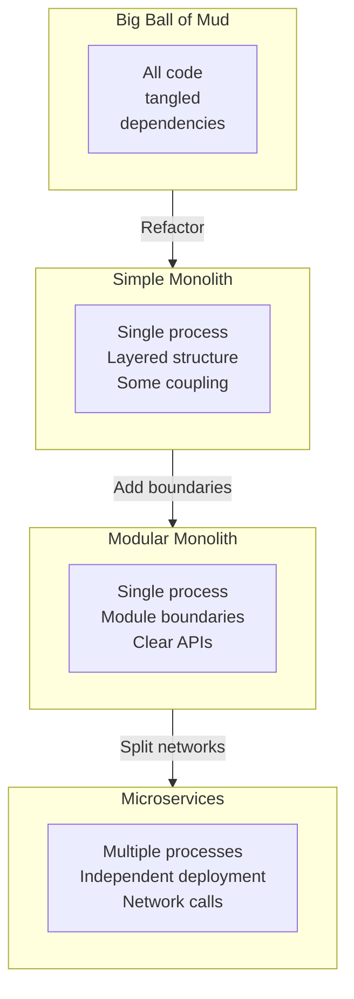
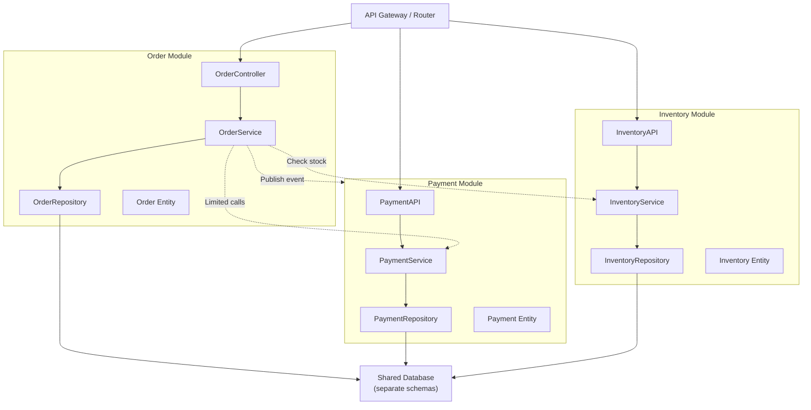

<Hero title="Monolith / Modular Monolith" subtitle="Single deployable unit with internal modularity and clear domain boundaries" imageAlt="Monolithic architecture showing internal module structure" size="large" />

## TL;DR

A monolith is a single deployable unit where all business logic lives in one codebase and runs in one process. A **modular monolith** improves on this by organizing code into internal modules representing domain boundaries (order module, payment module, shipping module), reducing coupling while maintaining single deployment. Ideal for teams building systems that don't yet require independent scaling or deployment.

## Learning Objectives

- Understand the characteristics of monolithic vs modular monolithic architecture
- Identify domain boundaries and design internal modules around them
- Recognize when a monolith has crossed the "big ball of mud" threshold
- Apply refactoring strategies to improve internal structure
- Know when to transition from monolith to microservices

## Motivating Scenario

Your SaaS platform started as a simple Django/Rails monolith. Three years later, 50k lines of code, three teams (order, payment, inventory). The single codebase is still manageable, but no team wants to wait for others' deploys. Instead of fragmenting into microservices, you reorganize internally: define order, payment, and inventory as separate modules with published interfaces. Teams can develop in isolation, but deploy together. This is a modular monolith.

## Core Concepts

**Monolith**: All code in one repository, deployed as one unit.

**Modular Monolith**: Same single deployment, but organized into domain-aligned modules with explicit boundaries and APIs, reducing internal coupling.

<Figure caption="Monolith evolution from big ball of mud to modular">

</Figure>

### Key Characteristics of Modular Monoliths

**Single Deployment Unit**: All modules deployed together. No partial rollouts per module.

**Internal Domain Modules**: Order, Payment, Inventory, etc. Each is a cohesive unit with a published API.

**Module Boundaries**: Clear, documented interfaces. Modules don't call internal functions of other modules.

**Shared Infrastructure**: Single database (or schema per module), shared logging, shared caching.

**Internal Communication**: Direct function calls, not RPC or message queues (yet).

<Figure caption="Modular monolith with domain boundaries">

</Figure>

### Module Design Principles

1. **High Cohesion**: All related logic lives together. Order module has order create, update, refund, etc.
2. **Low Coupling**: Minimize dependencies between modules. Use event-driven callbacks instead of direct calls.
3. **Published API**: Each module exposes a small, versioned interface. Internal implementation changes don't leak.
4. **Explicit Dependencies**: Module A clearly declares it needs module B, not hidden in code.
5. **Shared Infrastructure**: Typically one database, but clear schema/table ownership.

## Practical Example

<Tabs>
  <TabItem value="structure" label="Module Structure">
    ```
    src/
    ├── modules/
    │   ├── order/
    │   │   ├── __init__.py          # Public API
    │   │   ├── controllers.py        # HTTP handlers
    │   │   ├── services.py           # Business logic
    │   │   ├── repositories.py       # Data access
    │   │   ├── models.py             # Domain models
    │   │   └── events.py             # Events published by this module
    │   │
    │   ├── payment/
    │   │   ├── __init__.py
    │   │   ├── controllers.py
    │   │   ├── services.py
    │   │   ├── repositories.py
    │   │   ├── models.py
    │   │   └── events.py
    │   │
    │   └── inventory/
    │       ├── __init__.py
    │       ├── controllers.py
    │       ├── services.py
    │       ├── repositories.py
    │       ├── models.py
    │       └── events.py
    │
    ├── shared/
    │   ├── database.py              # Shared DB connection
    │   ├── events.py                # Event bus / mediator
    │   └── logging.py               # Shared logging
    │
    └── main.py                       # App entry point
    ```
  </TabItem>

  <TabItem value="order" label="Order Module API">
    ```python
    # order/__init__.py - Public API of Order module
    from .services import OrderService
    from .models import Order
    from .events import OrderCreated, OrderShipped

    __all__ = ['OrderService', 'Order', 'OrderCreated', 'OrderShipped']

    # Internal details (controllers, repositories) NOT exported
    ```

    ```python
    # order/services.py
    from shared.events import event_bus
    from payment import PaymentService  # Dependency on another module
    from .models import Order
    from .repositories import OrderRepository
    from .events import OrderCreated, OrderShipped

    class OrderService:
        def __init__(self, repo: OrderRepository, payment: PaymentService):
            self.repo = repo
            self.payment = payment

        def create_order(self, user_id: int, items: list):
            if not items:
                raise ValueError("Order must have items")

            total = sum(item['price'] * item['qty'] for item in items)
            order = Order(user_id=user_id, total=total, items=items)

            # Persist
            self.repo.save(order)

            # Notify other modules (event-driven, loosely coupled)
            event_bus.publish(OrderCreated(order_id=order.id, user_id=user_id))

            return order

        def ship_order(self, order_id: int):
            order = self.repo.get(order_id)
            if not order:
                raise ValueError(f"Order {order_id} not found")

            order.status = 'shipped'
            self.repo.save(order)

            # Publish event; Payment module can subscribe if needed
            event_bus.publish(OrderShipped(order_id=order.id))

            return order
    ```
  </TabItem>

  <TabItem value="payment" label="Payment Module Integration">
    ```python
    # payment/__init__.py
    from .services import PaymentService

    __all__ = ['PaymentService']

    # payment/services.py
    class PaymentService:
        def process_payment(self, user_id: int, amount: float, order_id: int):
            # Payment processing logic
            # Could call external payment gateway
            if amount <= 0:
                raise ValueError("Amount must be positive")

            # Record payment
            payment = Payment(user_id=user_id, amount=amount, order_id=order_id)
            # ... save to repo ...
            return payment

    # In shared event bus handler:
    # When OrderCreated event fires, call PaymentService.process_payment()
    ```
  </TabItem>

  <TabItem value="event-bus" label="Event Bus / Mediator">
    ```python
    # shared/events.py - Simple event mediator
    class EventBus:
        def __init__(self):
            self.handlers = {}

        def subscribe(self, event_type: type, handler: callable):
            if event_type not in self.handlers:
                self.handlers[event_type] = []
            self.handlers[event_type].append(handler)

        def publish(self, event):
            event_type = type(event)
            if event_type in self.handlers:
                for handler in self.handlers[event_type]:
                    handler(event)

    event_bus = EventBus()

    # In main.py or module initialization:
    from order.events import OrderCreated
    from payment.services import PaymentService

    payment_service = PaymentService(...)

    def on_order_created(event: OrderCreated):
        payment_service.process_payment(
            user_id=event.user_id,
            amount=event.order_total,
            order_id=event.order_id
        )

    event_bus.subscribe(OrderCreated, on_order_created)
    ```
  </TabItem>
</Tabs>

## When to Use / When Not to Use

<Vs highlight={[1]} items={[
{
    label: "Use Monolith / Modular Monolith When:",
    points: [
      "Team is small (< 30 people) and coordination cost is low",
      "Domain doesn't require independent scaling of components",
      "You want to avoid distributed system complexity",
      "Single deployment schedule works for all teams",
      "Code reuse across modules is high and benefits from shared libraries",
      "Building MVP; premature microservices are a waste"
    ],
    highlightTone: "positive"
  },
{
    label: "Avoid Monolith When:",
    points: [
      "Multiple large teams need independent release cycles",
      "Components have dramatically different scaling needs (e.g., one service needs 100x scale of another)",
      "Teams use conflicting technology stacks (Python vs Go vs Java critical)",
      "Failure of one component must not crash the entire system",
      "You need to update one module without coordinating with others"
    ],
    highlightTone: "warning"
  }
]} />

## Patterns and Pitfalls

<Showcase title="Patterns and Pitfalls" sections={[
  {
    label: "Pitfall: No Real Module Boundaries",
    body: "Modules exist on paper (separate packages) but code directly accesses private members. Order module calls PaymentRepository directly. Enforce boundaries via code review, package visibility (Java protected/private), and dependency injection. Use event-driven calls instead of direct dependencies."
  },
  {
    label: "Pitfall: Shared Database Becomes Single Point of Coupling",
    body: "All modules share a single table schema; schema change in one module breaks all others. Define clear table/schema ownership per module. Avoid cross-module joins. Use APIs for cross-module data access."
  },
  {
    label: "Pitfall: Monolith Gets Too Large",
    body: "50k lines in a single codebase; startup time, testing time, compile time all degrade. Consider multimodule build systems (Maven modules, Lerna workspaces). Or split into microservices when module count exceeds team capacity."
  },
  {
    label: "Pattern: Published Interfaces",
    body: "Each module exports a small, stable API in its __init__.py or public class. Internal details stay internal. Define interfaces/contracts clearly. Use semantic versioning if modules have external consumers."
  },
  {
    label: "Pattern: Event-Driven Communication",
    body: "Modules publish events; other modules subscribe. Loosely coupled compared to direct function calls. Implement a simple event bus/mediator. Modules publish domain events; subscribers handle reactions."
  },
  {
    label: "Pattern: Dependency Injection",
    body: "Wire modules together at startup, not scattered throughout code. Use DI framework or composition root pattern to explicit declare module dependencies."
  }
]} />

## Design Review Checklist

<Checklist items={[
  "Are modules organized around business domains (Order, Payment, Inventory)?",
  "Does each module have a published API / __init__ file restricting what's exported?",
  "Can you understand a module without reading code in other modules?",
  "Are cross-module dependencies declared explicitly (constructor injection)?",
  "Do modules communicate via published APIs, not by accessing private functions?",
  "Is there an event mechanism for loosely-coupled cross-module communication?",
  "Could you move a module to a separate service without major refactoring?",
  "Is startup time acceptable? (Monoliths often get slow at 50k+ lines)",
  "Can one module be tested in isolation by mocking its dependencies?",
  "Is database schema organized by module, with no cross-module foreign keys?"
]} />

## Self-Check

1. **What's the key difference between a monolith and a modular monolith?** Monolith is all code in one codebase; modular monolith has the same single deployment but organizes code into domain-aligned modules with clear boundaries and APIs.
2. **When might you transition a monolith to microservices?** When teams need independent deployment cycles, components have different scaling requirements, or multiple language/framework choices are critical.
3. **How does event-driven communication help in a modular monolith?** Decouples modules; instead of OrderService directly calling PaymentService, it publishes an OrderCreated event. Any module can subscribe without tight coupling.

:::info
**One Takeaway**: Start with a modular monolith. It offers structure and clarity without the operational complexity of microservices. Refactor to microservices only when you have a concrete reason (scaling, independent deployment, team independence).

:::

## Next Steps

- **Hexagonal / Ports & Adapters**: Better isolation of domain logic within modules
- **Microservices**: When and how to split modules into independent services
- **Domain-Driven Design**: Apply bounded contexts to design module boundaries
- **Event Sourcing & CQRS**: Advanced patterns for managing state across modules
- **Modular Monolith in Practice**: Spring modulith, Gradle multi-module, Nx workspace tools

## References

- Richards, M., & Ford, N. (2020). *Fundamentals of Software Architecture*. O'Reilly. ↗️
- Evans, E. (2003). *Domain-Driven Design*. Addison-Wesley. ↗️
- Newman, S. (2015). *Building Microservices*. O'Reilly. (Chapter 2: The Microservice World) ↗️
- Larsen, G., & Muller, R. (2023). *Building Modular Cloud Apps with OSGi*. Pragmatic Bookshelf. ↗️