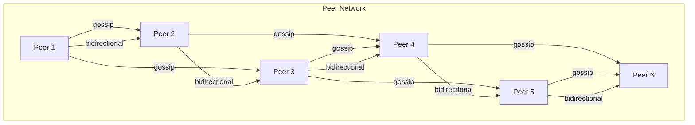

<Hero title="Peer-to-Peer (P2P) / Mesh / Gossip Architecture" subtitle="Decentralized networks where all nodes are equal, no central authority" imageAlt="P2P mesh network with peer-to-peer connections" size="large" />

## TL;DR

P2P (Peer-to-Peer) architecture has no central server; all nodes are equal. Each node can serve requests, store data, and route messages. Gossip protocols propagate information (spreading rumors through the network). Used in blockchain, distributed databases, resilient networks. Advantages: no single point of failure, true decentralization. Disadvantages: complex consensus, eventual consistency, slower information propagation.

## Learning Objectives

- Understand P2P topology and node equality
- Learn gossip protocols and epidemic algorithms
- Implement peer discovery and routing
- Handle distributed consensus without central authority
- Know when decentralization is necessary vs premature

## Motivating Scenario

You're designing a peer-to-peer file-sharing network (like BitTorrent or IPFS). No central server. Users connect to each other directly. When user A uploads a file, they tell peers they know about it (gossip). Those peers tell other peers. Eventually, the entire network knows the file exists. If user A goes offline, the file is still available from other peers. This is true decentralization.

## Core Concepts

P2P/Mesh architecture has **no central server; all nodes are equal** and can perform the same functions:

**Peer**: An autonomous node that stores data, serves requests, and routes messages. Equivalent authority.

**Gossip Protocol**: Information spreads virally. Node tells neighbors; they tell their neighbors, etc. Eventually reaches everyone.

**Peer Discovery**: Nodes find and connect to other peers (via DHT, bootstrap nodes, or direct sharing).

**Mesh Network**: All-to-all or partial connectivity. Messages can route through multiple peers.

**Consensus**: Nodes must agree on state without a central authority (Byzantine Fault Tolerance, Raft, etc.).

<Figure caption="P2P mesh network with gossip propagation">

</Figure>

### Key Characteristics

**No Central Authority**: Every node has equal authority. No server, no master.

**Resilience**: Node failure doesn't crash the network. Peers reroute around failures.

**Scalability**: Linear or sublinear scaling (gossip spreads logarithmically).

**Eventual Consistency**: Information propagates eventually, not immediately.

**Complex Consensus**: Ensuring agreement without a central arbiter requires sophisticated protocols.

## Practical Example

```python
# Simplified P2P gossip network
import random
from typing import Dict, List, Set

class Peer:
    """A node in the P2P network."""
    def __init__(self, peer_id: str):
        self.peer_id = peer_id
        self.neighbors: List['Peer'] = []
        self.state: Dict[str, any] = {}  # Local state
        self.message_history: Set[str] = set()  # Seen messages (avoid duplicates)

    def connect_to(self, other: 'Peer'):
        """Add bidirectional connection to another peer."""
        if other not in self.neighbors:
            self.neighbors.append(other)
        if self not in other.neighbors:
            other.neighbors.append(self)

    def receive_message(self, message: Dict):
        """Receive a message from a neighbor."""
        msg_id = message.get('id')

        # Avoid reprocessing
        if msg_id in self.message_history:
            return

        self.message_history.add(msg_id)

        # Update local state
        if message.get('type') == 'data':
            key = message.get('key')
            value = message.get('value')
            self.state[key] = value
            print(f"Peer {self.peer_id} updated {key} = {value}")

        # Gossip to random neighbors (epidemic algorithm)
        gossip_targets = random.sample(self.neighbors, min(2, len(self.neighbors)))
        for neighbor in gossip_targets:
            neighbor.receive_message(message.copy())

    def publish_update(self, key: str, value: any):
        """Publish an update to the network (gossip)."""
        msg_id = f"{self.peer_id}-{key}-{random.randint(0, 10000)}"
        message = {
            'id': msg_id,
            'type': 'data',
            'key': key,
            'value': value,
            'origin': self.peer_id
        }
        self.receive_message(message)

    def query(self, key: str):
        """Query local state."""
        return self.state.get(key)

class P2PNetwork:
    """A network of peer nodes."""
    def __init__(self, num_peers: int):
        self.peers = [Peer(f"peer-{i}") for i in range(num_peers)]
        # Create mesh topology (random connections)
        for peer in self.peers:
            for _ in range(random.randint(2, 4)):
                other = random.choice(self.peers)
                if other != peer:
                    peer.connect_to(other)

    def publish_globally(self, publisher_idx: int, key: str, value: any):
        """Publish from one peer; gossip spreads to all."""
        self.peers[publisher_idx].publish_update(key, value)

    def get_from_peer(self, peer_idx: int, key: str):
        """Query data from a specific peer."""
        return self.peers[peer_idx].query(key)

# Simulate P2P network
network = P2PNetwork(6)

# Peer 0 publishes "stock_price" = 150
print("=== Peer 0 publishes update ===")
network.publish_globally(0, "stock_price", 150)

# Wait (in real system, this is asynchronous over time)
import time
time.sleep(0.5)

# Query from different peers (eventually consistent)
print("\n=== After gossip propagation ===")
for i in range(6):
    value = network.get_from_peer(i, "stock_price")
    print(f"Peer {i} sees: stock_price = {value}")

# Even after one peer goes offline, others have the data
print("\n=== Peer 2 offline (not listening) ===")
network.peers[2].neighbors = []  # Disconnect
network.publish_globally(5, "news", "Market update")
time.sleep(0.5)
print(f"Peer 2 missed it (offline): {network.get_from_peer(2, 'news')}")
print(f"But Peer 3 has it: {network.get_from_peer(3, 'news')}")
```

## When to Use / When Not to Use

<Vs highlight={[1]} items={[
{
    label: "Use P2P When:",
    points: [
      "No trusted central authority (blockchain, decentralized apps)",
      "Need resilience to arbitrary node failures",
      "Nodes come and go frequently (mobile, IoT)",
      "Want censorship-resistant, decentralized system",
      "Can tolerate eventual consistency",
      "Building distributed databases or file systems"
    ],
    highlightTone: "positive"
  },
{
    label: "Avoid P2P When:",
    points: [
      "Need immediate consistency (financial transactions)",
      "Central authority is acceptable (most enterprise systems)",
      "Operational simplicity is important",
      "Bandwidth between nodes is limited (gossip floods network)",
      "Team lacks expertise in distributed consensus",
      "Privacy is critical (gossip broadcasts to everyone)"
    ],
    highlightTone: "warning"
  }
]} />

## Patterns and Pitfalls

<Showcase title="Patterns and Pitfalls" sections={[
  {
    label: "Pitfall: Gossip Amplification",
    body: "Every node tells every neighbor repeatedly. Network flooded with duplicate messages. Track seen messages. Suppress retransmission of duplicates."
  },
  {
    label: "Pitfall: Consensus Failures",
    body: "Nodes disagree on state. Byzantine faults (malicious nodes) spread misinformation. Implement Byzantine Fault Tolerant consensus (PBFT, PoW). Accept eventual consistency."
  ,
    body: "Nodes disagree on state. Byzantine faults (malicious nodes) spread misinformation. Implement Byzantine Fault Tolerant consensus (PBFT, PoW). Accept eventual consistency.",
    tone: "warning"
  },
  {
    label: "Pitfall: Partition Resilience",
    body: "Network partition: nodes in partition A disagree with partition B. Can't merge. Design for partition tolerance (CAP theorem). Use vector clocks to detect causal order."
  },
  {
    label: "Pattern: DHT (Distributed Hash Table)",
    body: "Decentralized lookup without central registry. Nodes store parts of hash table. Use Chord, Kademlia, or similar. Enables peer discovery and content location."
  },
  {
    label: "Pattern: Epidemic Algorithm",
    body: "Gossip spreads exponentially fast. Every node tells random neighbors. Targets: log(N) hops to reach all N nodes. Balance coverage vs bandwidth."
  }
]} />

## Design Review Checklist

<Checklist items={[
  "Is gossip message deduplication implemented (track seen IDs)?",
  "Is peer discovery mechanism defined (DHT, bootstrap nodes)?",
  "Can the network tolerate node churn (peers joining/leaving)?",
  "Is consensus mechanism appropriate (Byzantine FT, Raft)?",
  "Are network partitions handled gracefully?",
  "Is message amplification (gossip flooding) controlled?",
  "Can you trace information propagation through network?",
  "Are peers identified cryptographically (prevent spoofing)?",
  "Is eventual consistency acceptable for your use case?",
  "Have you stress-tested gossip with large networks?"
]} />

## Self-Check

1. **What's the main benefit of P2P?** No central authority or single point of failure. Highly resilient and censorship-resistant.
2. **What's the main tradeoff?** Complexity (consensus, partition handling) and eventual consistency. Information spreads slowly (logarithmic hops).
3. **When would you NOT use P2P?** When you trust a central authority, need immediate consistency, or system is simple enough.

:::info
**One Takeaway**: P2P architecture is powerful for truly decentralized systems (blockchain, IPFS). For most enterprise systems, client-server or microservices are simpler. Use P2P when decentralization itself is a requirement, not just an implementation detail.

:::

## Next Steps

- **Blockchain & Consensus**: Proof of Work, Proof of Stake for distributed consensus
- **Distributed Hash Tables**: DHT for decentralized peer discovery and content lookup
- **Vector Clocks**: Detecting causal relationships in distributed systems
- **CAP Theorem**: Consistency, Availability, Partition tolerance tradeoffs
- **IPFS & FileCoin**: Production P2P systems for decentralized storage

## Real-World P2P Systems

### IPFS: Decentralized File Storage

```
Traditional: User → Central Server
Problem: Server is single point of failure, censorship point, bottleneck

IPFS Model: User A ← → Peer Network ← → User B
- File stored on peers (decentralized)
- Filename hashed → peers with content found via DHT
- User A downloads from nearest peers (faster)
- File survives as long as any peer has it
```

### Chord Algorithm: Distributed Hash Table

```
- N peers in ring (0 to 2^m - 1)
- Peer 0 stored at nodes {0, 2, 4, 8, 16, ...}
- To find key: start at nearest node, follow finger table
- Lookup time: O(log N) hops
- Scales to millions of peers
```

## References

- Richards, M., & Ford, N. (2020). *Fundamentals of Software Architecture*. O'Reilly. ↗️
- Lamport, L. (1998). The Part-Time Parliament (Paxos). ACM TOCS ↗️
- Nakamoto, S. (2008). Bitcoin: A Peer-to-Peer Electronic Cash System ↗️
- IPFS whitepaper and documentation ↗️
- Real-world decentralized network implementations ↗️